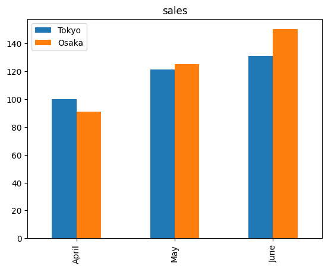
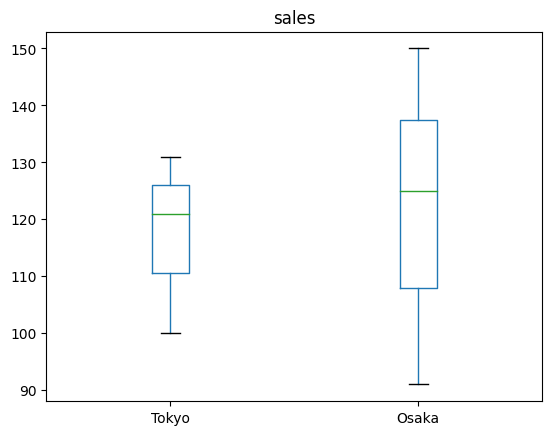
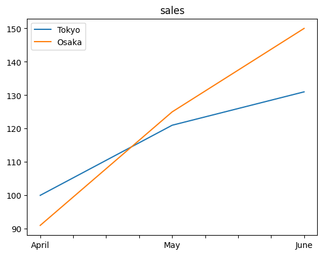

 # Pandas虎の巻

 ## シリーズの基本操作

 ### シリーズの作成


```python
import pandas as pd
pythonScore = pd.Series([90,70,70,80], index=['工藤','浅木','松田','瀬川'])

pythonScore # シリーズの表示
```


    工藤    90
    浅木    70
    松田    70
    瀬川    80
    dtype: int64


 ### インデックスの参照


```python
pythonScore.index
```


    Index(['工藤', '浅木', '松田', '瀬川'], dtype='object')


 ### インデックスによるデータ参照


```python
pythonScore['工藤'] # インデックスが'工藤'のデータを取得
```


    90


 ### 重複の排除結果を参照


```python
pythonScore.unique()
```


    array([90, 70, 80], dtype=int64)


 ### データの個数を集計


```python
pythonScore.value_counts()
```


    70    2
    80    1
    90    1
    dtype: int64


 ### データを並べ替える


```python
pythonScore.sort_values(ascending=False)
```


    工藤    90
    瀬川    80
    浅木    70
    松田    70
    dtype: int64


 ### 各要素に関数を適用する


```python
def fixedscore(score):
    return 0.8*score + 20 # 試験の素点を0.8倍し、20点足す

pythonScore.map(fixedscore)
```


    工藤    92.0
    浅木    76.0
    松田    76.0
    瀬川    84.0
    dtype: float64


 ### 各要素との演算


```python
pythonScore >= 80 # 80点以上が合格
```


    工藤     True
    浅木    False
    松田    False
    瀬川     True
    dtype: bool


```python
pythonScore + 5 # 全員に5点おまけ
```


    工藤    95
    浅木    75
    松田    75
    瀬川    85
    dtype: int64


 ### 条件式による検索


```python
pythonScore[pythonScore >= 80]
```


    工藤    90
    瀬川    80
    dtype: int64


 ## データフレームの基本操作

 ### データフレームの作成


```python
import pandas as pd
score = {'工藤':[90,70], '浅木':[70,80], '松田':[70,80], '瀬川':[85,70]}

df = pd.DataFrame(score, index=['Python','ML'])
df
```


<div>
<style scoped>
    .dataframe tbody tr th:only-of-type {
        vertical-align: middle;
    }

    .dataframe tbody tr th {
        vertical-align: top;
    }

    .dataframe thead th {
        text-align: right;
    }
</style>
<table border="1" class="dataframe">
  <thead>
    <tr style="text-align: right;">
      <th></th>
      <th>工藤</th>
      <th>浅木</th>
      <th>松田</th>
      <th>瀬川</th>
    </tr>
  </thead>
  <tbody>
    <tr>
      <th>Python</th>
      <td>90</td>
      <td>70</td>
      <td>70</td>
      <td>85</td>
    </tr>
    <tr>
      <th>ML</th>
      <td>70</td>
      <td>80</td>
      <td>80</td>
      <td>70</td>
    </tr>
  </tbody>
</table>
</div>


 ### カラム名（列名）一覧の取得


```python
df.columns
```


    Index(['工藤', '浅木', '松田', '瀬川'], dtype='object')


 ### インデックスの取得


```python
df.index
```


    Index(['Python', 'ML'], dtype='object')


 ### 行数と列数の取得


```python
df.shape
```


    (2, 4)


 ### 先頭行数だけ取得する


```python
df.head(1) # 先頭1行だけ
```


<div>
<style scoped>
    .dataframe tbody tr th:only-of-type {
        vertical-align: middle;
    }

    .dataframe tbody tr th {
        vertical-align: top;
    }

    .dataframe thead th {
        text-align: right;
    }
</style>
<table border="1" class="dataframe">
  <thead>
    <tr style="text-align: right;">
      <th></th>
      <th>工藤</th>
      <th>浅木</th>
      <th>松田</th>
      <th>瀬川</th>
    </tr>
  </thead>
  <tbody>
    <tr>
      <th>Python</th>
      <td>90</td>
      <td>70</td>
      <td>70</td>
      <td>85</td>
    </tr>
  </tbody>
</table>
</div>


 ### 末尾行数だけ表示


```python
df.tail(1)
```


<div>
<style scoped>
    .dataframe tbody tr th:only-of-type {
        vertical-align: middle;
    }

    .dataframe tbody tr th {
        vertical-align: top;
    }

    .dataframe thead th {
        text-align: right;
    }
</style>
<table border="1" class="dataframe">
  <thead>
    <tr style="text-align: right;">
      <th></th>
      <th>工藤</th>
      <th>浅木</th>
      <th>松田</th>
      <th>瀬川</th>
    </tr>
  </thead>
  <tbody>
    <tr>
      <th>ML</th>
      <td>70</td>
      <td>80</td>
      <td>80</td>
      <td>70</td>
    </tr>
  </tbody>
</table>
</div>


 ### 特定列の取得


```python
df['浅木']
```


    Python    70
    ML        80
    Name: 浅木, dtype: int64


```python
df[['浅木','松田']]
```


<div>
<style scoped>
    .dataframe tbody tr th:only-of-type {
        vertical-align: middle;
    }

    .dataframe tbody tr th {
        vertical-align: top;
    }

    .dataframe thead th {
        text-align: right;
    }
</style>
<table border="1" class="dataframe">
  <thead>
    <tr style="text-align: right;">
      <th></th>
      <th>浅木</th>
      <th>松田</th>
    </tr>
  </thead>
  <tbody>
    <tr>
      <th>Python</th>
      <td>70</td>
      <td>70</td>
    </tr>
    <tr>
      <th>ML</th>
      <td>80</td>
      <td>80</td>
    </tr>
  </tbody>
</table>
</div>


 ### インデックスによる特定行の抽出


```python
df.loc['ML']
```


    工藤    70
    浅木    80
    松田    80
    瀬川    70
    Name: ML, dtype: int64


 ### 検索条件による特定行の抽出


```python
df[df['工藤'] < 80] # 工藤列が80未満のデータ
```


<div>
<style scoped>
    .dataframe tbody tr th:only-of-type {
        vertical-align: middle;
    }

    .dataframe tbody tr th {
        vertical-align: top;
    }

    .dataframe thead th {
        text-align: right;
    }
</style>
<table border="1" class="dataframe">
  <thead>
    <tr style="text-align: right;">
      <th></th>
      <th>工藤</th>
      <th>浅木</th>
      <th>松田</th>
      <th>瀬川</th>
    </tr>
  </thead>
  <tbody>
    <tr>
      <th>ML</th>
      <td>70</td>
      <td>80</td>
      <td>80</td>
      <td>70</td>
    </tr>
  </tbody>
</table>
</div>


```python
df[(df['工藤'] < 80) & (df['浅木'] < 70)]
```


<div>
<style scoped>
    .dataframe tbody tr th:only-of-type {
        vertical-align: middle;
    }

    .dataframe tbody tr th {
        vertical-align: top;
    }

    .dataframe thead th {
        text-align: right;
    }
</style>
<table border="1" class="dataframe">
  <thead>
    <tr style="text-align: right;">
      <th></th>
      <th>工藤</th>
      <th>浅木</th>
      <th>松田</th>
      <th>瀬川</th>
    </tr>
  </thead>
  <tbody>
  </tbody>
</table>
</div>


 ### 行と列を同時に指定して抽出


```python
df.loc[['Python'],['工藤','浅木']]
```


<div>
<style scoped>
    .dataframe tbody tr th:only-of-type {
        vertical-align: middle;
    }

    .dataframe tbody tr th {
        vertical-align: top;
    }

    .dataframe thead th {
        text-align: right;
    }
</style>
<table border="1" class="dataframe">
  <thead>
    <tr style="text-align: right;">
      <th></th>
      <th>工藤</th>
      <th>浅木</th>
    </tr>
  </thead>
  <tbody>
    <tr>
      <th>Python</th>
      <td>90</td>
      <td>70</td>
    </tr>
  </tbody>
</table>
</div>


```python
df.loc[:,'工藤':'松田']
df
```


<div>
<style scoped>
    .dataframe tbody tr th:only-of-type {
        vertical-align: middle;
    }

    .dataframe tbody tr th {
        vertical-align: top;
    }

    .dataframe thead th {
        text-align: right;
    }
</style>
<table border="1" class="dataframe">
  <thead>
    <tr style="text-align: right;">
      <th></th>
      <th>工藤</th>
      <th>浅木</th>
      <th>松田</th>
      <th>瀬川</th>
    </tr>
  </thead>
  <tbody>
    <tr>
      <th>Python</th>
      <td>90</td>
      <td>70</td>
      <td>70</td>
      <td>85</td>
    </tr>
    <tr>
      <th>ML</th>
      <td>70</td>
      <td>80</td>
      <td>80</td>
      <td>70</td>
    </tr>
  </tbody>
</table>
</div>


 ### 行と列の追加および更新


```python
df['福田'] = [75, 75]
df.loc['web_app'] = [65,70,65,85,90]
df
```


<div>
<style scoped>
    .dataframe tbody tr th:only-of-type {
        vertical-align: middle;
    }

    .dataframe tbody tr th {
        vertical-align: top;
    }

    .dataframe thead th {
        text-align: right;
    }
</style>
<table border="1" class="dataframe">
  <thead>
    <tr style="text-align: right;">
      <th></th>
      <th>工藤</th>
      <th>浅木</th>
      <th>松田</th>
      <th>瀬川</th>
      <th>福田</th>
    </tr>
  </thead>
  <tbody>
    <tr>
      <th>Python</th>
      <td>90</td>
      <td>70</td>
      <td>70</td>
      <td>85</td>
      <td>75</td>
    </tr>
    <tr>
      <th>ML</th>
      <td>70</td>
      <td>80</td>
      <td>80</td>
      <td>70</td>
      <td>75</td>
    </tr>
    <tr>
      <th>web_app</th>
      <td>65</td>
      <td>70</td>
      <td>65</td>
      <td>85</td>
      <td>90</td>
    </tr>
  </tbody>
</table>
</div>


 ### 行と列の削除


```python
df = df.drop('web_app', axis=0)
df = df.drop('福田', axis=1)
df
```


<div>
<style scoped>
    .dataframe tbody tr th:only-of-type {
        vertical-align: middle;
    }

    .dataframe tbody tr th {
        vertical-align: top;
    }

    .dataframe thead th {
        text-align: right;
    }
</style>
<table border="1" class="dataframe">
  <thead>
    <tr style="text-align: right;">
      <th></th>
      <th>工藤</th>
      <th>浅木</th>
      <th>松田</th>
      <th>瀬川</th>
    </tr>
  </thead>
  <tbody>
    <tr>
      <th>Python</th>
      <td>90</td>
      <td>70</td>
      <td>70</td>
      <td>85</td>
    </tr>
    <tr>
      <th>ML</th>
      <td>70</td>
      <td>80</td>
      <td>80</td>
      <td>70</td>
    </tr>
  </tbody>
</table>
</div>


```python
df['福田'] = [75, 75]
```

 ### CSVファイルの読み込み
 pd.read_csv('ファイル名', encoding='文字コード', sep='区切り文字')

 ### CSVファイルとして保存
 df.to_csv('ファイル名', index=ブール値)

 ## データフレームの応用操作

 ### 代表値の計算


```python
df.sum() # 列ごとの合計値の計算
```


    工藤    160
    浅木    150
    松田    150
    瀬川    155
    福田    150
    dtype: int64


```python
df.mean(axis=1) # 行ごとの平均値
```


    Python    78.0
    ML        75.0
    dtype: float64


 ### 一括集計


```python
df.describe()
```


<div>
<style scoped>
    .dataframe tbody tr th:only-of-type {
        vertical-align: middle;
    }

    .dataframe tbody tr th {
        vertical-align: top;
    }

    .dataframe thead th {
        text-align: right;
    }
</style>
<table border="1" class="dataframe">
  <thead>
    <tr style="text-align: right;">
      <th></th>
      <th>工藤</th>
      <th>浅木</th>
      <th>松田</th>
      <th>瀬川</th>
      <th>福田</th>
    </tr>
  </thead>
  <tbody>
    <tr>
      <th>count</th>
      <td>2.000000</td>
      <td>2.000000</td>
      <td>2.000000</td>
      <td>2.000000</td>
      <td>2.0</td>
    </tr>
    <tr>
      <th>mean</th>
      <td>80.000000</td>
      <td>75.000000</td>
      <td>75.000000</td>
      <td>77.500000</td>
      <td>75.0</td>
    </tr>
    <tr>
      <th>std</th>
      <td>14.142136</td>
      <td>7.071068</td>
      <td>7.071068</td>
      <td>10.606602</td>
      <td>0.0</td>
    </tr>
    <tr>
      <th>min</th>
      <td>70.000000</td>
      <td>70.000000</td>
      <td>70.000000</td>
      <td>70.000000</td>
      <td>75.0</td>
    </tr>
    <tr>
      <th>25%</th>
      <td>75.000000</td>
      <td>72.500000</td>
      <td>72.500000</td>
      <td>73.750000</td>
      <td>75.0</td>
    </tr>
    <tr>
      <th>50%</th>
      <td>80.000000</td>
      <td>75.000000</td>
      <td>75.000000</td>
      <td>77.500000</td>
      <td>75.0</td>
    </tr>
    <tr>
      <th>75%</th>
      <td>85.000000</td>
      <td>77.500000</td>
      <td>77.500000</td>
      <td>81.250000</td>
      <td>75.0</td>
    </tr>
    <tr>
      <th>max</th>
      <td>90.000000</td>
      <td>80.000000</td>
      <td>80.000000</td>
      <td>85.000000</td>
      <td>75.0</td>
    </tr>
  </tbody>
</table>
</div>


 ### グループ集計


```python
data = pd.DataFrame({
    '年齢':[22, 25, 30, 40, 40],
    '性別':[1,0,1,1,1],
    '役職':[0,0,0,1,1]
}, index=['松田','浅木','工藤','瀬川','福田'])

data.groupby('役職').mean() # 役職ごとの集計
```


<div>
<style scoped>
    .dataframe tbody tr th:only-of-type {
        vertical-align: middle;
    }

    .dataframe tbody tr th {
        vertical-align: top;
    }

    .dataframe thead th {
        text-align: right;
    }
</style>
<table border="1" class="dataframe">
  <thead>
    <tr style="text-align: right;">
      <th></th>
      <th>年齢</th>
      <th>性別</th>
    </tr>
    <tr>
      <th>役職</th>
      <th></th>
      <th></th>
    </tr>
  </thead>
  <tbody>
    <tr>
      <th>0</th>
      <td>25.666667</td>
      <td>0.666667</td>
    </tr>
    <tr>
      <th>1</th>
      <td>40.000000</td>
      <td>1.000000</td>
    </tr>
  </tbody>
</table>
</div>


 ### ピボットテーブル集計


```python
pd.pivot_table(data, index='性別', columns='役職', values='年齢', aggfunc=max, margins=True)
```


<div>
<style scoped>
    .dataframe tbody tr th:only-of-type {
        vertical-align: middle;
    }

    .dataframe tbody tr th {
        vertical-align: top;
    }

    .dataframe thead th {
        text-align: right;
    }
</style>
<table border="1" class="dataframe">
  <thead>
    <tr style="text-align: right;">
      <th>役職</th>
      <th>0</th>
      <th>1</th>
      <th>All</th>
    </tr>
    <tr>
      <th>性別</th>
      <th></th>
      <th></th>
      <th></th>
    </tr>
  </thead>
  <tbody>
    <tr>
      <th>0</th>
      <td>25.0</td>
      <td>NaN</td>
      <td>25</td>
    </tr>
    <tr>
      <th>1</th>
      <td>30.0</td>
      <td>40.0</td>
      <td>40</td>
    </tr>
    <tr>
      <th>All</th>
      <td>30.0</td>
      <td>40.0</td>
      <td>40</td>
    </tr>
  </tbody>
</table>
</div>


 ### ２つのデータフレームの結合
 - 行方向の単純な結合

 >> pd.concat([df1, df2], axis=0)
 - 列方向の単純な結合

 >> pd.concat([df1, df2], axis=1)
 - 内部結合
 >> df.merge(df2, on='キー列名', how='inner')
 - データフレームの列名が異なるときの内部結合
 left_on='dfの列名', right_on='df2の列名'
 - 左外部結合
 >> df.merge(df2, on='キー列名', how='left')
 - 右外部結合
 >> df.merge(df2, on='キー列名', how='right')

 ### データフレームの欠損値の確認


```python
import numpy as np
score2 = {
    '工藤':[90,70],
    '浅木':[70,80],
    '松田':[70,80],
    '瀬川':[85,np.nan],
}
df2 = pd.DataFrame(score2, index=['Python','ML'])

df2.isnull() # 欠損値の確認
```


<div>
<style scoped>
    .dataframe tbody tr th:only-of-type {
        vertical-align: middle;
    }

    .dataframe tbody tr th {
        vertical-align: top;
    }

    .dataframe thead th {
        text-align: right;
    }
</style>
<table border="1" class="dataframe">
  <thead>
    <tr style="text-align: right;">
      <th></th>
      <th>工藤</th>
      <th>浅木</th>
      <th>松田</th>
      <th>瀬川</th>
    </tr>
  </thead>
  <tbody>
    <tr>
      <th>Python</th>
      <td>False</td>
      <td>False</td>
      <td>False</td>
      <td>False</td>
    </tr>
    <tr>
      <th>ML</th>
      <td>False</td>
      <td>False</td>
      <td>False</td>
      <td>True</td>
    </tr>
  </tbody>
</table>
</div>


 ### 欠損値のある行や列の削除


```python
df2.dropna(axis=0) # 欠損値のある行を削除
```


<div>
<style scoped>
    .dataframe tbody tr th:only-of-type {
        vertical-align: middle;
    }

    .dataframe tbody tr th {
        vertical-align: top;
    }

    .dataframe thead th {
        text-align: right;
    }
</style>
<table border="1" class="dataframe">
  <thead>
    <tr style="text-align: right;">
      <th></th>
      <th>工藤</th>
      <th>浅木</th>
      <th>松田</th>
      <th>瀬川</th>
    </tr>
  </thead>
  <tbody>
    <tr>
      <th>Python</th>
      <td>90</td>
      <td>70</td>
      <td>70</td>
      <td>85.0</td>
    </tr>
  </tbody>
</table>
</div>


 ### 欠損値のあるマスを他の値で穴埋め


```python
df2.fillna(0)
```


<div>
<style scoped>
    .dataframe tbody tr th:only-of-type {
        vertical-align: middle;
    }

    .dataframe tbody tr th {
        vertical-align: top;
    }

    .dataframe thead th {
        text-align: right;
    }
</style>
<table border="1" class="dataframe">
  <thead>
    <tr style="text-align: right;">
      <th></th>
      <th>工藤</th>
      <th>浅木</th>
      <th>松田</th>
      <th>瀬川</th>
    </tr>
  </thead>
  <tbody>
    <tr>
      <th>Python</th>
      <td>90</td>
      <td>70</td>
      <td>70</td>
      <td>85.0</td>
    </tr>
    <tr>
      <th>ML</th>
      <td>70</td>
      <td>80</td>
      <td>80</td>
      <td>0.0</td>
    </tr>
  </tbody>
</table>
</div>


 ### 線形補完
 データフレーム.interpolate(limit_direction='ooo')

 ### ダミー変数化
 pd.get_dummies(データフレーム, drop_first=True)

 ## データの可視化


```python
data = {
    'Tokyo':[100,121,131],
    'Osaka':[91,125,150],
}
# データフレームの作成
df3 = pd.DataFrame(data, index=['April','May','June'])

# 棒グラフの作成
df3.plot(kind='bar', title='sales')
# 箱ひげ図
df3.plot(kind='box', title='sales')
# 折れ線グラフ
df3.plot(kind='line', title='sales')
```


    <Axes: title={'center': 'sales'}>


    

    


    

    


    

    

