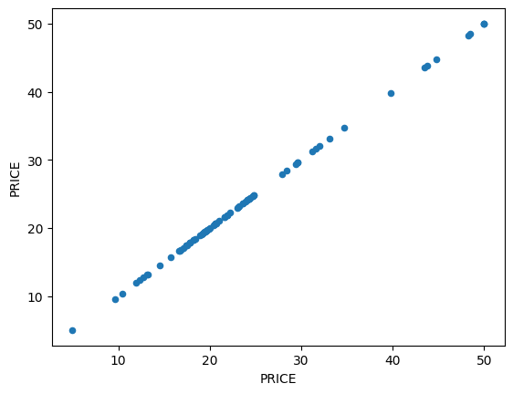
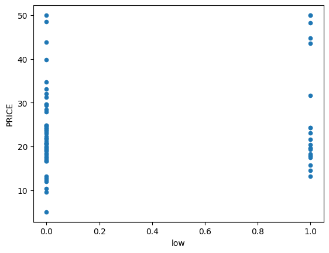

 # 回帰2:住宅の平均価格の予測


```python
import pickle
from sklearn.linear_model import LinearRegression
from sklearn.preprocessing import StandardScaler
from sklearn.model_selection import train_test_split
import pandas as pd
import seaborn as sns
import matplotlib.pyplot as plt
import unittest
import doctest
import os

from domain import convert_categoricals, CategoricalData, DataVisualization
from repository import CSVRepository, SQLRepository
from domain import learn_with_std as learn

VISUALIZTION = True
path = os.path.dirname(os.path.abspath(__file__))
# repo = SQLRepository(table='Boston')
repo = CSVRepository(file=path + '/data/Boston.csv')
```

 ## データの内容
 | 列名 | 内容 |
 | --- | --- |
 | CRIME | その地域の犯罪発生率(high,low,very_low)|
 | ZN | 25,000平方フィート以上の住居区画の占める割合 |
 | INDUS | 小売業以外の商業が占める面積の割合 |
 | CHAS | チャールズ川の付近かどうかによるダミー変数(1:川の周辺, 0:それ以外) |
 | NOX | 窒素酸化物の濃度 |
 | RM | 住居の平均部屋数 |
 | AGE | 1940年より前に建てられた物件の割合 |
 | DIS | ボストン市内の5つの雇用施設からの距離 |
 | RAD | 環状高速道路へのアクセスしやすさ |
 | TAX | $10,000ドルあたりの不動産税率の総計 |
 | PTRATIO | 町ごとの教員1人当たりの児童生徒数 |
 | B | 町ごとの黒人(Bk)の比率を次の式で表したもの。1000(Bk - 0.63)^2 |
 | LSTAT | 人口における低所得者の割合 |
 | PRICE | 住宅価格の平均価格 |


```python
df = repo.get_data()
df.head(3)
```


<div>
<style scoped>
    .dataframe tbody tr th:only-of-type {
        vertical-align: middle;
    }

    .dataframe tbody tr th {
        vertical-align: top;
    }

    .dataframe thead th {
        text-align: right;
    }
</style>
<table border="1" class="dataframe">
  <thead>
    <tr style="text-align: right;">
      <th></th>
      <th>CRIME</th>
      <th>ZN</th>
      <th>INDUS</th>
      <th>CHAS</th>
      <th>NOX</th>
      <th>RM</th>
      <th>AGE</th>
      <th>DIS</th>
      <th>RAD</th>
      <th>TAX</th>
      <th>PTRATIO</th>
      <th>B</th>
      <th>LSTAT</th>
      <th>PRICE</th>
    </tr>
  </thead>
  <tbody>
    <tr>
      <th>0</th>
      <td>high</td>
      <td>0.0</td>
      <td>18.10</td>
      <td>0</td>
      <td>0.718</td>
      <td>3.561</td>
      <td>87.9</td>
      <td>1.6132</td>
      <td>24.0</td>
      <td>666</td>
      <td>20.2</td>
      <td>354.70</td>
      <td>7.12</td>
      <td>27.5</td>
    </tr>
    <tr>
      <th>1</th>
      <td>low</td>
      <td>0.0</td>
      <td>8.14</td>
      <td>0</td>
      <td>0.538</td>
      <td>5.950</td>
      <td>82.0</td>
      <td>3.9900</td>
      <td>4.0</td>
      <td>307</td>
      <td>21.0</td>
      <td>232.60</td>
      <td>27.71</td>
      <td>13.2</td>
    </tr>
    <tr>
      <th>2</th>
      <td>very_low</td>
      <td>82.5</td>
      <td>2.03</td>
      <td>0</td>
      <td>0.415</td>
      <td>6.162</td>
      <td>38.4</td>
      <td>6.2700</td>
      <td>2.0</td>
      <td>348</td>
      <td>14.7</td>
      <td>393.77</td>
      <td>7.43</td>
      <td>24.1</td>
    </tr>
  </tbody>
</table>
</div>


 ## 問題背景

 ## データ分析の方法検討
 ボストン市内の特定の地域の住宅価格を予測する回帰式を作成し、どのような地域だと価格が高くなりやすいかを考察する。

 分析の実施

 ### データの概要


```python
df.info()
```

    <class 'pandas.core.frame.DataFrame'>
    RangeIndex: 100 entries, 0 to 99
    Data columns (total 14 columns):
     #   Column   Non-Null Count  Dtype  
    ---  ------   --------------  -----  
     0   CRIME    100 non-null    object 
     1   ZN       100 non-null    float64
     2   INDUS    100 non-null    float64
     3   CHAS     100 non-null    int64  
     4   NOX      99 non-null     float64
     5   RM       100 non-null    float64
     6   AGE      100 non-null    float64
     7   DIS      100 non-null    float64
     8   RAD      99 non-null     float64
     9   TAX      100 non-null    int64  
     10  PTRATIO  100 non-null    float64
     11  B        100 non-null    float64
     12  LSTAT    100 non-null    float64
     13  PRICE    100 non-null    float64
    dtypes: float64(11), int64(2), object(1)
    memory usage: 11.1+ KB


 ### データの統計量


```python
df.describe()
```


<div>
<style scoped>
    .dataframe tbody tr th:only-of-type {
        vertical-align: middle;
    }

    .dataframe tbody tr th {
        vertical-align: top;
    }

    .dataframe thead th {
        text-align: right;
    }
</style>
<table border="1" class="dataframe">
  <thead>
    <tr style="text-align: right;">
      <th></th>
      <th>ZN</th>
      <th>INDUS</th>
      <th>CHAS</th>
      <th>NOX</th>
      <th>RM</th>
      <th>AGE</th>
      <th>DIS</th>
      <th>RAD</th>
      <th>TAX</th>
      <th>PTRATIO</th>
      <th>B</th>
      <th>LSTAT</th>
      <th>PRICE</th>
    </tr>
  </thead>
  <tbody>
    <tr>
      <th>count</th>
      <td>100.000000</td>
      <td>100.00000</td>
      <td>100.000000</td>
      <td>99.000000</td>
      <td>100.000000</td>
      <td>100.000000</td>
      <td>100.000000</td>
      <td>99.000000</td>
      <td>100.000000</td>
      <td>100.00000</td>
      <td>100.000000</td>
      <td>100.000000</td>
      <td>100.000000</td>
    </tr>
    <tr>
      <th>mean</th>
      <td>9.895000</td>
      <td>10.25870</td>
      <td>0.050000</td>
      <td>0.543354</td>
      <td>6.235930</td>
      <td>65.579000</td>
      <td>3.948910</td>
      <td>8.747475</td>
      <td>381.120000</td>
      <td>18.51700</td>
      <td>372.658600</td>
      <td>11.826400</td>
      <td>23.457000</td>
    </tr>
    <tr>
      <th>std</th>
      <td>21.261039</td>
      <td>6.30552</td>
      <td>0.219043</td>
      <td>0.111871</td>
      <td>0.768287</td>
      <td>28.014034</td>
      <td>2.079704</td>
      <td>8.343815</td>
      <td>161.140586</td>
      <td>1.94251</td>
      <td>59.477814</td>
      <td>6.830843</td>
      <td>9.570211</td>
    </tr>
    <tr>
      <th>min</th>
      <td>0.000000</td>
      <td>1.91000</td>
      <td>0.000000</td>
      <td>0.392000</td>
      <td>3.561000</td>
      <td>6.000000</td>
      <td>1.178100</td>
      <td>1.000000</td>
      <td>188.000000</td>
      <td>13.00000</td>
      <td>27.490000</td>
      <td>1.920000</td>
      <td>5.000000</td>
    </tr>
    <tr>
      <th>25%</th>
      <td>0.000000</td>
      <td>5.32000</td>
      <td>0.000000</td>
      <td>0.451000</td>
      <td>5.870500</td>
      <td>42.475000</td>
      <td>2.363400</td>
      <td>4.000000</td>
      <td>276.000000</td>
      <td>17.60000</td>
      <td>376.132500</td>
      <td>6.772500</td>
      <td>17.800000</td>
    </tr>
    <tr>
      <th>50%</th>
      <td>0.000000</td>
      <td>7.38000</td>
      <td>0.000000</td>
      <td>0.507000</td>
      <td>6.135500</td>
      <td>68.450000</td>
      <td>3.560000</td>
      <td>5.000000</td>
      <td>307.000000</td>
      <td>18.65000</td>
      <td>392.580000</td>
      <td>10.445000</td>
      <td>21.500000</td>
    </tr>
    <tr>
      <th>75%</th>
      <td>3.125000</td>
      <td>18.10000</td>
      <td>0.000000</td>
      <td>0.609500</td>
      <td>6.457250</td>
      <td>89.025000</td>
      <td>5.117025</td>
      <td>8.000000</td>
      <td>430.500000</td>
      <td>20.20000</td>
      <td>396.397500</td>
      <td>14.482500</td>
      <td>24.800000</td>
    </tr>
    <tr>
      <th>max</th>
      <td>95.000000</td>
      <td>25.65000</td>
      <td>1.000000</td>
      <td>0.871000</td>
      <td>8.704000</td>
      <td>100.000000</td>
      <td>10.585700</td>
      <td>24.000000</td>
      <td>666.000000</td>
      <td>22.00000</td>
      <td>396.900000</td>
      <td>30.590000</td>
      <td>50.000000</td>
    </tr>
  </tbody>
</table>
</div>


 ### データの特徴量の相関確認


```python
categorical_cols = ['CRIME']
df_conv = convert_categoricals(df, categorical_cols)
df_conv.corr()
```


<div>
<style scoped>
    .dataframe tbody tr th:only-of-type {
        vertical-align: middle;
    }

    .dataframe tbody tr th {
        vertical-align: top;
    }

    .dataframe thead th {
        text-align: right;
    }
</style>
<table border="1" class="dataframe">
  <thead>
    <tr style="text-align: right;">
      <th></th>
      <th>CRIME</th>
      <th>ZN</th>
      <th>INDUS</th>
      <th>CHAS</th>
      <th>NOX</th>
      <th>RM</th>
      <th>AGE</th>
      <th>DIS</th>
      <th>RAD</th>
      <th>TAX</th>
      <th>PTRATIO</th>
      <th>B</th>
      <th>LSTAT</th>
      <th>PRICE</th>
    </tr>
  </thead>
  <tbody>
    <tr>
      <th>CRIME</th>
      <td>1.000000</td>
      <td>0.387749</td>
      <td>-0.803851</td>
      <td>-0.124509</td>
      <td>-0.816493</td>
      <td>0.297596</td>
      <td>-0.607953</td>
      <td>0.652767</td>
      <td>-0.820502</td>
      <td>-0.833979</td>
      <td>-0.251627</td>
      <td>0.382795</td>
      <td>-0.502427</td>
      <td>0.252646</td>
    </tr>
    <tr>
      <th>ZN</th>
      <td>0.387749</td>
      <td>1.000000</td>
      <td>-0.413801</td>
      <td>-0.020551</td>
      <td>-0.459571</td>
      <td>0.172917</td>
      <td>-0.484837</td>
      <td>0.593037</td>
      <td>-0.254731</td>
      <td>-0.257640</td>
      <td>-0.262523</td>
      <td>0.145139</td>
      <td>-0.337898</td>
      <td>0.193146</td>
    </tr>
    <tr>
      <th>INDUS</th>
      <td>-0.803851</td>
      <td>-0.413801</td>
      <td>1.000000</td>
      <td>0.157138</td>
      <td>0.803621</td>
      <td>-0.421951</td>
      <td>0.620097</td>
      <td>-0.676479</td>
      <td>0.650430</td>
      <td>0.743518</td>
      <td>0.282389</td>
      <td>-0.324724</td>
      <td>0.562670</td>
      <td>-0.396040</td>
    </tr>
    <tr>
      <th>CHAS</th>
      <td>-0.124509</td>
      <td>-0.020551</td>
      <td>0.157138</td>
      <td>1.000000</td>
      <td>0.129395</td>
      <td>0.072048</td>
      <td>0.096141</td>
      <td>-0.118997</td>
      <td>0.095917</td>
      <td>0.103137</td>
      <td>-0.030505</td>
      <td>0.017520</td>
      <td>-0.061717</td>
      <td>0.114753</td>
    </tr>
    <tr>
      <th>NOX</th>
      <td>-0.816493</td>
      <td>-0.459571</td>
      <td>0.803621</td>
      <td>0.129395</td>
      <td>1.000000</td>
      <td>-0.297559</td>
      <td>0.698213</td>
      <td>-0.757913</td>
      <td>0.624347</td>
      <td>0.693711</td>
      <td>0.099182</td>
      <td>-0.371288</td>
      <td>0.507267</td>
      <td>-0.286411</td>
    </tr>
    <tr>
      <th>RM</th>
      <td>0.297596</td>
      <td>0.172917</td>
      <td>-0.421951</td>
      <td>0.072048</td>
      <td>-0.297559</td>
      <td>1.000000</td>
      <td>-0.201136</td>
      <td>0.095502</td>
      <td>-0.277143</td>
      <td>-0.354765</td>
      <td>-0.363856</td>
      <td>0.099481</td>
      <td>-0.560947</td>
      <td>0.686674</td>
    </tr>
    <tr>
      <th>AGE</th>
      <td>-0.607953</td>
      <td>-0.484837</td>
      <td>0.620097</td>
      <td>0.096141</td>
      <td>0.698213</td>
      <td>-0.201136</td>
      <td>1.000000</td>
      <td>-0.696931</td>
      <td>0.402114</td>
      <td>0.441867</td>
      <td>0.147185</td>
      <td>-0.231157</td>
      <td>0.471668</td>
      <td>-0.261573</td>
    </tr>
    <tr>
      <th>DIS</th>
      <td>0.652767</td>
      <td>0.593037</td>
      <td>-0.676479</td>
      <td>-0.118997</td>
      <td>-0.757913</td>
      <td>0.095502</td>
      <td>-0.696931</td>
      <td>1.000000</td>
      <td>-0.470488</td>
      <td>-0.499881</td>
      <td>-0.083598</td>
      <td>0.237879</td>
      <td>-0.380318</td>
      <td>0.036360</td>
    </tr>
    <tr>
      <th>RAD</th>
      <td>-0.820502</td>
      <td>-0.254731</td>
      <td>0.650430</td>
      <td>0.095917</td>
      <td>0.624347</td>
      <td>-0.277143</td>
      <td>0.402114</td>
      <td>-0.470488</td>
      <td>1.000000</td>
      <td>0.945465</td>
      <td>0.441143</td>
      <td>-0.378279</td>
      <td>0.317426</td>
      <td>-0.245318</td>
    </tr>
    <tr>
      <th>TAX</th>
      <td>-0.833979</td>
      <td>-0.257640</td>
      <td>0.743518</td>
      <td>0.103137</td>
      <td>0.693711</td>
      <td>-0.354765</td>
      <td>0.441867</td>
      <td>-0.499881</td>
      <td>0.945465</td>
      <td>1.000000</td>
      <td>0.409159</td>
      <td>-0.383749</td>
      <td>0.367904</td>
      <td>-0.333706</td>
    </tr>
    <tr>
      <th>PTRATIO</th>
      <td>-0.251627</td>
      <td>-0.262523</td>
      <td>0.282389</td>
      <td>-0.030505</td>
      <td>0.099182</td>
      <td>-0.363856</td>
      <td>0.147185</td>
      <td>-0.083598</td>
      <td>0.441143</td>
      <td>0.409159</td>
      <td>1.000000</td>
      <td>-0.156204</td>
      <td>0.262200</td>
      <td>-0.453794</td>
    </tr>
    <tr>
      <th>B</th>
      <td>0.382795</td>
      <td>0.145139</td>
      <td>-0.324724</td>
      <td>0.017520</td>
      <td>-0.371288</td>
      <td>0.099481</td>
      <td>-0.231157</td>
      <td>0.237879</td>
      <td>-0.378279</td>
      <td>-0.383749</td>
      <td>-0.156204</td>
      <td>1.000000</td>
      <td>-0.313913</td>
      <td>0.256790</td>
    </tr>
    <tr>
      <th>LSTAT</th>
      <td>-0.502427</td>
      <td>-0.337898</td>
      <td>0.562670</td>
      <td>-0.061717</td>
      <td>0.507267</td>
      <td>-0.560947</td>
      <td>0.471668</td>
      <td>-0.380318</td>
      <td>0.317426</td>
      <td>0.367904</td>
      <td>0.262200</td>
      <td>-0.313913</td>
      <td>1.000000</td>
      <td>-0.685068</td>
    </tr>
    <tr>
      <th>PRICE</th>
      <td>0.252646</td>
      <td>0.193146</td>
      <td>-0.396040</td>
      <td>0.114753</td>
      <td>-0.286411</td>
      <td>0.686674</td>
      <td>-0.261573</td>
      <td>0.036360</td>
      <td>-0.245318</td>
      <td>-0.333706</td>
      <td>-0.453794</td>
      <td>0.256790</td>
      <td>-0.685068</td>
      <td>1.000000</td>
    </tr>
  </tbody>
</table>
</div>


 ### データの数値変数確認


```python
df.select_dtypes(include='number').columns
```


    Index(['ZN', 'INDUS', 'CHAS', 'NOX', 'RM', 'AGE', 'DIS', 'RAD', 'TAX',
           'PTRATIO', 'B', 'LSTAT', 'PRICE'],
          dtype='object')


 ### データのカテゴリ変数確認


```python
df.select_dtypes(include='object').columns
```


    Index(['CRIME'], dtype='object')


 ### CRIMEカテゴリ


```python
crime = CategoricalData(df, 'CRIME')
```


```python
crime.show()
```


    CRIME
    very_low    50
    high        25
    low         25
    Name: count, dtype: int64


```python
crime.plot()
```


    <Axes: xlabel='CRIME'>


    

    


 ### CRIMEカテゴリの数値変換


```python
categorical_cols = ['CRIME']
df_conv = convert_categoricals(df, categorical_cols)
conv_species = CategoricalData(df_conv, 'CRIME')
conv_species.plot()
```


    <Axes: xlabel='CRIME'>


    

    


 ### ダミー変数化


```python
df_dummy = crime.dummy()
df_dummy
```


<div>
<style scoped>
    .dataframe tbody tr th:only-of-type {
        vertical-align: middle;
    }

    .dataframe tbody tr th {
        vertical-align: top;
    }

    .dataframe thead th {
        text-align: right;
    }
</style>
<table border="1" class="dataframe">
  <thead>
    <tr style="text-align: right;">
      <th></th>
      <th>ZN</th>
      <th>INDUS</th>
      <th>CHAS</th>
      <th>NOX</th>
      <th>RM</th>
      <th>AGE</th>
      <th>DIS</th>
      <th>RAD</th>
      <th>TAX</th>
      <th>PTRATIO</th>
      <th>B</th>
      <th>LSTAT</th>
      <th>PRICE</th>
      <th>CRIME_high</th>
      <th>CRIME_low</th>
      <th>CRIME_very_low</th>
    </tr>
  </thead>
  <tbody>
    <tr>
      <th>0</th>
      <td>0.0</td>
      <td>18.10</td>
      <td>0</td>
      <td>0.718</td>
      <td>3.561</td>
      <td>87.9</td>
      <td>1.6132</td>
      <td>24.0</td>
      <td>666</td>
      <td>20.2</td>
      <td>354.70</td>
      <td>7.12</td>
      <td>27.5</td>
      <td>True</td>
      <td>False</td>
      <td>False</td>
    </tr>
    <tr>
      <th>1</th>
      <td>0.0</td>
      <td>8.14</td>
      <td>0</td>
      <td>0.538</td>
      <td>5.950</td>
      <td>82.0</td>
      <td>3.9900</td>
      <td>4.0</td>
      <td>307</td>
      <td>21.0</td>
      <td>232.60</td>
      <td>27.71</td>
      <td>13.2</td>
      <td>False</td>
      <td>True</td>
      <td>False</td>
    </tr>
    <tr>
      <th>2</th>
      <td>82.5</td>
      <td>2.03</td>
      <td>0</td>
      <td>0.415</td>
      <td>6.162</td>
      <td>38.4</td>
      <td>6.2700</td>
      <td>2.0</td>
      <td>348</td>
      <td>14.7</td>
      <td>393.77</td>
      <td>7.43</td>
      <td>24.1</td>
      <td>False</td>
      <td>False</td>
      <td>True</td>
    </tr>
    <tr>
      <th>3</th>
      <td>0.0</td>
      <td>21.89</td>
      <td>0</td>
      <td>0.624</td>
      <td>6.151</td>
      <td>97.9</td>
      <td>1.6687</td>
      <td>4.0</td>
      <td>437</td>
      <td>21.2</td>
      <td>396.90</td>
      <td>18.46</td>
      <td>17.8</td>
      <td>False</td>
      <td>True</td>
      <td>False</td>
    </tr>
    <tr>
      <th>4</th>
      <td>0.0</td>
      <td>18.10</td>
      <td>0</td>
      <td>0.614</td>
      <td>6.980</td>
      <td>67.6</td>
      <td>2.5329</td>
      <td>24.0</td>
      <td>666</td>
      <td>20.2</td>
      <td>374.68</td>
      <td>11.66</td>
      <td>29.8</td>
      <td>True</td>
      <td>False</td>
      <td>False</td>
    </tr>
    <tr>
      <th>...</th>
      <td>...</td>
      <td>...</td>
      <td>...</td>
      <td>...</td>
      <td>...</td>
      <td>...</td>
      <td>...</td>
      <td>...</td>
      <td>...</td>
      <td>...</td>
      <td>...</td>
      <td>...</td>
      <td>...</td>
      <td>...</td>
      <td>...</td>
      <td>...</td>
    </tr>
    <tr>
      <th>95</th>
      <td>0.0</td>
      <td>18.10</td>
      <td>0</td>
      <td>0.740</td>
      <td>6.219</td>
      <td>100.0</td>
      <td>2.0048</td>
      <td>24.0</td>
      <td>666</td>
      <td>20.2</td>
      <td>395.69</td>
      <td>16.59</td>
      <td>18.4</td>
      <td>True</td>
      <td>False</td>
      <td>False</td>
    </tr>
    <tr>
      <th>96</th>
      <td>0.0</td>
      <td>18.10</td>
      <td>0</td>
      <td>0.655</td>
      <td>5.759</td>
      <td>48.2</td>
      <td>3.0665</td>
      <td>24.0</td>
      <td>666</td>
      <td>20.2</td>
      <td>334.40</td>
      <td>14.13</td>
      <td>19.9</td>
      <td>True</td>
      <td>False</td>
      <td>False</td>
    </tr>
    <tr>
      <th>97</th>
      <td>0.0</td>
      <td>18.10</td>
      <td>0</td>
      <td>0.671</td>
      <td>6.380</td>
      <td>96.2</td>
      <td>1.3861</td>
      <td>24.0</td>
      <td>666</td>
      <td>20.2</td>
      <td>396.90</td>
      <td>23.69</td>
      <td>13.1</td>
      <td>True</td>
      <td>False</td>
      <td>False</td>
    </tr>
    <tr>
      <th>98</th>
      <td>0.0</td>
      <td>9.90</td>
      <td>0</td>
      <td>0.544</td>
      <td>5.914</td>
      <td>83.2</td>
      <td>3.9986</td>
      <td>4.0</td>
      <td>304</td>
      <td>18.4</td>
      <td>390.70</td>
      <td>18.33</td>
      <td>17.8</td>
      <td>False</td>
      <td>True</td>
      <td>False</td>
    </tr>
    <tr>
      <th>99</th>
      <td>0.0</td>
      <td>18.10</td>
      <td>0</td>
      <td>0.693</td>
      <td>5.453</td>
      <td>100.0</td>
      <td>1.4896</td>
      <td>24.0</td>
      <td>666</td>
      <td>20.2</td>
      <td>396.90</td>
      <td>30.59</td>
      <td>5.0</td>
      <td>True</td>
      <td>False</td>
      <td>False</td>
    </tr>
  </tbody>
</table>
<p>100 rows × 16 columns</p>
</div>


 ### データの可視化


```python
if VISUALIZTION:
    dv = DataVisualization(df)
    dv.df_all('PRICE')
```


    

    


    

    


    

    


```python
if VISUALIZTION:
    for c in df.columns:
        plt.figure()
        if c == 'ID' or c == 'PRICE':
            continue
        sns.boxenplot(x=c, y='PRICE', data=df)
```


    

    


    

    


    

    


    

    


    

    


    

    


    

    


    

    


    

    


    

    


    

    


    

    


    

    


    <Figure size 640x480 with 0 Axes>


 ## データの前処理


```python
df = repo.get_data()
df.head(3)
```


<div>
<style scoped>
    .dataframe tbody tr th:only-of-type {
        vertical-align: middle;
    }

    .dataframe tbody tr th {
        vertical-align: top;
    }

    .dataframe thead th {
        text-align: right;
    }
</style>
<table border="1" class="dataframe">
  <thead>
    <tr style="text-align: right;">
      <th></th>
      <th>CRIME</th>
      <th>ZN</th>
      <th>INDUS</th>
      <th>CHAS</th>
      <th>NOX</th>
      <th>RM</th>
      <th>AGE</th>
      <th>DIS</th>
      <th>RAD</th>
      <th>TAX</th>
      <th>PTRATIO</th>
      <th>B</th>
      <th>LSTAT</th>
      <th>PRICE</th>
    </tr>
  </thead>
  <tbody>
    <tr>
      <th>0</th>
      <td>high</td>
      <td>0.0</td>
      <td>18.10</td>
      <td>0</td>
      <td>0.718</td>
      <td>3.561</td>
      <td>87.9</td>
      <td>1.6132</td>
      <td>24.0</td>
      <td>666</td>
      <td>20.2</td>
      <td>354.70</td>
      <td>7.12</td>
      <td>27.5</td>
    </tr>
    <tr>
      <th>1</th>
      <td>low</td>
      <td>0.0</td>
      <td>8.14</td>
      <td>0</td>
      <td>0.538</td>
      <td>5.950</td>
      <td>82.0</td>
      <td>3.9900</td>
      <td>4.0</td>
      <td>307</td>
      <td>21.0</td>
      <td>232.60</td>
      <td>27.71</td>
      <td>13.2</td>
    </tr>
    <tr>
      <th>2</th>
      <td>very_low</td>
      <td>82.5</td>
      <td>2.03</td>
      <td>0</td>
      <td>0.415</td>
      <td>6.162</td>
      <td>38.4</td>
      <td>6.2700</td>
      <td>2.0</td>
      <td>348</td>
      <td>14.7</td>
      <td>393.77</td>
      <td>7.43</td>
      <td>24.1</td>
    </tr>
  </tbody>
</table>
</div>


```python
crime = pd.get_dummies(df['CRIME'], drop_first=True)
df2 = pd.concat([df, crime], axis=1)
df2 = df2.drop('CRIME', axis=1)
df2.head(3)
```


<div>
<style scoped>
    .dataframe tbody tr th:only-of-type {
        vertical-align: middle;
    }

    .dataframe tbody tr th {
        vertical-align: top;
    }

    .dataframe thead th {
        text-align: right;
    }
</style>
<table border="1" class="dataframe">
  <thead>
    <tr style="text-align: right;">
      <th></th>
      <th>ZN</th>
      <th>INDUS</th>
      <th>CHAS</th>
      <th>NOX</th>
      <th>RM</th>
      <th>AGE</th>
      <th>DIS</th>
      <th>RAD</th>
      <th>TAX</th>
      <th>PTRATIO</th>
      <th>B</th>
      <th>LSTAT</th>
      <th>PRICE</th>
      <th>low</th>
      <th>very_low</th>
    </tr>
  </thead>
  <tbody>
    <tr>
      <th>0</th>
      <td>0.0</td>
      <td>18.10</td>
      <td>0</td>
      <td>0.718</td>
      <td>3.561</td>
      <td>87.9</td>
      <td>1.6132</td>
      <td>24.0</td>
      <td>666</td>
      <td>20.2</td>
      <td>354.70</td>
      <td>7.12</td>
      <td>27.5</td>
      <td>False</td>
      <td>False</td>
    </tr>
    <tr>
      <th>1</th>
      <td>0.0</td>
      <td>8.14</td>
      <td>0</td>
      <td>0.538</td>
      <td>5.950</td>
      <td>82.0</td>
      <td>3.9900</td>
      <td>4.0</td>
      <td>307</td>
      <td>21.0</td>
      <td>232.60</td>
      <td>27.71</td>
      <td>13.2</td>
      <td>True</td>
      <td>False</td>
    </tr>
    <tr>
      <th>2</th>
      <td>82.5</td>
      <td>2.03</td>
      <td>0</td>
      <td>0.415</td>
      <td>6.162</td>
      <td>38.4</td>
      <td>6.2700</td>
      <td>2.0</td>
      <td>348</td>
      <td>14.7</td>
      <td>393.77</td>
      <td>7.43</td>
      <td>24.1</td>
      <td>False</td>
      <td>True</td>
    </tr>
  </tbody>
</table>
</div>


```python
train_val, test = train_test_split(df2, test_size=0.2, random_state=123)
```

 ### 欠損値処理（行削除・全体代表値埋め、グループ代表値埋め）


```python
train_val_mean = train_val.mean()
train_val2 = train_val.fillna(train_val_mean)

train_val2['low'] = train_val2['low'].astype(int)
train_val2['very_low'] = train_val2['very_low'].astype(int)

colname = train_val2.columns
for name in colname:
    train_val2.plot(kind='scatter', x=name, y='PRICE')
```


    

    


    

    


    

    


    

    


    

    


    

    


    

    


    

    


    

    


    

    


    

    


    

    


    

    


    

    


    

    


 ### 各手法を必要に応じて実施

 - 外れ値の除外
 - 多項式特徴量・交互作用特徴量の追加
 - 特徴量の絞り込み
 - 標準化


```python
out_line1 = train_val2[(train_val2['RM'] < 6) &
                       (train_val2['PRICE'] > 40)].index
out_line2 = train_val2[(train_val2['PTRATIO'] > 18) &
                       (train_val2['PRICE'] > 40)].index
print(out_line1, out_line2)
```

    Index([], dtype='int64') Index([], dtype='int64')


```python
train_val3 = train_val2.drop(out_line1)
col = ['INDUS', 'NOX', 'RM', 'PTRATIO', 'LSTAT', 'PRICE']

train_val4 = train_val3[col]
train_val4.head(3)
```


<div>
<style scoped>
    .dataframe tbody tr th:only-of-type {
        vertical-align: middle;
    }

    .dataframe tbody tr th {
        vertical-align: top;
    }

    .dataframe thead th {
        text-align: right;
    }
</style>
<table border="1" class="dataframe">
  <thead>
    <tr style="text-align: right;">
      <th></th>
      <th>INDUS</th>
      <th>NOX</th>
      <th>RM</th>
      <th>PTRATIO</th>
      <th>LSTAT</th>
      <th>PRICE</th>
    </tr>
  </thead>
  <tbody>
    <tr>
      <th>35</th>
      <td>2.46</td>
      <td>0.488</td>
      <td>7.765</td>
      <td>17.8</td>
      <td>7.56</td>
      <td>39.8</td>
    </tr>
    <tr>
      <th>88</th>
      <td>18.10</td>
      <td>0.659</td>
      <td>4.138</td>
      <td>20.2</td>
      <td>23.34</td>
      <td>11.9</td>
    </tr>
    <tr>
      <th>19</th>
      <td>8.14</td>
      <td>0.538</td>
      <td>6.072</td>
      <td>21.0</td>
      <td>13.04</td>
      <td>14.5</td>
    </tr>
  </tbody>
</table>
</div>


```python
train_cor = train_val4.corr()['PRICE']
abs_cor = train_cor.map(abs)
abs_cor.sort_values(ascending=False)
```


    PRICE      1.000000
    RM         0.875532
    LSTAT      0.716529
    PTRATIO    0.522731
    INDUS      0.454504
    NOX        0.303965
    Name: PRICE, dtype: float64


```python
col = ['RM', 'LSTAT', 'PTRATIO']
x = train_val4[col]
t = train_val4[['PRICE']]

x_train, x_val, y_train, y_val = train_test_split(
    x, t, test_size=0.2, random_state=0)
```


```python
sc_model_x = StandardScaler()
sc_model_x.fit(x_train)
sc_x = sc_model_x.transform(x_train)

sc_model_y = StandardScaler()
sc_model_y.fit(y_train)
sc_y = sc_model_y.transform(y_train)
```

 ## モデルの作成と学習

 ### 未学習状態モデルの生成（分類なら決定木、回帰なら線形回帰）


```python
model = LinearRegression()
```

 ### 訓練データで学習（必要に応じて不均衡データ補正）


```python
model.fit(sc_x, sc_y)
```


<style>#sk-container-id-1 {color: black;background-color: white;}#sk-container-id-1 pre{padding: 0;}#sk-container-id-1 div.sk-toggleable {background-color: white;}#sk-container-id-1 label.sk-toggleable__label {cursor: pointer;display: block;width: 100%;margin-bottom: 0;padding: 0.3em;box-sizing: border-box;text-align: center;}#sk-container-id-1 label.sk-toggleable__label-arrow:before {content: "▸";float: left;margin-right: 0.25em;color: #696969;}#sk-container-id-1 label.sk-toggleable__label-arrow:hover:before {color: black;}#sk-container-id-1 div.sk-estimator:hover label.sk-toggleable__label-arrow:before {color: black;}#sk-container-id-1 div.sk-toggleable__content {max-height: 0;max-width: 0;overflow: hidden;text-align: left;background-color: #f0f8ff;}#sk-container-id-1 div.sk-toggleable__content pre {margin: 0.2em;color: black;border-radius: 0.25em;background-color: #f0f8ff;}#sk-container-id-1 input.sk-toggleable__control:checked~div.sk-toggleable__content {max-height: 200px;max-width: 100%;overflow: auto;}#sk-container-id-1 input.sk-toggleable__control:checked~label.sk-toggleable__label-arrow:before {content: "▾";}#sk-container-id-1 div.sk-estimator input.sk-toggleable__control:checked~label.sk-toggleable__label {background-color: #d4ebff;}#sk-container-id-1 div.sk-label input.sk-toggleable__control:checked~label.sk-toggleable__label {background-color: #d4ebff;}#sk-container-id-1 input.sk-hidden--visually {border: 0;clip: rect(1px 1px 1px 1px);clip: rect(1px, 1px, 1px, 1px);height: 1px;margin: -1px;overflow: hidden;padding: 0;position: absolute;width: 1px;}#sk-container-id-1 div.sk-estimator {font-family: monospace;background-color: #f0f8ff;border: 1px dotted black;border-radius: 0.25em;box-sizing: border-box;margin-bottom: 0.5em;}#sk-container-id-1 div.sk-estimator:hover {background-color: #d4ebff;}#sk-container-id-1 div.sk-parallel-item::after {content: "";width: 100%;border-bottom: 1px solid gray;flex-grow: 1;}#sk-container-id-1 div.sk-label:hover label.sk-toggleable__label {background-color: #d4ebff;}#sk-container-id-1 div.sk-serial::before {content: "";position: absolute;border-left: 1px solid gray;box-sizing: border-box;top: 0;bottom: 0;left: 50%;z-index: 0;}#sk-container-id-1 div.sk-serial {display: flex;flex-direction: column;align-items: center;background-color: white;padding-right: 0.2em;padding-left: 0.2em;position: relative;}#sk-container-id-1 div.sk-item {position: relative;z-index: 1;}#sk-container-id-1 div.sk-parallel {display: flex;align-items: stretch;justify-content: center;background-color: white;position: relative;}#sk-container-id-1 div.sk-item::before, #sk-container-id-1 div.sk-parallel-item::before {content: "";position: absolute;border-left: 1px solid gray;box-sizing: border-box;top: 0;bottom: 0;left: 50%;z-index: -1;}#sk-container-id-1 div.sk-parallel-item {display: flex;flex-direction: column;z-index: 1;position: relative;background-color: white;}#sk-container-id-1 div.sk-parallel-item:first-child::after {align-self: flex-end;width: 50%;}#sk-container-id-1 div.sk-parallel-item:last-child::after {align-self: flex-start;width: 50%;}#sk-container-id-1 div.sk-parallel-item:only-child::after {width: 0;}#sk-container-id-1 div.sk-dashed-wrapped {border: 1px dashed gray;margin: 0 0.4em 0.5em 0.4em;box-sizing: border-box;padding-bottom: 0.4em;background-color: white;}#sk-container-id-1 div.sk-label label {font-family: monospace;font-weight: bold;display: inline-block;line-height: 1.2em;}#sk-container-id-1 div.sk-label-container {text-align: center;}#sk-container-id-1 div.sk-container {/* jupyter's `normalize.less` sets `[hidden] { display: none; }` but bootstrap.min.css set `[hidden] { display: none !important; }` so we also need the `!important` here to be able to override the default hidden behavior on the sphinx rendered scikit-learn.org. See: https://github.com/scikit-learn/scikit-learn/issues/21755 */display: inline-block !important;position: relative;}#sk-container-id-1 div.sk-text-repr-fallback {display: none;}</style><div id="sk-container-id-1" class="sk-top-container"><div class="sk-text-repr-fallback"><pre>LinearRegression()</pre><b>In a Jupyter environment, please rerun this cell to show the HTML representation or trust the notebook. <br />On GitHub, the HTML representation is unable to render, please try loading this page with nbviewer.org.</b></div><div class="sk-container" hidden><div class="sk-item"><div class="sk-estimator sk-toggleable"><input class="sk-toggleable__control sk-hidden--visually" id="sk-estimator-id-1" type="checkbox" checked><label for="sk-estimator-id-1" class="sk-toggleable__label sk-toggleable__label-arrow">LinearRegression</label><div class="sk-toggleable__content"><pre>LinearRegression()</pre></div></div></div></div></div>


 ## モデルの評価

 ### 検証データで評価し指標確認（分類なら正解率、回帰なら決定係数）


```python
sc_x_val = sc_model_x.transform(x_val)
sc_y_val = sc_model_y.transform(y_val)
model.score(sc_x_val, sc_y_val)
```


    0.884127644087128


 ### NG:改善案検討前処理に戻る

 ### Take1


```python
path = os.path.dirname(os.path.abspath(__file__))
# repo = SQLRepository(table='Boston')
repo = CSVRepository(file=path + '/data/Boston.csv')

# モデルの作成と学習


# データの前処理
df = repo.get_data()

crime = pd.get_dummies(df['CRIME'], drop_first=True)
df2 = pd.concat([df, crime], axis=1)
df2 = df2.drop('CRIME', axis=1)

train_val, test = train_test_split(df2, test_size=0.2, random_state=0)

train_val_mean = train_val.mean()
train_val2 = train_val.fillna(train_val_mean)

out_line1 = train_val2[(train_val2['RM'] < 6) &
                       (train_val2['PRICE'] > 40)].index
out_line2 = train_val2[(train_val2['PTRATIO'] > 18) &
                       (train_val2['PRICE'] > 40)].index
train_val3 = train_val2.drop([76], axis=0)

col = ['INDUS', 'NOX', 'RM', 'PTRATIO', 'LSTAT', 'PRICE']
train_val4 = train_val3[col]
train_val4.head(3)

train_cor = train_val4.corr()['PRICE']
abs_cor = train_cor.map(abs)
abs_cor.sort_values(ascending=False)

# モデルの評価とチューニング
x = train_val3.loc[:, ['RM', 'LSTAT', 'PTRATIO']]
t = train_val3[['PRICE']]

s1, s2 = learn(x, t)
print(s1, s2)
```

    0.7175897572515981 0.7359028880291001


 ### Take1
 - 特徴量にINDUS列を追加


```python
x = train_val3.loc[:, ['RM', 'LSTAT', 'PTRATIO', 'INDUS']]
t = train_val3[['PRICE']]
s1, s2 = learn(x, t)
print(s1, s2)
```

    0.7190252930186809 0.7295535344941493


 ### Take2
 - RM列のデータを2乗した新しい列を追加


```python
x = train_val3.loc[:, ['RM', 'LSTAT', 'PTRATIO']]
t = train_val3[['PRICE']]
x['RM2'] = x['RM'] ** 2
s1, s2 = learn(x, t)
print(s1, s2)
```

    0.8456207631185566 0.8372526287986776


 ### Take3
 - RM列のデータを2乗した新しい列を追加
 - LSTAT列のデータを2乗した新しい列を追加


```python
x = train_val3.loc[:, ['RM', 'LSTAT', 'PTRATIO']]
t = train_val3[['PRICE']]
x['RM2'] = x['RM'] ** 2
x['LSTAT2'] = x['LSTAT'] ** 2
s1, s2 = learn(x, t)
print(s1, s2)
```

    0.8565689444345094 0.8425282632102129


 ### Take4
 - RM列のデータを2乗した新しい列を追加
 - LSTAT列のデータを2乗した新しい列を追加
 - PTRATIO列のデータを2乗した新しい列を追加


```python
x = train_val3.loc[:, ['RM', 'LSTAT', 'PTRATIO']]
t = train_val3[['PRICE']]
x['RM2'] = x['RM'] ** 2
x['LSTAT2'] = x['LSTAT'] ** 2
x['PTRATIO2'] = x['PTRATIO'] ** 2
s1, s2 = learn(x, t)
print(s1, s2)
```

    0.8643834988984441 0.8678022326740727


 ### Take5
 - RM列のデータを2乗した新しい列を追加
 - LSTAT列のデータを2乗した新しい列を追加
 - PTRATIO列のデータを2乗した新しい列を追加
 - 交差作用特徴量を追加


```python
x = train_val3.loc[:, ['RM', 'LSTAT', 'PTRATIO']]
t = train_val3[['PRICE']]
x['RM2'] = x['RM'] ** 2
x['LSTAT2'] = x['LSTAT'] ** 2
x['PTRATIO2'] = x['PTRATIO'] ** 2
x['RM * LSTAT'] = x['RM'] * x['LSTAT']
s1, s2 = learn(x, t)
print(s1, s2)
```

    0.8668534967796697 0.8739347357775974


 ### OK:最終性能評価（テストデータで評価）

 ### Take5
 - RM列のデータを2乗した新しい列を追加
 - LSTAT列のデータを2乗した新しい列を追加
 - PTRATIO列のデータを2乗した新しい列を追加
 - 交差作用特徴量を追加


```python
sc_model_x2 = StandardScaler()
sc_model_x2.fit(x)
sc_x = sc_model_x2.transform(x)

sc_model_y2 = StandardScaler()
sc_model_y2.fit(t)
sc_y = sc_model_y2.transform(t)
model = LinearRegression()
model.fit(sc_x, sc_y)
```


<style>#sk-container-id-2 {color: black;background-color: white;}#sk-container-id-2 pre{padding: 0;}#sk-container-id-2 div.sk-toggleable {background-color: white;}#sk-container-id-2 label.sk-toggleable__label {cursor: pointer;display: block;width: 100%;margin-bottom: 0;padding: 0.3em;box-sizing: border-box;text-align: center;}#sk-container-id-2 label.sk-toggleable__label-arrow:before {content: "▸";float: left;margin-right: 0.25em;color: #696969;}#sk-container-id-2 label.sk-toggleable__label-arrow:hover:before {color: black;}#sk-container-id-2 div.sk-estimator:hover label.sk-toggleable__label-arrow:before {color: black;}#sk-container-id-2 div.sk-toggleable__content {max-height: 0;max-width: 0;overflow: hidden;text-align: left;background-color: #f0f8ff;}#sk-container-id-2 div.sk-toggleable__content pre {margin: 0.2em;color: black;border-radius: 0.25em;background-color: #f0f8ff;}#sk-container-id-2 input.sk-toggleable__control:checked~div.sk-toggleable__content {max-height: 200px;max-width: 100%;overflow: auto;}#sk-container-id-2 input.sk-toggleable__control:checked~label.sk-toggleable__label-arrow:before {content: "▾";}#sk-container-id-2 div.sk-estimator input.sk-toggleable__control:checked~label.sk-toggleable__label {background-color: #d4ebff;}#sk-container-id-2 div.sk-label input.sk-toggleable__control:checked~label.sk-toggleable__label {background-color: #d4ebff;}#sk-container-id-2 input.sk-hidden--visually {border: 0;clip: rect(1px 1px 1px 1px);clip: rect(1px, 1px, 1px, 1px);height: 1px;margin: -1px;overflow: hidden;padding: 0;position: absolute;width: 1px;}#sk-container-id-2 div.sk-estimator {font-family: monospace;background-color: #f0f8ff;border: 1px dotted black;border-radius: 0.25em;box-sizing: border-box;margin-bottom: 0.5em;}#sk-container-id-2 div.sk-estimator:hover {background-color: #d4ebff;}#sk-container-id-2 div.sk-parallel-item::after {content: "";width: 100%;border-bottom: 1px solid gray;flex-grow: 1;}#sk-container-id-2 div.sk-label:hover label.sk-toggleable__label {background-color: #d4ebff;}#sk-container-id-2 div.sk-serial::before {content: "";position: absolute;border-left: 1px solid gray;box-sizing: border-box;top: 0;bottom: 0;left: 50%;z-index: 0;}#sk-container-id-2 div.sk-serial {display: flex;flex-direction: column;align-items: center;background-color: white;padding-right: 0.2em;padding-left: 0.2em;position: relative;}#sk-container-id-2 div.sk-item {position: relative;z-index: 1;}#sk-container-id-2 div.sk-parallel {display: flex;align-items: stretch;justify-content: center;background-color: white;position: relative;}#sk-container-id-2 div.sk-item::before, #sk-container-id-2 div.sk-parallel-item::before {content: "";position: absolute;border-left: 1px solid gray;box-sizing: border-box;top: 0;bottom: 0;left: 50%;z-index: -1;}#sk-container-id-2 div.sk-parallel-item {display: flex;flex-direction: column;z-index: 1;position: relative;background-color: white;}#sk-container-id-2 div.sk-parallel-item:first-child::after {align-self: flex-end;width: 50%;}#sk-container-id-2 div.sk-parallel-item:last-child::after {align-self: flex-start;width: 50%;}#sk-container-id-2 div.sk-parallel-item:only-child::after {width: 0;}#sk-container-id-2 div.sk-dashed-wrapped {border: 1px dashed gray;margin: 0 0.4em 0.5em 0.4em;box-sizing: border-box;padding-bottom: 0.4em;background-color: white;}#sk-container-id-2 div.sk-label label {font-family: monospace;font-weight: bold;display: inline-block;line-height: 1.2em;}#sk-container-id-2 div.sk-label-container {text-align: center;}#sk-container-id-2 div.sk-container {/* jupyter's `normalize.less` sets `[hidden] { display: none; }` but bootstrap.min.css set `[hidden] { display: none !important; }` so we also need the `!important` here to be able to override the default hidden behavior on the sphinx rendered scikit-learn.org. See: https://github.com/scikit-learn/scikit-learn/issues/21755 */display: inline-block !important;position: relative;}#sk-container-id-2 div.sk-text-repr-fallback {display: none;}</style><div id="sk-container-id-2" class="sk-top-container"><div class="sk-text-repr-fallback"><pre>LinearRegression()</pre><b>In a Jupyter environment, please rerun this cell to show the HTML representation or trust the notebook. <br />On GitHub, the HTML representation is unable to render, please try loading this page with nbviewer.org.</b></div><div class="sk-container" hidden><div class="sk-item"><div class="sk-estimator sk-toggleable"><input class="sk-toggleable__control sk-hidden--visually" id="sk-estimator-id-2" type="checkbox" checked><label for="sk-estimator-id-2" class="sk-toggleable__label sk-toggleable__label-arrow">LinearRegression</label><div class="sk-toggleable__content"><pre>LinearRegression()</pre></div></div></div></div></div>


```python
test2 = test.fillna(train_val.mean())
x_test = test2.loc[:, ['RM', 'LSTAT', 'PTRATIO']]
y_test = test2[['PRICE']]

x_test['RM2'] = x_test['RM'] ** 2
x_test['LSTAT2'] = x_test['LSTAT'] ** 2
x_test['PTRATIO2'] = x_test['PTRATIO'] ** 2

x_test['RM * LSTAT'] = x_test['RM'] * x_test['LSTAT']

sc_x_test = sc_model_x2.transform(x_test)
sc_y_test = sc_model_y2.transform(y_test)
```


```python
model.score(sc_x_test, sc_y_test)
```


    0.7649249353669059


```python
with open(path + '/model/boston.pkl', mode='wb') as fp:
    pickle.dump(model, fp)
with open(path + '/model/boston_scx.pkl', mode='wb') as fp:
    pickle.dump(sc_model_x2, fp)
with open(path + '/model/boston_scy.pkl', mode='wb') as fp:
    pickle.dump(sc_model_y2, fp)
```


```python
doctest.testmod(verbose=True)
unittest.main(argv=[''], verbosity=2, exit=False)
```

    3 items had no tests:
        __main__
        __main__.__VSCODE_compute_hash
        __main__.__VSCODE_wrap_run_cell
    0 tests in 3 items.
    0 passed and 0 failed.
    Test passed.


    
    ----------------------------------------------------------------------
    Ran 0 tests in 0.000s
    
    OK


    <unittest.main.TestProgram at 0x7f2312a5cdc0>


