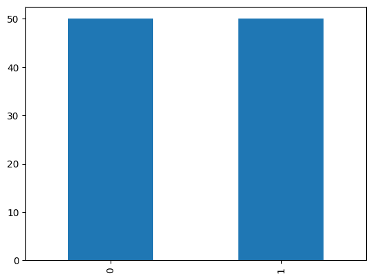
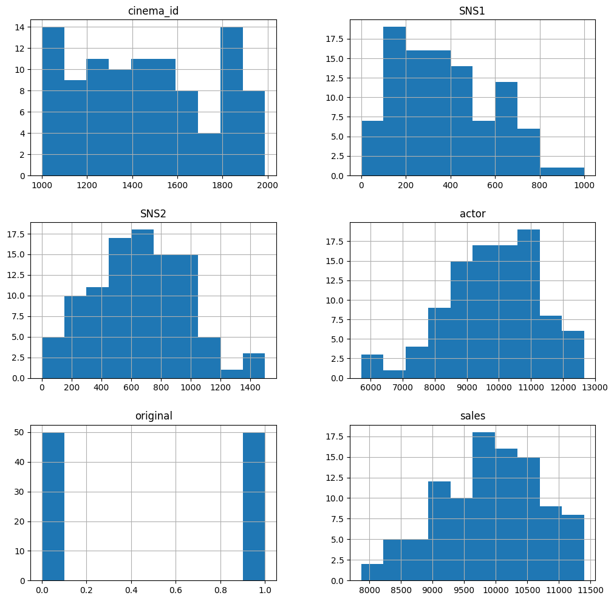
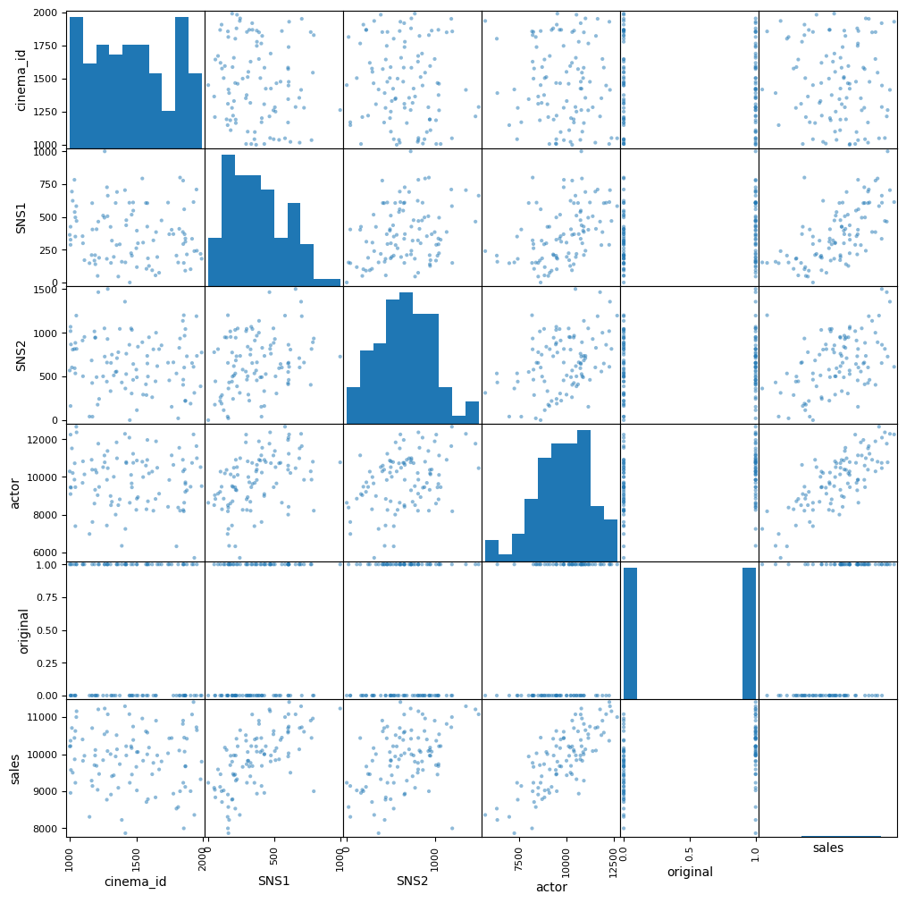
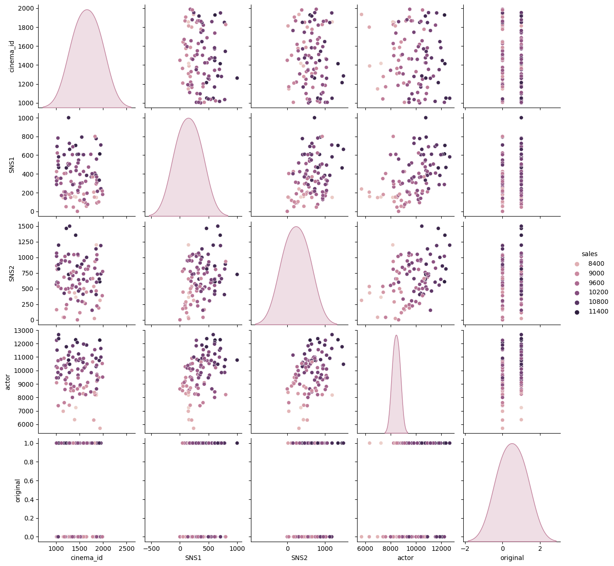

 # 回帰1:映画の興行収入の予測


```python
import unittest
import doctest
import os
from domain import CSVRepository, SQLRepository, CategoricalData, DataVisualization, convert_categoricals

path = os.path.dirname(os.path.abspath(__file__))
#repo = SQLRepository(table='Cinema')
repo = CSVRepository(file= path + '/data/cinema.csv')
```

 ## データの内容
 | 列名 | 内容 |
 | --- | --- |
 | cinema_id | 映画作品のID |
 | SNS1 | 公開後10日以内にSNS1でつぶやかれた数 |
 | SNS2 | 公開後10日以内にSNS2でつぶやかれた数 |
 | actor | 主演俳優の昨年のメディア露出度。actorの値が大きいほど露出している |
 | original | 原作があるかどうか（あるなら1,ないなら0） |
 | sales | 最終的な興行収入（単位:万円） |


```python
df = repo.get_data()
df.head(3)
```


<div>
<style scoped>
    .dataframe tbody tr th:only-of-type {
        vertical-align: middle;
    }

    .dataframe tbody tr th {
        vertical-align: top;
    }

    .dataframe thead th {
        text-align: right;
    }
</style>
<table border="1" class="dataframe">
  <thead>
    <tr style="text-align: right;">
      <th></th>
      <th>cinema_id</th>
      <th>SNS1</th>
      <th>SNS2</th>
      <th>actor</th>
      <th>original</th>
      <th>sales</th>
    </tr>
  </thead>
  <tbody>
    <tr>
      <th>0</th>
      <td>1375</td>
      <td>291.0</td>
      <td>1044</td>
      <td>8808.994029</td>
      <td>0</td>
      <td>9731</td>
    </tr>
    <tr>
      <th>1</th>
      <td>1000</td>
      <td>363.0</td>
      <td>568</td>
      <td>10290.709370</td>
      <td>1</td>
      <td>10210</td>
    </tr>
    <tr>
      <th>2</th>
      <td>1390</td>
      <td>158.0</td>
      <td>431</td>
      <td>6340.388534</td>
      <td>1</td>
      <td>8227</td>
    </tr>
  </tbody>
</table>
</div>


 ## 問題背景

 ## データ分析の方法検討
 - 特徴量を「公開後10日以内にSNS1でつぶやかれた数、公開後10日以内にSNS2でつぶやかれた数、主演俳優の昨年のメディア露出度、原作があるかどうか」、目的変数を「最終的な興行収入」として、映画の興行収入を予測する。

 # 分析の実施

 ### データの概要


```python
df.info()
```

    <class 'pandas.core.frame.DataFrame'>
    RangeIndex: 100 entries, 0 to 99
    Data columns (total 6 columns):
     #   Column     Non-Null Count  Dtype  
    ---  ------     --------------  -----  
     0   cinema_id  100 non-null    int64  
     1   SNS1       99 non-null     float64
     2   SNS2       100 non-null    int64  
     3   actor      99 non-null     float64
     4   original   100 non-null    int64  
     5   sales      100 non-null    int64  
    dtypes: float64(2), int64(4)
    memory usage: 4.8 KB
    

 ### データの統計量


```python
df.describe()
```


<div>
<style scoped>
    .dataframe tbody tr th:only-of-type {
        vertical-align: middle;
    }

    .dataframe tbody tr th {
        vertical-align: top;
    }

    .dataframe thead th {
        text-align: right;
    }
</style>
<table border="1" class="dataframe">
  <thead>
    <tr style="text-align: right;">
      <th></th>
      <th>cinema_id</th>
      <th>SNS1</th>
      <th>SNS2</th>
      <th>actor</th>
      <th>original</th>
      <th>sales</th>
    </tr>
  </thead>
  <tbody>
    <tr>
      <th>count</th>
      <td>100.000000</td>
      <td>99.000000</td>
      <td>100.000000</td>
      <td>99.000000</td>
      <td>100.000000</td>
      <td>100.0000</td>
    </tr>
    <tr>
      <th>mean</th>
      <td>1465.310000</td>
      <td>370.737374</td>
      <td>658.510000</td>
      <td>9817.539306</td>
      <td>0.500000</td>
      <td>9882.4300</td>
    </tr>
    <tr>
      <th>std</th>
      <td>297.894826</td>
      <td>211.925795</td>
      <td>323.839232</td>
      <td>1446.802508</td>
      <td>0.502519</td>
      <td>799.2267</td>
    </tr>
    <tr>
      <th>min</th>
      <td>1000.000000</td>
      <td>0.000000</td>
      <td>0.000000</td>
      <td>5702.796056</td>
      <td>0.000000</td>
      <td>7869.0000</td>
    </tr>
    <tr>
      <th>25%</th>
      <td>1212.750000</td>
      <td>194.500000</td>
      <td>443.250000</td>
      <td>8819.109486</td>
      <td>0.000000</td>
      <td>9314.5000</td>
    </tr>
    <tr>
      <th>50%</th>
      <td>1455.000000</td>
      <td>350.000000</td>
      <td>654.000000</td>
      <td>9991.717888</td>
      <td>0.500000</td>
      <td>9965.0000</td>
    </tr>
    <tr>
      <th>75%</th>
      <td>1739.250000</td>
      <td>513.500000</td>
      <td>885.750000</td>
      <td>10796.866185</td>
      <td>1.000000</td>
      <td>10440.2500</td>
    </tr>
    <tr>
      <th>max</th>
      <td>1989.000000</td>
      <td>1000.000000</td>
      <td>1500.000000</td>
      <td>12665.073780</td>
      <td>1.000000</td>
      <td>11405.0000</td>
    </tr>
  </tbody>
</table>
</div>


 ### データの特徴量の相関確認


```python
categorical_cols = ['sales']
df_conv = convert_categoricals(df, categorical_cols)
df_conv.corr()
```


<div>
<style scoped>
    .dataframe tbody tr th:only-of-type {
        vertical-align: middle;
    }

    .dataframe tbody tr th {
        vertical-align: top;
    }

    .dataframe thead th {
        text-align: right;
    }
</style>
<table border="1" class="dataframe">
  <thead>
    <tr style="text-align: right;">
      <th></th>
      <th>cinema_id</th>
      <th>SNS1</th>
      <th>SNS2</th>
      <th>actor</th>
      <th>original</th>
      <th>sales</th>
    </tr>
  </thead>
  <tbody>
    <tr>
      <th>cinema_id</th>
      <td>1.000000</td>
      <td>-0.132512</td>
      <td>-0.107442</td>
      <td>-0.088354</td>
      <td>-0.068050</td>
      <td>-0.072153</td>
    </tr>
    <tr>
      <th>SNS1</th>
      <td>-0.132512</td>
      <td>1.000000</td>
      <td>0.291303</td>
      <td>0.449249</td>
      <td>0.209370</td>
      <td>0.657756</td>
    </tr>
    <tr>
      <th>SNS2</th>
      <td>-0.107442</td>
      <td>0.291303</td>
      <td>1.000000</td>
      <td>0.391254</td>
      <td>0.075136</td>
      <td>0.470141</td>
    </tr>
    <tr>
      <th>actor</th>
      <td>-0.088354</td>
      <td>0.449249</td>
      <td>0.391254</td>
      <td>1.000000</td>
      <td>0.280555</td>
      <td>0.756298</td>
    </tr>
    <tr>
      <th>original</th>
      <td>-0.068050</td>
      <td>0.209370</td>
      <td>0.075136</td>
      <td>0.280555</td>
      <td>1.000000</td>
      <td>0.431011</td>
    </tr>
    <tr>
      <th>sales</th>
      <td>-0.072153</td>
      <td>0.657756</td>
      <td>0.470141</td>
      <td>0.756298</td>
      <td>0.431011</td>
      <td>1.000000</td>
    </tr>
  </tbody>
</table>
</div>


 ### データの数値変数確認


```python
df.select_dtypes(include='number').columns
```


    Index(['cinema_id', 'SNS1', 'SNS2', 'actor', 'original', 'sales'], dtype='object')


 ### originalカテゴリ


```python
original = CategoricalData(df, 'original')
```


```python
original.show()
```


    0    50
    1    50
    Name: original, dtype: int64


```python
original.plot()

## %% [markdown]
# ### 種類カテゴリの数値変換
```


    <Axes: >


    

    


```python
categorical_cols = ['original']
df_conv = convert_categoricals(df, categorical_cols)
conv_species = CategoricalData(df_conv, 'sales')
conv_species.plot()
```


    <Axes: >


    

    


 ### ピボットテーブルによる集計


```python
original.pivot('sales', 'SNS1')
```


<div>
<style scoped>
    .dataframe tbody tr th:only-of-type {
        vertical-align: middle;
    }

    .dataframe tbody tr th {
        vertical-align: top;
    }

    .dataframe thead th {
        text-align: right;
    }
</style>
<table border="1" class="dataframe">
  <thead>
    <tr style="text-align: right;">
      <th>original</th>
      <th>0</th>
      <th>1</th>
    </tr>
    <tr>
      <th>sales</th>
      <th></th>
      <th></th>
    </tr>
  </thead>
  <tbody>
    <tr>
      <th>7869</th>
      <td>NaN</td>
      <td>1.0</td>
    </tr>
    <tr>
      <th>8000</th>
      <td>1.0</td>
      <td>NaN</td>
    </tr>
    <tr>
      <th>8227</th>
      <td>NaN</td>
      <td>1.0</td>
    </tr>
    <tr>
      <th>8310</th>
      <td>1.0</td>
      <td>NaN</td>
    </tr>
    <tr>
      <th>8362</th>
      <td>1.0</td>
      <td>NaN</td>
    </tr>
    <tr>
      <th>...</th>
      <td>...</td>
      <td>...</td>
    </tr>
    <tr>
      <th>11157</th>
      <td>NaN</td>
      <td>1.0</td>
    </tr>
    <tr>
      <th>11208</th>
      <td>NaN</td>
      <td>1.0</td>
    </tr>
    <tr>
      <th>11231</th>
      <td>NaN</td>
      <td>1.0</td>
    </tr>
    <tr>
      <th>11292</th>
      <td>NaN</td>
      <td>1.0</td>
    </tr>
    <tr>
      <th>11405</th>
      <td>NaN</td>
      <td>1.0</td>
    </tr>
  </tbody>
</table>
<p>99 rows × 2 columns</p>
</div>


```python
original.pivot('sales', 'SNS2')
```


<div>
<style scoped>
    .dataframe tbody tr th:only-of-type {
        vertical-align: middle;
    }

    .dataframe tbody tr th {
        vertical-align: top;
    }

    .dataframe thead th {
        text-align: right;
    }
</style>
<table border="1" class="dataframe">
  <thead>
    <tr style="text-align: right;">
      <th>original</th>
      <th>0</th>
      <th>1</th>
    </tr>
    <tr>
      <th>sales</th>
      <th></th>
      <th></th>
    </tr>
  </thead>
  <tbody>
    <tr>
      <th>7869</th>
      <td>NaN</td>
      <td>1.0</td>
    </tr>
    <tr>
      <th>8000</th>
      <td>1.0</td>
      <td>NaN</td>
    </tr>
    <tr>
      <th>8227</th>
      <td>NaN</td>
      <td>1.0</td>
    </tr>
    <tr>
      <th>8310</th>
      <td>1.0</td>
      <td>NaN</td>
    </tr>
    <tr>
      <th>8362</th>
      <td>1.0</td>
      <td>NaN</td>
    </tr>
    <tr>
      <th>...</th>
      <td>...</td>
      <td>...</td>
    </tr>
    <tr>
      <th>11157</th>
      <td>NaN</td>
      <td>1.0</td>
    </tr>
    <tr>
      <th>11208</th>
      <td>NaN</td>
      <td>1.0</td>
    </tr>
    <tr>
      <th>11231</th>
      <td>NaN</td>
      <td>1.0</td>
    </tr>
    <tr>
      <th>11292</th>
      <td>NaN</td>
      <td>1.0</td>
    </tr>
    <tr>
      <th>11405</th>
      <td>NaN</td>
      <td>1.0</td>
    </tr>
  </tbody>
</table>
<p>99 rows × 2 columns</p>
</div>


```python
original.pivot('sales', 'actor')
```


<div>
<style scoped>
    .dataframe tbody tr th:only-of-type {
        vertical-align: middle;
    }

    .dataframe tbody tr th {
        vertical-align: top;
    }

    .dataframe thead th {
        text-align: right;
    }
</style>
<table border="1" class="dataframe">
  <thead>
    <tr style="text-align: right;">
      <th>original</th>
      <th>0</th>
      <th>1</th>
    </tr>
    <tr>
      <th>sales</th>
      <th></th>
      <th></th>
    </tr>
  </thead>
  <tbody>
    <tr>
      <th>7869</th>
      <td>NaN</td>
      <td>1.0</td>
    </tr>
    <tr>
      <th>8000</th>
      <td>1.0</td>
      <td>NaN</td>
    </tr>
    <tr>
      <th>8227</th>
      <td>NaN</td>
      <td>1.0</td>
    </tr>
    <tr>
      <th>8310</th>
      <td>1.0</td>
      <td>NaN</td>
    </tr>
    <tr>
      <th>8362</th>
      <td>1.0</td>
      <td>NaN</td>
    </tr>
    <tr>
      <th>...</th>
      <td>...</td>
      <td>...</td>
    </tr>
    <tr>
      <th>11157</th>
      <td>NaN</td>
      <td>1.0</td>
    </tr>
    <tr>
      <th>11208</th>
      <td>NaN</td>
      <td>1.0</td>
    </tr>
    <tr>
      <th>11231</th>
      <td>NaN</td>
      <td>1.0</td>
    </tr>
    <tr>
      <th>11292</th>
      <td>NaN</td>
      <td>1.0</td>
    </tr>
    <tr>
      <th>11405</th>
      <td>NaN</td>
      <td>1.0</td>
    </tr>
  </tbody>
</table>
<p>99 rows × 2 columns</p>
</div>


 ### ダミー変数化


```python
df_dummy = original.dummy()
df_dummy
```


<div>
<style scoped>
    .dataframe tbody tr th:only-of-type {
        vertical-align: middle;
    }

    .dataframe tbody tr th {
        vertical-align: top;
    }

    .dataframe thead th {
        text-align: right;
    }
</style>
<table border="1" class="dataframe">
  <thead>
    <tr style="text-align: right;">
      <th></th>
      <th>cinema_id</th>
      <th>SNS1</th>
      <th>SNS2</th>
      <th>actor</th>
      <th>sales</th>
      <th>original_0</th>
      <th>original_1</th>
    </tr>
  </thead>
  <tbody>
    <tr>
      <th>0</th>
      <td>1375</td>
      <td>291.0</td>
      <td>1044</td>
      <td>8808.994029</td>
      <td>9731</td>
      <td>1</td>
      <td>0</td>
    </tr>
    <tr>
      <th>1</th>
      <td>1000</td>
      <td>363.0</td>
      <td>568</td>
      <td>10290.709370</td>
      <td>10210</td>
      <td>0</td>
      <td>1</td>
    </tr>
    <tr>
      <th>2</th>
      <td>1390</td>
      <td>158.0</td>
      <td>431</td>
      <td>6340.388534</td>
      <td>8227</td>
      <td>0</td>
      <td>1</td>
    </tr>
    <tr>
      <th>3</th>
      <td>1499</td>
      <td>261.0</td>
      <td>578</td>
      <td>8250.485081</td>
      <td>9658</td>
      <td>1</td>
      <td>0</td>
    </tr>
    <tr>
      <th>4</th>
      <td>1164</td>
      <td>209.0</td>
      <td>683</td>
      <td>10908.539550</td>
      <td>9286</td>
      <td>1</td>
      <td>0</td>
    </tr>
    <tr>
      <th>...</th>
      <td>...</td>
      <td>...</td>
      <td>...</td>
      <td>...</td>
      <td>...</td>
      <td>...</td>
      <td>...</td>
    </tr>
    <tr>
      <th>95</th>
      <td>1260</td>
      <td>494.0</td>
      <td>1050</td>
      <td>11137.482810</td>
      <td>10537</td>
      <td>0</td>
      <td>1</td>
    </tr>
    <tr>
      <th>96</th>
      <td>1283</td>
      <td>505.0</td>
      <td>928</td>
      <td>11376.038540</td>
      <td>10084</td>
      <td>0</td>
      <td>1</td>
    </tr>
    <tr>
      <th>97</th>
      <td>1861</td>
      <td>368.0</td>
      <td>966</td>
      <td>10393.252480</td>
      <td>10069</td>
      <td>1</td>
      <td>0</td>
    </tr>
    <tr>
      <th>98</th>
      <td>1006</td>
      <td>326.0</td>
      <td>1068</td>
      <td>9454.019853</td>
      <td>10218</td>
      <td>0</td>
      <td>1</td>
    </tr>
    <tr>
      <th>99</th>
      <td>1764</td>
      <td>402.0</td>
      <td>153</td>
      <td>11144.482970</td>
      <td>10435</td>
      <td>0</td>
      <td>1</td>
    </tr>
  </tbody>
</table>
<p>100 rows × 7 columns</p>
</div>


 ### データのカテゴリ変数確認


```python
df.select_dtypes(include='object').columns
```


    Index([], dtype='object')


 ### データの可視化


```python
dv = DataVisualization(df)
dv.df_all('sales')
```


    

    


    

    


    

    


 ## データの前処理

 ### 欠損地処理（行削除・全体代表値埋め、グループ代表値埋め）

 ### 各手法を必要に応じて実施

 - 外れ値の除外
 - 多項式特徴量・交互作用特徴量の追加
 - 特徴量の絞り込み
 - 標準化

 ## モデルの作成と学習

 ### 未学習状態モデルの生成（分類なら決定木、回帰なら線形回帰）

 ### 訓練データで学習（必要に応じて不均衡データ補正）

 ## モデルの評価

 ### 検証データで評価し指標確認（分類なら正解率、回帰なら決定係数）

 ### NG:改善案検討前処理に戻る
 ### OK:最終性能評価（テストデータで評価）


```python
doctest.testmod(verbose=True)
unittest.main(argv=[''], verbosity=2, exit=False)
```

    3 items had no tests:
        __main__
        __main__.__VSCODE_compute_hash
        __main__.__VSCODE_wrap_run_cell
    0 tests in 3 items.
    0 passed and 0 failed.
    Test passed.
    

    
    ----------------------------------------------------------------------
    Ran 0 tests in 0.000s
    
    OK
    


    <unittest.main.TestProgram at 0x2a08781a400>


