 # 分類2:客船沈没事故での生存予測


```python
import pickle
from sklearn import tree
from sklearn.model_selection import train_test_split
import unittest
import doctest
import os

from domain import CSVRepository, SQLRepository, CategoricalData, DataVisualization, convert_categoricals
import pandas as pd

path = os.path.dirname(os.path.abspath(__file__))
#repo = SQLRepository(table='Survived')
repo = CSVRepository(file=path + '/data/Survived.csv')
```

 ## データの内容
 | 列名 | 内容 |
 | --- | --- |
 | PassengerId | 乗客ID |
 | Pclass | チケットクラス（1等、2等、3等）|
 | Age | 年齢 |
 | Parch | 同乗した、自身の親と子供の総数 |
 | Fare | 運賃 |
 | Embarked | 搭乗港 |
 | Survived | 1:生存,0:死亡 |
 | Sex | 性別 |
 | SibSp | 同乗した兄弟や配偶者の総数 |
 | Ticket | チケットID |
 | Cabin | 部屋番号 |


```python
df = repo.get_data()
df.head(3)
```


<div>
<style scoped>
    .dataframe tbody tr th:only-of-type {
        vertical-align: middle;
    }

    .dataframe tbody tr th {
        vertical-align: top;
    }

    .dataframe thead th {
        text-align: right;
    }
</style>
<table border="1" class="dataframe">
  <thead>
    <tr style="text-align: right;">
      <th></th>
      <th>PassengerId</th>
      <th>Survived</th>
      <th>Pclass</th>
      <th>Sex</th>
      <th>Age</th>
      <th>SibSp</th>
      <th>Parch</th>
      <th>Ticket</th>
      <th>Fare</th>
      <th>Cabin</th>
      <th>Embarked</th>
    </tr>
  </thead>
  <tbody>
    <tr>
      <th>0</th>
      <td>1</td>
      <td>0</td>
      <td>3</td>
      <td>male</td>
      <td>22.0</td>
      <td>1</td>
      <td>0</td>
      <td>A/5 21171</td>
      <td>7.2500</td>
      <td>NaN</td>
      <td>S</td>
    </tr>
    <tr>
      <th>1</th>
      <td>2</td>
      <td>1</td>
      <td>1</td>
      <td>female</td>
      <td>38.0</td>
      <td>1</td>
      <td>0</td>
      <td>PC 17599</td>
      <td>71.2833</td>
      <td>C85</td>
      <td>C</td>
    </tr>
    <tr>
      <th>2</th>
      <td>3</td>
      <td>1</td>
      <td>3</td>
      <td>female</td>
      <td>26.0</td>
      <td>0</td>
      <td>0</td>
      <td>STON/O2. 3101282</td>
      <td>7.9250</td>
      <td>NaN</td>
      <td>S</td>
    </tr>
  </tbody>
</table>
</div>


 ## 問題背景
 客船沈没事故で、どのような人が生き残ったかを分析します。このデータを用いて、客船の乗客の特徴量から生存者を予測するモデルを作成します。

 ## データ分析の方法検討
 - 乗客の特徴から沈没時に生存か死亡かに分類するモデルを作成する。また、その過程で、どのような特徴を持つ人が生き残れたかを考察する。
 - 特徴量を「チケットクラス、年齢、同乗した、自身の親と子供の総数、運賃、搭乗港、性別、同乗した兄弟や配偶者の総数、部屋番号」、目的変数を「生存」（1:生存,0:死亡）として、客船の乗客の生存を予測する。

 分析の実施

 ### データの概要


```python
df.info()
```

    <class 'pandas.core.frame.DataFrame'>
    RangeIndex: 891 entries, 0 to 890
    Data columns (total 11 columns):
     #   Column       Non-Null Count  Dtype  
    ---  ------       --------------  -----  
     0   PassengerId  891 non-null    int64  
     1   Survived     891 non-null    int64  
     2   Pclass       891 non-null    int64  
     3   Sex          891 non-null    object 
     4   Age          714 non-null    float64
     5   SibSp        891 non-null    int64  
     6   Parch        891 non-null    int64  
     7   Ticket       891 non-null    object 
     8   Fare         891 non-null    float64
     9   Cabin        204 non-null    object 
     10  Embarked     889 non-null    object 
    dtypes: float64(2), int64(5), object(4)
    memory usage: 76.7+ KB
    

 ### データの統計量


```python
df.describe()
```


<div>
<style scoped>
    .dataframe tbody tr th:only-of-type {
        vertical-align: middle;
    }

    .dataframe tbody tr th {
        vertical-align: top;
    }

    .dataframe thead th {
        text-align: right;
    }
</style>
<table border="1" class="dataframe">
  <thead>
    <tr style="text-align: right;">
      <th></th>
      <th>PassengerId</th>
      <th>Survived</th>
      <th>Pclass</th>
      <th>Age</th>
      <th>SibSp</th>
      <th>Parch</th>
      <th>Fare</th>
    </tr>
  </thead>
  <tbody>
    <tr>
      <th>count</th>
      <td>891.000000</td>
      <td>891.000000</td>
      <td>891.000000</td>
      <td>714.000000</td>
      <td>891.000000</td>
      <td>891.000000</td>
      <td>891.000000</td>
    </tr>
    <tr>
      <th>mean</th>
      <td>446.000000</td>
      <td>0.383838</td>
      <td>2.308642</td>
      <td>29.699118</td>
      <td>0.523008</td>
      <td>0.381594</td>
      <td>32.204208</td>
    </tr>
    <tr>
      <th>std</th>
      <td>257.353842</td>
      <td>0.486592</td>
      <td>0.836071</td>
      <td>14.526497</td>
      <td>1.102743</td>
      <td>0.806057</td>
      <td>49.693429</td>
    </tr>
    <tr>
      <th>min</th>
      <td>1.000000</td>
      <td>0.000000</td>
      <td>1.000000</td>
      <td>0.420000</td>
      <td>0.000000</td>
      <td>0.000000</td>
      <td>0.000000</td>
    </tr>
    <tr>
      <th>25%</th>
      <td>223.500000</td>
      <td>0.000000</td>
      <td>2.000000</td>
      <td>20.125000</td>
      <td>0.000000</td>
      <td>0.000000</td>
      <td>7.910400</td>
    </tr>
    <tr>
      <th>50%</th>
      <td>446.000000</td>
      <td>0.000000</td>
      <td>3.000000</td>
      <td>28.000000</td>
      <td>0.000000</td>
      <td>0.000000</td>
      <td>14.454200</td>
    </tr>
    <tr>
      <th>75%</th>
      <td>668.500000</td>
      <td>1.000000</td>
      <td>3.000000</td>
      <td>38.000000</td>
      <td>1.000000</td>
      <td>0.000000</td>
      <td>31.000000</td>
    </tr>
    <tr>
      <th>max</th>
      <td>891.000000</td>
      <td>1.000000</td>
      <td>3.000000</td>
      <td>80.000000</td>
      <td>8.000000</td>
      <td>6.000000</td>
      <td>512.329200</td>
    </tr>
  </tbody>
</table>
</div>


 ### データの特徴量の相関確認


```python
categorical_cols = ['Sex', 'Ticket', 'Cabin', 'Embarked']
df_conv = convert_categoricals(df, categorical_cols)
df_conv.corr()
```


<div>
<style scoped>
    .dataframe tbody tr th:only-of-type {
        vertical-align: middle;
    }

    .dataframe tbody tr th {
        vertical-align: top;
    }

    .dataframe thead th {
        text-align: right;
    }
</style>
<table border="1" class="dataframe">
  <thead>
    <tr style="text-align: right;">
      <th></th>
      <th>PassengerId</th>
      <th>Survived</th>
      <th>Pclass</th>
      <th>Sex</th>
      <th>Age</th>
      <th>SibSp</th>
      <th>Parch</th>
      <th>Ticket</th>
      <th>Fare</th>
      <th>Cabin</th>
      <th>Embarked</th>
    </tr>
  </thead>
  <tbody>
    <tr>
      <th>PassengerId</th>
      <td>1.000000</td>
      <td>-0.005007</td>
      <td>-0.035144</td>
      <td>0.042939</td>
      <td>0.036847</td>
      <td>-0.057527</td>
      <td>-0.001652</td>
      <td>-0.056554</td>
      <td>0.012658</td>
      <td>-0.035077</td>
      <td>0.013083</td>
    </tr>
    <tr>
      <th>Survived</th>
      <td>-0.005007</td>
      <td>1.000000</td>
      <td>-0.338481</td>
      <td>-0.543351</td>
      <td>-0.077221</td>
      <td>-0.035322</td>
      <td>0.081629</td>
      <td>-0.164549</td>
      <td>0.257307</td>
      <td>-0.254888</td>
      <td>-0.163517</td>
    </tr>
    <tr>
      <th>Pclass</th>
      <td>-0.035144</td>
      <td>-0.338481</td>
      <td>1.000000</td>
      <td>0.131900</td>
      <td>-0.369226</td>
      <td>0.083081</td>
      <td>0.018443</td>
      <td>0.319869</td>
      <td>-0.549500</td>
      <td>0.684121</td>
      <td>0.157112</td>
    </tr>
    <tr>
      <th>Sex</th>
      <td>0.042939</td>
      <td>-0.543351</td>
      <td>0.131900</td>
      <td>1.000000</td>
      <td>0.093254</td>
      <td>-0.114631</td>
      <td>-0.245489</td>
      <td>0.059372</td>
      <td>-0.182333</td>
      <td>0.096681</td>
      <td>0.104057</td>
    </tr>
    <tr>
      <th>Age</th>
      <td>0.036847</td>
      <td>-0.077221</td>
      <td>-0.369226</td>
      <td>0.093254</td>
      <td>1.000000</td>
      <td>-0.308247</td>
      <td>-0.189119</td>
      <td>-0.075934</td>
      <td>0.096067</td>
      <td>-0.252331</td>
      <td>-0.025252</td>
    </tr>
    <tr>
      <th>SibSp</th>
      <td>-0.057527</td>
      <td>-0.035322</td>
      <td>0.083081</td>
      <td>-0.114631</td>
      <td>-0.308247</td>
      <td>1.000000</td>
      <td>0.414838</td>
      <td>0.079461</td>
      <td>0.159651</td>
      <td>0.043593</td>
      <td>0.066654</td>
    </tr>
    <tr>
      <th>Parch</th>
      <td>-0.001652</td>
      <td>0.081629</td>
      <td>0.018443</td>
      <td>-0.245489</td>
      <td>-0.189119</td>
      <td>0.414838</td>
      <td>1.000000</td>
      <td>0.020003</td>
      <td>0.216225</td>
      <td>-0.028324</td>
      <td>0.038322</td>
    </tr>
    <tr>
      <th>Ticket</th>
      <td>-0.056554</td>
      <td>-0.164549</td>
      <td>0.319869</td>
      <td>0.059372</td>
      <td>-0.075934</td>
      <td>0.079461</td>
      <td>0.020003</td>
      <td>1.000000</td>
      <td>-0.013885</td>
      <td>0.243696</td>
      <td>-0.006041</td>
    </tr>
    <tr>
      <th>Fare</th>
      <td>0.012658</td>
      <td>0.257307</td>
      <td>-0.549500</td>
      <td>-0.182333</td>
      <td>0.096067</td>
      <td>0.159651</td>
      <td>0.216225</td>
      <td>-0.013885</td>
      <td>1.000000</td>
      <td>-0.503355</td>
      <td>-0.221226</td>
    </tr>
    <tr>
      <th>Cabin</th>
      <td>-0.035077</td>
      <td>-0.254888</td>
      <td>0.684121</td>
      <td>0.096681</td>
      <td>-0.252331</td>
      <td>0.043593</td>
      <td>-0.028324</td>
      <td>0.243696</td>
      <td>-0.503355</td>
      <td>1.000000</td>
      <td>0.193205</td>
    </tr>
    <tr>
      <th>Embarked</th>
      <td>0.013083</td>
      <td>-0.163517</td>
      <td>0.157112</td>
      <td>0.104057</td>
      <td>-0.025252</td>
      <td>0.066654</td>
      <td>0.038322</td>
      <td>-0.006041</td>
      <td>-0.221226</td>
      <td>0.193205</td>
      <td>1.000000</td>
    </tr>
  </tbody>
</table>
</div>


 ### データの数値変数確認


```python
df.select_dtypes(include='number').columns
```


    Index(['PassengerId', 'Survived', 'Pclass', 'Age', 'SibSp', 'Parch', 'Fare'], dtype='object')


 ### データのカテゴリ変数確認


```python
df.select_dtypes(include='object').columns
```


    Index(['Sex', 'Ticket', 'Cabin', 'Embarked'], dtype='object')


 ### 性別カテゴリ


```python
sex = CategoricalData(df, 'Sex')
```


```python
sex.show()
```


    male      577
    female    314
    Name: Sex, dtype: int64


```python
sex.plot()
```


    <Axes: >


    
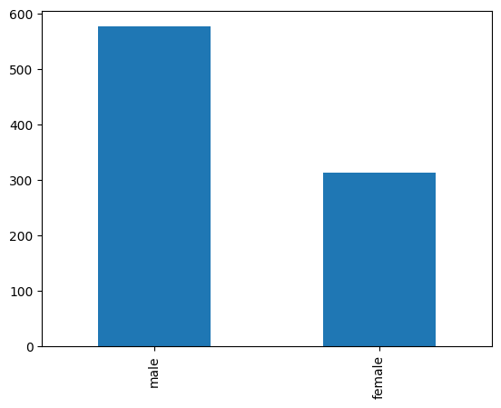
    


 ### 性別カテゴリの数値変換


```python
categorical_cols = ['Sex']
df_conv = convert_categoricals(df, categorical_cols)
conv_species = CategoricalData(df_conv, 'Sex')
conv_species.plot()
```


    <Axes: >


    
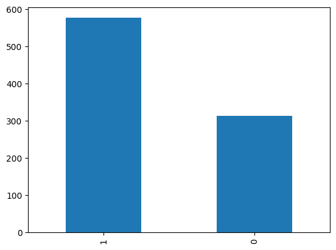
    


 ### チケットIDカテゴリ


```python
ticket = CategoricalData(df, 'Ticket')
```


```python
ticket.show()
```


    347082       7
    1601         7
    CA. 2343     7
    3101295      6
    CA 2144      6
                ..
    367655       1
    113800       1
    113783       1
    A/4 45380    1
    28228        1
    Name: Ticket, Length: 681, dtype: int64


```python
ticket.plot()
```


    <Axes: >


    
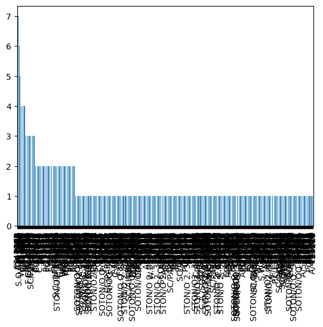
    


 ### チケットIDカテゴリの数値変換


```python
categorical_cols = ['Ticket']
df_conv = convert_categoricals(df, categorical_cols)
conv_species = CategoricalData(df_conv, 'Ticket')
conv_species.plot()
```


    <Axes: >


    
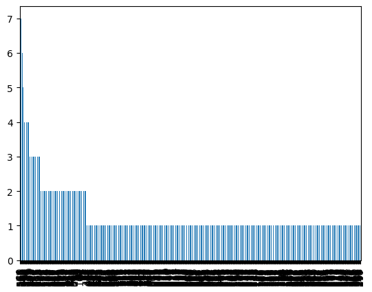
    


 ### 部屋番号カテゴリ


```python
cabin = CategoricalData(df, 'Cabin')
```


```python
cabin.show()
```


    G6             4
    B96 B98        4
    C23 C25 C27    4
    C22 C26        3
    D              3
                  ..
    E17            1
    C49            1
    D30            1
    B19            1
    B41            1
    Name: Cabin, Length: 147, dtype: int64


```python
cabin.plot()
```


    <Axes: >


    
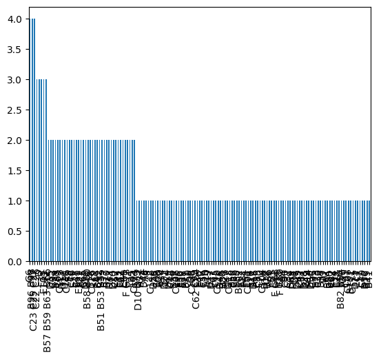
    


 ### 部屋番号カテゴリの数値変換


```python
categorical_cols = ['Cabin']
df_conv = convert_categoricals(df, categorical_cols)
conv_species = CategoricalData(df_conv, 'Cabin')
conv_species.plot()
```


    <Axes: >


    
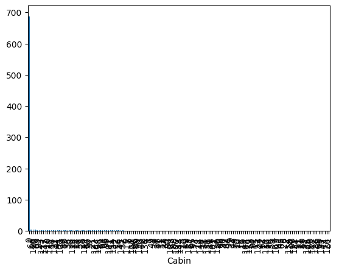
    


 ### 搭乗港カテゴリ


```python
embarked = CategoricalData(df, 'Embarked')
```


```python
embarked.show()
```


    S    644
    C    168
    Q     77
    Name: Embarked, dtype: int64


```python
embarked.plot()
```


    <Axes: >


    
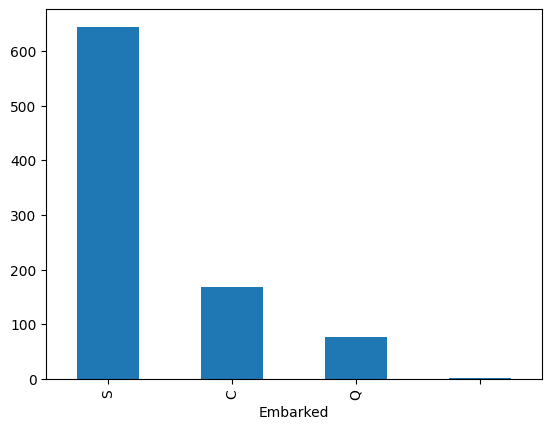
    


 ### 搭乗港カテゴリの数値変換


```python
categorical_cols = ['Embarked']
df_conv = convert_categoricals(df, categorical_cols)
conv_species = CategoricalData(df_conv, 'Embarked')
conv_species.plot()
```


    <Axes: >


    
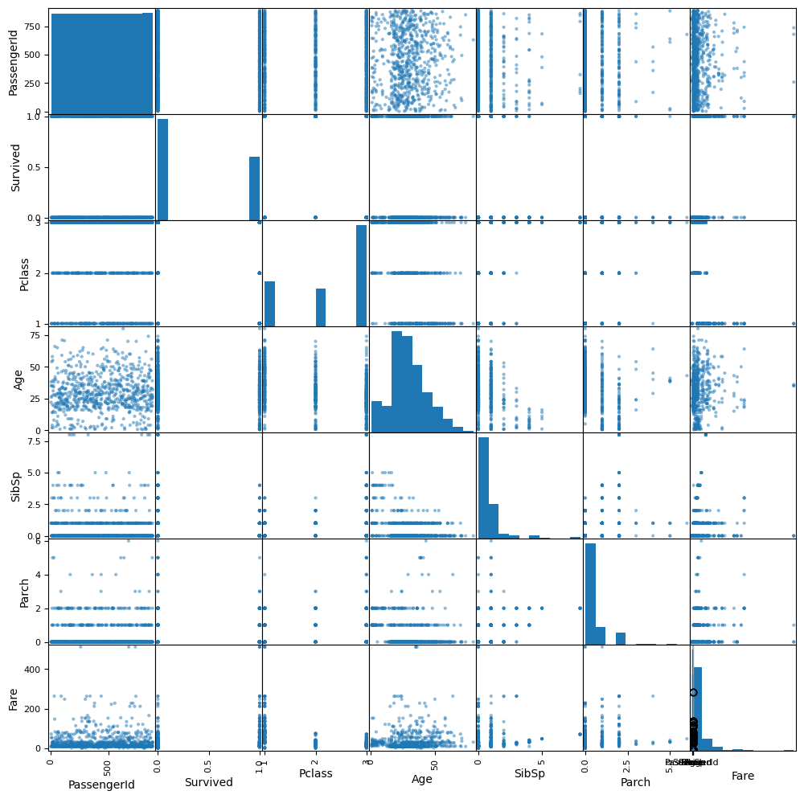
    


 ### ダミー変数化


```python
df_dummy = pd.get_dummies(df, columns=['Survived'])
df_dummy
```


<div>
<style scoped>
    .dataframe tbody tr th:only-of-type {
        vertical-align: middle;
    }

    .dataframe tbody tr th {
        vertical-align: top;
    }

    .dataframe thead th {
        text-align: right;
    }
</style>
<table border="1" class="dataframe">
  <thead>
    <tr style="text-align: right;">
      <th></th>
      <th>PassengerId</th>
      <th>Pclass</th>
      <th>Sex</th>
      <th>Age</th>
      <th>SibSp</th>
      <th>Parch</th>
      <th>Ticket</th>
      <th>Fare</th>
      <th>Cabin</th>
      <th>Embarked</th>
      <th>Survived_0</th>
      <th>Survived_1</th>
    </tr>
  </thead>
  <tbody>
    <tr>
      <th>0</th>
      <td>1</td>
      <td>3</td>
      <td>male</td>
      <td>22.0</td>
      <td>1</td>
      <td>0</td>
      <td>A/5 21171</td>
      <td>7.2500</td>
      <td>NaN</td>
      <td>S</td>
      <td>1</td>
      <td>0</td>
    </tr>
    <tr>
      <th>1</th>
      <td>2</td>
      <td>1</td>
      <td>female</td>
      <td>38.0</td>
      <td>1</td>
      <td>0</td>
      <td>PC 17599</td>
      <td>71.2833</td>
      <td>C85</td>
      <td>C</td>
      <td>0</td>
      <td>1</td>
    </tr>
    <tr>
      <th>2</th>
      <td>3</td>
      <td>3</td>
      <td>female</td>
      <td>26.0</td>
      <td>0</td>
      <td>0</td>
      <td>STON/O2. 3101282</td>
      <td>7.9250</td>
      <td>NaN</td>
      <td>S</td>
      <td>0</td>
      <td>1</td>
    </tr>
    <tr>
      <th>3</th>
      <td>4</td>
      <td>1</td>
      <td>female</td>
      <td>35.0</td>
      <td>1</td>
      <td>0</td>
      <td>113803</td>
      <td>53.1000</td>
      <td>C123</td>
      <td>S</td>
      <td>0</td>
      <td>1</td>
    </tr>
    <tr>
      <th>4</th>
      <td>5</td>
      <td>3</td>
      <td>male</td>
      <td>35.0</td>
      <td>0</td>
      <td>0</td>
      <td>373450</td>
      <td>8.0500</td>
      <td>NaN</td>
      <td>S</td>
      <td>1</td>
      <td>0</td>
    </tr>
    <tr>
      <th>...</th>
      <td>...</td>
      <td>...</td>
      <td>...</td>
      <td>...</td>
      <td>...</td>
      <td>...</td>
      <td>...</td>
      <td>...</td>
      <td>...</td>
      <td>...</td>
      <td>...</td>
      <td>...</td>
    </tr>
    <tr>
      <th>886</th>
      <td>887</td>
      <td>2</td>
      <td>male</td>
      <td>27.0</td>
      <td>0</td>
      <td>0</td>
      <td>211536</td>
      <td>13.0000</td>
      <td>NaN</td>
      <td>S</td>
      <td>1</td>
      <td>0</td>
    </tr>
    <tr>
      <th>887</th>
      <td>888</td>
      <td>1</td>
      <td>female</td>
      <td>19.0</td>
      <td>0</td>
      <td>0</td>
      <td>112053</td>
      <td>30.0000</td>
      <td>B42</td>
      <td>S</td>
      <td>0</td>
      <td>1</td>
    </tr>
    <tr>
      <th>888</th>
      <td>889</td>
      <td>3</td>
      <td>female</td>
      <td>NaN</td>
      <td>1</td>
      <td>2</td>
      <td>W./C. 6607</td>
      <td>23.4500</td>
      <td>NaN</td>
      <td>S</td>
      <td>1</td>
      <td>0</td>
    </tr>
    <tr>
      <th>889</th>
      <td>890</td>
      <td>1</td>
      <td>male</td>
      <td>26.0</td>
      <td>0</td>
      <td>0</td>
      <td>111369</td>
      <td>30.0000</td>
      <td>C148</td>
      <td>C</td>
      <td>0</td>
      <td>1</td>
    </tr>
    <tr>
      <th>890</th>
      <td>891</td>
      <td>3</td>
      <td>male</td>
      <td>32.0</td>
      <td>0</td>
      <td>0</td>
      <td>370376</td>
      <td>7.7500</td>
      <td>NaN</td>
      <td>Q</td>
      <td>1</td>
      <td>0</td>
    </tr>
  </tbody>
</table>
<p>891 rows × 12 columns</p>
</div>


 ### データの可視化


```python
dv = DataVisualization(df)
dv.df_all('Survived')
```


    
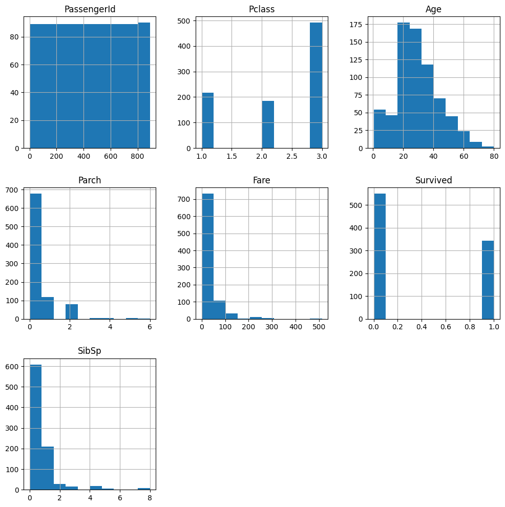
    


    
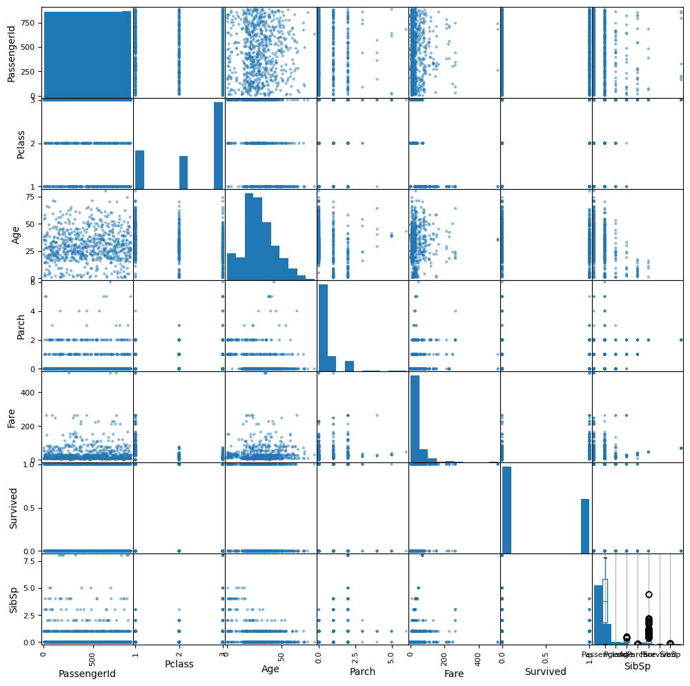
    


    
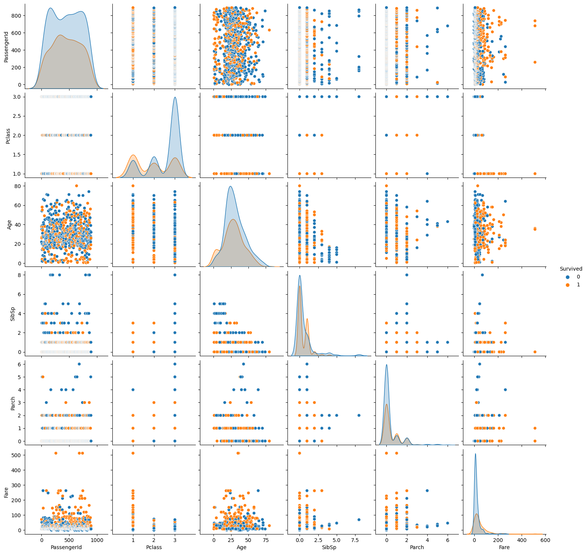
    


 ## データの前処理


```python
df = repo.get_data()
df.head(2)

df['Survived'].value_counts()
```


    0    549
    1    342
    Name: Survived, dtype: int64


 ### 欠損地処理（行削除・全体代表値埋め、グループ代表値埋め）


```python
df.isnull().sum()
df.shape

df['Age'] = df['Age'].fillna(df['Age'].mean())
df['Embarked'] = df['Embarked'].fillna(df['Embarked'].mode()[0])
```

 ### 各手法を必要に応じて実施

 - 外れ値の除外
 - 多項式特徴量・交互作用特徴量の追加
 - 特徴量の絞り込み
 - 標準化


```python
col = ['Pclass', 'Age', 'SibSp', 'Parch', 'Fare']

x = df[col]
y = df['Survived']

x_train, x_test, y_train, y_test = train_test_split(
    x, y, test_size=0.2, random_state=0)

x_train.shape
```


    (712, 5)


 ## モデルの作成と学習

 ### 未学習状態モデルの生成（分類なら決定木、回帰なら線形回帰）


```python
model = tree.DecisionTreeClassifier(
    max_depth=5, random_state=0, class_weight='balanced')
```

 ### 訓練データで学習（必要に応じて不均衡データ補正）


```python
model.fit(x_train, y_train)
```


<style>#sk-container-id-1 {color: black;background-color: white;}#sk-container-id-1 pre{padding: 0;}#sk-container-id-1 div.sk-toggleable {background-color: white;}#sk-container-id-1 label.sk-toggleable__label {cursor: pointer;display: block;width: 100%;margin-bottom: 0;padding: 0.3em;box-sizing: border-box;text-align: center;}#sk-container-id-1 label.sk-toggleable__label-arrow:before {content: "▸";float: left;margin-right: 0.25em;color: #696969;}#sk-container-id-1 label.sk-toggleable__label-arrow:hover:before {color: black;}#sk-container-id-1 div.sk-estimator:hover label.sk-toggleable__label-arrow:before {color: black;}#sk-container-id-1 div.sk-toggleable__content {max-height: 0;max-width: 0;overflow: hidden;text-align: left;background-color: #f0f8ff;}#sk-container-id-1 div.sk-toggleable__content pre {margin: 0.2em;color: black;border-radius: 0.25em;background-color: #f0f8ff;}#sk-container-id-1 input.sk-toggleable__control:checked~div.sk-toggleable__content {max-height: 200px;max-width: 100%;overflow: auto;}#sk-container-id-1 input.sk-toggleable__control:checked~label.sk-toggleable__label-arrow:before {content: "▾";}#sk-container-id-1 div.sk-estimator input.sk-toggleable__control:checked~label.sk-toggleable__label {background-color: #d4ebff;}#sk-container-id-1 div.sk-label input.sk-toggleable__control:checked~label.sk-toggleable__label {background-color: #d4ebff;}#sk-container-id-1 input.sk-hidden--visually {border: 0;clip: rect(1px 1px 1px 1px);clip: rect(1px, 1px, 1px, 1px);height: 1px;margin: -1px;overflow: hidden;padding: 0;position: absolute;width: 1px;}#sk-container-id-1 div.sk-estimator {font-family: monospace;background-color: #f0f8ff;border: 1px dotted black;border-radius: 0.25em;box-sizing: border-box;margin-bottom: 0.5em;}#sk-container-id-1 div.sk-estimator:hover {background-color: #d4ebff;}#sk-container-id-1 div.sk-parallel-item::after {content: "";width: 100%;border-bottom: 1px solid gray;flex-grow: 1;}#sk-container-id-1 div.sk-label:hover label.sk-toggleable__label {background-color: #d4ebff;}#sk-container-id-1 div.sk-serial::before {content: "";position: absolute;border-left: 1px solid gray;box-sizing: border-box;top: 0;bottom: 0;left: 50%;z-index: 0;}#sk-container-id-1 div.sk-serial {display: flex;flex-direction: column;align-items: center;background-color: white;padding-right: 0.2em;padding-left: 0.2em;position: relative;}#sk-container-id-1 div.sk-item {position: relative;z-index: 1;}#sk-container-id-1 div.sk-parallel {display: flex;align-items: stretch;justify-content: center;background-color: white;position: relative;}#sk-container-id-1 div.sk-item::before, #sk-container-id-1 div.sk-parallel-item::before {content: "";position: absolute;border-left: 1px solid gray;box-sizing: border-box;top: 0;bottom: 0;left: 50%;z-index: -1;}#sk-container-id-1 div.sk-parallel-item {display: flex;flex-direction: column;z-index: 1;position: relative;background-color: white;}#sk-container-id-1 div.sk-parallel-item:first-child::after {align-self: flex-end;width: 50%;}#sk-container-id-1 div.sk-parallel-item:last-child::after {align-self: flex-start;width: 50%;}#sk-container-id-1 div.sk-parallel-item:only-child::after {width: 0;}#sk-container-id-1 div.sk-dashed-wrapped {border: 1px dashed gray;margin: 0 0.4em 0.5em 0.4em;box-sizing: border-box;padding-bottom: 0.4em;background-color: white;}#sk-container-id-1 div.sk-label label {font-family: monospace;font-weight: bold;display: inline-block;line-height: 1.2em;}#sk-container-id-1 div.sk-label-container {text-align: center;}#sk-container-id-1 div.sk-container {/* jupyter's `normalize.less` sets `[hidden] { display: none; }` but bootstrap.min.css set `[hidden] { display: none !important; }` so we also need the `!important` here to be able to override the default hidden behavior on the sphinx rendered scikit-learn.org. See: https://github.com/scikit-learn/scikit-learn/issues/21755 */display: inline-block !important;position: relative;}#sk-container-id-1 div.sk-text-repr-fallback {display: none;}</style><div id="sk-container-id-1" class="sk-top-container"><div class="sk-text-repr-fallback"><pre>DecisionTreeClassifier(class_weight=&#x27;balanced&#x27;, max_depth=5, random_state=0)</pre><b>In a Jupyter environment, please rerun this cell to show the HTML representation or trust the notebook. <br />On GitHub, the HTML representation is unable to render, please try loading this page with nbviewer.org.</b></div><div class="sk-container" hidden><div class="sk-item"><div class="sk-estimator sk-toggleable"><input class="sk-toggleable__control sk-hidden--visually" id="sk-estimator-id-1" type="checkbox" checked><label for="sk-estimator-id-1" class="sk-toggleable__label sk-toggleable__label-arrow">DecisionTreeClassifier</label><div class="sk-toggleable__content"><pre>DecisionTreeClassifier(class_weight=&#x27;balanced&#x27;, max_depth=5, random_state=0)</pre></div></div></div></div></div>


 ## モデルの評価

 ### 検証データで評価し指標確認（分類なら正解率、回帰なら決定係数）


```python
model.score(x_test, y_test)
```


    0.7374301675977654


```python
def learn(x, t, depth=3):
    x_train, x_test, y_train, y_test = train_test_split(
        x, t, test_size=0.2, random_state=0)
    model = tree.DecisionTreeClassifier(
        max_depth=depth, random_state=0, class_weight='balanced')
    model.fit(x_train, y_train)

    score = model.score(x_train, y_train)
    score2 = model.score(x_test, y_test)
    return round(score, 3), round(score2, 3), model


for j in range(1, 15):
    train_score, test_score, model = learn(x, y, depth=j)
    sentence = '訓練データの正解率{}'
    sentence2 = 'テストデータの正解率{}'
    total_sentence = '深さ{}:' + sentence + sentence2
    print(total_sentence.format(j, train_score, test_score))
```

    深さ1:訓練データの正解率0.659テストデータの正解率0.704
    深さ2:訓練データの正解率0.699テストデータの正解率0.732
    深さ3:訓練データの正解率0.704テストデータの正解率0.737
    深さ4:訓練データの正解率0.698テストデータの正解率0.726
    深さ5:訓練データの正解率0.722テストデータの正解率0.737
    深さ6:訓練データの正解率0.77テストデータの正解率0.698
    深さ7:訓練データの正解率0.771テストデータの正解率0.648
    深さ8:訓練データの正解率0.781テストデータの正解率0.631
    深さ9:訓練データの正解率0.83テストデータの正解率0.704
    深さ10:訓練データの正解率0.851テストデータの正解率0.687
    深さ11:訓練データの正解率0.878テストデータの正解率0.676
    深さ12:訓練データの正解率0.892テストデータの正解率0.654
    深さ13:訓練データの正解率0.909テストデータの正解率0.654
    深さ14:訓練データの正解率0.92テストデータの正解率0.654
    

 ### NG:改善案検討前処理に戻る


```python
# repo = SQLRepository(table='Survived')
repo = CSVRepository(file=path + '/data/Survived.csv')
```

 #### Take1
 - Age列の平均値と中央値を確認する


```python
# 前処理
df = repo.get_data()
df['Age'] = df['Age'].fillna(df['Age'].median())
df['Embarked'] = df['Embarked'].fillna(df['Embarked'].mode()[0])

col = ['Pclass', 'Age', 'SibSp', 'Parch', 'Fare']
x = df[col]
y = df['Survived']

x_train, x_test, y_train, y_test = train_test_split(
    x, y, test_size=0.2, random_state=0)

# モデルの作成と学習
model = tree.DecisionTreeClassifier(
    max_depth=5, random_state=0, class_weight='balanced')
model.fit(x_train, y_train)

# モデルの評価
model.score(x_test, y_test)
```


    0.7541899441340782


 #### Take2
 - グループ別集計


```python
df2 = repo.get_data()

categorical_cols = ['Sex', 'Ticket', 'Cabin', 'Embarked']
df_conv = convert_categoricals(df2, categorical_cols)
print(df_conv.groupby('Survived').mean()['Age'])
print(df_conv.groupby('Pclass').median()['Age'])
print(pd.pivot_table(df, index='Survived',
      columns='Pclass', values='Age', aggfunc='median'))
print(pd.pivot_table(df, index='Survived',
      columns='Pclass', values='Age', aggfunc=max))
```

    Survived
    0    30.626179
    1    28.343690
    Name: Age, dtype: float64
    Pclass
    1    37.0
    2    29.0
    3    24.0
    Name: Age, dtype: float64
    Pclass       1     2     3
    Survived                  
    0         38.5  30.0  28.0
    1         33.5  28.0  27.0
    Pclass       1     2     3
    Survived                  
    0         71.0  70.0  74.0
    1         80.0  62.0  63.0
    


```python
# 前処理
is_null = df2['Age'].isnull()

df2.loc[(df2['Pclass'] == 1) & (df2['Survived'] == 0) & (is_null), 'Age'] = 43
df2.loc[(df2['Pclass'] == 1) & (df2['Survived'] == 1) & (is_null), 'Age'] = 35

df2.loc[(df2['Pclass'] == 2) & (df2['Survived'] == 0) & (is_null), 'Age'] = 33
df2.loc[(df2['Pclass'] == 2) & (df2['Survived'] == 1) & (is_null), 'Age'] = 25

df2.loc[(df2['Pclass'] == 3) & (df2['Survived'] == 0) & (is_null), 'Age'] = 26
df2.loc[(df2['Pclass'] == 3) & (df2['Survived'] == 1) & (is_null), 'Age'] = 20

col = ['Pclass', 'Age', 'SibSp', 'Parch', 'Fare']
x = df2[col]
y = df2['Survived']

for j in range(1, 15):
    s1, s2, m = learn(x, y, depth=j)
    sentence = '深さ{}:訓練データの精度{}::テストデータの精度{}'
    print(sentence.format(j, s1, s2))

x_train, x_test, y_train, y_test = train_test_split(
    x, y, test_size=0.2, random_state=0)

# モデルの作成と学習
model = tree.DecisionTreeClassifier(
    max_depth=6, random_state=0, class_weight='balanced')
model.fit(x_train, y_train)

# モデルの評価
model.score(x_test, y_test)
```

    深さ1:訓練データの精度0.659::テストデータの精度0.704
    深さ2:訓練データの精度0.699::テストデータの精度0.67
    深さ3:訓練データの精度0.722::テストデータの精度0.715
    深さ4:訓練データの精度0.74::テストデータの精度0.704
    深さ5:訓練データの精度0.76::テストデータの精度0.726
    深さ6:訓練データの精度0.794::テストデータの精度0.793
    深さ7:訓練データの精度0.819::テストデータの精度0.749
    深さ8:訓練データの精度0.84::テストデータの精度0.749
    深さ9:訓練データの精度0.885::テストデータの精度0.743
    深さ10:訓練データの精度0.906::テストデータの精度0.732
    深さ11:訓練データの精度0.93::テストデータの精度0.726
    深さ12:訓練データの精度0.947::テストデータの精度0.737
    深さ13:訓練データの精度0.961::テストデータの精度0.732
    深さ14:訓練データの精度0.969::テストデータの精度0.721
    


    0.7932960893854749


 #### Take3
 - グループ別集計
 - 特徴量に性別を追加


```python
df3 = repo.get_data()

categorical_cols = ['Sex', 'Ticket', 'Cabin', 'Embarked']
df_conv = convert_categoricals(df3, categorical_cols)
sex = df_conv.groupby('Sex').mean()
sex['Survived']
sex['Survived'].plot(kind='bar')
```


    <Axes: xlabel='Sex'>


    
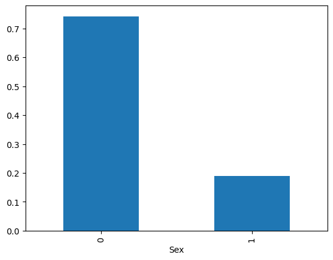
    


```python
# 前処理
is_null = df3['Age'].isnull()

df3.loc[(df3['Pclass'] == 1) & (df3['Survived'] == 0) & (is_null), 'Age'] = 43
df3.loc[(df3['Pclass'] == 1) & (df3['Survived'] == 1) & (is_null), 'Age'] = 35

df3.loc[(df3['Pclass'] == 2) & (df3['Survived'] == 0) & (is_null), 'Age'] = 33
df3.loc[(df3['Pclass'] == 2) & (df3['Survived'] == 1) & (is_null), 'Age'] = 25

df3.loc[(df3['Pclass'] == 3) & (df3['Survived'] == 0) & (is_null), 'Age'] = 26
df3.loc[(df3['Pclass'] == 3) & (df3['Survived'] == 1) & (is_null), 'Age'] = 20

col = ['Pclass', 'Age', 'SibSp', 'Parch', 'Fare', 'Sex']
x = df3[col]
y = df3['Survived']

male = pd.get_dummies(df3['Sex'], drop_first=True)
x_temp = pd.concat([x, male], axis=1)
x_new = x_temp.drop('Sex', axis=1)

# モデルの評価
for j in range(1, 15):
    s1, s2, m = learn(x_new, y, depth=j)
    sentence = '深さ{}:訓練データの精度{}::テストデータの精度{}'
    print(sentence.format(j, s1, s2))
```

    深さ1:訓練データの精度0.787::テストデータの精度0.788
    深さ2:訓練データの精度0.792::テストデータの精度0.782
    深さ3:訓練データの精度0.847::テストデータの精度0.81
    深さ4:訓練データの精度0.854::テストデータの精度0.849
    深さ5:訓練データの精度0.865::テストデータの精度0.86
    深さ6:訓練データの精度0.876::テストデータの精度0.866
    深さ7:訓練データの精度0.904::テストデータの精度0.866
    深さ8:訓練データの精度0.912::テストデータの精度0.894
    深さ9:訓練データの精度0.926::テストデータの精度0.899
    深さ10:訓練データの精度0.948::テストデータの精度0.883
    深さ11:訓練データの精度0.956::テストデータの精度0.832
    深さ12:訓練データの精度0.972::テストデータの精度0.849
    深さ13:訓練データの精度0.971::テストデータの精度0.855
    深さ14:訓練データの精度0.979::テストデータの精度0.844
    

 ### OK:最終性能評価（テストデータで評価）
 #### Take3


```python
# 前処理
df = repo.get_data()
is_null = df['Age'].isnull()

df.loc[(df['Pclass'] == 1) & (df['Survived'] == 0) & (is_null), 'Age'] = 43
df.loc[(df['Pclass'] == 1) & (df['Survived'] == 1) & (is_null), 'Age'] = 35

df.loc[(df['Pclass'] == 2) & (df['Survived'] == 0) & (is_null), 'Age'] = 33
df.loc[(df['Pclass'] == 2) & (df['Survived'] == 1) & (is_null), 'Age'] = 25

df.loc[(df['Pclass'] == 3) & (df['Survived'] == 0) & (is_null), 'Age'] = 26
df.loc[(df['Pclass'] == 3) & (df['Survived'] == 1) & (is_null), 'Age'] = 20

col = ['Pclass', 'Age', 'SibSp', 'Parch', 'Fare', 'Sex']
x = df[col]
y = df['Survived']

male = pd.get_dummies(df['Sex'], drop_first=True)
x_temp = pd.concat([x, male], axis=1)
x_new = x_temp.drop('Sex', axis=1)

# モデルの作成と学習
s1, s2, model = learn(x_new, y, depth=9)
# モデルの評価
print(f'テストデータの精度:{s2}')
```

    テストデータの精度:0.899
    


```python
# モデルの保存
with open(path + '/data/survived.pkl', 'wb') as f:
    pickle.dump(model, f)
```

 ## 決定木における特徴量の考察


```python
# 特徴量重要度の確認
model.feature_importances_
```


    array([0.09019032, 0.28797249, 0.0630141 , 0.0117882 , 0.17890329,
           0.3681316 ])


```python
# データフレームに変換
pd.DataFrame(model.feature_importances_, index=x_new.columns)
```


<div>
<style scoped>
    .dataframe tbody tr th:only-of-type {
        vertical-align: middle;
    }

    .dataframe tbody tr th {
        vertical-align: top;
    }

    .dataframe thead th {
        text-align: right;
    }
</style>
<table border="1" class="dataframe">
  <thead>
    <tr style="text-align: right;">
      <th></th>
      <th>0</th>
    </tr>
  </thead>
  <tbody>
    <tr>
      <th>Pclass</th>
      <td>0.090190</td>
    </tr>
    <tr>
      <th>Age</th>
      <td>0.287972</td>
    </tr>
    <tr>
      <th>SibSp</th>
      <td>0.063014</td>
    </tr>
    <tr>
      <th>Parch</th>
      <td>0.011788</td>
    </tr>
    <tr>
      <th>Fare</th>
      <td>0.178903</td>
    </tr>
    <tr>
      <th>male</th>
      <td>0.368132</td>
    </tr>
  </tbody>
</table>
</div>


```python
doctest.testmod(verbose=True)
unittest.main(argv=[''], verbosity=2, exit=False)
```

    4 items had no tests:
        __main__
        __main__.__VSCODE_compute_hash
        __main__.__VSCODE_wrap_run_cell
        __main__.learn
    0 tests in 4 items.
    0 passed and 0 failed.
    Test passed.
    

    
    ----------------------------------------------------------------------
    Ran 0 tests in 0.000s
    
    OK
    


    <unittest.main.TestProgram at 0x2c7daab4f10>


