 # 回帰2:住宅の平均価格の予測


```python
import unittest
import doctest
import os

from domain import SQLRepository, convert_categoricals, CategoricalData, DataVisualization

path = os.path.dirname(os.path.abspath(__file__))
repo = SQLRepository(table='Boston')
#repo = CSVRepository(file=path + '/data/Boston.csv')
```

 ## データの内容
 | 列名 | 内容 |
 | --- | --- |
 | CRIME | その地域の犯罪発生率(high,low,very_low)|
 | ZN | 25,000平方フィート以上の住居区画の占める割合 |
 | INDUS | 小売業以外の商業が占める面積の割合 |
 | CHAS | チャールズ川の付近かどうかによるダミー変数(1:川の周辺, 0:それ以外) |
 | NOX | 窒素酸化物の濃度 |
 | RM | 住居の平均部屋数 |
 | AGE | 1940年より前に建てられた物件の割合 |
 | DIS | ボストン市内の5つの雇用施設からの距離 |
 | RAD | 環状高速道路へのアクセスしやすさ |
 | TAX | $10,000ドルあたりの不動産税率の総計 |
 | PTRATIO | 町ごとの教員1人当たりの児童生徒数 |
 | B | 町ごとの黒人(Bk)の比率を次の式で表したもの。1000(Bk - 0.63)^2 |
 | LSTAT | 人口における低所得者の割合 |
 | PRICE | 住宅価格の平均価格 |


```python
df = repo.get_data()
df.head(3)
```


<div>
<style scoped>
    .dataframe tbody tr th:only-of-type {
        vertical-align: middle;
    }

    .dataframe tbody tr th {
        vertical-align: top;
    }

    .dataframe thead th {
        text-align: right;
    }
</style>
<table border="1" class="dataframe">
  <thead>
    <tr style="text-align: right;">
      <th></th>
      <th>ID</th>
      <th>CRIME</th>
      <th>ZN</th>
      <th>INDUS</th>
      <th>CHAS</th>
      <th>NOX</th>
      <th>RM</th>
      <th>AGE</th>
      <th>DIS</th>
      <th>RAD</th>
      <th>TAX</th>
      <th>PTRATIO</th>
      <th>B</th>
      <th>LSTAT</th>
      <th>PRICE</th>
    </tr>
  </thead>
  <tbody>
    <tr>
      <th>0</th>
      <td>0</td>
      <td>high</td>
      <td>0.0</td>
      <td>18.10</td>
      <td>0</td>
      <td>0.718</td>
      <td>3.561</td>
      <td>87.9</td>
      <td>1.6132</td>
      <td>24.0</td>
      <td>666</td>
      <td>20.2</td>
      <td>354.70</td>
      <td>7.12</td>
      <td>27.5</td>
    </tr>
    <tr>
      <th>1</th>
      <td>1</td>
      <td>low</td>
      <td>0.0</td>
      <td>8.14</td>
      <td>0</td>
      <td>0.538</td>
      <td>5.950</td>
      <td>82.0</td>
      <td>3.9900</td>
      <td>4.0</td>
      <td>307</td>
      <td>21.0</td>
      <td>232.60</td>
      <td>27.71</td>
      <td>13.2</td>
    </tr>
    <tr>
      <th>2</th>
      <td>2</td>
      <td>very_low</td>
      <td>82.5</td>
      <td>2.03</td>
      <td>0</td>
      <td>0.415</td>
      <td>6.162</td>
      <td>38.4</td>
      <td>6.2700</td>
      <td>2.0</td>
      <td>348</td>
      <td>14.7</td>
      <td>393.77</td>
      <td>7.43</td>
      <td>24.1</td>
    </tr>
  </tbody>
</table>
</div>


 ## 問題背景

 ## データ分析の方法検討
 ボストン市内の特定の地域の住宅価格を予測する回帰式を作成し、どのような地域だと価格が高くなりやすいかを考察する。

 分析の実施

 ### データの概要


```python
df.info()
```

    <class 'pandas.core.frame.DataFrame'>
    RangeIndex: 100 entries, 0 to 99
    Data columns (total 15 columns):
     #   Column   Non-Null Count  Dtype  
    ---  ------   --------------  -----  
     0   ID       100 non-null    int64  
     1   CRIME    100 non-null    object 
     2   ZN       100 non-null    float64
     3   INDUS    100 non-null    float64
     4   CHAS     100 non-null    int64  
     5   NOX      99 non-null     float64
     6   RM       100 non-null    float64
     7   AGE      100 non-null    float64
     8   DIS      100 non-null    float64
     9   RAD      99 non-null     float64
     10  TAX      100 non-null    int64  
     11  PTRATIO  100 non-null    float64
     12  B        100 non-null    float64
     13  LSTAT    100 non-null    float64
     14  PRICE    100 non-null    float64
    dtypes: float64(11), int64(3), object(1)
    memory usage: 11.8+ KB
    

 ### データの統計量


```python
df.describe()
```


<div>
<style scoped>
    .dataframe tbody tr th:only-of-type {
        vertical-align: middle;
    }

    .dataframe tbody tr th {
        vertical-align: top;
    }

    .dataframe thead th {
        text-align: right;
    }
</style>
<table border="1" class="dataframe">
  <thead>
    <tr style="text-align: right;">
      <th></th>
      <th>ID</th>
      <th>ZN</th>
      <th>INDUS</th>
      <th>CHAS</th>
      <th>NOX</th>
      <th>RM</th>
      <th>AGE</th>
      <th>DIS</th>
      <th>RAD</th>
      <th>TAX</th>
      <th>PTRATIO</th>
      <th>B</th>
      <th>LSTAT</th>
      <th>PRICE</th>
    </tr>
  </thead>
  <tbody>
    <tr>
      <th>count</th>
      <td>100.000000</td>
      <td>100.000000</td>
      <td>100.00000</td>
      <td>100.000000</td>
      <td>99.000000</td>
      <td>100.000000</td>
      <td>100.000000</td>
      <td>100.000000</td>
      <td>99.000000</td>
      <td>100.000000</td>
      <td>100.00000</td>
      <td>100.000000</td>
      <td>100.000000</td>
      <td>100.000000</td>
    </tr>
    <tr>
      <th>mean</th>
      <td>49.500000</td>
      <td>9.895000</td>
      <td>10.25870</td>
      <td>0.050000</td>
      <td>0.543354</td>
      <td>6.235930</td>
      <td>65.579000</td>
      <td>3.948910</td>
      <td>8.747475</td>
      <td>381.120000</td>
      <td>18.51700</td>
      <td>372.658600</td>
      <td>11.826400</td>
      <td>23.457000</td>
    </tr>
    <tr>
      <th>std</th>
      <td>29.011492</td>
      <td>21.261039</td>
      <td>6.30552</td>
      <td>0.219043</td>
      <td>0.111871</td>
      <td>0.768287</td>
      <td>28.014034</td>
      <td>2.079704</td>
      <td>8.343815</td>
      <td>161.140586</td>
      <td>1.94251</td>
      <td>59.477814</td>
      <td>6.830843</td>
      <td>9.570211</td>
    </tr>
    <tr>
      <th>min</th>
      <td>0.000000</td>
      <td>0.000000</td>
      <td>1.91000</td>
      <td>0.000000</td>
      <td>0.392000</td>
      <td>3.561000</td>
      <td>6.000000</td>
      <td>1.178100</td>
      <td>1.000000</td>
      <td>188.000000</td>
      <td>13.00000</td>
      <td>27.490000</td>
      <td>1.920000</td>
      <td>5.000000</td>
    </tr>
    <tr>
      <th>25%</th>
      <td>24.750000</td>
      <td>0.000000</td>
      <td>5.32000</td>
      <td>0.000000</td>
      <td>0.451000</td>
      <td>5.870500</td>
      <td>42.475000</td>
      <td>2.363400</td>
      <td>4.000000</td>
      <td>276.000000</td>
      <td>17.60000</td>
      <td>376.132500</td>
      <td>6.772500</td>
      <td>17.800000</td>
    </tr>
    <tr>
      <th>50%</th>
      <td>49.500000</td>
      <td>0.000000</td>
      <td>7.38000</td>
      <td>0.000000</td>
      <td>0.507000</td>
      <td>6.135500</td>
      <td>68.450000</td>
      <td>3.560000</td>
      <td>5.000000</td>
      <td>307.000000</td>
      <td>18.65000</td>
      <td>392.580000</td>
      <td>10.445000</td>
      <td>21.500000</td>
    </tr>
    <tr>
      <th>75%</th>
      <td>74.250000</td>
      <td>3.125000</td>
      <td>18.10000</td>
      <td>0.000000</td>
      <td>0.609500</td>
      <td>6.457250</td>
      <td>89.025000</td>
      <td>5.117025</td>
      <td>8.000000</td>
      <td>430.500000</td>
      <td>20.20000</td>
      <td>396.397500</td>
      <td>14.482500</td>
      <td>24.800000</td>
    </tr>
    <tr>
      <th>max</th>
      <td>99.000000</td>
      <td>95.000000</td>
      <td>25.65000</td>
      <td>1.000000</td>
      <td>0.871000</td>
      <td>8.704000</td>
      <td>100.000000</td>
      <td>10.585700</td>
      <td>24.000000</td>
      <td>666.000000</td>
      <td>22.00000</td>
      <td>396.900000</td>
      <td>30.590000</td>
      <td>50.000000</td>
    </tr>
  </tbody>
</table>
</div>


 ### データの特徴量の相関確認


```python
categorical_cols = ['PRICE']
df_conv = convert_categoricals(df, categorical_cols)
df_conv.corr()
```


<div>
<style scoped>
    .dataframe tbody tr th:only-of-type {
        vertical-align: middle;
    }

    .dataframe tbody tr th {
        vertical-align: top;
    }

    .dataframe thead th {
        text-align: right;
    }
</style>
<table border="1" class="dataframe">
  <thead>
    <tr style="text-align: right;">
      <th></th>
      <th>ID</th>
      <th>ZN</th>
      <th>INDUS</th>
      <th>CHAS</th>
      <th>NOX</th>
      <th>RM</th>
      <th>AGE</th>
      <th>DIS</th>
      <th>RAD</th>
      <th>TAX</th>
      <th>PTRATIO</th>
      <th>B</th>
      <th>LSTAT</th>
      <th>PRICE</th>
    </tr>
  </thead>
  <tbody>
    <tr>
      <th>ID</th>
      <td>1.000000</td>
      <td>-0.055896</td>
      <td>0.097731</td>
      <td>-0.043712</td>
      <td>0.070360</td>
      <td>-0.086694</td>
      <td>0.062875</td>
      <td>-0.059059</td>
      <td>0.032424</td>
      <td>0.059203</td>
      <td>0.002590</td>
      <td>0.093768</td>
      <td>0.120334</td>
      <td>-0.118742</td>
    </tr>
    <tr>
      <th>ZN</th>
      <td>-0.055896</td>
      <td>1.000000</td>
      <td>-0.413801</td>
      <td>-0.020551</td>
      <td>-0.459571</td>
      <td>0.172917</td>
      <td>-0.484837</td>
      <td>0.593037</td>
      <td>-0.254731</td>
      <td>-0.257640</td>
      <td>-0.262523</td>
      <td>0.145139</td>
      <td>-0.337898</td>
      <td>0.245650</td>
    </tr>
    <tr>
      <th>INDUS</th>
      <td>0.097731</td>
      <td>-0.413801</td>
      <td>1.000000</td>
      <td>0.157138</td>
      <td>0.803621</td>
      <td>-0.421951</td>
      <td>0.620097</td>
      <td>-0.676479</td>
      <td>0.650430</td>
      <td>0.743518</td>
      <td>0.282389</td>
      <td>-0.324724</td>
      <td>0.562670</td>
      <td>-0.512754</td>
    </tr>
    <tr>
      <th>CHAS</th>
      <td>-0.043712</td>
      <td>-0.020551</td>
      <td>0.157138</td>
      <td>1.000000</td>
      <td>0.129395</td>
      <td>0.072048</td>
      <td>0.096141</td>
      <td>-0.118997</td>
      <td>0.095917</td>
      <td>0.103137</td>
      <td>-0.030505</td>
      <td>0.017520</td>
      <td>-0.061717</td>
      <td>0.069790</td>
    </tr>
    <tr>
      <th>NOX</th>
      <td>0.070360</td>
      <td>-0.459571</td>
      <td>0.803621</td>
      <td>0.129395</td>
      <td>1.000000</td>
      <td>-0.297559</td>
      <td>0.698213</td>
      <td>-0.757913</td>
      <td>0.624347</td>
      <td>0.693711</td>
      <td>0.099182</td>
      <td>-0.371288</td>
      <td>0.507267</td>
      <td>-0.444202</td>
    </tr>
    <tr>
      <th>RM</th>
      <td>-0.086694</td>
      <td>0.172917</td>
      <td>-0.421951</td>
      <td>0.072048</td>
      <td>-0.297559</td>
      <td>1.000000</td>
      <td>-0.201136</td>
      <td>0.095502</td>
      <td>-0.277143</td>
      <td>-0.354765</td>
      <td>-0.363856</td>
      <td>0.099481</td>
      <td>-0.560947</td>
      <td>0.591992</td>
    </tr>
    <tr>
      <th>AGE</th>
      <td>0.062875</td>
      <td>-0.484837</td>
      <td>0.620097</td>
      <td>0.096141</td>
      <td>0.698213</td>
      <td>-0.201136</td>
      <td>1.000000</td>
      <td>-0.696931</td>
      <td>0.402114</td>
      <td>0.441867</td>
      <td>0.147185</td>
      <td>-0.231157</td>
      <td>0.471668</td>
      <td>-0.482590</td>
    </tr>
    <tr>
      <th>DIS</th>
      <td>-0.059059</td>
      <td>0.593037</td>
      <td>-0.676479</td>
      <td>-0.118997</td>
      <td>-0.757913</td>
      <td>0.095502</td>
      <td>-0.696931</td>
      <td>1.000000</td>
      <td>-0.470488</td>
      <td>-0.499881</td>
      <td>-0.083598</td>
      <td>0.237879</td>
      <td>-0.380318</td>
      <td>0.189752</td>
    </tr>
    <tr>
      <th>RAD</th>
      <td>0.032424</td>
      <td>-0.254731</td>
      <td>0.650430</td>
      <td>0.095917</td>
      <td>0.624347</td>
      <td>-0.277143</td>
      <td>0.402114</td>
      <td>-0.470488</td>
      <td>1.000000</td>
      <td>0.945465</td>
      <td>0.441143</td>
      <td>-0.378279</td>
      <td>0.317426</td>
      <td>-0.311677</td>
    </tr>
    <tr>
      <th>TAX</th>
      <td>0.059203</td>
      <td>-0.257640</td>
      <td>0.743518</td>
      <td>0.103137</td>
      <td>0.693711</td>
      <td>-0.354765</td>
      <td>0.441867</td>
      <td>-0.499881</td>
      <td>0.945465</td>
      <td>1.000000</td>
      <td>0.409159</td>
      <td>-0.383749</td>
      <td>0.367904</td>
      <td>-0.412400</td>
    </tr>
    <tr>
      <th>PTRATIO</th>
      <td>0.002590</td>
      <td>-0.262523</td>
      <td>0.282389</td>
      <td>-0.030505</td>
      <td>0.099182</td>
      <td>-0.363856</td>
      <td>0.147185</td>
      <td>-0.083598</td>
      <td>0.441143</td>
      <td>0.409159</td>
      <td>1.000000</td>
      <td>-0.156204</td>
      <td>0.262200</td>
      <td>-0.411741</td>
    </tr>
    <tr>
      <th>B</th>
      <td>0.093768</td>
      <td>0.145139</td>
      <td>-0.324724</td>
      <td>0.017520</td>
      <td>-0.371288</td>
      <td>0.099481</td>
      <td>-0.231157</td>
      <td>0.237879</td>
      <td>-0.378279</td>
      <td>-0.383749</td>
      <td>-0.156204</td>
      <td>1.000000</td>
      <td>-0.313913</td>
      <td>0.327434</td>
    </tr>
    <tr>
      <th>LSTAT</th>
      <td>0.120334</td>
      <td>-0.337898</td>
      <td>0.562670</td>
      <td>-0.061717</td>
      <td>0.507267</td>
      <td>-0.560947</td>
      <td>0.471668</td>
      <td>-0.380318</td>
      <td>0.317426</td>
      <td>0.367904</td>
      <td>0.262200</td>
      <td>-0.313913</td>
      <td>1.000000</td>
      <td>-0.763961</td>
    </tr>
    <tr>
      <th>PRICE</th>
      <td>-0.118742</td>
      <td>0.245650</td>
      <td>-0.512754</td>
      <td>0.069790</td>
      <td>-0.444202</td>
      <td>0.591992</td>
      <td>-0.482590</td>
      <td>0.189752</td>
      <td>-0.311677</td>
      <td>-0.412400</td>
      <td>-0.411741</td>
      <td>0.327434</td>
      <td>-0.763961</td>
      <td>1.000000</td>
    </tr>
  </tbody>
</table>
</div>


 ### データの数値変数確認


```python
df.select_dtypes(include='number').columns
```


    Index(['ID', 'ZN', 'INDUS', 'CHAS', 'NOX', 'RM', 'AGE', 'DIS', 'RAD', 'TAX',
           'PTRATIO', 'B', 'LSTAT', 'PRICE'],
          dtype='object')


 ### データのカテゴリ変数確認


```python
df.select_dtypes(include='object').columns
```


    Index(['CRIME'], dtype='object')


 ### CRIMEカテゴリ


```python
crime = CategoricalData(df, 'CRIME')
```


```python
crime.show()
```


    very_low    50
    low         25
    high        25
    Name: CRIME, dtype: int64


```python
crime.plot()

## %% [markdown]
# ### CRIMEカテゴリの数値変換
```


    <Axes: >


    
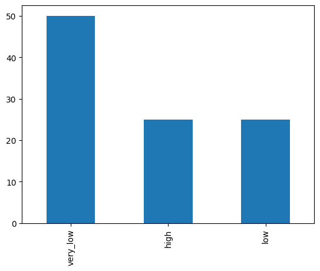
    


```python
categorical_cols = ['CRIME']
df_conv = convert_categoricals(df, categorical_cols)
conv_species = CategoricalData(df_conv, 'CRIME')
conv_species.plot()
```


    <Axes: >


    
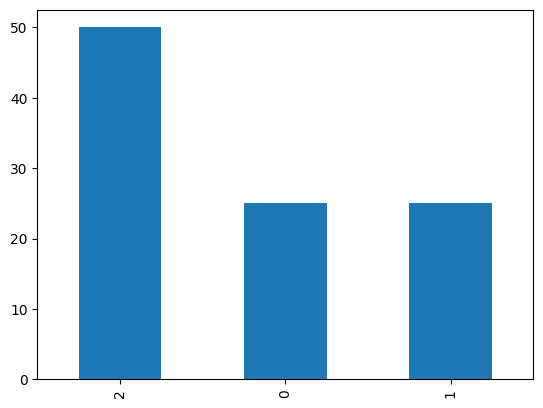
    


 ### ダミー変数化


```python
df_dummy = crime.dummy()
df_dummy
```


<div>
<style scoped>
    .dataframe tbody tr th:only-of-type {
        vertical-align: middle;
    }

    .dataframe tbody tr th {
        vertical-align: top;
    }

    .dataframe thead th {
        text-align: right;
    }
</style>
<table border="1" class="dataframe">
  <thead>
    <tr style="text-align: right;">
      <th></th>
      <th>ID</th>
      <th>ZN</th>
      <th>INDUS</th>
      <th>CHAS</th>
      <th>NOX</th>
      <th>RM</th>
      <th>AGE</th>
      <th>DIS</th>
      <th>RAD</th>
      <th>TAX</th>
      <th>PTRATIO</th>
      <th>B</th>
      <th>LSTAT</th>
      <th>PRICE</th>
      <th>CRIME_high</th>
      <th>CRIME_low</th>
      <th>CRIME_very_low</th>
    </tr>
  </thead>
  <tbody>
    <tr>
      <th>0</th>
      <td>0</td>
      <td>0.0</td>
      <td>18.10</td>
      <td>0</td>
      <td>0.718</td>
      <td>3.561</td>
      <td>87.9</td>
      <td>1.6132</td>
      <td>24.0</td>
      <td>666</td>
      <td>20.2</td>
      <td>354.70</td>
      <td>7.12</td>
      <td>27.5</td>
      <td>1</td>
      <td>0</td>
      <td>0</td>
    </tr>
    <tr>
      <th>1</th>
      <td>1</td>
      <td>0.0</td>
      <td>8.14</td>
      <td>0</td>
      <td>0.538</td>
      <td>5.950</td>
      <td>82.0</td>
      <td>3.9900</td>
      <td>4.0</td>
      <td>307</td>
      <td>21.0</td>
      <td>232.60</td>
      <td>27.71</td>
      <td>13.2</td>
      <td>0</td>
      <td>1</td>
      <td>0</td>
    </tr>
    <tr>
      <th>2</th>
      <td>2</td>
      <td>82.5</td>
      <td>2.03</td>
      <td>0</td>
      <td>0.415</td>
      <td>6.162</td>
      <td>38.4</td>
      <td>6.2700</td>
      <td>2.0</td>
      <td>348</td>
      <td>14.7</td>
      <td>393.77</td>
      <td>7.43</td>
      <td>24.1</td>
      <td>0</td>
      <td>0</td>
      <td>1</td>
    </tr>
    <tr>
      <th>3</th>
      <td>3</td>
      <td>0.0</td>
      <td>21.89</td>
      <td>0</td>
      <td>0.624</td>
      <td>6.151</td>
      <td>97.9</td>
      <td>1.6687</td>
      <td>4.0</td>
      <td>437</td>
      <td>21.2</td>
      <td>396.90</td>
      <td>18.46</td>
      <td>17.8</td>
      <td>0</td>
      <td>1</td>
      <td>0</td>
    </tr>
    <tr>
      <th>4</th>
      <td>4</td>
      <td>0.0</td>
      <td>18.10</td>
      <td>0</td>
      <td>0.614</td>
      <td>6.980</td>
      <td>67.6</td>
      <td>2.5329</td>
      <td>24.0</td>
      <td>666</td>
      <td>20.2</td>
      <td>374.68</td>
      <td>11.66</td>
      <td>29.8</td>
      <td>1</td>
      <td>0</td>
      <td>0</td>
    </tr>
    <tr>
      <th>...</th>
      <td>...</td>
      <td>...</td>
      <td>...</td>
      <td>...</td>
      <td>...</td>
      <td>...</td>
      <td>...</td>
      <td>...</td>
      <td>...</td>
      <td>...</td>
      <td>...</td>
      <td>...</td>
      <td>...</td>
      <td>...</td>
      <td>...</td>
      <td>...</td>
      <td>...</td>
    </tr>
    <tr>
      <th>95</th>
      <td>95</td>
      <td>0.0</td>
      <td>18.10</td>
      <td>0</td>
      <td>0.740</td>
      <td>6.219</td>
      <td>100.0</td>
      <td>2.0048</td>
      <td>24.0</td>
      <td>666</td>
      <td>20.2</td>
      <td>395.69</td>
      <td>16.59</td>
      <td>18.4</td>
      <td>1</td>
      <td>0</td>
      <td>0</td>
    </tr>
    <tr>
      <th>96</th>
      <td>96</td>
      <td>0.0</td>
      <td>18.10</td>
      <td>0</td>
      <td>0.655</td>
      <td>5.759</td>
      <td>48.2</td>
      <td>3.0665</td>
      <td>24.0</td>
      <td>666</td>
      <td>20.2</td>
      <td>334.40</td>
      <td>14.13</td>
      <td>19.9</td>
      <td>1</td>
      <td>0</td>
      <td>0</td>
    </tr>
    <tr>
      <th>97</th>
      <td>97</td>
      <td>0.0</td>
      <td>18.10</td>
      <td>0</td>
      <td>0.671</td>
      <td>6.380</td>
      <td>96.2</td>
      <td>1.3861</td>
      <td>24.0</td>
      <td>666</td>
      <td>20.2</td>
      <td>396.90</td>
      <td>23.69</td>
      <td>13.1</td>
      <td>1</td>
      <td>0</td>
      <td>0</td>
    </tr>
    <tr>
      <th>98</th>
      <td>98</td>
      <td>0.0</td>
      <td>9.90</td>
      <td>0</td>
      <td>0.544</td>
      <td>5.914</td>
      <td>83.2</td>
      <td>3.9986</td>
      <td>4.0</td>
      <td>304</td>
      <td>18.4</td>
      <td>390.70</td>
      <td>18.33</td>
      <td>17.8</td>
      <td>0</td>
      <td>1</td>
      <td>0</td>
    </tr>
    <tr>
      <th>99</th>
      <td>99</td>
      <td>0.0</td>
      <td>18.10</td>
      <td>0</td>
      <td>0.693</td>
      <td>5.453</td>
      <td>100.0</td>
      <td>1.4896</td>
      <td>24.0</td>
      <td>666</td>
      <td>20.2</td>
      <td>396.90</td>
      <td>30.59</td>
      <td>5.0</td>
      <td>1</td>
      <td>0</td>
      <td>0</td>
    </tr>
  </tbody>
</table>
<p>100 rows × 17 columns</p>
</div>


 ### データの可視化


```python
dv = DataVisualization(df)
dv.df_all('PRICE')
```


    
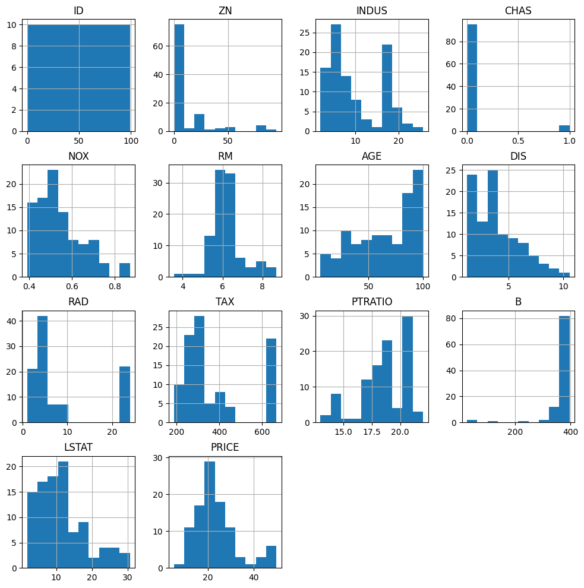
    


    
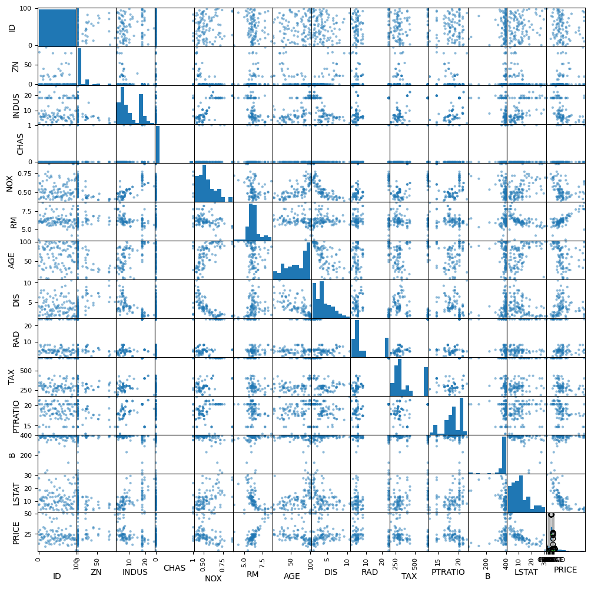
    


    
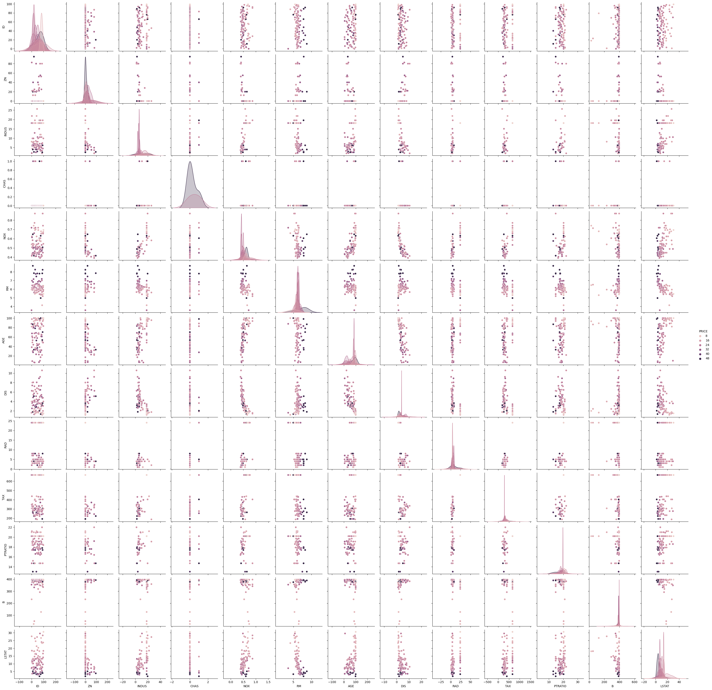
    


```python
import matplotlib.pyplot as plt
import seaborn as sns

for c in df.columns:
    plt.figure()
    if c == 'ID' or c == 'PRICE':
        continue
    sns.boxenplot(x=c, y='PRICE', data=df)
```


    <Figure size 640x480 with 0 Axes>


    
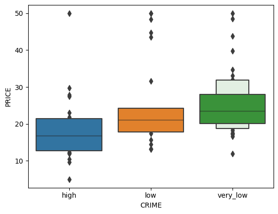
    


    
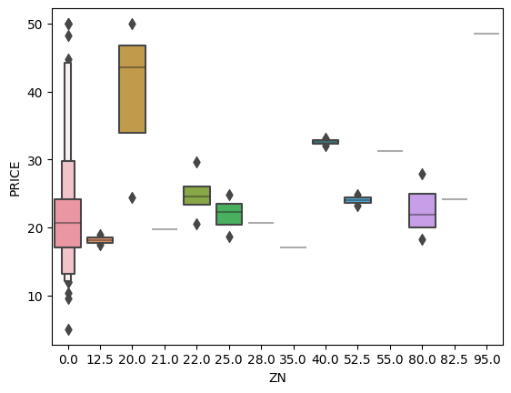
    


    
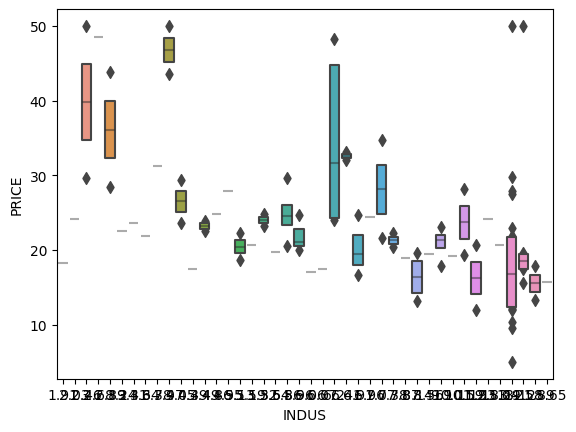
    


    
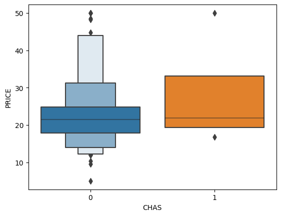
    


    
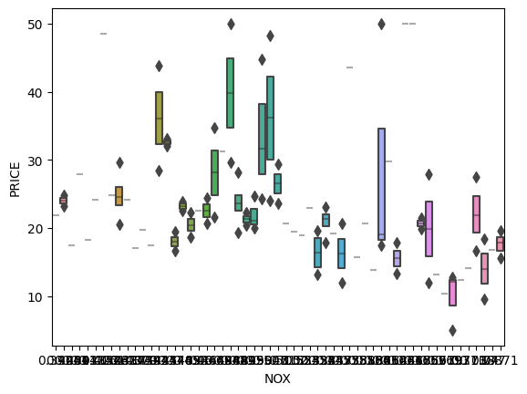
    


    
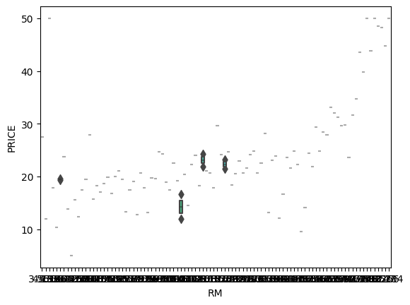
    


    
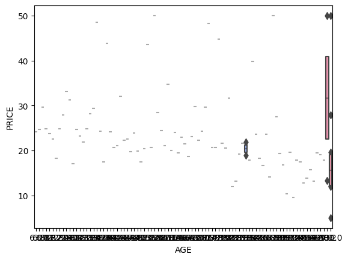
    


    
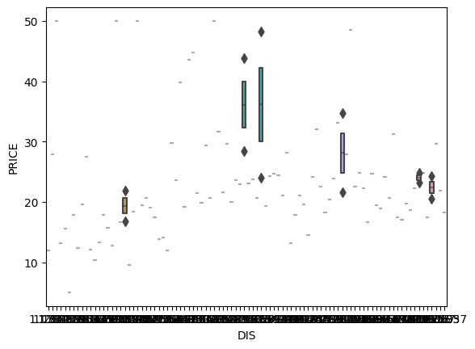
    


    
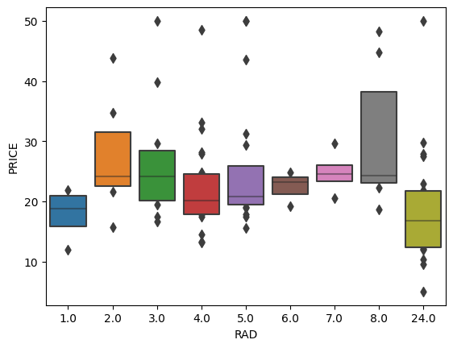
    


    
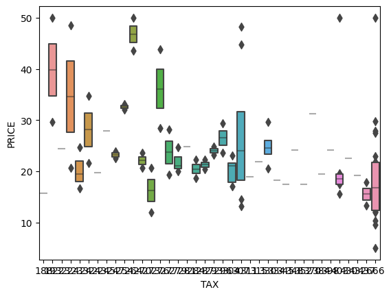
    


    
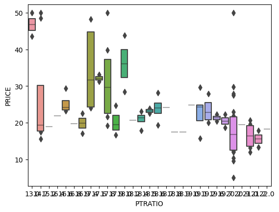
    


    
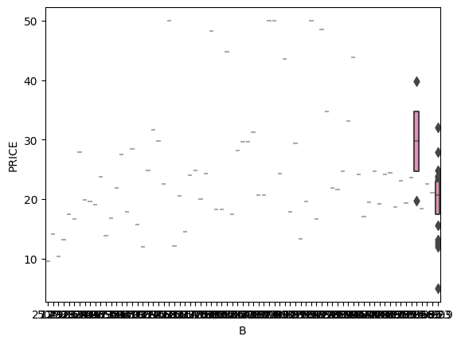
    


    
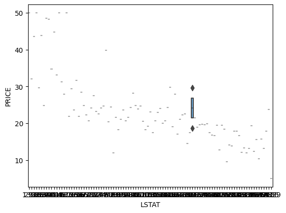
    


    <Figure size 640x480 with 0 Axes>


 ## データの前処理

 ### 欠損地処理（行削除・全体代表値埋め、グループ代表値埋め）

 ### 各手法を必要に応じて実施

 - 外れ値の除外
 - 多項式特徴量・交互作用特徴量の追加
 - 特徴量の絞り込み
 - 標準化

 ## モデルの作成と学習

 ### 未学習状態モデルの生成（分類なら決定木、回帰なら線形回帰）

 ### 訓練データで学習（必要に応じて不均衡データ補正）

 ## モデルの評価

 ### 検証データで評価し指標確認（分類なら正解率、回帰なら決定係数）

 ### NG:改善案検討前処理に戻る
 ### OK:最終性能評価（テストデータで評価）


```python
doctest.testmod(verbose=True)
unittest.main(argv=[''], verbosity=2, exit=False)
```

    3 items had no tests:
        __main__
        __main__.__VSCODE_compute_hash
        __main__.__VSCODE_wrap_run_cell
    0 tests in 3 items.
    0 passed and 0 failed.
    Test passed.
    

    
    ----------------------------------------------------------------------
    Ran 0 tests in 0.000s
    
    OK
    


    <unittest.main.TestProgram at 0x235845b73a0>


