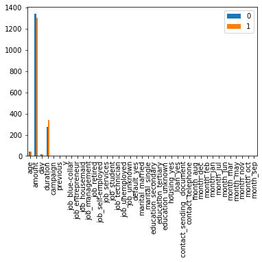
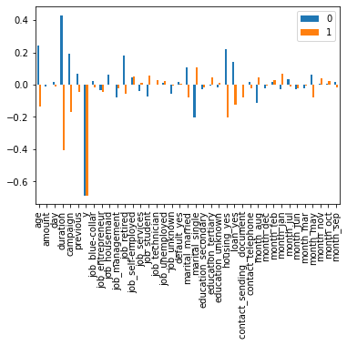

# 練習9-1 
## どのような機械学習手法を用いると良いか？

### 解答例
教師あり学習の分類

# 練習9-2
## どのようなアウトプットを得られるか？また、その分析結果からどのようにスッキリ銀行の課題を解決する事が出来るか？

### 解答例  
ｙ列を予測する分類モデルを作ることにより、その顧客が購入してくれるかどうかが事前に分かる。また、特徴量にこちらからのアプローチ法を入れる事により、「この顧客の場合、こういうアプローチをとったら購入してくれる」というような営業の最適化を行う事が出来る


# 練習9-3 
## ひとまず何でもいいのでモデルを作ってみましょう。ただし、データは訓練、検証、テストデータの3分割をする方法を利用すること


```python
import pandas as pd
from sklearn import tree
from sklearn.model_selection import train_test_split
%matplotlib inline 
```


```python

```


```python

```


```python
df = pd.read_csv('Bank.csv')
print(df.shape)
df.head()
```

    (27128, 16)
    


<div>
<style scoped>
    .dataframe tbody tr th:only-of-type {
        vertical-align: middle;
    }

    .dataframe tbody tr th {
        vertical-align: top;
    }

    .dataframe thead th {
        text-align: right;
    }
</style>
<table border="1" class="dataframe">
  <thead>
    <tr style="text-align: right;">
      <th></th>
      <th>id</th>
      <th>age</th>
      <th>job</th>
      <th>marital</th>
      <th>education</th>
      <th>default</th>
      <th>amount</th>
      <th>housing</th>
      <th>loan</th>
      <th>contact</th>
      <th>day</th>
      <th>month</th>
      <th>duration</th>
      <th>campaign</th>
      <th>previous</th>
      <th>y</th>
    </tr>
  </thead>
  <tbody>
    <tr>
      <th>0</th>
      <td>1</td>
      <td>39</td>
      <td>blue-collar</td>
      <td>married</td>
      <td>secondary</td>
      <td>no</td>
      <td>1756.0</td>
      <td>yes</td>
      <td>no</td>
      <td>cellular</td>
      <td>3</td>
      <td>apr</td>
      <td>370.055237</td>
      <td>1</td>
      <td>0</td>
      <td>1</td>
    </tr>
    <tr>
      <th>1</th>
      <td>2</td>
      <td>51</td>
      <td>entrepreneur</td>
      <td>married</td>
      <td>primary</td>
      <td>no</td>
      <td>1443.0</td>
      <td>no</td>
      <td>no</td>
      <td>cellular</td>
      <td>18</td>
      <td>feb</td>
      <td>233.998933</td>
      <td>10</td>
      <td>0</td>
      <td>1</td>
    </tr>
    <tr>
      <th>2</th>
      <td>3</td>
      <td>36</td>
      <td>management</td>
      <td>single</td>
      <td>tertiary</td>
      <td>no</td>
      <td>436.0</td>
      <td>no</td>
      <td>no</td>
      <td>cellular</td>
      <td>13</td>
      <td>apr</td>
      <td>NaN</td>
      <td>1</td>
      <td>2</td>
      <td>0</td>
    </tr>
    <tr>
      <th>3</th>
      <td>4</td>
      <td>63</td>
      <td>retired</td>
      <td>married</td>
      <td>secondary</td>
      <td>no</td>
      <td>474.0</td>
      <td>no</td>
      <td>no</td>
      <td>cellular</td>
      <td>25</td>
      <td>jan</td>
      <td>252.525808</td>
      <td>1</td>
      <td>0</td>
      <td>0</td>
    </tr>
    <tr>
      <th>4</th>
      <td>5</td>
      <td>31</td>
      <td>management</td>
      <td>single</td>
      <td>tertiary</td>
      <td>no</td>
      <td>354.0</td>
      <td>no</td>
      <td>no</td>
      <td>cellular</td>
      <td>30</td>
      <td>apr</td>
      <td>NaN</td>
      <td>1</td>
      <td>2</td>
      <td>0</td>
    </tr>
  </tbody>
</table>
</div>


```python
# まず、ダミー変数化をしたいが、文字列の列が複数あるので抜き出す。
str_col_name=['job','default','marital','education','housing','loan','contact','month']
str_df = df[str_col_name]
#複数列を一気にダミー変数化
str_df2=pd.get_dummies(str_df,drop_first=True)

num_df = df.drop(str_col_name,axis=1)#数値列を抜き出す
df2 = pd.concat([num_df,str_df2,str_df],axis=1)#結合(今後の集計の利便性も考慮してstr_dfも結合しておく)
```


```python
df2.columns
```


    Index(['id', 'age', 'amount', 'day', 'duration', 'campaign', 'previous', 'y',
           'job_blue-collar', 'job_entrepreneur', 'job_housemaid',
           'job_management', 'job_retired', 'job_self-employed', 'job_services',
           'job_student', 'job_technician', 'job_unemployed', 'job_unknown',
           'default_yes', 'marital_married', 'marital_single',
           'education_secondary', 'education_tertiary', 'education_unknown',
           'housing_yes', 'loan_yes', 'contact_sending _document',
           'contact_telephone', 'month_aug', 'month_dec', 'month_feb', 'month_jan',
           'month_jul', 'month_jun', 'month_mar', 'month_may', 'month_nov',
           'month_oct', 'month_sep', 'job', 'default', 'marital', 'education',
           'housing', 'loan', 'contact', 'month'],
          dtype='object')


```python
#訓練&検証データとテストデータに分割
train_val,test = train_test_split(df2,test_size=0.1,random_state=9)
train_val.head()
```


<div>
<style scoped>
    .dataframe tbody tr th:only-of-type {
        vertical-align: middle;
    }

    .dataframe tbody tr th {
        vertical-align: top;
    }

    .dataframe thead th {
        text-align: right;
    }
</style>
<table border="1" class="dataframe">
  <thead>
    <tr style="text-align: right;">
      <th></th>
      <th>id</th>
      <th>age</th>
      <th>amount</th>
      <th>day</th>
      <th>duration</th>
      <th>campaign</th>
      <th>previous</th>
      <th>y</th>
      <th>job_blue-collar</th>
      <th>job_entrepreneur</th>
      <th>...</th>
      <th>month_oct</th>
      <th>month_sep</th>
      <th>job</th>
      <th>default</th>
      <th>marital</th>
      <th>education</th>
      <th>housing</th>
      <th>loan</th>
      <th>contact</th>
      <th>month</th>
    </tr>
  </thead>
  <tbody>
    <tr>
      <th>13378</th>
      <td>13379</td>
      <td>46</td>
      <td>0.0</td>
      <td>10</td>
      <td>378.293875</td>
      <td>1</td>
      <td>0</td>
      <td>1</td>
      <td>0</td>
      <td>0</td>
      <td>...</td>
      <td>0</td>
      <td>0</td>
      <td>unemployed</td>
      <td>no</td>
      <td>married</td>
      <td>tertiary</td>
      <td>yes</td>
      <td>no</td>
      <td>cellular</td>
      <td>jul</td>
    </tr>
    <tr>
      <th>3800</th>
      <td>3801</td>
      <td>41</td>
      <td>-333.0</td>
      <td>30</td>
      <td>300.845752</td>
      <td>3</td>
      <td>2</td>
      <td>0</td>
      <td>1</td>
      <td>0</td>
      <td>...</td>
      <td>0</td>
      <td>0</td>
      <td>blue-collar</td>
      <td>no</td>
      <td>divorced</td>
      <td>secondary</td>
      <td>yes</td>
      <td>no</td>
      <td>cellular</td>
      <td>jan</td>
    </tr>
    <tr>
      <th>10398</th>
      <td>10399</td>
      <td>30</td>
      <td>5389.0</td>
      <td>6</td>
      <td>159.053623</td>
      <td>3</td>
      <td>0</td>
      <td>1</td>
      <td>0</td>
      <td>0</td>
      <td>...</td>
      <td>0</td>
      <td>0</td>
      <td>management</td>
      <td>no</td>
      <td>single</td>
      <td>tertiary</td>
      <td>no</td>
      <td>no</td>
      <td>cellular</td>
      <td>aug</td>
    </tr>
    <tr>
      <th>23401</th>
      <td>23402</td>
      <td>39</td>
      <td>255.0</td>
      <td>5</td>
      <td>334.802583</td>
      <td>1</td>
      <td>0</td>
      <td>0</td>
      <td>0</td>
      <td>0</td>
      <td>...</td>
      <td>0</td>
      <td>0</td>
      <td>management</td>
      <td>no</td>
      <td>single</td>
      <td>tertiary</td>
      <td>yes</td>
      <td>no</td>
      <td>sending _document</td>
      <td>may</td>
    </tr>
    <tr>
      <th>26223</th>
      <td>26224</td>
      <td>47</td>
      <td>33.0</td>
      <td>5</td>
      <td>NaN</td>
      <td>1</td>
      <td>0</td>
      <td>1</td>
      <td>0</td>
      <td>0</td>
      <td>...</td>
      <td>0</td>
      <td>0</td>
      <td>services</td>
      <td>no</td>
      <td>single</td>
      <td>secondary</td>
      <td>yes</td>
      <td>no</td>
      <td>cellular</td>
      <td>may</td>
    </tr>
  </tbody>
</table>
<p>5 rows × 48 columns</p>
</div>


```python

```


```python

```

# 欠損値の確認


```python
a=train_val.isnull().sum()
a[a>0]
```


    duration    6331
    dtype: int64


```python
train_val['duration'].median()
```


    314.89135074820206


```python
#とりあえず最初は中央値で補完
train_val2= train_val.fillna(train_val.median())
```


```python
#不均衡なデータであるか確認
train_val2['y'].value_counts()
```


    0    16601
    1     7814
    Name: y, dtype: int64


```python

```

### 今回は不均衡データの分類。モデル作成時にclass_weight="balanced"と指定する事で、不均衡データに対応したモデルにする。

### class_weightを指定すると、通常より正解率は上がりにくい。


```python
#とりあえず、全ての特徴量を利用してモデルを作ってみる。
t =train_val2['y']
x = train_val2.drop(str_col_name,axis=1)
x =x.drop(['id','y','day'],axis=1)

x_train,x_val,y_train,y_val = train_test_split(x,t,test_size=0.2,random_state=13)

#不均衡データに対応できるように、class_weight引数も設定
model = tree.DecisionTreeClassifier(random_state=3,max_depth=3,class_weight='balanced')

#class_weightを指定しないとちなみに正解率は0.7ぐらい
#model = tree.DecisionTreeClassifier(random_state=3,max_depth=5)
model.fit(x_train,y_train)
model.score(x_val,y_val)
```


    0.6493958631988531


# 練習9-4　様々な検証をしてテストデータでの性能を高めましょう。ただし、テストデータを集計したり、図示したりはしてはいけません。

# 実はこのデータは、決定木では試行錯誤しても性能が高まりませんが、どういう着眼点で進めていくべきか、その一例を紹介します。(第3部で決定木以外の手法を紹介します)


```python

```


```python
#まず、さくっと学習できるようなlearn関数を定義する。
def learn(x,t,i):
    x_train,x_val,y_train,y_val = train_test_split(x,t,test_size=0.2,random_state=13)

    datas=[x_train,x_val,y_train,y_val]
    #不均衡データに対応できるように、class_weight引数も設定
    model = tree.DecisionTreeClassifier(random_state=i,max_depth=i,class_weight='balanced')
    model.fit(x_train,y_train)
    train_score=model.score(x_train,y_train)
    
    val_score=model.score(x_val,y_val)
    return train_score,val_score,model,datas
```


```python
#とりあえず、for文で様々な木の深さでの正解率を調べてみる
for i in range(1,20):
    s1,s2,model,datas = learn(x,t,i)
    print(i,s1,s2)
```

    1 0.6995187384804423 0.6993651443784559
    2 0.6492422690968667 0.6493958631988531
    3 0.6492422690968667 0.6493958631988531
    4 0.7357669465492525 0.7481056727421667
    5 0.7767765717796437 0.7773909481875896
    6 0.80124923202949 0.8023755887773909
    7 0.8224452181036248 0.8095433135367602
    8 0.8448699569936514 0.8238787630554987
    9 0.8584374360024575 0.8230595945115707
    10 0.8755887773909482 0.829612942862994
    11 0.8988838828588982 0.8371902518943273
    12 0.9096866680319475 0.8265410608232644
    13 0.9289371288142535 0.8242883473274626
    14 0.9434261724349785 0.8130247798484538
    15 0.9591951669055908 0.8169158304321114
    16 0.9688203972967439 0.8156870776162195
    17 0.9776264591439688 0.8140487405283637
    18 0.9847941839033381 0.8144583248003276
    19 0.9898115912348966 0.8132295719844358
    


```python
#深さ11以降はvalが停滞するので過学習が発生ここでテストデータでチェック
model = tree.DecisionTreeClassifier(max_depth=11,random_state=11)
model.fit(x,t)
test2 = test.copy()
test2=test2.fillna(train_val.median())

test_y=test2['y']
test_x = test2.drop(str_col_name,axis=1)
test_x =test_x.drop(['id','y','day'],axis=1)
model.score(test_x,test_y)
```


    0.8330261702911905


```python

```


```python

```


```python

```


```python

```


```python
#特徴量重要度の確認(ちなみに、連続量とダミー変数を比べると、連続量の方が重要度は高め出力されてしまう事に注意)
a=pd.Series(model.feature_importances_,index=x.columns).sort_values(ascending=False)
a[0:9]#campaignやdurationが重要度が大きいと分かる
```


    duration                     0.529793
    age                          0.143316
    campaign                     0.103042
    housing_yes                  0.064951
    loan_yes                     0.041739
    amount                       0.039681
    previous                     0.015744
    contact_sending _document    0.014536
    month_aug                    0.002839
    dtype: float64


# durationの欠損値処理


```python
# durationに関係がありそうなものを見つけるためには7章の様に集計処理で判断したい。
#よって、集計処理の軸になるstr_dfの列名をいったん確認
print(str_df.columns)
```

    Index(['job', 'default', 'marital', 'education', 'housing', 'loan', 'contact',
           'month'],
          dtype='object')
    


```python
for name in str_df.columns:
    print(train_val.groupby(name)['y'].mean())
    print("next=========")
```

    job
    admin.           0.304550
    blue-collar      0.352886
    entrepreneur     0.390453
    housemaid        0.290043
    management       0.307299
    retired          0.369268
    self-employed    0.301974
    services         0.337611
    student          0.166667
    technician       0.307423
    unemployed       0.241084
    unknown          0.294118
    Name: y, dtype: float64
    next=========
    default
    no     0.321336
    yes    0.249428
    Name: y, dtype: float64
    next=========
    marital
    divorced    0.334059
    married     0.341211
    single      0.269086
    Name: y, dtype: float64
    next=========
    education
    primary      0.351921
    secondary    0.318327
    tertiary     0.301592
    unknown      0.354354
    Name: y, dtype: float64
    next=========
    housing
    no     0.217959
    yes    0.400910
    Name: y, dtype: float64
    next=========
    loan
    no     0.300195
    yes    0.424328
    Name: y, dtype: float64
    next=========
    contact
    cellular             0.277883
    sending _document    0.416372
    telephone            0.311842
    Name: y, dtype: float64
    next=========
    month
    apr    0.312070
    aug    0.251950
    dec    0.327731
    feb    0.266805
    jan    0.202073
    jul    0.307506
    jun    0.356744
    mar    0.354244
    may    0.389833
    nov    0.234457
    oct    0.308483
    sep    0.327217
    Name: y, dtype: float64
    next=========
    

#### housing ,loan, contactが関係してそう。　ただ、contactにおいて、sending_documentは資料送付しかしていないのに接触時間が長いとはどういうことか？？
#### 実際ならば、このデータはどう解釈すればいいのか実際の現場の人間に聞き取りをする必要があるが、今回は不可能なのでこのまま分析を進める。


```python
print(pd.pivot_table(train_val,index="housing",columns="loan",values="duration"))
print(pd.pivot_table(train_val,index="housing",columns="contact",values="duration"))
print(pd.pivot_table(train_val,index="loan",columns="contact",values="duration"))
```

    loan             no         yes
    housing                        
    no       237.256887  301.180261
    yes      332.635840  439.472217
    contact    cellular  sending _document   telephone
    housing                                           
    no       249.821962         249.179202  272.785529
    yes      348.532350         349.179816  368.638141
    contact    cellular  sending _document   telephone
    loan                                              
    no       297.588613         314.969378  304.960446
    yes      375.465455         400.911698  379.000771
    

##### どれも強く関係してそうに見える。今回は2×2で処理しやすい。loan×housingを採用しよう


```python

```


```python
def nan_fill(train_val):
    isnull = train_val['duration'].isnull()

    #train_valを変えたくないので、py基本文法のcopyメソッドでコピーを作って
    #train_val2に代入
    train_val2 = train_val.copy()
    #housing=yesの処理
    train_val2.loc[(isnull) & (train_val2['housing']=='yes') 
                  &(train_val2['loan']=='yes'),'duration' ]=439
    train_val2.loc[(isnull) & (train_val2['housing']=='yes') 
                  &(train_val2['loan']=='no'),'duration' ]=332

    #housing=noの処理
    train_val2.loc[(isnull) & (train_val2['housing']=='no') 
                  &(train_val2['loan']=='yes'),'duration' ]=301
    train_val2.loc[(isnull) & (train_val2['housing']=='no') 
                  &(train_val2['loan']=='no'),'duration' ]=237
    
    return train_val2
train_val2=nan_fill(train_val)
```


```python
#特徴量重要度が大きかった項目とyの関係
train_val2.groupby('y')['duration'].median()
```


    y
    0    263.575464
    1    346.960871
    Name: duration, dtype: float64


```python
train_val2.groupby('y')['amount'].median()
```


    y
    0    449.0
    1    449.0
    Name: amount, dtype: float64


```python
train_val2.groupby('y')['campaign'].median()
```


    y
    0    2
    1    3
    Name: campaign, dtype: int64


```python
train_val2.groupby('y')['age'].median()
```


    y
    0    38
    1    41
    Name: age, dtype: int64


# durationは値が大きいほど、y=1になりやすい傾向がありそう


```python
#ここでいったん、learn関数で分析

t =train_val2['y']

x = train_val2.drop(str_col_name,axis=1)
x =x.drop(['id','y','day'],axis=1)
#x =train_val2[xcol]
for i in range(1,20):
    s1,s2,model,datas = learn(x,t,i)
    print(i,s1,s2)
```

    1 0.7462113454843334 0.7511775547818964
    2 0.7462113454843334 0.7511775547818964
    3 0.7507167724759369 0.7554781896375179
    4 0.7481056727421667 0.7569117345893918
    5 0.7746262543518329 0.7751382346917879
    6 0.7780565226295311 0.7712471841081302
    7 0.8182469793159942 0.8117960270325619
    8 0.8275138234691788 0.8077001843129223
    9 0.8483514233053451 0.8273602293671923
    10 0.86852344869957 0.8320704484947778
    11 0.8782510751587139 0.8249027237354085
    12 0.900010239606799 0.8246979315994266
    13 0.9143456891255376 0.8275650215031742
    14 0.9303194757321319 0.8218308416956789
    15 0.9458324800327668 0.821421257423715
    16 0.9597583452795413 0.820806881015769
    17 0.9707147245545771 0.820602088879787
    18 0.9792647962318247 0.8177349989760393
    19 0.9855621544132706 0.8167110382961295
    


```python

```


```python
#どのような間違い方をしているのか確認
s1,s2,model,datas = learn(x,t,10)

#訓練データでの予測結果と実際の値の2軸で個数集計flagがFalseならば、検証データで集計
def syuukei(model,datas,flag=False):
    if flag:
        pre=model.predict(datas[0])
        y_val=datas[2]
    else:
        pre=model.predict(datas[1])
        y_val=datas[3]
    data={
        "pred":pre,
        "true":y_val
    }
    tmp=pd.DataFrame(data)
    return tmp,pd.pivot_table(tmp,index="true",columns="pred",values="true",aggfunc=len)
tmp,a=syuukei(model,datas,False)
a
```


<div>
<style scoped>
    .dataframe tbody tr th:only-of-type {
        vertical-align: middle;
    }

    .dataframe tbody tr th {
        vertical-align: top;
    }

    .dataframe thead th {
        text-align: right;
    }
</style>
<table border="1" class="dataframe">
  <thead>
    <tr style="text-align: right;">
      <th>pred</th>
      <th>0</th>
      <th>1</th>
    </tr>
    <tr>
      <th>true</th>
      <th></th>
      <th></th>
    </tr>
  </thead>
  <tbody>
    <tr>
      <th>0</th>
      <td>2790</td>
      <td>593</td>
    </tr>
    <tr>
      <th>1</th>
      <td>227</td>
      <td>1273</td>
    </tr>
  </tbody>
</table>
</div>


```python

```


```python
#本当はｙ＝０の中で、正確に予測された人と謝った予測をされた人でどういう傾向があるか分析

false=tmp.loc[(tmp['pred']==1)&(tmp['true']==0)].index
true=tmp.loc[(tmp['pred']==0)&(tmp['true']==0)].index
true_df=train_val2.loc[true]
false_df=train_val2.loc[false]
pd.concat([true_df.mean()["age":],false_df.mean()["age":]],axis=1).plot(kind="bar")
true
```


    Int64Index([ 8008,  5734,  1594,  2167, 10468, 26200,  7851,  4695, 24120,
                18766,
                ...
                14655,  5003,  4196, 17968, 13960,  1548,   508,  7200,  9861,
                20515],
               dtype='int64', length=2790)


    

    


```python

```


```python
#値にばらつきが大きいので、標準化してもう一度グラフ化
from sklearn.preprocessing import StandardScaler

sc = StandardScaler()
tmp2=train_val2.drop(str_col_name,axis=1)
sc_data = sc.fit_transform(tmp2)
sc_df = pd.DataFrame(sc_data,columns=tmp2.columns,index=tmp2.index)

true_df=sc_df.loc[true]
false_df=sc_df.loc[false]
true_df
temp2=pd.concat([false_df.mean()["age":],true_df.mean()["age":]],axis=1)
temp2.plot(kind="bar")
```


    <AxesSubplot:>


    

    


```python
#青色の０は誤分類、オレンジ１は正解のデータ

# durationと housing_yesが大きく異なる
#実際はy=0の人で、 durationが大きい人は誤分類しやすい
#実際はy=0の人で、 housingが大きい人は誤分類しやすい


#事前に、durationが大きい人はy=1になりやすいということは分かっているので、「こういう人はy=0になりやすい」という
#特徴量を見つけ出して、特徴量×durationという特徴量を作って、durationに重み付けをする列を作れば正解率
#があがるのではないか？ 続きは3部に譲ってここでテストデータ評価を行う
```


```python
model_tree=tree.DecisionTreeClassifier(max_depth=10,random_state=10,class_weight="balanced")
model_tree.fit(x,t)

test2=nan_fill(test)
t =test2['y']
x = test2.drop(str_col_name,axis=1)
x =x.drop(['id','y','day'],axis=1)
model_tree.score(x,t)
```


    0.8157021747143384


```python
#テストデータの正解率は上昇した
```


```python

```
