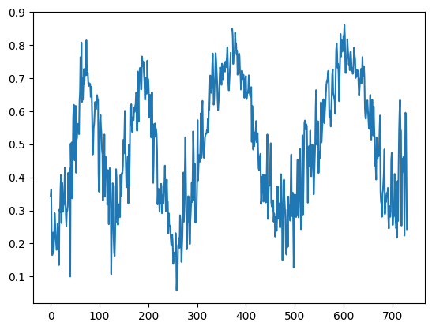
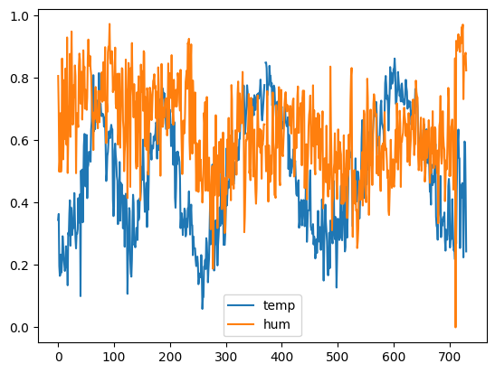
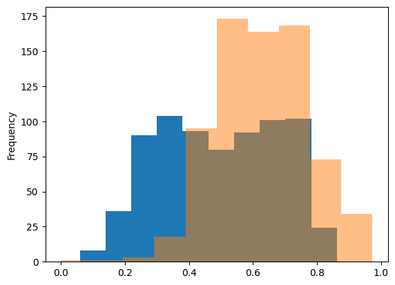
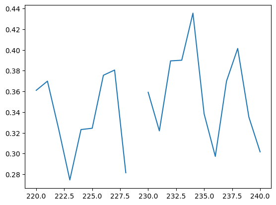
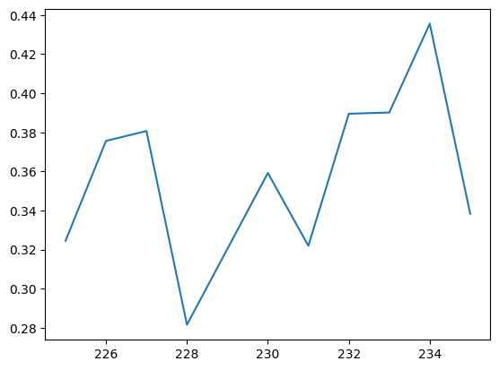
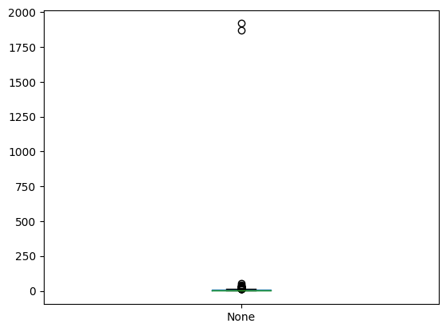
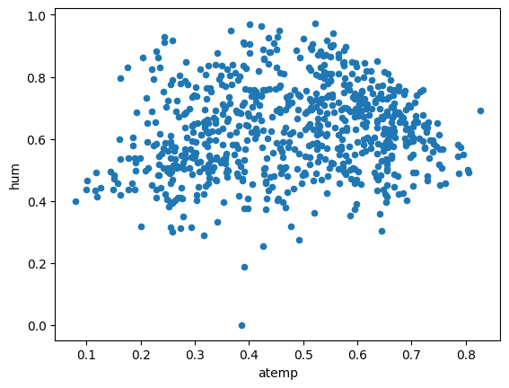
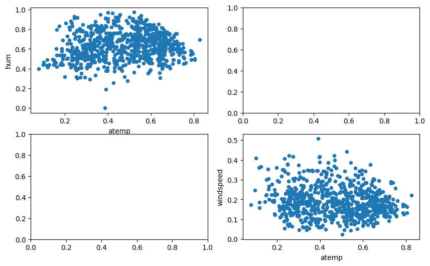

 # より実践的な前処理


```python
import unittest
import doctest
import os
path = os.path.dirname(os.path.abspath(__file__))
```

 ## さまざまなデータの読み込み

 ### 表データの区切り文字

 #### bike.tsvの各列の意味
 |列名|意味|
 |:--|:--|
 |dteday|日付|
 |weekday|曜日（0=日,...6=土）|
 |weather_id|天気|
 |holiday|祝日フラグ（普通の土日は含めない）|
 |workingday|平日フラグ|
 |cnt|利用者数|

 #### コード10-1 bike.tsvを読み込む


```python
import pandas as pd
df = pd.read_csv(path + '/data/bike.tsv')
df.head(3)
```


<div>
<style scoped>
    .dataframe tbody tr th:only-of-type {
        vertical-align: middle;
    }

    .dataframe tbody tr th {
        vertical-align: top;
    }

    .dataframe thead th {
        text-align: right;
    }
</style>
<table border="1" class="dataframe">
  <thead>
    <tr style="text-align: right;">
      <th></th>
      <th>dteday\tholiday\tweekday\tworkingday\tweather_id\tcnt</th>
    </tr>
  </thead>
  <tbody>
    <tr>
      <th>0</th>
      <td>2011-01-01\t0\t6\t0\t2\t985</td>
    </tr>
    <tr>
      <th>1</th>
      <td>2011-01-02\t0\t0\t0\t2\t801</td>
    </tr>
    <tr>
      <th>2</th>
      <td>2011-01-03\t0\t1\t1\t1\t1349</td>
    </tr>
  </tbody>
</table>
</div>


 #### コード10-2 read_csv関数にパラメータ引数を追加する


```python
df = pd.read_csv(path + '/data/bike.tsv', sep='\t')

df.head(2)
```


<div>
<style scoped>
    .dataframe tbody tr th:only-of-type {
        vertical-align: middle;
    }

    .dataframe tbody tr th {
        vertical-align: top;
    }

    .dataframe thead th {
        text-align: right;
    }
</style>
<table border="1" class="dataframe">
  <thead>
    <tr style="text-align: right;">
      <th></th>
      <th>dteday</th>
      <th>holiday</th>
      <th>weekday</th>
      <th>workingday</th>
      <th>weather_id</th>
      <th>cnt</th>
    </tr>
  </thead>
  <tbody>
    <tr>
      <th>0</th>
      <td>2011-01-01</td>
      <td>0</td>
      <td>6</td>
      <td>0</td>
      <td>2</td>
      <td>985</td>
    </tr>
    <tr>
      <th>1</th>
      <td>2011-01-02</td>
      <td>0</td>
      <td>0</td>
      <td>0</td>
      <td>2</td>
      <td>801</td>
    </tr>
  </tbody>
</table>
</div>


 ### 文字コードの指定

 #### コード10-3 read_csv関数でweather.csvを読み込む


```python
df2 = pd.read_csv(path + '/data/weather.csv')
df2.head(3)
```


<div>
<style scoped>
    .dataframe tbody tr th:only-of-type {
        vertical-align: middle;
    }

    .dataframe tbody tr th {
        vertical-align: top;
    }

    .dataframe thead th {
        text-align: right;
    }
</style>
<table border="1" class="dataframe">
  <thead>
    <tr style="text-align: right;">
      <th></th>
      <th>weather_id</th>
      <th>weather</th>
    </tr>
  </thead>
  <tbody>
    <tr>
      <th>0</th>
      <td>1</td>
      <td>����</td>
    </tr>
    <tr>
      <th>1</th>
      <td>2</td>
      <td>�܂�</td>
    </tr>
    <tr>
      <th>2</th>
      <td>3</td>
      <td>�J</td>
    </tr>
  </tbody>
</table>
</div>


 #### コード10-4 文字コードを指定する


```python
weather = pd.read_csv(path + '/data/weather.csv', encoding='shift-jis')
weather
```


<div>
<style scoped>
    .dataframe tbody tr th:only-of-type {
        vertical-align: middle;
    }

    .dataframe tbody tr th {
        vertical-align: top;
    }

    .dataframe thead th {
        text-align: right;
    }
</style>
<table border="1" class="dataframe">
  <thead>
    <tr style="text-align: right;">
      <th></th>
      <th>weather_id</th>
      <th>weather</th>
    </tr>
  </thead>
  <tbody>
    <tr>
      <th>0</th>
      <td>1</td>
      <td>晴れ</td>
    </tr>
    <tr>
      <th>1</th>
      <td>2</td>
      <td>曇り</td>
    </tr>
    <tr>
      <th>2</th>
      <td>3</td>
      <td>雨</td>
    </tr>
  </tbody>
</table>
</div>


 ### JSONファイルの読み込み

 #### コード10-5 JSONファイルを読み込む


```python
temp = pd.read_json(path + '/data/temp.json')

temp.head(2)
```


<div>
<style scoped>
    .dataframe tbody tr th:only-of-type {
        vertical-align: middle;
    }

    .dataframe tbody tr th {
        vertical-align: top;
    }

    .dataframe thead th {
        text-align: right;
    }
</style>
<table border="1" class="dataframe">
  <thead>
    <tr style="text-align: right;">
      <th></th>
      <th>0</th>
      <th>1</th>
      <th>2</th>
      <th>3</th>
      <th>4</th>
      <th>5</th>
      <th>6</th>
      <th>7</th>
      <th>8</th>
      <th>9</th>
      <th>...</th>
      <th>720</th>
      <th>721</th>
      <th>722</th>
      <th>723</th>
      <th>724</th>
      <th>725</th>
      <th>726</th>
      <th>727</th>
      <th>728</th>
      <th>729</th>
    </tr>
  </thead>
  <tbody>
    <tr>
      <th>atemp</th>
      <td>0.363625</td>
      <td>0.353739</td>
      <td>0.189405</td>
      <td>0.212122</td>
      <td>0.22927</td>
      <td>0.233209</td>
      <td>0.208839</td>
      <td>0.162254</td>
      <td>0.116175</td>
      <td>0.150888</td>
      <td>...</td>
      <td>0.236113</td>
      <td>0.259471</td>
      <td>0.2589</td>
      <td>0.294465</td>
      <td>0.220333</td>
      <td>0.226642</td>
      <td>0.255046</td>
      <td>0.2424</td>
      <td>0.2317</td>
      <td>0.223487</td>
    </tr>
    <tr>
      <th>dteday</th>
      <td>2011-01-01</td>
      <td>2011-01-02</td>
      <td>2011-01-03</td>
      <td>2011-01-04</td>
      <td>2011-01-05</td>
      <td>2011-01-06</td>
      <td>2011-01-07</td>
      <td>2011-01-08</td>
      <td>2011-01-09</td>
      <td>2011-01-10</td>
      <td>...</td>
      <td>2012-12-22</td>
      <td>2012-12-23</td>
      <td>2012-12-24</td>
      <td>2012-12-25</td>
      <td>2012-12-26</td>
      <td>2012-12-27</td>
      <td>2012-12-28</td>
      <td>2012-12-29</td>
      <td>2012-12-30</td>
      <td>2012-12-31</td>
    </tr>
  </tbody>
</table>
<p>2 rows × 730 columns</p>
</div>


 #### コード10-6 行と列を反転させる


```python
temp.T
```


<div>
<style scoped>
    .dataframe tbody tr th:only-of-type {
        vertical-align: middle;
    }

    .dataframe tbody tr th {
        vertical-align: top;
    }

    .dataframe thead th {
        text-align: right;
    }
</style>
<table border="1" class="dataframe">
  <thead>
    <tr style="text-align: right;">
      <th></th>
      <th>atemp</th>
      <th>dteday</th>
      <th>hum</th>
      <th>temp</th>
      <th>windspeed</th>
    </tr>
  </thead>
  <tbody>
    <tr>
      <th>0</th>
      <td>0.363625</td>
      <td>2011-01-01</td>
      <td>0.805833</td>
      <td>0.344167</td>
      <td>0.160446</td>
    </tr>
    <tr>
      <th>1</th>
      <td>0.353739</td>
      <td>2011-01-02</td>
      <td>0.696087</td>
      <td>0.363478</td>
      <td>0.248539</td>
    </tr>
    <tr>
      <th>2</th>
      <td>0.189405</td>
      <td>2011-01-03</td>
      <td>0.437273</td>
      <td>0.196364</td>
      <td>0.248309</td>
    </tr>
    <tr>
      <th>3</th>
      <td>0.212122</td>
      <td>2011-01-04</td>
      <td>0.590435</td>
      <td>0.2</td>
      <td>0.160296</td>
    </tr>
    <tr>
      <th>4</th>
      <td>0.22927</td>
      <td>2011-01-05</td>
      <td>0.436957</td>
      <td>0.226957</td>
      <td>0.1869</td>
    </tr>
    <tr>
      <th>...</th>
      <td>...</td>
      <td>...</td>
      <td>...</td>
      <td>...</td>
      <td>...</td>
    </tr>
    <tr>
      <th>725</th>
      <td>0.226642</td>
      <td>2012-12-27</td>
      <td>0.652917</td>
      <td>0.254167</td>
      <td>0.350133</td>
    </tr>
    <tr>
      <th>726</th>
      <td>0.255046</td>
      <td>2012-12-28</td>
      <td>0.59</td>
      <td>0.253333</td>
      <td>0.155471</td>
    </tr>
    <tr>
      <th>727</th>
      <td>0.2424</td>
      <td>2012-12-29</td>
      <td>0.752917</td>
      <td>0.253333</td>
      <td>0.124383</td>
    </tr>
    <tr>
      <th>728</th>
      <td>0.2317</td>
      <td>2012-12-30</td>
      <td>0.483333</td>
      <td>0.255833</td>
      <td>0.350754</td>
    </tr>
    <tr>
      <th>729</th>
      <td>0.223487</td>
      <td>2012-12-31</td>
      <td>0.5775</td>
      <td>0.215833</td>
      <td>0.154846</td>
    </tr>
  </tbody>
</table>
<p>730 rows × 5 columns</p>
</div>


 #### tempの各列の意味
 |列名|意味|
 |:--|:--|
 |atemp|体感温度|
 |hum|湿度|
 |windspeed|風速|
 |dteday|日付|
 |temp|気温|

 ### 内部結合

 #### コード10-7 内部結合を行う


```python
df2 = df.merge(weather, how = 'inner', on='weather_id')
df2.head(2)
```


<div>
<style scoped>
    .dataframe tbody tr th:only-of-type {
        vertical-align: middle;
    }

    .dataframe tbody tr th {
        vertical-align: top;
    }

    .dataframe thead th {
        text-align: right;
    }
</style>
<table border="1" class="dataframe">
  <thead>
    <tr style="text-align: right;">
      <th></th>
      <th>dteday</th>
      <th>holiday</th>
      <th>weekday</th>
      <th>workingday</th>
      <th>weather_id</th>
      <th>cnt</th>
      <th>weather</th>
    </tr>
  </thead>
  <tbody>
    <tr>
      <th>0</th>
      <td>2011-01-01</td>
      <td>0</td>
      <td>6</td>
      <td>0</td>
      <td>2</td>
      <td>985</td>
      <td>曇り</td>
    </tr>
    <tr>
      <th>1</th>
      <td>2011-01-02</td>
      <td>0</td>
      <td>0</td>
      <td>0</td>
      <td>2</td>
      <td>801</td>
      <td>曇り</td>
    </tr>
  </tbody>
</table>
</div>


 #### コード10-8 weatherごとのcntの平均値を集計する


```python
df2.groupby('weather').mean()['cnt']
```


    weather
    晴れ    4876.786177
    曇り    4052.672065
    雨     1803.285714
    Name: cnt, dtype: float64


 ### 外部結合

 #### コード10-9 tempデータフレームの200行目付近を表示する


```python
temp = temp.T
temp.loc[199:201]
```


<div>
<style scoped>
    .dataframe tbody tr th:only-of-type {
        vertical-align: middle;
    }

    .dataframe tbody tr th {
        vertical-align: top;
    }

    .dataframe thead th {
        text-align: right;
    }
</style>
<table border="1" class="dataframe">
  <thead>
    <tr style="text-align: right;">
      <th></th>
      <th>atemp</th>
      <th>dteday</th>
      <th>hum</th>
      <th>temp</th>
      <th>windspeed</th>
    </tr>
  </thead>
  <tbody>
    <tr>
      <th>199</th>
      <td>0.747479</td>
      <td>2011-07-19</td>
      <td>0.650417</td>
      <td>0.776667</td>
      <td>0.1306</td>
    </tr>
    <tr>
      <th>200</th>
      <td>0.826371</td>
      <td>2011-07-21</td>
      <td>0.69125</td>
      <td>0.815</td>
      <td>0.222021</td>
    </tr>
    <tr>
      <th>201</th>
      <td>None</td>
      <td>2011-07-22</td>
      <td>0.580417</td>
      <td>0.848333</td>
      <td>0.1331</td>
    </tr>
  </tbody>
</table>
</div>


 #### コード10-10 2011-07-20を表示する


```python
df2[df2['dteday'] == '2011-07-20']
```


<div>
<style scoped>
    .dataframe tbody tr th:only-of-type {
        vertical-align: middle;
    }

    .dataframe tbody tr th {
        vertical-align: top;
    }

    .dataframe thead th {
        text-align: right;
    }
</style>
<table border="1" class="dataframe">
  <thead>
    <tr style="text-align: right;">
      <th></th>
      <th>dteday</th>
      <th>holiday</th>
      <th>weekday</th>
      <th>workingday</th>
      <th>weather_id</th>
      <th>cnt</th>
      <th>weather</th>
    </tr>
  </thead>
  <tbody>
    <tr>
      <th>370</th>
      <td>2011-07-20</td>
      <td>0</td>
      <td>3</td>
      <td>1</td>
      <td>1</td>
      <td>4332</td>
      <td>晴れ</td>
    </tr>
  </tbody>
</table>
</div>


 #### コード10-11 merge関数で外部結合を行う


```python
df3 = df2.merge(temp, how='left', on='dteday')

df3[df3['dteday'] == '2011-07-20']
```


<div>
<style scoped>
    .dataframe tbody tr th:only-of-type {
        vertical-align: middle;
    }

    .dataframe tbody tr th {
        vertical-align: top;
    }

    .dataframe thead th {
        text-align: right;
    }
</style>
<table border="1" class="dataframe">
  <thead>
    <tr style="text-align: right;">
      <th></th>
      <th>dteday</th>
      <th>holiday</th>
      <th>weekday</th>
      <th>workingday</th>
      <th>weather_id</th>
      <th>cnt</th>
      <th>weather</th>
      <th>atemp</th>
      <th>hum</th>
      <th>temp</th>
      <th>windspeed</th>
    </tr>
  </thead>
  <tbody>
    <tr>
      <th>370</th>
      <td>2011-07-20</td>
      <td>0</td>
      <td>3</td>
      <td>1</td>
      <td>1</td>
      <td>4332</td>
      <td>晴れ</td>
      <td>NaN</td>
      <td>NaN</td>
      <td>NaN</td>
      <td>NaN</td>
    </tr>
  </tbody>
</table>
</div>


 ## より高度な欠損値の処理

 ### 線形補完

 #### コード10-12 気温に関する折れ線グラフを作成する


```python
import matplotlib.pyplot as plt
df3['temp'].plot(kind='line')
```


    <Axes: >


    

    


 #### コード10-13 temp列とhum列を折れ線グラフにして比較する


```python
df3[['temp','hum']].plot(kind='line')
```


    <Axes: >


    

    


 #### コード10-14 plotメソッドでヒストグラムを作成する


```python
df3['temp'].plot(kind='hist')
df3['hum'].plot(kind='hist', alpha=0.5)
```


    <Axes: ylabel='Frequency'>


    

    


 #### コード10-15 欠損値付近の折れ線グラフを作成する


```python
# インデックス220-240を抜き出して、折れ線グラフで表示
df3['atemp'].loc[220:240].plot(kind='line')
```


    <Axes: >


    

    


 #### コード10-16 欠損値を線形補完する


```python
# atemp列の型をfloatに変換
df3['atemp'] = df3['atemp'].astype(float)
df3['atemp'] = df3['atemp'].interpolate()

df3.loc[225:235, 'atemp'].plot(kind='line')
```


    <Axes: >


    

    


 ### 教師あり学習による補完

 #### コード10-17 がく片長さを予測する重回帰の予測モデルを作成する


```python
# 「がく片長さ」列に2個の欠損がある
iris_df = pd.read_csv(path + '/data/iris.csv')
non_df = iris_df.dropna() # 欠損値を含む行を削除
from sklearn.linear_model import LinearRegression
x = non_df.loc[:, 'がく片幅':'花弁幅']
t = non_df['がく片長さ']
model = LinearRegression()
model.fit(x, t) # 欠損値予測のためのモデルを予測
```


<style>#sk-container-id-4 {color: black;background-color: white;}#sk-container-id-4 pre{padding: 0;}#sk-container-id-4 div.sk-toggleable {background-color: white;}#sk-container-id-4 label.sk-toggleable__label {cursor: pointer;display: block;width: 100%;margin-bottom: 0;padding: 0.3em;box-sizing: border-box;text-align: center;}#sk-container-id-4 label.sk-toggleable__label-arrow:before {content: "▸";float: left;margin-right: 0.25em;color: #696969;}#sk-container-id-4 label.sk-toggleable__label-arrow:hover:before {color: black;}#sk-container-id-4 div.sk-estimator:hover label.sk-toggleable__label-arrow:before {color: black;}#sk-container-id-4 div.sk-toggleable__content {max-height: 0;max-width: 0;overflow: hidden;text-align: left;background-color: #f0f8ff;}#sk-container-id-4 div.sk-toggleable__content pre {margin: 0.2em;color: black;border-radius: 0.25em;background-color: #f0f8ff;}#sk-container-id-4 input.sk-toggleable__control:checked~div.sk-toggleable__content {max-height: 200px;max-width: 100%;overflow: auto;}#sk-container-id-4 input.sk-toggleable__control:checked~label.sk-toggleable__label-arrow:before {content: "▾";}#sk-container-id-4 div.sk-estimator input.sk-toggleable__control:checked~label.sk-toggleable__label {background-color: #d4ebff;}#sk-container-id-4 div.sk-label input.sk-toggleable__control:checked~label.sk-toggleable__label {background-color: #d4ebff;}#sk-container-id-4 input.sk-hidden--visually {border: 0;clip: rect(1px 1px 1px 1px);clip: rect(1px, 1px, 1px, 1px);height: 1px;margin: -1px;overflow: hidden;padding: 0;position: absolute;width: 1px;}#sk-container-id-4 div.sk-estimator {font-family: monospace;background-color: #f0f8ff;border: 1px dotted black;border-radius: 0.25em;box-sizing: border-box;margin-bottom: 0.5em;}#sk-container-id-4 div.sk-estimator:hover {background-color: #d4ebff;}#sk-container-id-4 div.sk-parallel-item::after {content: "";width: 100%;border-bottom: 1px solid gray;flex-grow: 1;}#sk-container-id-4 div.sk-label:hover label.sk-toggleable__label {background-color: #d4ebff;}#sk-container-id-4 div.sk-serial::before {content: "";position: absolute;border-left: 1px solid gray;box-sizing: border-box;top: 0;bottom: 0;left: 50%;z-index: 0;}#sk-container-id-4 div.sk-serial {display: flex;flex-direction: column;align-items: center;background-color: white;padding-right: 0.2em;padding-left: 0.2em;position: relative;}#sk-container-id-4 div.sk-item {position: relative;z-index: 1;}#sk-container-id-4 div.sk-parallel {display: flex;align-items: stretch;justify-content: center;background-color: white;position: relative;}#sk-container-id-4 div.sk-item::before, #sk-container-id-4 div.sk-parallel-item::before {content: "";position: absolute;border-left: 1px solid gray;box-sizing: border-box;top: 0;bottom: 0;left: 50%;z-index: -1;}#sk-container-id-4 div.sk-parallel-item {display: flex;flex-direction: column;z-index: 1;position: relative;background-color: white;}#sk-container-id-4 div.sk-parallel-item:first-child::after {align-self: flex-end;width: 50%;}#sk-container-id-4 div.sk-parallel-item:last-child::after {align-self: flex-start;width: 50%;}#sk-container-id-4 div.sk-parallel-item:only-child::after {width: 0;}#sk-container-id-4 div.sk-dashed-wrapped {border: 1px dashed gray;margin: 0 0.4em 0.5em 0.4em;box-sizing: border-box;padding-bottom: 0.4em;background-color: white;}#sk-container-id-4 div.sk-label label {font-family: monospace;font-weight: bold;display: inline-block;line-height: 1.2em;}#sk-container-id-4 div.sk-label-container {text-align: center;}#sk-container-id-4 div.sk-container {/* jupyter's `normalize.less` sets `[hidden] { display: none; }` but bootstrap.min.css set `[hidden] { display: none !important; }` so we also need the `!important` here to be able to override the default hidden behavior on the sphinx rendered scikit-learn.org. See: https://github.com/scikit-learn/scikit-learn/issues/21755 */display: inline-block !important;position: relative;}#sk-container-id-4 div.sk-text-repr-fallback {display: none;}</style><div id="sk-container-id-4" class="sk-top-container"><div class="sk-text-repr-fallback"><pre>LinearRegression()</pre><b>In a Jupyter environment, please rerun this cell to show the HTML representation or trust the notebook. <br />On GitHub, the HTML representation is unable to render, please try loading this page with nbviewer.org.</b></div><div class="sk-container" hidden><div class="sk-item"><div class="sk-estimator sk-toggleable"><input class="sk-toggleable__control sk-hidden--visually" id="sk-estimator-id-4" type="checkbox" checked><label for="sk-estimator-id-4" class="sk-toggleable__label sk-toggleable__label-arrow">LinearRegression</label><div class="sk-toggleable__content"><pre>LinearRegression()</pre></div></div></div></div></div>


 #### コード10-18 欠損データの本来の値を予測させる


```python
# 欠損値の抜き出し
condition = iris_df['がく片長さ'].isnull()
non_data = iris_df[condition]

# 欠損行の入力に利用する特徴量だけを抜き出して、モデルで予測
x = non_data.loc[:, 'がく片幅':'花弁幅']
pred = model.predict(x)

# 欠損行のがく片長さのマスを抜き出して、predで代入
iris_df.loc[condition, 'がく片長さ'] = pred
```

 ## より高度な外れ値の処理

 ### マハラノビス距離

 #### コード10-19 自転車データでマハラノビス距離を計算する


```python
from sklearn.covariance import MinCovDet
# 試しに適当な数値列でマハラノビス距離を計算
df4 = df3.loc[:, 'atemp':'windspeed']
df4 = df4.dropna() # 欠損値を削除
# マハラノビス距離を計算するための準備
mcd = MinCovDet(random_state=0, support_fraction=0.7)
mcd.fit(df4)
# マハラノビス距離
distance = mcd.mahalanobis(df4)
distance
```


    array([5.27754434e+00, 2.95288431e+00, 4.56554287e+00, 1.11292894e+01,
           4.88709108e+00, 3.61583593e+00, 8.14460849e+00, 6.75556991e+00,
           2.87723941e+00, 5.21488750e+00, 3.79416537e+00, 5.40316379e+00,
           6.20213715e+00, 1.10553049e+01, 8.90271314e+00, 3.76946284e+00,
           9.37787119e+00, 8.19067907e+00, 9.96797528e+00, 4.96633549e+00,
           9.49019954e+00, 8.66205425e+00, 4.97595770e+00, 4.10070771e+00,
           1.69047652e+01, 6.72016281e+00, 4.26099138e+00, 1.44169140e+00,
           2.48070141e+00, 5.30852520e+00, 6.32167727e+00, 1.09093890e+01,
           4.97013012e+00, 2.46016070e+00, 8.26586093e+00, 1.55628115e+00,
           1.11467060e+01, 7.12123114e+00, 5.31412121e+00, 3.68894563e+00,
           1.91868229e+03, 4.79217095e+00, 6.04087328e+00, 1.83355572e-01,
           5.17790203e+00, 5.63622705e+00, 2.28418229e+00, 9.46535988e+00,
           6.11551425e+00, 2.28464022e+00, 1.26942361e+00, 7.86245236e+00,
           7.40873776e+00, 3.31990003e+00, 5.12019709e+00, 3.36617674e+00,
           6.27099475e+00, 3.91012671e+00, 2.89707058e+00, 3.94257500e+00,
           4.32989292e+00, 3.51579109e+00, 1.27130459e+00, 4.32062827e+00,
           9.63586827e-01, 3.78225964e+00, 1.50353478e+00, 2.02654693e+00,
           5.13321497e+00, 2.42179436e+00, 2.26496266e+00, 6.35106880e+00,
           3.47667923e+00, 5.53579570e+01, 2.22102981e+00, 2.33853483e+00,
           3.51887432e+00, 2.01098779e+00, 5.09165493e+00, 2.85718006e+00,
           2.67497955e+00, 1.54635345e+01, 1.34373505e+00, 3.37328220e+00,
           1.89710561e+01, 3.42792061e+00, 7.88797085e-01, 7.10318989e-01,
           5.24864816e-01, 4.21584452e+00, 8.64113322e+00, 2.30017740e+01,
           4.55886758e+01, 7.02943665e+00, 1.57581947e+01, 1.07779318e+01,
           1.37026267e+01, 1.04655457e+01, 6.61996540e+00, 4.70805357e+00,
           3.77887588e+00, 2.07983911e+00, 5.49792564e+00, 1.38394595e+00,
           2.31491862e+00, 7.23463745e-01, 2.39127532e+00, 3.27857493e+00,
           3.29235943e+00, 3.10139096e+00, 3.71917585e-01, 7.00286318e+00,
           8.45425194e-01, 8.42418132e+00, 5.38315672e+00, 5.54350506e+00,
           6.06651131e+00, 2.20690941e+00, 3.29114134e+00, 6.44471952e+00,
           5.58541033e+00, 5.06178965e+00, 5.05510592e+00, 2.47308490e+00,
           1.04997244e+01, 4.49405324e+00, 5.38132197e+00, 2.50825353e+00,
           9.01526217e+00, 5.63277770e+00, 1.29034332e+01, 1.33431136e+01,
           8.32797971e+00, 4.84793805e+00, 8.63122143e+00, 8.56159871e-01,
           4.34633958e+00, 4.03748773e+00, 3.31968994e+00, 3.42791249e+00,
           3.75939797e+00, 3.80647455e+00, 7.30000642e+00, 3.43888392e+00,
           2.93646819e+00, 1.36799580e+00, 8.49545240e-01, 1.41809612e+01,
           3.74565675e+00, 2.28571053e+00, 2.30687525e+00, 3.24185585e+00,
           1.26869880e+00, 4.23027634e+00, 5.90457379e+00, 1.80218229e+00,
           3.20656207e+00, 3.63363683e-01, 1.08036890e+00, 1.23442029e+01,
           1.00977775e+00, 2.86712823e+00, 1.04713661e+00, 6.14494029e-01,
           1.35807064e+00, 1.48808593e+00, 1.63615806e+00, 2.96273399e+00,
           4.68072554e+00, 1.84624765e+00, 2.32755240e+00, 2.06362643e+00,
           3.41735779e+00, 1.98084650e+00, 2.82113037e+00, 1.81243629e+00,
           3.26485225e+00, 1.36127622e+00, 3.29708091e+00, 7.02042822e+00,
           1.39585821e+00, 2.68181814e+00, 2.57958469e+00, 8.80645077e+00,
           1.98322881e+00, 5.96779573e+00, 3.51410372e+00, 3.83148321e+00,
           3.08180305e+00, 3.33364215e+00, 3.36211671e+00, 2.88543609e+00,
           3.12986404e+00, 2.54035379e+00, 1.76102840e+00, 5.87188215e+00,
           2.47978209e+00, 8.44151101e+00, 2.99670059e+00, 5.86728320e+00,
           2.86734803e+00, 6.37560004e+00, 7.97437377e-01, 1.85065692e+01,
           1.47494054e+00, 5.69086186e-01, 2.85809831e+00, 1.02241332e+01,
           3.48144263e+00, 1.88590885e+00, 1.58230765e+00, 1.37548620e+00,
           4.72627446e+00, 3.25194775e+00, 2.17088395e+00, 2.00922162e+00,
           2.01291096e+00, 2.26313948e+00, 1.41808118e+01, 6.46734320e+00,
           9.84552755e-01, 1.28739082e+00, 6.00466007e+00, 1.08236713e+01,
           1.06865898e+01, 1.36287700e+00, 1.27230118e+00, 3.14228866e+00,
           7.98333378e+00, 6.82405923e+00, 3.98189452e+00, 3.02955379e+00,
           6.24244187e+00, 5.52107207e+00, 6.34294801e+00, 5.19794622e+00,
           2.47241756e+00, 4.32644124e+00, 6.30827045e+00, 1.61646406e+00,
           1.46239223e+01, 6.54779264e+00, 2.75338204e+00, 2.23254506e+01,
           3.67627199e+00, 1.09890574e+01, 4.15181984e+00, 1.08038290e+01,
           3.88783658e+00, 5.82674590e+00, 6.85790611e+00, 3.05039075e+01,
           1.06488064e+01, 1.73474004e+01, 1.85597495e+01, 5.31385448e+00,
           4.78212091e+00, 2.32776088e+01, 1.17661830e+01, 1.48436234e+01,
           7.96899671e+00, 4.42728408e+00, 3.87171053e+00, 7.11498540e+00,
           1.30758086e+01, 2.36223819e+00, 8.96698399e+00, 2.14252909e+01,
           9.53018394e+00, 5.85218243e+00, 3.24566223e+00, 4.30586172e+00,
           1.49081479e+01, 1.13501501e+01, 4.13985641e+00, 1.85212680e+00,
           4.73098793e+00, 3.26934989e+01, 5.95724815e+00, 6.54661100e+00,
           8.27699776e+00, 2.71716487e+00, 1.83842562e+00, 3.86666119e+00,
           6.90305315e+00, 1.00390489e+01, 1.66838255e+01, 5.61064540e+00,
           1.67644065e+00, 2.77758748e+00, 2.95788084e+00, 7.12593696e-01,
           3.12823037e+00, 1.34848222e+01, 2.78595044e+00, 2.07466308e+00,
           5.79381532e+00, 7.36913266e+00, 9.59682024e+00, 8.14035988e+00,
           2.17485193e+00, 1.15090414e+01, 3.32509378e+00, 7.90275499e-01,
           2.89305287e+00, 1.55769745e+00, 4.89999930e+00, 2.07924872e+00,
           1.26973596e+00, 9.06477671e+00, 1.58045489e+00, 7.13623292e+00,
           3.65367653e+00, 2.48436913e+00, 4.41438887e+00, 2.36778137e+00,
           2.91737009e+00, 3.72792148e+00, 2.86253826e+00, 4.60421579e+00,
           1.62317077e+00, 2.06792655e+00, 1.82601081e+00, 2.74246977e+00,
           1.14109883e+00, 1.11023524e+00, 1.50469140e+00, 2.12899459e+00,
           2.00912386e+00, 2.28233027e+00, 5.05269640e+00, 4.45927251e+00,
           3.50757341e+00, 1.25539176e+01, 6.25396118e+00, 4.01285357e+00,
           4.40163003e+00, 1.68544479e+00, 3.08570136e+00, 2.50875462e+00,
           1.64933544e+00, 2.27409955e+00, 5.56213198e+00, 8.59375805e+00,
           2.36693458e+00, 2.98591313e+00, 3.04414226e+00, 2.60853928e+00,
           5.27209673e+00, 2.93965687e+00, 4.28335164e+00, 2.15243754e+00,
           8.44998018e+00, 5.39407596e+00, 1.24726324e+01, 1.01542411e+01,
           2.83977552e+00, 3.27598111e+00, 3.57665057e+00, 5.80107026e+00,
           2.46863939e+00, 1.02025187e+01, 3.34734041e+00, 2.66164453e+00,
           3.11980524e+00, 9.71286394e-01, 1.53433474e+00, 2.53866429e+00,
           3.05229969e+00, 8.65007032e+00, 4.73098922e+00, 9.99969698e+00,
           1.15686687e+01, 9.62905257e+00, 6.51788503e+00, 1.31546134e+01,
           5.39132150e+00, 5.64509918e+00, 7.47049239e+00, 7.37408357e+00,
           4.98231183e+00, 7.24468359e+00, 1.97260067e+00, 7.76722048e+00,
           2.93031644e+00, 3.11236010e+00, 1.13816729e+01, 7.42923564e+00,
           6.39082685e+00, 2.35787793e+00, 2.71564275e+00, 3.04159163e+00,
           2.18563159e+00, 2.84855486e+00, 5.31717577e+00, 4.68875752e+00,
           3.40311694e+00, 2.24115310e+00, 3.59332679e+00, 5.89700120e+00,
           1.87170351e+00, 2.66774004e+00, 3.98021431e+00, 1.07018787e+00,
           1.39766694e+00, 2.30040054e+00, 3.68177941e+00, 2.39744522e+00,
           3.08330112e+00, 2.34532182e+00, 1.45348979e+00, 2.87470661e-01,
           1.43032861e+00, 1.05497184e+00, 9.87266532e-01, 1.60944011e+00,
           6.27677754e-01, 6.48886136e+00, 4.89790534e+00, 3.31840901e+00,
           4.78333946e+00, 4.89677407e+00, 5.96009295e+00, 2.23496141e-01,
           1.64192224e+01, 1.29251647e+00, 2.98480850e+00, 2.46608869e+00,
           1.94960715e+00, 5.53555392e-01, 1.22567494e+00, 3.63261907e+00,
           9.27082982e-01, 4.36302367e+00, 1.02325125e+00, 1.91450905e+00,
           3.89506182e+00, 4.69079109e+00, 3.76709068e+00, 5.04061870e+00,
           8.37610525e+00, 1.32899752e+00, 3.97222224e+00, 8.59090818e+00,
           5.52533184e+00, 2.37335094e+00, 1.10341978e+00, 2.49133747e+00,
           4.17346877e+00, 1.77233623e+00, 1.00224310e+00, 5.20871871e+00,
           2.95335539e+00, 3.77564255e+00, 3.28044879e+00, 5.13610947e+00,
           5.93580436e+00, 6.11554937e+00, 5.34742078e+00, 9.57874769e+00,
           7.34199558e+00, 2.97508730e+00, 3.03451080e+00, 2.13870278e+00,
           4.10373828e+00, 2.45195536e+00, 2.50804384e+00, 2.93140046e+00,
           9.22924307e+00, 3.40969936e+00, 1.76571270e+00, 2.36148399e+00,
           1.54247213e+00, 1.44127253e+01, 3.04888445e+01, 3.38307596e+00,
           1.68462710e+00, 1.16239529e+00, 2.54084840e+00, 1.56319472e+00,
           1.86193942e+01, 7.86172358e+00, 1.25814151e+01, 7.30108485e+00,
           2.10119477e+01, 7.60962867e+00, 3.86858351e+00, 2.20022999e+00,
           2.29273369e+00, 9.16733079e+00, 6.51672985e+00, 3.91569161e+00,
           2.98626853e+00, 2.42820459e+00, 2.00679581e+00, 2.89786431e+00,
           3.86853749e+00, 3.84342411e+01, 6.29781957e+00, 1.52034160e+00,
           1.67883849e+00, 2.22560453e+00, 4.47499126e+00, 1.75119520e+00,
           1.41341871e+00, 6.51572764e-01, 2.70441651e+01, 7.16583282e+00,
           3.09620781e+00, 3.86727128e+00, 1.24490599e+00, 1.16671888e+01,
           5.12699181e+00, 5.21041880e+00, 7.26655482e+00, 2.41839723e+01,
           7.72403220e+00, 2.20750056e+00, 2.33879930e+00, 1.42749125e+00,
           2.78252402e+00, 5.86486654e-01, 1.76812975e+00, 2.20481651e+00,
           2.72815628e+00, 1.20616146e+01, 8.34578727e+00, 4.41482185e+00,
           7.38105721e+00, 5.47146256e+00, 7.03650148e+00, 5.08800348e+00,
           5.31298855e+00, 6.18027326e+00, 9.71310136e+00, 1.06884244e+01,
           1.30345912e+01, 3.32685783e+00, 5.02664262e+00, 4.05085331e+00,
           3.68935632e+00, 2.78470717e+00, 1.67875481e+00, 3.80224079e+00,
           1.35927242e+01, 4.37140424e+00, 1.33315227e+00, 3.34578671e+00,
           2.86228414e+00, 5.25889537e+00, 1.09366545e+01, 1.46444040e+00,
           1.81587288e+00, 1.09306838e+00, 5.42588384e+00, 7.23042004e+00,
           3.51272351e+00, 1.68397220e+00, 1.74361227e+00, 3.18644761e+00,
           3.66227315e+00, 5.45780506e+00, 2.15170587e+00, 2.15143239e+00,
           3.40309924e+00, 2.25620127e+00, 1.94533844e+00, 3.30905302e+00,
           5.27964623e+00, 2.47173956e+00, 2.61967268e+00, 2.03136684e+00,
           6.61652462e+00, 4.06648137e+00, 7.94902939e-01, 3.75745734e+00,
           6.82950426e+00, 5.22627333e+00, 7.11634330e+00, 5.05921619e+00,
           7.62497747e-01, 1.76328867e+00, 1.64764447e+00, 1.98689833e+00,
           4.35838263e+00, 4.58118970e+00, 2.76321236e+00, 1.06229745e+01,
           7.19075106e+00, 6.37270602e+00, 1.01836709e+01, 7.29323239e+00,
           9.10040630e+00, 7.88597018e+00, 8.33364769e+00, 4.43011517e+00,
           9.43690266e+00, 1.01261037e+01, 4.01826455e+00, 5.61060796e+00,
           8.09313108e+00, 6.95287534e+00, 1.22396834e+01, 5.68789698e+00,
           4.57809424e+00, 2.90646917e+00, 3.93924729e+00, 5.95626979e+00,
           4.27689323e+00, 2.46206039e+00, 2.29116564e+00, 2.83372455e+00,
           8.16381124e+00, 9.48650643e+00, 3.43558196e+00, 2.62924979e+00,
           1.92105132e+00, 1.78831978e+00, 1.85387521e+00, 1.97211883e+00,
           2.67912181e+00, 7.23325846e+00, 8.93701221e+00, 2.40821618e+00,
           4.43937510e+00, 3.97330233e+00, 1.72440611e+00, 1.83982554e+00,
           5.80763402e+00, 1.86732406e+03, 4.24398641e+00, 5.04265449e+00,
           4.27677583e+00, 6.29277980e+00, 2.42153971e+00, 3.41205010e+00,
           3.41065668e+00, 5.33310066e+00, 6.97468352e+00, 2.66954108e+00,
           4.37805179e+00, 6.69368120e+00, 1.80372293e+00, 1.36676964e+00,
           4.89219753e+00, 3.59661808e+00, 1.22145201e+00, 2.63541936e+00,
           2.11056415e+00, 4.19621872e+00, 3.81445365e+00, 3.36674736e+00,
           1.81935858e+00, 5.46008399e-01, 3.46427716e+00, 4.38788638e+00,
           2.81024562e+00, 5.84470460e+00, 1.58145464e+00, 3.12325574e+00,
           2.40041646e+00, 1.76924579e+00, 3.79539936e+00, 1.03817101e+00,
           2.66677982e+00, 2.01785728e+00, 2.18832154e+00, 3.72585818e+00,
           1.08226612e+00, 1.76336837e+00, 1.56332316e+00, 1.70298575e+00,
           4.09708880e+00, 2.42799895e+00, 2.95615842e+00, 3.02343602e+00,
           1.60979145e+00, 4.03049805e+00, 2.53763854e+00, 1.03219579e+01,
           1.36090115e+00, 4.33021252e+00, 1.49493232e+00, 1.09446013e+00,
           3.93007080e+00, 1.59808546e+00, 1.48024650e+00, 2.24501285e+00,
           3.20483692e+00, 5.62111495e+00, 2.70159217e+00, 2.11811548e+01,
           4.11444151e+00, 9.92251967e+00, 3.69021380e+00, 3.74601360e+00,
           7.12204751e+00, 4.20419245e+00, 1.25700356e+00, 5.90201800e+00,
           3.64970188e+00, 3.20170817e+00, 2.28341893e+00, 3.04640609e+00,
           1.42959416e+00, 1.53674979e+00, 2.45516346e+01, 3.72489150e+00,
           1.80097311e+01, 2.09331935e+01, 2.51157240e+01, 1.43803961e+01,
           1.34198757e+01, 1.29490654e+01, 1.40517669e+01, 2.74739390e+01,
           6.89863956e+00, 6.45429894e+00, 3.00546112e+01, 5.59239054e+00,
           5.07687257e+00, 7.60518018e+00, 8.35071011e+00, 1.12895605e+01,
           1.49805437e+01, 1.16492788e+01, 6.95793265e+00, 9.34911890e+00,
           1.59335403e+01, 2.37987797e+01])


 ### 中央値を用いた外れ値の判定

 #### コード10-20 箱ひげ図で外れ値を見つける


```python
distance = pd.Series(distance) # シリーズに変換
distance.plot(kind='box') # 箱ひげ図
```


    <Axes: >


    

    


 #### コード10-21 さまざまな基本統計量を調べる


```python
tmp = distance.describe() # さまざまな基本統計量を計算
tmp
```


    count     730.000000
    mean       10.571304
    std        98.889470
    min         0.183356
    25%         2.302019
    50%         3.780568
    75%         6.517596
    max      1918.682293
    dtype: float64


 #### コード10-22 四分位範囲を用いた外れ値の判定


```python
iqr = tmp['75%'] - tmp['25%'] # IQR計算
jougen = 1.5 * (iqr) + tmp['75%'] # 上限値
kagen = tmp['25%'] - 1.5 * (iqr) # 下限値

# 上限と下限の条件をもとに、シリーズで条件検索
outlier = distance[(distance > jougen) | (distance < kagen)]
outlier
```


    24       16.904765
    40     1918.682293
    73       55.357957
    81       15.463534
    84       18.971056
    91       23.001774
    92       45.588676
    94       15.758195
    96       13.702627
    130      12.903433
    131      13.343114
    147      14.180961
    203      18.506569
    218      14.180812
    240      14.623922
    243      22.325451
    251      30.503908
    253      17.347400
    254      18.559749
    257      23.277609
    259      14.843623
    264      13.075809
    267      21.425291
    272      14.908148
    277      32.693499
    286      16.683825
    293      13.484822
    375      13.154613
    424      16.419222
    473      14.412725
    474      30.488845
    480      18.619394
    484      21.011948
    497      38.434241
    506      27.044165
    515      24.183972
    536      13.034591
    544      13.592724
    629    1867.324064
    691      21.181155
    706      24.551635
    708      18.009731
    709      20.933194
    710      25.115724
    711      14.380396
    712      13.419876
    713      12.949065
    714      14.051767
    715      27.473939
    718      30.054611
    724      14.980544
    728      15.933540
    729      23.798780
    dtype: float64


 #### データフレームの各列のデータ型（dtype）


```python
se = pd.Series([1,2,3,4])
print(se.dtype) # 型の確認
se2 = se.astype(float)
print(se2.dtype) # 型の確認
```

    int64
    float64
    

 #### グラフの保存


```python
import matplotlib.pyplot as plt
# df4は10章で利用したデータフレーム
df4.plot(kind='scatter', x='atemp', y='hum')
plt.savefig(path + '/img/test0.png') # pngファイルとして保存
```

    c:\Users\kakim\Projects\github\k2works\programing_introduce_2023\.venv\lib\site-packages\pandas\plotting\_matplotlib\core.py:1041: UserWarning: No data for colormapping provided via 'c'. Parameters 'cmap' will be ignored
      scatter = ax.scatter(
    


    

    


 #### subplotsによる分割


```python
import matplotlib.pyplot as plt
# 1枚の画像を2行2列に分割、サイズは縦が6,横が10
fig, axes = plt.subplots(2, 2, figsize=(10,6))

# 画像内の0行0列の位置に配置
df4.plot(kind='scatter', x='atemp', y='hum', ax=axes[0,0])
# 画像内の1行1列の位置に配置
df4.plot(kind='scatter', x='atemp', y='windspeed', ax=axes[1,1])
plt.savefig(path + '/img/test1.png') # pngファイルとして保存
```


    

    


```python
doctest.testmod(verbose=True)
unittest.main(argv=[''], verbosity=2, exit=False)
```

    3 items had no tests:
        __main__
        __main__.__VSCODE_compute_hash
        __main__.__VSCODE_wrap_run_cell
    0 tests in 3 items.
    0 passed and 0 failed.
    Test passed.
    

    
    ----------------------------------------------------------------------
    Ran 0 tests in 0.000s
    
    OK
    


    <unittest.main.TestProgram at 0x1415b7c4760>


