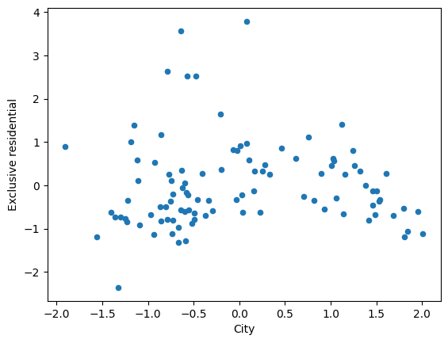
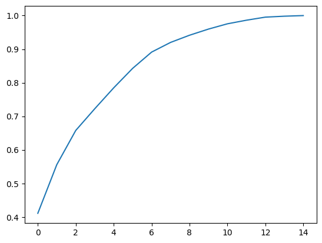

 # 教師なし学習1:次元の削除


```python
import unittest
import doctest
import os
path = os.path.dirname(os.path.abspath(__file__))
```

 ## 次元削除の概要

 ### 次元削減とは

 ### 主成分分析とは

 ## データの前処理

 ### データの読み込み

 #### コード14-1 Boston.csvを読み込み先頭２行を表示


```python
import pandas as pd
df = pd.read_csv(path + '/data/Boston.csv') # csvファイルの読み込み
df.head(2) # 先頭２行の表示
```


<div>
<style scoped>
    .dataframe tbody tr th:only-of-type {
        vertical-align: middle;
    }

    .dataframe tbody tr th {
        vertical-align: top;
    }

    .dataframe thead th {
        text-align: right;
    }
</style>
<table border="1" class="dataframe">
  <thead>
    <tr style="text-align: right;">
      <th></th>
      <th>CRIME</th>
      <th>ZN</th>
      <th>INDUS</th>
      <th>CHAS</th>
      <th>NOX</th>
      <th>RM</th>
      <th>AGE</th>
      <th>DIS</th>
      <th>RAD</th>
      <th>TAX</th>
      <th>PTRATIO</th>
      <th>B</th>
      <th>LSTAT</th>
      <th>PRICE</th>
    </tr>
  </thead>
  <tbody>
    <tr>
      <th>0</th>
      <td>high</td>
      <td>0.0</td>
      <td>18.10</td>
      <td>0</td>
      <td>0.718</td>
      <td>3.561</td>
      <td>87.9</td>
      <td>1.6132</td>
      <td>24.0</td>
      <td>666</td>
      <td>20.2</td>
      <td>354.7</td>
      <td>7.12</td>
      <td>27.5</td>
    </tr>
    <tr>
      <th>1</th>
      <td>low</td>
      <td>0.0</td>
      <td>8.14</td>
      <td>0</td>
      <td>0.538</td>
      <td>5.950</td>
      <td>82.0</td>
      <td>3.9900</td>
      <td>4.0</td>
      <td>307</td>
      <td>21.0</td>
      <td>232.6</td>
      <td>27.71</td>
      <td>13.2</td>
    </tr>
  </tbody>
</table>
</div>


 ### 欠損値の確認

 #### コード14-2 平均値で欠損値を穴埋めする


```python
df2 = df.fillna(df.mean()) # 列ごとの平均値で欠損値の穴埋め
```

 ### ダミー変数化

 #### コード14-3 CRIME列のダミー変数化


```python
dummy = pd.get_dummies(df2['CRIME'], drop_first=True)
df3 = df2.join(dummy) # df2とdummyを列方向に結合
df3 = df3.drop('CRIME', axis=1) # CRIME列を削除

df3.head(2)
```


<div>
<style scoped>
    .dataframe tbody tr th:only-of-type {
        vertical-align: middle;
    }

    .dataframe tbody tr th {
        vertical-align: top;
    }

    .dataframe thead th {
        text-align: right;
    }
</style>
<table border="1" class="dataframe">
  <thead>
    <tr style="text-align: right;">
      <th></th>
      <th>ZN</th>
      <th>INDUS</th>
      <th>CHAS</th>
      <th>NOX</th>
      <th>RM</th>
      <th>AGE</th>
      <th>DIS</th>
      <th>RAD</th>
      <th>TAX</th>
      <th>PTRATIO</th>
      <th>B</th>
      <th>LSTAT</th>
      <th>PRICE</th>
      <th>low</th>
      <th>very_low</th>
    </tr>
  </thead>
  <tbody>
    <tr>
      <th>0</th>
      <td>0.0</td>
      <td>18.10</td>
      <td>0</td>
      <td>0.718</td>
      <td>3.561</td>
      <td>87.9</td>
      <td>1.6132</td>
      <td>24.0</td>
      <td>666</td>
      <td>20.2</td>
      <td>354.7</td>
      <td>7.12</td>
      <td>27.5</td>
      <td>0</td>
      <td>0</td>
    </tr>
    <tr>
      <th>1</th>
      <td>0.0</td>
      <td>8.14</td>
      <td>0</td>
      <td>0.538</td>
      <td>5.950</td>
      <td>82.0</td>
      <td>3.9900</td>
      <td>4.0</td>
      <td>307</td>
      <td>21.0</td>
      <td>232.6</td>
      <td>27.71</td>
      <td>13.2</td>
      <td>1</td>
      <td>0</td>
    </tr>
  </tbody>
</table>
</div>


 ### データの標準化

 #### コード14-4 データの標準化


```python
from sklearn.preprocessing import StandardScaler

# 中身が整数だと、fit_transformで警告になるので、float型に変換（省略可能）
df4 = df3.astype(float)

# 標準化
sc = StandardScaler()
sc_df = sc.fit_transform(df4)
```

 ## 主成分分析の実施

 ### モジュールのインポート

 #### コード14-5 モジュールのインポート


```python
from sklearn.decomposition import PCA
```

 ### モデルの作成

 #### コード14-6 モデルの作成


```python
model = PCA(n_components=2, whiten=True) # モデル作成
```

 #### コード14-7 モデルに学習をさせる


```python
# モデルに学習させる
model.fit(sc_df)
```


<style>#sk-container-id-2 {color: black;background-color: white;}#sk-container-id-2 pre{padding: 0;}#sk-container-id-2 div.sk-toggleable {background-color: white;}#sk-container-id-2 label.sk-toggleable__label {cursor: pointer;display: block;width: 100%;margin-bottom: 0;padding: 0.3em;box-sizing: border-box;text-align: center;}#sk-container-id-2 label.sk-toggleable__label-arrow:before {content: "▸";float: left;margin-right: 0.25em;color: #696969;}#sk-container-id-2 label.sk-toggleable__label-arrow:hover:before {color: black;}#sk-container-id-2 div.sk-estimator:hover label.sk-toggleable__label-arrow:before {color: black;}#sk-container-id-2 div.sk-toggleable__content {max-height: 0;max-width: 0;overflow: hidden;text-align: left;background-color: #f0f8ff;}#sk-container-id-2 div.sk-toggleable__content pre {margin: 0.2em;color: black;border-radius: 0.25em;background-color: #f0f8ff;}#sk-container-id-2 input.sk-toggleable__control:checked~div.sk-toggleable__content {max-height: 200px;max-width: 100%;overflow: auto;}#sk-container-id-2 input.sk-toggleable__control:checked~label.sk-toggleable__label-arrow:before {content: "▾";}#sk-container-id-2 div.sk-estimator input.sk-toggleable__control:checked~label.sk-toggleable__label {background-color: #d4ebff;}#sk-container-id-2 div.sk-label input.sk-toggleable__control:checked~label.sk-toggleable__label {background-color: #d4ebff;}#sk-container-id-2 input.sk-hidden--visually {border: 0;clip: rect(1px 1px 1px 1px);clip: rect(1px, 1px, 1px, 1px);height: 1px;margin: -1px;overflow: hidden;padding: 0;position: absolute;width: 1px;}#sk-container-id-2 div.sk-estimator {font-family: monospace;background-color: #f0f8ff;border: 1px dotted black;border-radius: 0.25em;box-sizing: border-box;margin-bottom: 0.5em;}#sk-container-id-2 div.sk-estimator:hover {background-color: #d4ebff;}#sk-container-id-2 div.sk-parallel-item::after {content: "";width: 100%;border-bottom: 1px solid gray;flex-grow: 1;}#sk-container-id-2 div.sk-label:hover label.sk-toggleable__label {background-color: #d4ebff;}#sk-container-id-2 div.sk-serial::before {content: "";position: absolute;border-left: 1px solid gray;box-sizing: border-box;top: 0;bottom: 0;left: 50%;z-index: 0;}#sk-container-id-2 div.sk-serial {display: flex;flex-direction: column;align-items: center;background-color: white;padding-right: 0.2em;padding-left: 0.2em;position: relative;}#sk-container-id-2 div.sk-item {position: relative;z-index: 1;}#sk-container-id-2 div.sk-parallel {display: flex;align-items: stretch;justify-content: center;background-color: white;position: relative;}#sk-container-id-2 div.sk-item::before, #sk-container-id-2 div.sk-parallel-item::before {content: "";position: absolute;border-left: 1px solid gray;box-sizing: border-box;top: 0;bottom: 0;left: 50%;z-index: -1;}#sk-container-id-2 div.sk-parallel-item {display: flex;flex-direction: column;z-index: 1;position: relative;background-color: white;}#sk-container-id-2 div.sk-parallel-item:first-child::after {align-self: flex-end;width: 50%;}#sk-container-id-2 div.sk-parallel-item:last-child::after {align-self: flex-start;width: 50%;}#sk-container-id-2 div.sk-parallel-item:only-child::after {width: 0;}#sk-container-id-2 div.sk-dashed-wrapped {border: 1px dashed gray;margin: 0 0.4em 0.5em 0.4em;box-sizing: border-box;padding-bottom: 0.4em;background-color: white;}#sk-container-id-2 div.sk-label label {font-family: monospace;font-weight: bold;display: inline-block;line-height: 1.2em;}#sk-container-id-2 div.sk-label-container {text-align: center;}#sk-container-id-2 div.sk-container {/* jupyter's `normalize.less` sets `[hidden] { display: none; }` but bootstrap.min.css set `[hidden] { display: none !important; }` so we also need the `!important` here to be able to override the default hidden behavior on the sphinx rendered scikit-learn.org. See: https://github.com/scikit-learn/scikit-learn/issues/21755 */display: inline-block !important;position: relative;}#sk-container-id-2 div.sk-text-repr-fallback {display: none;}</style><div id="sk-container-id-2" class="sk-top-container"><div class="sk-text-repr-fallback"><pre>PCA(n_components=2, whiten=True)</pre><b>In a Jupyter environment, please rerun this cell to show the HTML representation or trust the notebook. <br />On GitHub, the HTML representation is unable to render, please try loading this page with nbviewer.org.</b></div><div class="sk-container" hidden><div class="sk-item"><div class="sk-estimator sk-toggleable"><input class="sk-toggleable__control sk-hidden--visually" id="sk-estimator-id-2" type="checkbox" checked><label for="sk-estimator-id-2" class="sk-toggleable__label sk-toggleable__label-arrow">PCA</label><div class="sk-toggleable__content"><pre>PCA(n_components=2, whiten=True)</pre></div></div></div></div></div>


 #### コード14-8 第１軸と第２軸の固有ベクトル


```python
# 新規の第１軸（第１主成分とも呼ぶ）の固有ベクトル
print(model.components_[0])
print('-----')
# 新規の第２軸（第２主成分とも呼ぶ）の固有ベクトル
print(model.components_[1])
```

    [-0.2258543   0.35923465  0.04220985  0.3499321  -0.19485285  0.29792086
     -0.29980115  0.30726517  0.32822012  0.16246983 -0.18251937  0.27543839
     -0.2018449   0.03831172 -0.31492126]
    -----
    [-0.1533893   0.02835867  0.19795373  0.13817925  0.4047141   0.20058802
     -0.29340246 -0.1027543  -0.11546952 -0.34046929  0.05661836 -0.17845386
      0.44390529  0.42253976 -0.27716437]
    

 #### コード14-9 既存のsc_dfを新しい２つの軸に当てはめる


```python
new = model.transform(sc_df)

new_df = pd.DataFrame(new)
new_df.head(3)
```


<div>
<style scoped>
    .dataframe tbody tr th:only-of-type {
        vertical-align: middle;
    }

    .dataframe tbody tr th {
        vertical-align: top;
    }

    .dataframe thead th {
        text-align: right;
    }
</style>
<table border="1" class="dataframe">
  <thead>
    <tr style="text-align: right;">
      <th></th>
      <th>0</th>
      <th>1</th>
    </tr>
  </thead>
  <tbody>
    <tr>
      <th>0</th>
      <td>1.490417</td>
      <td>-0.680415</td>
    </tr>
    <tr>
      <th>1</th>
      <td>0.703223</td>
      <td>-0.252517</td>
    </tr>
    <tr>
      <th>2</th>
      <td>-1.403756</td>
      <td>-0.613175</td>
    </tr>
  </tbody>
</table>
</div>


 ## 結果の評価

 ### 主成分負荷量の確認

 #### コード14-10 新しい２列ともとの列を結合


```python
new_df.columns = ['PC1', 'PC2']
# 標準化済みの既存データ(numpy)をデータフレーム化
df5 = pd.DataFrame(sc_df, columns=df4.columns)
# 2つのデータフレームを列方向に結合
df6 = pd.concat([new_df, df5], axis=1)
```

 #### コード14-11 主成分負荷量の計算


```python
df_corr = df6.corr() # 相関係数の計算
df_corr.loc[:'very_low','PC1':]
```


<div>
<style scoped>
    .dataframe tbody tr th:only-of-type {
        vertical-align: middle;
    }

    .dataframe tbody tr th {
        vertical-align: top;
    }

    .dataframe thead th {
        text-align: right;
    }
</style>
<table border="1" class="dataframe">
  <thead>
    <tr style="text-align: right;">
      <th></th>
      <th>PC1</th>
      <th>PC2</th>
      <th>ZN</th>
      <th>INDUS</th>
      <th>CHAS</th>
      <th>NOX</th>
      <th>RM</th>
      <th>AGE</th>
      <th>DIS</th>
      <th>RAD</th>
      <th>TAX</th>
      <th>PTRATIO</th>
      <th>B</th>
      <th>LSTAT</th>
      <th>PRICE</th>
      <th>low</th>
      <th>very_low</th>
    </tr>
  </thead>
  <tbody>
    <tr>
      <th>PC1</th>
      <td>1.000000e+00</td>
      <td>-3.341883e-16</td>
      <td>-0.560802</td>
      <td>0.891989</td>
      <td>0.104808</td>
      <td>0.868891</td>
      <td>-0.483825</td>
      <td>0.739745</td>
      <td>-0.744414</td>
      <td>0.762947</td>
      <td>0.814979</td>
      <td>0.403417</td>
      <td>-0.453200</td>
      <td>0.683921</td>
      <td>-0.501186</td>
      <td>0.095129</td>
      <td>-0.781958</td>
    </tr>
    <tr>
      <th>PC2</th>
      <td>-3.341883e-16</td>
      <td>1.000000e+00</td>
      <td>-0.226097</td>
      <td>0.041801</td>
      <td>0.291786</td>
      <td>0.203678</td>
      <td>0.596553</td>
      <td>0.295669</td>
      <td>-0.432478</td>
      <td>-0.151461</td>
      <td>-0.170203</td>
      <td>-0.501855</td>
      <td>0.083456</td>
      <td>-0.263043</td>
      <td>0.654321</td>
      <td>0.622828</td>
      <td>-0.408543</td>
    </tr>
    <tr>
      <th>ZN</th>
      <td>-5.608021e-01</td>
      <td>-2.260973e-01</td>
      <td>1.000000</td>
      <td>-0.413801</td>
      <td>-0.020551</td>
      <td>-0.459063</td>
      <td>0.172917</td>
      <td>-0.484837</td>
      <td>0.593037</td>
      <td>-0.254450</td>
      <td>-0.257640</td>
      <td>-0.262523</td>
      <td>0.145139</td>
      <td>-0.337898</td>
      <td>0.193146</td>
      <td>-0.202371</td>
      <td>0.409133</td>
    </tr>
    <tr>
      <th>INDUS</th>
      <td>8.919890e-01</td>
      <td>4.180095e-02</td>
      <td>-0.413801</td>
      <td>1.000000</td>
      <td>0.157138</td>
      <td>0.802464</td>
      <td>-0.421951</td>
      <td>0.620097</td>
      <td>-0.676479</td>
      <td>0.650419</td>
      <td>0.743518</td>
      <td>0.282389</td>
      <td>-0.324724</td>
      <td>0.562670</td>
      <td>-0.396040</td>
      <td>0.063395</td>
      <td>-0.693969</td>
    </tr>
    <tr>
      <th>CHAS</th>
      <td>1.048082e-01</td>
      <td>2.917857e-01</td>
      <td>-0.020551</td>
      <td>0.157138</td>
      <td>1.000000</td>
      <td>0.129360</td>
      <td>0.072048</td>
      <td>0.096141</td>
      <td>-0.118997</td>
      <td>0.095892</td>
      <td>0.103137</td>
      <td>-0.030505</td>
      <td>0.017520</td>
      <td>-0.061717</td>
      <td>0.114753</td>
      <td>0.079472</td>
      <td>-0.137649</td>
    </tr>
    <tr>
      <th>NOX</th>
      <td>8.688905e-01</td>
      <td>2.036776e-01</td>
      <td>-0.459063</td>
      <td>0.802464</td>
      <td>0.129360</td>
      <td>1.000000</td>
      <td>-0.297557</td>
      <td>0.682188</td>
      <td>-0.755101</td>
      <td>0.622817</td>
      <td>0.690715</td>
      <td>0.099131</td>
      <td>-0.371033</td>
      <td>0.506199</td>
      <td>-0.286387</td>
      <td>0.063427</td>
      <td>-0.701661</td>
    </tr>
    <tr>
      <th>RM</th>
      <td>-4.838247e-01</td>
      <td>5.965525e-01</td>
      <td>0.172917</td>
      <td>-0.421951</td>
      <td>0.072048</td>
      <td>-0.297557</td>
      <td>1.000000</td>
      <td>-0.201136</td>
      <td>0.095502</td>
      <td>-0.277106</td>
      <td>-0.354765</td>
      <td>-0.363856</td>
      <td>0.099481</td>
      <td>-0.560947</td>
      <td>0.686674</td>
      <td>0.134248</td>
      <td>0.188623</td>
    </tr>
    <tr>
      <th>AGE</th>
      <td>7.397452e-01</td>
      <td>2.956687e-01</td>
      <td>-0.484837</td>
      <td>0.620097</td>
      <td>0.096141</td>
      <td>0.682188</td>
      <td>-0.201136</td>
      <td>1.000000</td>
      <td>-0.696931</td>
      <td>0.401993</td>
      <td>0.441867</td>
      <td>0.147185</td>
      <td>-0.231157</td>
      <td>0.471668</td>
      <td>-0.261573</td>
      <td>0.226705</td>
      <td>-0.602254</td>
    </tr>
    <tr>
      <th>DIS</th>
      <td>-7.444141e-01</td>
      <td>-4.324781e-01</td>
      <td>0.593037</td>
      <td>-0.676479</td>
      <td>-0.118997</td>
      <td>-0.755101</td>
      <td>0.095502</td>
      <td>-0.696931</td>
      <td>1.000000</td>
      <td>-0.470486</td>
      <td>-0.499881</td>
      <td>-0.083598</td>
      <td>0.237879</td>
      <td>-0.380318</td>
      <td>0.036360</td>
      <td>-0.160125</td>
      <td>0.610582</td>
    </tr>
    <tr>
      <th>RAD</th>
      <td>7.629474e-01</td>
      <td>-1.514608e-01</td>
      <td>-0.254450</td>
      <td>0.650419</td>
      <td>0.095892</td>
      <td>0.622817</td>
      <td>-0.277106</td>
      <td>0.401993</td>
      <td>-0.470486</td>
      <td>1.000000</td>
      <td>0.944359</td>
      <td>0.441135</td>
      <td>-0.377976</td>
      <td>0.317398</td>
      <td>-0.245235</td>
      <td>-0.243074</td>
      <td>-0.574758</td>
    </tr>
    <tr>
      <th>TAX</th>
      <td>8.149791e-01</td>
      <td>-1.702032e-01</td>
      <td>-0.257640</td>
      <td>0.743518</td>
      <td>0.103137</td>
      <td>0.690715</td>
      <td>-0.354765</td>
      <td>0.441867</td>
      <td>-0.499881</td>
      <td>0.944359</td>
      <td>1.000000</td>
      <td>0.409159</td>
      <td>-0.383749</td>
      <td>0.367904</td>
      <td>-0.333706</td>
      <td>-0.227436</td>
      <td>-0.593016</td>
    </tr>
    <tr>
      <th>PTRATIO</th>
      <td>4.034168e-01</td>
      <td>-5.018551e-01</td>
      <td>-0.262523</td>
      <td>0.282389</td>
      <td>-0.030505</td>
      <td>0.099131</td>
      <td>-0.363856</td>
      <td>0.147185</td>
      <td>-0.083598</td>
      <td>0.441135</td>
      <td>0.409159</td>
      <td>1.000000</td>
      <td>-0.156204</td>
      <td>0.262200</td>
      <td>-0.453794</td>
      <td>-0.129344</td>
      <td>-0.152630</td>
    </tr>
    <tr>
      <th>B</th>
      <td>-4.532004e-01</td>
      <td>8.345601e-02</td>
      <td>0.145139</td>
      <td>-0.324724</td>
      <td>0.017520</td>
      <td>-0.371033</td>
      <td>0.099481</td>
      <td>-0.231157</td>
      <td>0.237879</td>
      <td>-0.377976</td>
      <td>-0.383749</td>
      <td>-0.156204</td>
      <td>1.000000</td>
      <td>-0.313913</td>
      <td>0.256790</td>
      <td>0.005895</td>
      <td>0.314845</td>
    </tr>
    <tr>
      <th>LSTAT</th>
      <td>6.839207e-01</td>
      <td>-2.630427e-01</td>
      <td>-0.337898</td>
      <td>0.562670</td>
      <td>-0.061717</td>
      <td>0.506199</td>
      <td>-0.560947</td>
      <td>0.471668</td>
      <td>-0.380318</td>
      <td>0.317398</td>
      <td>0.367904</td>
      <td>0.262200</td>
      <td>-0.313913</td>
      <td>1.000000</td>
      <td>-0.685068</td>
      <td>0.104723</td>
      <td>-0.461937</td>
    </tr>
    <tr>
      <th>PRICE</th>
      <td>-5.011861e-01</td>
      <td>6.543207e-01</td>
      <td>0.193146</td>
      <td>-0.396040</td>
      <td>0.114753</td>
      <td>-0.286387</td>
      <td>0.686674</td>
      <td>-0.261573</td>
      <td>0.036360</td>
      <td>-0.245235</td>
      <td>-0.333706</td>
      <td>-0.453794</td>
      <td>0.256790</td>
      <td>-0.685068</td>
      <td>1.000000</td>
      <td>0.122658</td>
      <td>0.156371</td>
    </tr>
    <tr>
      <th>low</th>
      <td>9.512899e-02</td>
      <td>6.228277e-01</td>
      <td>-0.202371</td>
      <td>0.063395</td>
      <td>0.079472</td>
      <td>0.063427</td>
      <td>0.134248</td>
      <td>0.226705</td>
      <td>-0.160125</td>
      <td>-0.243074</td>
      <td>-0.227436</td>
      <td>-0.129344</td>
      <td>0.005895</td>
      <td>0.104723</td>
      <td>0.122658</td>
      <td>1.000000</td>
      <td>-0.577350</td>
    </tr>
    <tr>
      <th>very_low</th>
      <td>-7.819577e-01</td>
      <td>-4.085430e-01</td>
      <td>0.409133</td>
      <td>-0.693969</td>
      <td>-0.137649</td>
      <td>-0.701661</td>
      <td>0.188623</td>
      <td>-0.602254</td>
      <td>0.610582</td>
      <td>-0.574758</td>
      <td>-0.593016</td>
      <td>-0.152630</td>
      <td>0.314845</td>
      <td>-0.461937</td>
      <td>0.156371</td>
      <td>-0.577350</td>
      <td>1.000000</td>
    </tr>
  </tbody>
</table>
</div>


 #### コード14-12 相関係数を大きい順に並べ替える


```python
# わかりやすいように変数に代入
pc_corr = df_corr.loc[:'very_low','PC1':]

pc_corr['PC1'].sort_values(ascending=False)
```


    PC1         1.000000e+00
    INDUS       8.919890e-01
    NOX         8.688905e-01
    TAX         8.149791e-01
    RAD         7.629474e-01
    AGE         7.397452e-01
    LSTAT       6.839207e-01
    PTRATIO     4.034168e-01
    CHAS        1.048082e-01
    low         9.512899e-02
    PC2        -3.341883e-16
    B          -4.532004e-01
    RM         -4.838247e-01
    PRICE      -5.011861e-01
    ZN         -5.608021e-01
    DIS        -7.444141e-01
    very_low   -7.819577e-01
    Name: PC1, dtype: float64


 #### コード14-13 第2列の相関を確認


```python
pc_corr['PC2'].sort_values(ascending=False)
```


    PC2         1.000000e+00
    PRICE       6.543207e-01
    low         6.228277e-01
    RM          5.965525e-01
    AGE         2.956687e-01
    CHAS        2.917857e-01
    NOX         2.036776e-01
    B           8.345601e-02
    INDUS       4.180095e-02
    PC1        -3.341883e-16
    RAD        -1.514608e-01
    TAX        -1.702032e-01
    ZN         -2.260973e-01
    LSTAT      -2.630427e-01
    very_low   -4.085430e-01
    DIS        -4.324781e-01
    PTRATIO    -5.018551e-01
    Name: PC2, dtype: float64


 #### コード14-14 新しい列の散布図


```python
col = ['City','Exclusive residential']

new_df.columns = col # 列名の変更

new_df.plot(kind='scatter', x='City', y='Exclusive residential') # 散布図
```

    c:\Users\kakim\Projects\github\k2works\programing_introduce_2023\.venv\lib\site-packages\pandas\plotting\_matplotlib\core.py:1041: UserWarning: No data for colormapping provided via 'c'. Parameters 'cmap' will be ignored
      scatter = ax.scatter(
    


    <Axes: xlabel='City', ylabel='Exclusive residential'>


    

    


 ### 最適な列の個数　-寄与率-

 #### コード14-15 新規の軸をすべて用意する


```python
model = PCA(whiten=True)

# 学習と新機軸へのデータの当てはめを一括で行う
tmp = model.fit_transform(sc_df)
tmp.shape
```


    (100, 15)


 #### コード14-16 寄与率を表示する


```python
model.explained_variance_ratio_ # 寄与率
```


    array([0.41102789, 0.14484698, 0.10192698, 0.06448954, 0.06233684,
           0.05810331, 0.04843711, 0.02885228, 0.02142431, 0.01831962,
           0.01572944, 0.01068611, 0.00918466, 0.00277548, 0.00185945])


 #### コード14-17 累積寄与率


```python
ratio = model.explained_variance_ratio_ # 寄与率のデータ集合

array = [] # 第N列までの累積寄与率を格納するリスト

for i in range(len(ratio)):
    # 寄与率の計算
    ruiseki = sum(ratio[:i+1])

    array.append(ruiseki) # 累積寄与率の格納

# 第N列の累積寄与率を折れ線グラフ化
pd.DataFrame(array).plot(kind='line', legend=False)
```


    <Axes: >


    

    


 #### コード14-18 情報量のしきい値を設定して必要な列の数を求める


```python
thred = 0.8 # 累積寄与率のしきい値
for i in range(len(array)):
    # 第(i + 1)列の累積寄与率がthredより大きいかチェック
    if array[i] >= thred:
        print(i+1)
        break
```

    6
    

 #### コード14-19 新規の列を6つに設定してモデルに学習させる


```python
# もとデータの全情報の80%を賄うために、新規の列を6つに設定
model = PCA(n_components=6, whiten=True)

model.fit(sc_df) # 学習

# 元データを新規の列（6列）に当てはめる
new = model.transform(sc_df)
```

 #### コード14-20 6列のデータをCSVファイルに保存


```python
# 主成分分析の結果をデータフレームに変換
col = ['PC1','PC2','PC3','PC4','PC5','PC6']
new_df2 = pd.DataFrame(new, columns=col)

# データフレームをcsvファイルとして保存
new_df2.to_csv(path + '/data/boston_pca.csv', index=False)
```


```python
doctest.testmod(verbose=True)
unittest.main(argv=[''], verbosity=2, exit=False)
```

    3 items had no tests:
        __main__
        __main__.__VSCODE_compute_hash
        __main__.__VSCODE_wrap_run_cell
    0 tests in 3 items.
    0 passed and 0 failed.
    Test passed.
    

    
    ----------------------------------------------------------------------
    Ran 0 tests in 0.000s
    
    OK
    


    <unittest.main.TestProgram at 0x20de5738730>


