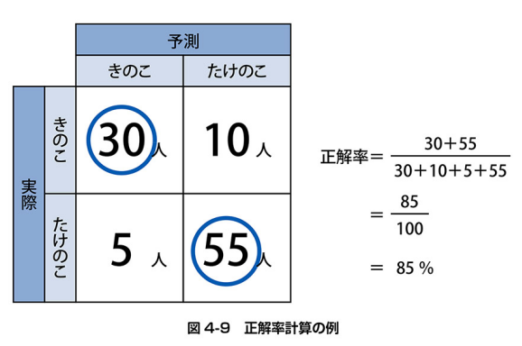

 # 機械学習の体験


```python
import unittest
import doctest
```

 ## きのこ派とたけのこ派に分類する


 ## pandas超入門


 ### pandasのインポート

 #### pandasをインポート


```python
import pandas as pd
from pandas.testing import assert_frame_equal
```

 ### データフレームの作成

 #### ディクショナリをDataFrame関数でデータフレームに変換


```python
data = {
    '松田の労働時間' : [160, 160], # 松田の労働時間列の作成
    '浅木の労働時間' : [161, 175], # 浅木の労働時間列の作成
}

df = pd.DataFrame(data)
df # DataFrameの表示
```


<div>
<style scoped>
    .dataframe tbody tr th:only-of-type {
        vertical-align: middle;
    }

    .dataframe tbody tr th {
        vertical-align: top;
    }

    .dataframe thead th {
        text-align: right;
    }
</style>
<table border="1" class="dataframe">
  <thead>
    <tr style="text-align: right;">
      <th></th>
      <th>松田の労働時間</th>
      <th>浅木の労働時間</th>
    </tr>
  </thead>
  <tbody>
    <tr>
      <th>0</th>
      <td>160</td>
      <td>161</td>
    </tr>
    <tr>
      <th>1</th>
      <td>160</td>
      <td>175</td>
    </tr>
  </tbody>
</table>
</div>


```python
# DataFrameのアサーション
assert_frame_equal(df, pd.DataFrame({
    '松田の労働時間' : [160, 160],
    '浅木の労働時間' : [161, 175],
}))
```

 #### type関数でデータフレームのデータ型を確認


```python
# セルの途中の場合、print関数を
# 利用しないと表示できない
print(type(df))
df.shape
```

    <class 'pandas.core.frame.DataFrame'>
    


    (2, 2)


 ### インデックスや列名の走査

 #### インデックスをデフォルトの整数から月に変更する


```python
df.index = ['4月', '5月'] # インデックスの変更
df # DataFrameの表示
```


<div>
<style scoped>
    .dataframe tbody tr th:only-of-type {
        vertical-align: middle;
    }

    .dataframe tbody tr th {
        vertical-align: top;
    }

    .dataframe thead th {
        text-align: right;
    }
</style>
<table border="1" class="dataframe">
  <thead>
    <tr style="text-align: right;">
      <th></th>
      <th>松田の労働時間</th>
      <th>浅木の労働時間</th>
    </tr>
  </thead>
  <tbody>
    <tr>
      <th>4月</th>
      <td>160</td>
      <td>161</td>
    </tr>
    <tr>
      <th>5月</th>
      <td>160</td>
      <td>175</td>
    </tr>
  </tbody>
</table>
</div>


 #### 列名を変更する


```python
df.columns = ['松田の労働(h)', '浅木の労働(h)'] # 列名の変更
df # DataFrameの表示
```


<div>
<style scoped>
    .dataframe tbody tr th:only-of-type {
        vertical-align: middle;
    }

    .dataframe tbody tr th {
        vertical-align: top;
    }

    .dataframe thead th {
        text-align: right;
    }
</style>
<table border="1" class="dataframe">
  <thead>
    <tr style="text-align: right;">
      <th></th>
      <th>松田の労働(h)</th>
      <th>浅木の労働(h)</th>
    </tr>
  </thead>
  <tbody>
    <tr>
      <th>4月</th>
      <td>160</td>
      <td>161</td>
    </tr>
    <tr>
      <th>5月</th>
      <td>160</td>
      <td>175</td>
    </tr>
  </tbody>
</table>
</div>


 #### インデックスや列名のみを参照する


```python
print(df.index) # インデックスの参照
print(df.columns) # 列名の参照
```

    Index(['4月', '5月'], dtype='object')
    Index(['松田の労働(h)', '浅木の労働(h)'], dtype='object')
    

 #### DataFrame関数の引数でインデックスや列名を指定する


```python
df = [
    [160, 161],
    [160, 175]
]

df2 = pd.DataFrame(data, index= ['4月', '5月'], columns=['松田の労働', '浅木の労働'])
```

 ### CSVファイルの読み込み

 #### read_csv関数でCSVファイルからデータを読み込む


```python
# pandasは別名pdでインポート済み
# KvsT.csvファイルを読み込んで、データフレームに変換
df = pd.read_csv('data/KvsT.csv')
# 先頭3行だけ表示
df.head(3)
```


<div>
<style scoped>
    .dataframe tbody tr th:only-of-type {
        vertical-align: middle;
    }

    .dataframe tbody tr th {
        vertical-align: top;
    }

    .dataframe thead th {
        text-align: right;
    }
</style>
<table border="1" class="dataframe">
  <thead>
    <tr style="text-align: right;">
      <th></th>
      <th>身長</th>
      <th>体重</th>
      <th>年代</th>
      <th>派閥</th>
    </tr>
  </thead>
  <tbody>
    <tr>
      <th>0</th>
      <td>170</td>
      <td>60</td>
      <td>10</td>
      <td>きのこ</td>
    </tr>
    <tr>
      <th>1</th>
      <td>172</td>
      <td>65</td>
      <td>20</td>
      <td>きのこ</td>
    </tr>
    <tr>
      <th>2</th>
      <td>170</td>
      <td>60</td>
      <td>30</td>
      <td>たけのこ</td>
    </tr>
  </tbody>
</table>
</div>


 ### 特定の列の参照

 #### 指定した列だけを参照する


```python
# 身長列だけを参照
df['身長']
```


    0     170
    1     172
    2     170
    3     170
    4     177
    5     168
    6     169
    7     170
    8     180
    9     170
    10    165
    11    170
    12    175
    13    170
    14    170
    15    155
    16    160
    17    170
    18    175
    Name: 身長, dtype: int64


 #### 複数の列を一度に参照する


```python
# 抜き出したい列名の文字列リストを作成
col = ['身長', '体重']
# 身長と体重の列だけを参照
df[col]
```


<div>
<style scoped>
    .dataframe tbody tr th:only-of-type {
        vertical-align: middle;
    }

    .dataframe tbody tr th {
        vertical-align: top;
    }

    .dataframe thead th {
        text-align: right;
    }
</style>
<table border="1" class="dataframe">
  <thead>
    <tr style="text-align: right;">
      <th></th>
      <th>身長</th>
      <th>体重</th>
    </tr>
  </thead>
  <tbody>
    <tr>
      <th>0</th>
      <td>170</td>
      <td>60</td>
    </tr>
    <tr>
      <th>1</th>
      <td>172</td>
      <td>65</td>
    </tr>
    <tr>
      <th>2</th>
      <td>170</td>
      <td>60</td>
    </tr>
    <tr>
      <th>3</th>
      <td>170</td>
      <td>65</td>
    </tr>
    <tr>
      <th>4</th>
      <td>177</td>
      <td>65</td>
    </tr>
    <tr>
      <th>5</th>
      <td>168</td>
      <td>55</td>
    </tr>
    <tr>
      <th>6</th>
      <td>169</td>
      <td>65</td>
    </tr>
    <tr>
      <th>7</th>
      <td>170</td>
      <td>62</td>
    </tr>
    <tr>
      <th>8</th>
      <td>180</td>
      <td>70</td>
    </tr>
    <tr>
      <th>9</th>
      <td>170</td>
      <td>68</td>
    </tr>
    <tr>
      <th>10</th>
      <td>165</td>
      <td>65</td>
    </tr>
    <tr>
      <th>11</th>
      <td>170</td>
      <td>72</td>
    </tr>
    <tr>
      <th>12</th>
      <td>175</td>
      <td>77</td>
    </tr>
    <tr>
      <th>13</th>
      <td>170</td>
      <td>65</td>
    </tr>
    <tr>
      <th>14</th>
      <td>170</td>
      <td>65</td>
    </tr>
    <tr>
      <th>15</th>
      <td>155</td>
      <td>56</td>
    </tr>
    <tr>
      <th>16</th>
      <td>160</td>
      <td>56</td>
    </tr>
    <tr>
      <th>17</th>
      <td>170</td>
      <td>65</td>
    </tr>
    <tr>
      <th>18</th>
      <td>175</td>
      <td>60</td>
    </tr>
  </tbody>
</table>
</div>


 #### 1列だけ抜き出したデータの型


```python
type(df['派閥'])
```


    pandas.core.series.Series


 #### 1次元のデータを扱うSeries型


```python
df['派閥']
```


    0      きのこ
    1      きのこ
    2     たけのこ
    3      きのこ
    4     たけのこ
    5      きのこ
    6     たけのこ
    7     たけのこ
    8     たけのこ
    9      きのこ
    10    たけのこ
    11     きのこ
    12    たけのこ
    13    たけのこ
    14    たけのこ
    15     きのこ
    16    たけのこ
    17     きのこ
    18    たけのこ
    Name: 派閥, dtype: object


 ## データの前処理


 ### 特徴量と正解データ

 #### 特徴量を変数xに代入


```python
# 特徴量の列を参照してxに代入
xcol = ['身長', '体重', '年代']
x = df[xcol]
x
```


<div>
<style scoped>
    .dataframe tbody tr th:only-of-type {
        vertical-align: middle;
    }

    .dataframe tbody tr th {
        vertical-align: top;
    }

    .dataframe thead th {
        text-align: right;
    }
</style>
<table border="1" class="dataframe">
  <thead>
    <tr style="text-align: right;">
      <th></th>
      <th>身長</th>
      <th>体重</th>
      <th>年代</th>
    </tr>
  </thead>
  <tbody>
    <tr>
      <th>0</th>
      <td>170</td>
      <td>60</td>
      <td>10</td>
    </tr>
    <tr>
      <th>1</th>
      <td>172</td>
      <td>65</td>
      <td>20</td>
    </tr>
    <tr>
      <th>2</th>
      <td>170</td>
      <td>60</td>
      <td>30</td>
    </tr>
    <tr>
      <th>3</th>
      <td>170</td>
      <td>65</td>
      <td>40</td>
    </tr>
    <tr>
      <th>4</th>
      <td>177</td>
      <td>65</td>
      <td>10</td>
    </tr>
    <tr>
      <th>5</th>
      <td>168</td>
      <td>55</td>
      <td>20</td>
    </tr>
    <tr>
      <th>6</th>
      <td>169</td>
      <td>65</td>
      <td>30</td>
    </tr>
    <tr>
      <th>7</th>
      <td>170</td>
      <td>62</td>
      <td>40</td>
    </tr>
    <tr>
      <th>8</th>
      <td>180</td>
      <td>70</td>
      <td>10</td>
    </tr>
    <tr>
      <th>9</th>
      <td>170</td>
      <td>68</td>
      <td>20</td>
    </tr>
    <tr>
      <th>10</th>
      <td>165</td>
      <td>65</td>
      <td>40</td>
    </tr>
    <tr>
      <th>11</th>
      <td>170</td>
      <td>72</td>
      <td>20</td>
    </tr>
    <tr>
      <th>12</th>
      <td>175</td>
      <td>77</td>
      <td>40</td>
    </tr>
    <tr>
      <th>13</th>
      <td>170</td>
      <td>65</td>
      <td>30</td>
    </tr>
    <tr>
      <th>14</th>
      <td>170</td>
      <td>65</td>
      <td>30</td>
    </tr>
    <tr>
      <th>15</th>
      <td>155</td>
      <td>56</td>
      <td>20</td>
    </tr>
    <tr>
      <th>16</th>
      <td>160</td>
      <td>56</td>
      <td>20</td>
    </tr>
    <tr>
      <th>17</th>
      <td>170</td>
      <td>65</td>
      <td>40</td>
    </tr>
    <tr>
      <th>18</th>
      <td>175</td>
      <td>60</td>
      <td>20</td>
    </tr>
  </tbody>
</table>
</div>


 #### 正解データを変数tに代入


```python
# 正解データ(派閥)を参照して, tに代入
t = df['派閥']
t
```


    0      きのこ
    1      きのこ
    2     たけのこ
    3      きのこ
    4     たけのこ
    5      きのこ
    6     たけのこ
    7     たけのこ
    8     たけのこ
    9      きのこ
    10    たけのこ
    11     きのこ
    12    たけのこ
    13    たけのこ
    14    たけのこ
    15     きのこ
    16    たけのこ
    17     きのこ
    18    たけのこ
    Name: 派閥, dtype: object


 ## モデルの準備と機械学習の実行


 ### scikit-learnのインポート

 #### treeモジュールのインポート


```python
from sklearn import tree
```

 #### モデルの準備と学習

 ##### モデルの準備と学習の実行


```python
# モデルの準備（未学習）
model = tree.DecisionTreeClassifier(random_state=0)

# 学習の実行（x,tは事前に定義済みの特徴料と正解ラベル）
model.fit(x, t)
```


<style>#sk-container-id-1 {color: black;background-color: white;}#sk-container-id-1 pre{padding: 0;}#sk-container-id-1 div.sk-toggleable {background-color: white;}#sk-container-id-1 label.sk-toggleable__label {cursor: pointer;display: block;width: 100%;margin-bottom: 0;padding: 0.3em;box-sizing: border-box;text-align: center;}#sk-container-id-1 label.sk-toggleable__label-arrow:before {content: "▸";float: left;margin-right: 0.25em;color: #696969;}#sk-container-id-1 label.sk-toggleable__label-arrow:hover:before {color: black;}#sk-container-id-1 div.sk-estimator:hover label.sk-toggleable__label-arrow:before {color: black;}#sk-container-id-1 div.sk-toggleable__content {max-height: 0;max-width: 0;overflow: hidden;text-align: left;background-color: #f0f8ff;}#sk-container-id-1 div.sk-toggleable__content pre {margin: 0.2em;color: black;border-radius: 0.25em;background-color: #f0f8ff;}#sk-container-id-1 input.sk-toggleable__control:checked~div.sk-toggleable__content {max-height: 200px;max-width: 100%;overflow: auto;}#sk-container-id-1 input.sk-toggleable__control:checked~label.sk-toggleable__label-arrow:before {content: "▾";}#sk-container-id-1 div.sk-estimator input.sk-toggleable__control:checked~label.sk-toggleable__label {background-color: #d4ebff;}#sk-container-id-1 div.sk-label input.sk-toggleable__control:checked~label.sk-toggleable__label {background-color: #d4ebff;}#sk-container-id-1 input.sk-hidden--visually {border: 0;clip: rect(1px 1px 1px 1px);clip: rect(1px, 1px, 1px, 1px);height: 1px;margin: -1px;overflow: hidden;padding: 0;position: absolute;width: 1px;}#sk-container-id-1 div.sk-estimator {font-family: monospace;background-color: #f0f8ff;border: 1px dotted black;border-radius: 0.25em;box-sizing: border-box;margin-bottom: 0.5em;}#sk-container-id-1 div.sk-estimator:hover {background-color: #d4ebff;}#sk-container-id-1 div.sk-parallel-item::after {content: "";width: 100%;border-bottom: 1px solid gray;flex-grow: 1;}#sk-container-id-1 div.sk-label:hover label.sk-toggleable__label {background-color: #d4ebff;}#sk-container-id-1 div.sk-serial::before {content: "";position: absolute;border-left: 1px solid gray;box-sizing: border-box;top: 0;bottom: 0;left: 50%;z-index: 0;}#sk-container-id-1 div.sk-serial {display: flex;flex-direction: column;align-items: center;background-color: white;padding-right: 0.2em;padding-left: 0.2em;position: relative;}#sk-container-id-1 div.sk-item {position: relative;z-index: 1;}#sk-container-id-1 div.sk-parallel {display: flex;align-items: stretch;justify-content: center;background-color: white;position: relative;}#sk-container-id-1 div.sk-item::before, #sk-container-id-1 div.sk-parallel-item::before {content: "";position: absolute;border-left: 1px solid gray;box-sizing: border-box;top: 0;bottom: 0;left: 50%;z-index: -1;}#sk-container-id-1 div.sk-parallel-item {display: flex;flex-direction: column;z-index: 1;position: relative;background-color: white;}#sk-container-id-1 div.sk-parallel-item:first-child::after {align-self: flex-end;width: 50%;}#sk-container-id-1 div.sk-parallel-item:last-child::after {align-self: flex-start;width: 50%;}#sk-container-id-1 div.sk-parallel-item:only-child::after {width: 0;}#sk-container-id-1 div.sk-dashed-wrapped {border: 1px dashed gray;margin: 0 0.4em 0.5em 0.4em;box-sizing: border-box;padding-bottom: 0.4em;background-color: white;}#sk-container-id-1 div.sk-label label {font-family: monospace;font-weight: bold;display: inline-block;line-height: 1.2em;}#sk-container-id-1 div.sk-label-container {text-align: center;}#sk-container-id-1 div.sk-container {/* jupyter's `normalize.less` sets `[hidden] { display: none; }` but bootstrap.min.css set `[hidden] { display: none !important; }` so we also need the `!important` here to be able to override the default hidden behavior on the sphinx rendered scikit-learn.org. See: https://github.com/scikit-learn/scikit-learn/issues/21755 */display: inline-block !important;position: relative;}#sk-container-id-1 div.sk-text-repr-fallback {display: none;}</style><div id="sk-container-id-1" class="sk-top-container"><div class="sk-text-repr-fallback"><pre>DecisionTreeClassifier(random_state=0)</pre><b>In a Jupyter environment, please rerun this cell to show the HTML representation or trust the notebook. <br />On GitHub, the HTML representation is unable to render, please try loading this page with nbviewer.org.</b></div><div class="sk-container" hidden><div class="sk-item"><div class="sk-estimator sk-toggleable"><input class="sk-toggleable__control sk-hidden--visually" id="sk-estimator-id-1" type="checkbox" checked><label for="sk-estimator-id-1" class="sk-toggleable__label sk-toggleable__label-arrow">DecisionTreeClassifier</label><div class="sk-toggleable__content"><pre>DecisionTreeClassifier(random_state=0)</pre></div></div></div></div></div>


 #### 新しいデータでの予測

 ##### きのこかたけのこか予測する


```python
# 身長170cm,体重70kg,年齢20代のデータ（新しいデータ)を
# 2次元リストで作成
taro = [[170, 70, 20]]

# taroがどちらに分類されるか予測
model.predict(taro)
```

    c:\Users\kakim\Projects\github\k2works\programing_introduce_2023\.venv\lib\site-packages\sklearn\base.py:439: UserWarning: X does not have valid feature names, but DecisionTreeClassifier was fitted with feature names
      warnings.warn(
    


    array(['きのこ'], dtype=object)


 ##### 複数の予測を一度に実行


```python
matsuda = [172, 65, 20] # 松田のデータ
asagi = [158, 48, 20]     # 浅木のデータ
new_data = [matsuda, asagi] # 2人のデータを二次元リスト化

model.predict(new_data) # 2人のデータを一括で予測
```

    c:\Users\kakim\Projects\github\k2works\programing_introduce_2023\.venv\lib\site-packages\sklearn\base.py:439: UserWarning: X does not have valid feature names, but DecisionTreeClassifier was fitted with feature names
      warnings.warn(
    


    array(['きのこ', 'たけのこ'], dtype=object)


 ## モデルの評価


 ### 予測性能の評価

 #### 正解率
 $正解率 = \frac{実際の答えと予測結果が一致している件数}{全データ件数}$


```python
from PIL import Image
im = Image.open('img/4-9.png')
im
```


    

    


 #### 正解率の計算


```python
# 正解率の計算
model.score(x, t)
```


    1.0


 ## モデルの保存


 ### pickleによるモデルの保存

 #### モデルの保存


```python
import pickle

with open('model/kvst-model.pkl', 'wb') as f:
    pickle.dump(model, f)
```

 #### KinokoTakenoko.pklからモデルを変数に読み込む


```python
import pickle

with open('model/kvst-model.pkl', 'rb') as f:
    model = pickle.load(f)
```

 #### ファイルから読み込んだ学習済モデルで予測する


```python
suzuki = [[180, 80, 30]]
model.predict(suzuki)
```

    c:\Users\kakim\Projects\github\k2works\programing_introduce_2023\.venv\lib\site-packages\sklearn\base.py:439: UserWarning: X does not have valid feature names, but DecisionTreeClassifier was fitted with feature names
      warnings.warn(
    


    array(['たけのこ'], dtype=object)


 #### データの準備・前処理からモデルの評価までの全体像


```python
import pandas as pd

# データの読み込み
df = pd.read_csv('data/KvsT.csv')

# 特徴量と正解データに分割
xcol = ['身長', '体重', '年代']
x = df[xcol]
t = df['派閥']

# モデルの準備と学習
from sklearn import tree
model = tree.DecisionTreeClassifier(random_state=0)
model.fit(x, t)

# 正解率の計算
model.score(x, t)
```


    1.0


