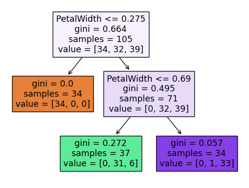

 # 分類1:アヤメの判定


```python
import unittest
import doctest
import os
path = os.path.dirname(os.path.abspath(__file__))
```

 ## アヤメの花を分類する

 ## データの前処理

 ### CSVファイルの読み込み

 #### データフレームの作成


```python
import pandas as pd # pandasをインポート
# iris.csvファイルを読み込んで、データフレームに変換
file = path + '/data/iris.csv'
df = pd.read_csv(file)
df.head(3) # 先頭3行だけ表示
```


<div>
<style scoped>
    .dataframe tbody tr th:only-of-type {
        vertical-align: middle;
    }

    .dataframe tbody tr th {
        vertical-align: top;
    }

    .dataframe thead th {
        text-align: right;
    }
</style>
<table border="1" class="dataframe">
  <thead>
    <tr style="text-align: right;">
      <th></th>
      <th>がく片長さ</th>
      <th>がく片幅</th>
      <th>花弁長さ</th>
      <th>花弁幅</th>
      <th>種類</th>
    </tr>
  </thead>
  <tbody>
    <tr>
      <th>0</th>
      <td>0.22</td>
      <td>0.63</td>
      <td>0.08</td>
      <td>0.04</td>
      <td>Iris-setosa</td>
    </tr>
    <tr>
      <th>1</th>
      <td>0.17</td>
      <td>0.42</td>
      <td>0.35</td>
      <td>0.04</td>
      <td>Iris-setosa</td>
    </tr>
    <tr>
      <th>2</th>
      <td>0.11</td>
      <td>0.50</td>
      <td>0.13</td>
      <td>0.04</td>
      <td>Iris-setosa</td>
    </tr>
  </tbody>
</table>
</div>


 #### 正解データの確認（文字データの集計）

 #### uniqueメソッドで種類列の値を確認


```python
df['種類'].unique()
```


    array(['Iris-setosa', 'Iris-versicolor', 'Iris-virginica'], dtype=object)


 #### array型の特定要素を参照


```python
syurui = df['種類'].unique()
syurui[0]
```


    'Iris-setosa'


 #### value_countsメソッドでデータの出現回数をカウント


```python
df['種類'].value_counts()
```


    Iris-virginica     50
    Iris-setosa        50
    Iris-versicolor    50
    Name: 種類, dtype: int64


 ### 欠損値の確認

 #### tailメソッドでデータフレームの末尾3行を表示


```python
df.tail(3) # 末尾3行だけ表示
```


<div>
<style scoped>
    .dataframe tbody tr th:only-of-type {
        vertical-align: middle;
    }

    .dataframe tbody tr th {
        vertical-align: top;
    }

    .dataframe thead th {
        text-align: right;
    }
</style>
<table border="1" class="dataframe">
  <thead>
    <tr style="text-align: right;">
      <th></th>
      <th>がく片長さ</th>
      <th>がく片幅</th>
      <th>花弁長さ</th>
      <th>花弁幅</th>
      <th>種類</th>
    </tr>
  </thead>
  <tbody>
    <tr>
      <th>147</th>
      <td>0.61</td>
      <td>0.42</td>
      <td>NaN</td>
      <td>0.79</td>
      <td>Iris-virginica</td>
    </tr>
    <tr>
      <th>148</th>
      <td>0.53</td>
      <td>0.58</td>
      <td>0.63</td>
      <td>0.92</td>
      <td>Iris-virginica</td>
    </tr>
    <tr>
      <th>149</th>
      <td>0.44</td>
      <td>0.42</td>
      <td>0.41</td>
      <td>0.71</td>
      <td>Iris-virginica</td>
    </tr>
  </tbody>
</table>
</div>


 #### isnullメソッドで欠損値の有無を確認


```python
df.isnull() # 各マスが欠損値かどうかを確認
```


<div>
<style scoped>
    .dataframe tbody tr th:only-of-type {
        vertical-align: middle;
    }

    .dataframe tbody tr th {
        vertical-align: top;
    }

    .dataframe thead th {
        text-align: right;
    }
</style>
<table border="1" class="dataframe">
  <thead>
    <tr style="text-align: right;">
      <th></th>
      <th>がく片長さ</th>
      <th>がく片幅</th>
      <th>花弁長さ</th>
      <th>花弁幅</th>
      <th>種類</th>
    </tr>
  </thead>
  <tbody>
    <tr>
      <th>0</th>
      <td>False</td>
      <td>False</td>
      <td>False</td>
      <td>False</td>
      <td>False</td>
    </tr>
    <tr>
      <th>1</th>
      <td>False</td>
      <td>False</td>
      <td>False</td>
      <td>False</td>
      <td>False</td>
    </tr>
    <tr>
      <th>2</th>
      <td>False</td>
      <td>False</td>
      <td>False</td>
      <td>False</td>
      <td>False</td>
    </tr>
    <tr>
      <th>3</th>
      <td>False</td>
      <td>False</td>
      <td>False</td>
      <td>False</td>
      <td>False</td>
    </tr>
    <tr>
      <th>4</th>
      <td>False</td>
      <td>False</td>
      <td>False</td>
      <td>False</td>
      <td>False</td>
    </tr>
    <tr>
      <th>...</th>
      <td>...</td>
      <td>...</td>
      <td>...</td>
      <td>...</td>
      <td>...</td>
    </tr>
    <tr>
      <th>145</th>
      <td>False</td>
      <td>False</td>
      <td>False</td>
      <td>False</td>
      <td>False</td>
    </tr>
    <tr>
      <th>146</th>
      <td>False</td>
      <td>False</td>
      <td>False</td>
      <td>False</td>
      <td>False</td>
    </tr>
    <tr>
      <th>147</th>
      <td>False</td>
      <td>False</td>
      <td>True</td>
      <td>False</td>
      <td>False</td>
    </tr>
    <tr>
      <th>148</th>
      <td>False</td>
      <td>False</td>
      <td>False</td>
      <td>False</td>
      <td>False</td>
    </tr>
    <tr>
      <th>149</th>
      <td>False</td>
      <td>False</td>
      <td>False</td>
      <td>False</td>
      <td>False</td>
    </tr>
  </tbody>
</table>
<p>150 rows × 5 columns</p>
</div>


 #### anyメソッドで欠損値の有無を確認


```python
# 列単位で欠損値が存在するか調べる
df.isnull().any(axis=0)
```


    がく片長さ     True
    がく片幅      True
    花弁長さ      True
    花弁幅       True
    種類       False
    dtype: bool


 #### sumメソッドで欠損値の数を確認


```python
df.sum() # 列単位で欠損値の数を確認
```


    がく片長さ                                                62.29
    がく片幅                                                 65.62
    花弁長さ                                                 72.04
    花弁幅                                                  66.22
    種類       Iris-setosaIris-setosaIris-setosaIris-setosaIr...
    dtype: object


 #### isnullメソッドとsumメソッドを組み合わせて欠損値の数を確認


```python
# 各列に欠損値がいくつあるか確認
tmp = df.isnull()
tmp.sum()
```


    がく片長さ    2
    がく片幅     1
    花弁長さ     2
    花弁幅      2
    種類       0
    dtype: int64


 ### 欠損値を含む行または列の削除

 #### dropnaメソッドで欠損値を含む行を削除


```python
# 欠損値が1つでもある行を削除した結果を、df2に代入
df2 = df.dropna(how='any', axis=0)

df2.tail(3) # 欠損値の存在確認
```


<div>
<style scoped>
    .dataframe tbody tr th:only-of-type {
        vertical-align: middle;
    }

    .dataframe tbody tr th {
        vertical-align: top;
    }

    .dataframe thead th {
        text-align: right;
    }
</style>
<table border="1" class="dataframe">
  <thead>
    <tr style="text-align: right;">
      <th></th>
      <th>がく片長さ</th>
      <th>がく片幅</th>
      <th>花弁長さ</th>
      <th>花弁幅</th>
      <th>種類</th>
    </tr>
  </thead>
  <tbody>
    <tr>
      <th>146</th>
      <td>0.56</td>
      <td>0.21</td>
      <td>0.69</td>
      <td>0.46</td>
      <td>Iris-virginica</td>
    </tr>
    <tr>
      <th>148</th>
      <td>0.53</td>
      <td>0.58</td>
      <td>0.63</td>
      <td>0.92</td>
      <td>Iris-virginica</td>
    </tr>
    <tr>
      <th>149</th>
      <td>0.44</td>
      <td>0.42</td>
      <td>0.41</td>
      <td>0.71</td>
      <td>Iris-virginica</td>
    </tr>
  </tbody>
</table>
</div>


 ### 欠損値の穴埋め

 #### fillnaメソッドで欠損値を穴埋め


```python
df['花弁長さ'] = df['花弁長さ'].fillna(0)
df.tail(3)
```


<div>
<style scoped>
    .dataframe tbody tr th:only-of-type {
        vertical-align: middle;
    }

    .dataframe tbody tr th {
        vertical-align: top;
    }

    .dataframe thead th {
        text-align: right;
    }
</style>
<table border="1" class="dataframe">
  <thead>
    <tr style="text-align: right;">
      <th></th>
      <th>がく片長さ</th>
      <th>がく片幅</th>
      <th>花弁長さ</th>
      <th>花弁幅</th>
      <th>種類</th>
    </tr>
  </thead>
  <tbody>
    <tr>
      <th>147</th>
      <td>0.61</td>
      <td>0.42</td>
      <td>0.00</td>
      <td>0.79</td>
      <td>Iris-virginica</td>
    </tr>
    <tr>
      <th>148</th>
      <td>0.53</td>
      <td>0.58</td>
      <td>0.63</td>
      <td>0.92</td>
      <td>Iris-virginica</td>
    </tr>
    <tr>
      <th>149</th>
      <td>0.44</td>
      <td>0.42</td>
      <td>0.41</td>
      <td>0.71</td>
      <td>Iris-virginica</td>
    </tr>
  </tbody>
</table>
</div>


 ### 代表値の計算

 #### meanメソッドで平均値を計算


```python
# 数値列の各平均値を計算（文字列の列は自動的に除外してくれる）
df.mean()
```


    がく片長さ    0.420878
    がく片幅     0.440403
    花弁長さ     0.480267
    花弁幅      0.447432
    dtype: float64


 #### 特定の列だけ計算する


```python
df['がく片長さ'].mean()
```


    0.42087837837837844


 #### 標準偏差の計算


```python
df.std() # 各列の標準偏差
```


    がく片長さ    0.228910
    がく片幅     0.181137
    花弁長さ     0.236909
    花弁幅      0.309960
    dtype: float64


 #### 平均値を求めてデータフレームの欠損値と置き換える


```python
df = pd.read_csv(file)

# 各列の平均値を計算して、colmeanに代入
colmean = df.mean()

# 平均値で欠損値を穴埋めしてdf2に代入
df2 = df.fillna(colmean)

# 欠損値があるか確認
df2.isnull().any(axis=0)
```


    がく片長さ    False
    がく片幅     False
    花弁長さ     False
    花弁幅      False
    種類       False
    dtype: bool


 ### 特徴量と正解データの取り出し

 #### 特徴量と正解データを変数に代入


```python
xcol = ['がく片長さ', 'がく片幅', '花弁長さ', '花弁幅']

x = df2[xcol]
t = df2['種類']
```

 ## モデルの作成と学習

 ### 決定木の概要

 ### 乱数の利用と再現性

 ### モデルの作成


```python
# モジュールのインポート
from sklearn import tree

# 決定木のモデルを作成
model = tree.DecisionTreeClassifier(max_depth=2, random_state=0)
```

 ### モデルの学習と正解率計算の落とし穴

 #### モデルの学習と正解率の計算


```python
model.fit(x, t) # モデルの学習
model.score(x, t) # 学習済みモデルの正解率計算
```


    0.94


 ## モデルの評価

 ### 訓練データとテストデータの分割（ホールドアウト法）

 #### 訓練データとテストデータに分割する


```python
# 関数のインポート
from sklearn.model_selection import train_test_split

x_train, x_test, y_train, y_test = train_test_split(x, t, test_size=0.3, random_state=0)

# x_train, y_trainが学習に利用する訓練データ
# x_test, y_testが検証に利用するテストデータ
```

 #### train_test_split関数の結果を確認


```python
print(x_train.shape) # x_trainの行数と列数を表示
print(x_test.shape) # x_testの行数と列数を表示
```

    (105, 4)
    (45, 4)
    

 ### 正解率の計算


```python
# 訓練データで再学習
model.fit(x_train, y_train)

# テストデータの予測結果と実際の答えが合致する正解率を計算
model.score(x_test, y_test)
```


    0.9555555555555556


 ### モデルの保存

 #### モデルを保存する


```python
import pickle # pickleモジュールのインポート

file = path + '/model/irismodel.pkl'
with open(file, 'wb') as f:
    pickle.dump(model, f)
```

 ## 決定木の図の作成

 ### 決定木の深さ

 #### 分岐条件の列を決める


```python
model.tree_.feature
```


    array([ 3, -2,  3, -2, -2], dtype=int64)


 ### 分岐条件のしきい値

 #### 分岐条件のしきい値を含む配列を返すtree_.threshold


```python
model.tree_.threshold
```


    array([ 0.275, -2.   ,  0.69 , -2.   , -2.   ])


 ### 末端ノードと種類の紐付け

 #### リーフに到達したデータの数を返すtree_.value


```python
# ノード番号1,3,4に到達したアヤメの種類ごとの数
print(model.tree_.value[1]) # ノード番号1に到達したとき
print(model.tree_.value[3]) # ノード番号3に到達したとき
print(model.tree_.value[4]) # ノード番号4に到達したとき
```

    [[34.  0.  0.]]
    [[ 0. 31.  6.]]
    [[ 0.  1. 33.]]
    

 #### classes_でアヤメの種類とグループ番号の対応を調べる


```python
# アヤメの種類とグループ番号の対応
model.classes_
```


    array(['Iris-setosa', 'Iris-versicolor', 'Iris-virginica'], dtype=object)


 #### plot_tree関数で簡単に決定木を描画する


```python
# 描画関数の仕様上、和名の特徴量を英字に直す
x_train.columns = ['SepalLength', 'SepalWidth', 'PetalLength', 'PetalWidth']

# 描画関数の利用
from sklearn.tree import plot_tree

# plot_tree関数で決定木を描画
plot_tree(model, feature_names=x_train.columns, filled=True)
```


    [Text(0.4, 0.8333333333333334, 'PetalWidth <= 0.275\ngini = 0.664\nsamples = 105\nvalue = [34, 32, 39]'),
     Text(0.2, 0.5, 'gini = 0.0\nsamples = 34\nvalue = [34, 0, 0]'),
     Text(0.6, 0.5, 'PetalWidth <= 0.69\ngini = 0.495\nsamples = 71\nvalue = [0, 32, 39]'),
     Text(0.4, 0.16666666666666666, 'gini = 0.272\nsamples = 37\nvalue = [0, 31, 6]'),
     Text(0.8, 0.16666666666666666, 'gini = 0.057\nsamples = 34\nvalue = [0, 1, 33]')]


    

    


```python
doctest.testmod(verbose=True)
unittest.main(argv=[''], verbosity=2, exit=False)
```

    3 items had no tests:
        __main__
        __main__.__VSCODE_compute_hash
        __main__.__VSCODE_wrap_run_cell
    0 tests in 3 items.
    0 passed and 0 failed.
    Test passed.
    

    
    ----------------------------------------------------------------------
    Ran 0 tests in 0.000s
    
    OK
    


    <unittest.main.TestProgram at 0x14c408a0af0>


