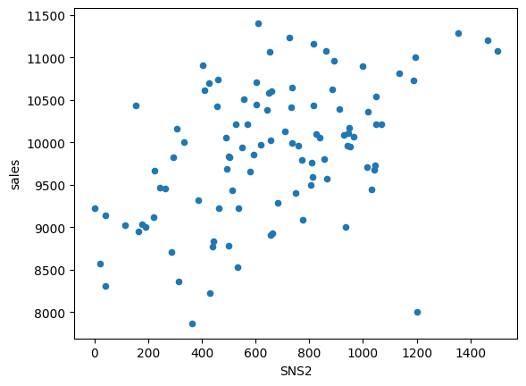
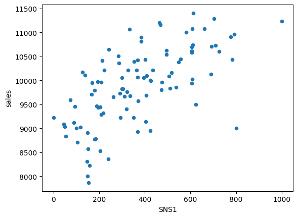
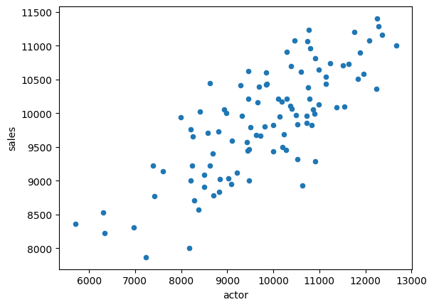
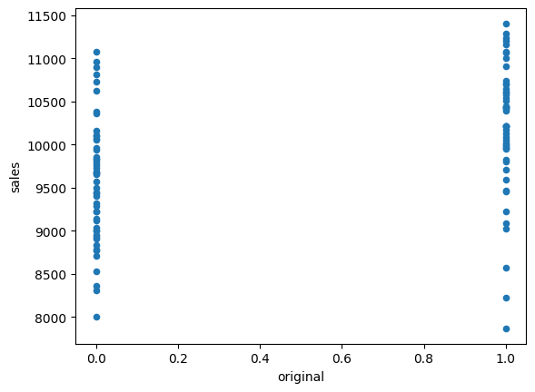

 # 回帰1:映画の興行収入の予測


```python
import unittest
import doctest
import os
path = os.path.dirname(os.path.abspath(__file__))
```

 ## 映画の興行収入を予測する

 ### 分析の目的とデータの概要

 ## データの前処理

 ### CSVファイルの読み込み

 #### cinema.csvの読み込み


```python
import pandas as pd

df = pd.read_csv(path + '/data/cinema.csv')
df.head(3) # 先頭3行を表示
```


<div>
<style scoped>
    .dataframe tbody tr th:only-of-type {
        vertical-align: middle;
    }

    .dataframe tbody tr th {
        vertical-align: top;
    }

    .dataframe thead th {
        text-align: right;
    }
</style>
<table border="1" class="dataframe">
  <thead>
    <tr style="text-align: right;">
      <th></th>
      <th>cinema_id</th>
      <th>SNS1</th>
      <th>SNS2</th>
      <th>actor</th>
      <th>original</th>
      <th>sales</th>
    </tr>
  </thead>
  <tbody>
    <tr>
      <th>0</th>
      <td>1375</td>
      <td>291.0</td>
      <td>1044</td>
      <td>8808.994029</td>
      <td>0</td>
      <td>9731</td>
    </tr>
    <tr>
      <th>1</th>
      <td>1000</td>
      <td>363.0</td>
      <td>568</td>
      <td>10290.709370</td>
      <td>1</td>
      <td>10210</td>
    </tr>
    <tr>
      <th>2</th>
      <td>1390</td>
      <td>158.0</td>
      <td>431</td>
      <td>6340.388534</td>
      <td>1</td>
      <td>8227</td>
    </tr>
  </tbody>
</table>
</div>


 ### 欠損値の処理

 #### 欠損値の確認


```python
df.isnull().any(axis=0)
```


    cinema_id    False
    SNS1          True
    SNS2         False
    actor         True
    original     False
    sales        False
    dtype: bool


 #### 欠損値の穴埋め


```python
# 欠損値を平均で補完して、df2に代入
df2 = df.fillna(df.mean())

# 穴埋めができたか確認
df2.isnull().any(axis=0)
```


    cinema_id    False
    SNS1         False
    SNS2         False
    actor        False
    original     False
    sales        False
    dtype: bool


 ### 散布図による外れ値の確認

 #### SNS2列とsales列の散布図を作成


```python
# JupyterLab上にグラフを描画するためのおまじない
# %matplotlib inline

# SNS2とsalesの散布図の作成
df.plot(kind='scatter', x='SNS2', y='sales')
```

    c:\Users\kakim\Projects\github\k2works\programing_introduce_2023\.venv\lib\site-packages\pandas\plotting\_matplotlib\core.py:1041: UserWarning: No data for colormapping provided via 'c'. Parameters 'cmap' will be ignored
      scatter = ax.scatter(
    


    <Axes: xlabel='SNS2', ylabel='sales'>


    

    


 #### 特徴量と組合わせを変えて散布図を作成


```python
df2.plot(kind='scatter', x='SNS1', y='sales')
df2.plot(kind='scatter', x='SNS2', y='sales')
df2.plot(kind='scatter', x='actor', y='sales')
```


    <Axes: xlabel='actor', ylabel='sales'>


    

    


    

    


    

    


 #### コード6-5と同じことをfor文との組合わせで行う


```python
for name in df2.columns:
    #X軸がcinema_id列とsales列の散布図は作っても意味が無いので外す
    if name == 'cinema_id' or name == 'sales':
        continue

    df2.plot(kind='scatter', x=name, y='sales')
```


    

    


    

    


    

    


    

    


 ### 外れ値の削除


```python
# #### 外れ値を削除する
```


```python
no = df2[(df2['SNS2'] > 1000 ) & (df2['sales'] < 8500)].index
df3 = df2.drop(no, axis=0)
```

 ### 特定の行の参照

 #### データフレームを作成する


```python
test = pd.DataFrame(
    {'Acolumn':[1,2,3],
     'Bcolumn':[4,5,6]
     }
     )
```

 #### Acolumn列の値が2未満の行だけを参照する


```python
test[test['Acolumn'] < 2]
```


<div>
<style scoped>
    .dataframe tbody tr th:only-of-type {
        vertical-align: middle;
    }

    .dataframe tbody tr th {
        vertical-align: top;
    }

    .dataframe thead th {
        text-align: right;
    }
</style>
<table border="1" class="dataframe">
  <thead>
    <tr style="text-align: right;">
      <th></th>
      <th>Acolumn</th>
      <th>Bcolumn</th>
    </tr>
  </thead>
  <tbody>
    <tr>
      <th>0</th>
      <td>1</td>
      <td>4</td>
    </tr>
  </tbody>
</table>
</div>


 #### Acolumn列(シリーズ型)に対して比較演算を行う


```python
test['Acolumn'] < 2
```


    0     True
    1    False
    2    False
    Name: Acolumn, dtype: bool


 #### 2つの条件で外れ値の行を特定する


```python
# SNS2列が1000より大きく、sales列が8500より小さい行を特定
df2[(df2['SNS2'] > 1000 ) & (df2['sales'] < 8500)]
```


<div>
<style scoped>
    .dataframe tbody tr th:only-of-type {
        vertical-align: middle;
    }

    .dataframe tbody tr th {
        vertical-align: top;
    }

    .dataframe thead th {
        text-align: right;
    }
</style>
<table border="1" class="dataframe">
  <thead>
    <tr style="text-align: right;">
      <th></th>
      <th>cinema_id</th>
      <th>SNS1</th>
      <th>SNS2</th>
      <th>actor</th>
      <th>original</th>
      <th>sales</th>
    </tr>
  </thead>
  <tbody>
    <tr>
      <th>30</th>
      <td>1855</td>
      <td>149.0</td>
      <td>1200</td>
      <td>8173.096892</td>
      <td>0</td>
      <td>8000</td>
    </tr>
  </tbody>
</table>
</div>


 #### 特定した行からインデックスのみを取り出す


```python
no = df2[(df2['SNS2'] > 1000 ) & (df2['sales'] < 8500)].index
no
```


    Int64Index([30], dtype='int64')


 ### 行や列の削除

 #### dropメソッドでインデックスが0の行を削除する


```python
test.drop(0, axis=0)
```


<div>
<style scoped>
    .dataframe tbody tr th:only-of-type {
        vertical-align: middle;
    }

    .dataframe tbody tr th {
        vertical-align: top;
    }

    .dataframe thead th {
        text-align: right;
    }
</style>
<table border="1" class="dataframe">
  <thead>
    <tr style="text-align: right;">
      <th></th>
      <th>Acolumn</th>
      <th>Bcolumn</th>
    </tr>
  </thead>
  <tbody>
    <tr>
      <th>1</th>
      <td>2</td>
      <td>5</td>
    </tr>
    <tr>
      <th>2</th>
      <td>3</td>
      <td>6</td>
    </tr>
  </tbody>
</table>
</div>


 #### 列を削除する


```python
test.drop('Bcolumn', axis=1)
```


<div>
<style scoped>
    .dataframe tbody tr th:only-of-type {
        vertical-align: middle;
    }

    .dataframe tbody tr th {
        vertical-align: top;
    }

    .dataframe thead th {
        text-align: right;
    }
</style>
<table border="1" class="dataframe">
  <thead>
    <tr style="text-align: right;">
      <th></th>
      <th>Acolumn</th>
    </tr>
  </thead>
  <tbody>
    <tr>
      <th>0</th>
      <td>1</td>
    </tr>
    <tr>
      <th>1</th>
      <td>2</td>
    </tr>
    <tr>
      <th>2</th>
      <td>3</td>
    </tr>
  </tbody>
</table>
</div>


 ### 外れ値を含む行の削除

 #### dropメソッドで外れ値を含む行を削除する


```python
df3 = df2.drop(no, axis=0) # 外れ値の行を削除
df3.shape # 行が削除できたかどうかを行数で確認
```


    (99, 6)


 ### locによる特徴量と正解データの取り出し

 #### df3から特徴量の変数xと正解データの変数tに分割


```python
# 特徴量の列の候補
col = ['SNS1', 'SNS2', 'actor', 'original']
x = df3[col] # 特徴量の取り出し

t = df3['sales'] # 正解データの取り出し
```

 #### インデックス2の行からSNS1列の値を取り出す


```python
# インデックスが2,列がSNS1のマスの値のみ参照
df3.loc[2, 'SNS1']
```


    158.0


 #### 特定のデータのみ参照する


```python
index = [2,4,6] # インデックス
col = ['SNS1', 'actor'] # 列名
df3.loc[index, col]
```


<div>
<style scoped>
    .dataframe tbody tr th:only-of-type {
        vertical-align: middle;
    }

    .dataframe tbody tr th {
        vertical-align: top;
    }

    .dataframe thead th {
        text-align: right;
    }
</style>
<table border="1" class="dataframe">
  <thead>
    <tr style="text-align: right;">
      <th></th>
      <th>SNS1</th>
      <th>actor</th>
    </tr>
  </thead>
  <tbody>
    <tr>
      <th>2</th>
      <td>158.0</td>
      <td>6340.388534</td>
    </tr>
    <tr>
      <th>4</th>
      <td>209.0</td>
      <td>10908.539550</td>
    </tr>
    <tr>
      <th>6</th>
      <td>153.0</td>
      <td>7237.639848</td>
    </tr>
  </tbody>
</table>
</div>


 #### スライス構文で連続した要素を参照する


```python
sample = [10, 20, 30, 40] # リストの作成
sample[1:3] # 添え字が1以上3未満の要素を取得
```


    [20, 30]


 #### データフレームで複数のインデックスや列名を参照する


```python
# 0行目以上3行目以下、actor列より左の列(actor列含む)
df3.loc[0:3, :'actor']
```


<div>
<style scoped>
    .dataframe tbody tr th:only-of-type {
        vertical-align: middle;
    }

    .dataframe tbody tr th {
        vertical-align: top;
    }

    .dataframe thead th {
        text-align: right;
    }
</style>
<table border="1" class="dataframe">
  <thead>
    <tr style="text-align: right;">
      <th></th>
      <th>cinema_id</th>
      <th>SNS1</th>
      <th>SNS2</th>
      <th>actor</th>
    </tr>
  </thead>
  <tbody>
    <tr>
      <th>0</th>
      <td>1375</td>
      <td>291.0</td>
      <td>1044</td>
      <td>8808.994029</td>
    </tr>
    <tr>
      <th>1</th>
      <td>1000</td>
      <td>363.0</td>
      <td>568</td>
      <td>10290.709370</td>
    </tr>
    <tr>
      <th>2</th>
      <td>1390</td>
      <td>158.0</td>
      <td>431</td>
      <td>6340.388534</td>
    </tr>
    <tr>
      <th>3</th>
      <td>1499</td>
      <td>261.0</td>
      <td>578</td>
      <td>8250.485081</td>
    </tr>
  </tbody>
</table>
</div>


 #### スライス構文で特徴量と正解データを取り出す


```python
x = df3.loc[:, 'SNS1':'original'] # 特徴量の取り出し

t = df3['sales'] # 正解ラベルの取り出し
```

 ### 訓練データとテストデータの分割

 #### 訓練データとテストデータに分割する


```python
from sklearn.model_selection import train_test_split
x_train, x_test, y_train, y_test = train_test_split(x, t, test_size=0.2, random_state=0)
```

 ## モデルの作成と学習

 ### 線形回帰分析の概要

 ### 最小２乗法の概要

 ### 重回帰モデルの作成と学習、分析の実行

 #### 重回帰モデルのLinerRegression関数をインポートする


```python
from sklearn.linear_model import LinearRegression
```

 #### LinearRegression関数を使ってモデルを作成する


```python
model = LinearRegression()
```

 #### fitメソッドでモデルを学習させる


```python
model.fit(x_train, y_train)
```


<style>#sk-container-id-6 {color: black;background-color: white;}#sk-container-id-6 pre{padding: 0;}#sk-container-id-6 div.sk-toggleable {background-color: white;}#sk-container-id-6 label.sk-toggleable__label {cursor: pointer;display: block;width: 100%;margin-bottom: 0;padding: 0.3em;box-sizing: border-box;text-align: center;}#sk-container-id-6 label.sk-toggleable__label-arrow:before {content: "▸";float: left;margin-right: 0.25em;color: #696969;}#sk-container-id-6 label.sk-toggleable__label-arrow:hover:before {color: black;}#sk-container-id-6 div.sk-estimator:hover label.sk-toggleable__label-arrow:before {color: black;}#sk-container-id-6 div.sk-toggleable__content {max-height: 0;max-width: 0;overflow: hidden;text-align: left;background-color: #f0f8ff;}#sk-container-id-6 div.sk-toggleable__content pre {margin: 0.2em;color: black;border-radius: 0.25em;background-color: #f0f8ff;}#sk-container-id-6 input.sk-toggleable__control:checked~div.sk-toggleable__content {max-height: 200px;max-width: 100%;overflow: auto;}#sk-container-id-6 input.sk-toggleable__control:checked~label.sk-toggleable__label-arrow:before {content: "▾";}#sk-container-id-6 div.sk-estimator input.sk-toggleable__control:checked~label.sk-toggleable__label {background-color: #d4ebff;}#sk-container-id-6 div.sk-label input.sk-toggleable__control:checked~label.sk-toggleable__label {background-color: #d4ebff;}#sk-container-id-6 input.sk-hidden--visually {border: 0;clip: rect(1px 1px 1px 1px);clip: rect(1px, 1px, 1px, 1px);height: 1px;margin: -1px;overflow: hidden;padding: 0;position: absolute;width: 1px;}#sk-container-id-6 div.sk-estimator {font-family: monospace;background-color: #f0f8ff;border: 1px dotted black;border-radius: 0.25em;box-sizing: border-box;margin-bottom: 0.5em;}#sk-container-id-6 div.sk-estimator:hover {background-color: #d4ebff;}#sk-container-id-6 div.sk-parallel-item::after {content: "";width: 100%;border-bottom: 1px solid gray;flex-grow: 1;}#sk-container-id-6 div.sk-label:hover label.sk-toggleable__label {background-color: #d4ebff;}#sk-container-id-6 div.sk-serial::before {content: "";position: absolute;border-left: 1px solid gray;box-sizing: border-box;top: 0;bottom: 0;left: 50%;z-index: 0;}#sk-container-id-6 div.sk-serial {display: flex;flex-direction: column;align-items: center;background-color: white;padding-right: 0.2em;padding-left: 0.2em;position: relative;}#sk-container-id-6 div.sk-item {position: relative;z-index: 1;}#sk-container-id-6 div.sk-parallel {display: flex;align-items: stretch;justify-content: center;background-color: white;position: relative;}#sk-container-id-6 div.sk-item::before, #sk-container-id-6 div.sk-parallel-item::before {content: "";position: absolute;border-left: 1px solid gray;box-sizing: border-box;top: 0;bottom: 0;left: 50%;z-index: -1;}#sk-container-id-6 div.sk-parallel-item {display: flex;flex-direction: column;z-index: 1;position: relative;background-color: white;}#sk-container-id-6 div.sk-parallel-item:first-child::after {align-self: flex-end;width: 50%;}#sk-container-id-6 div.sk-parallel-item:last-child::after {align-self: flex-start;width: 50%;}#sk-container-id-6 div.sk-parallel-item:only-child::after {width: 0;}#sk-container-id-6 div.sk-dashed-wrapped {border: 1px dashed gray;margin: 0 0.4em 0.5em 0.4em;box-sizing: border-box;padding-bottom: 0.4em;background-color: white;}#sk-container-id-6 div.sk-label label {font-family: monospace;font-weight: bold;display: inline-block;line-height: 1.2em;}#sk-container-id-6 div.sk-label-container {text-align: center;}#sk-container-id-6 div.sk-container {/* jupyter's `normalize.less` sets `[hidden] { display: none; }` but bootstrap.min.css set `[hidden] { display: none !important; }` so we also need the `!important` here to be able to override the default hidden behavior on the sphinx rendered scikit-learn.org. See: https://github.com/scikit-learn/scikit-learn/issues/21755 */display: inline-block !important;position: relative;}#sk-container-id-6 div.sk-text-repr-fallback {display: none;}</style><div id="sk-container-id-6" class="sk-top-container"><div class="sk-text-repr-fallback"><pre>LinearRegression()</pre><b>In a Jupyter environment, please rerun this cell to show the HTML representation or trust the notebook. <br />On GitHub, the HTML representation is unable to render, please try loading this page with nbviewer.org.</b></div><div class="sk-container" hidden><div class="sk-item"><div class="sk-estimator sk-toggleable"><input class="sk-toggleable__control sk-hidden--visually" id="sk-estimator-id-6" type="checkbox" checked><label for="sk-estimator-id-6" class="sk-toggleable__label sk-toggleable__label-arrow">LinearRegression</label><div class="sk-toggleable__content"><pre>LinearRegression()</pre></div></div></div></div></div>


 ### 未知データでの予測

 #### 興行収入を予測する


```python
new = [[150, 700, 300, 0]] # 新しいデータを２次元リストで作成
model.predict(new) # 学習済みモデルで推論
```

    c:\Users\kakim\Projects\github\k2works\programing_introduce_2023\.venv\lib\site-packages\sklearn\base.py:439: UserWarning: X does not have valid feature names, but LinearRegression was fitted with feature names
      warnings.warn(
    


    array([6874.109753])


 ## モデルの評価

 ### 回帰での評価指標

 #### scoreメソッドでモデルのscoreを計算


```python
model.score(x_test, y_test)
```


    0.790388159657009


 #### MAEを求める


```python
from sklearn.metrics import mean_absolute_error

pred = model.predict(x_test) # x_testのデータを一括で予測

# 平均絶対誤差の計算
mean_absolute_error(y_pred= pred, y_true= y_test)
```


    277.12236964086253


 ### 決定係数

 #### socreメソッド


```python
model.score(x_test, y_test)
```


    0.790388159657009


 ### モデルの保存

 #### モデルを保存する


```python
import pickle

with open(path + '/model/cinema.pkl', 'wb') as f:
    pickle.dump(model, f)
```

 ## 回帰式による影響度の分析

 ### 計算式の係数と切片の確認

 #### 係数と切片を確認


```python
print(model.coef_) # 計算式の係数の表示
print(model.intercept_) # 計算式の切片の表示
```

    [  1.07645622   0.53400191   0.28473752 213.95584503]
    6253.418729438709
    

 #### 列と係数を表示する


```python
tmp = pd.DataFrame(model.coef_) # データフレームの作成
tmp.index = x_train.columns # 列名をインデックスに指定
tmp
```


<div>
<style scoped>
    .dataframe tbody tr th:only-of-type {
        vertical-align: middle;
    }

    .dataframe tbody tr th {
        vertical-align: top;
    }

    .dataframe thead th {
        text-align: right;
    }
</style>
<table border="1" class="dataframe">
  <thead>
    <tr style="text-align: right;">
      <th></th>
      <th>0</th>
    </tr>
  </thead>
  <tbody>
    <tr>
      <th>SNS1</th>
      <td>1.076456</td>
    </tr>
    <tr>
      <th>SNS2</th>
      <td>0.534002</td>
    </tr>
    <tr>
      <th>actor</th>
      <td>0.284738</td>
    </tr>
    <tr>
      <th>original</th>
      <td>213.955845</td>
    </tr>
  </tbody>
</table>
</div>


 ### 正解データと特徴量の影響度の考察


```python
doctest.testmod(verbose=True)
unittest.main(argv=[''], verbosity=2, exit=False)
```

    3 items had no tests:
        __main__
        __main__.__VSCODE_compute_hash
        __main__.__VSCODE_wrap_run_cell
    0 tests in 3 items.
    0 passed and 0 failed.
    Test passed.
    

    
    ----------------------------------------------------------------------
    Ran 0 tests in 0.000s
    
    OK
    


    <unittest.main.TestProgram at 0x1f155846b20>


