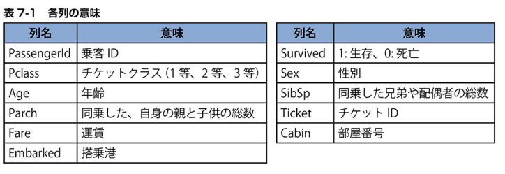
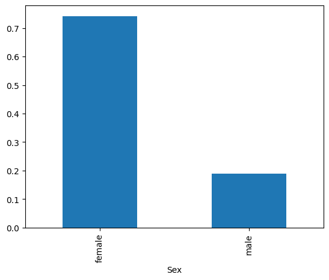

 # 分類2:客船沈没事故での生存予測


```python
import unittest
import doctest
import os
path = os.path.dirname(os.path.abspath(__file__))
```

 ## 客船沈没事故から生き残れるかを予測

 ### データの概要


```python
from PIL import Image
file = path + '/img/7-1.png'
im = Image.open(file)
im
```


    

    


 ## データの前処理

 ### CSVファイルの読み込み

 #### CSVファイルの読み込み


```python
import pandas as pd
from sklearn import tree
from sklearn.model_selection import train_test_split
# %matplotlib inline
df = pd.read_csv(path + '/data/Survived.csv')
df.head(2) # 先頭2行を表示
```


<div>
<style scoped>
    .dataframe tbody tr th:only-of-type {
        vertical-align: middle;
    }

    .dataframe tbody tr th {
        vertical-align: top;
    }

    .dataframe thead th {
        text-align: right;
    }
</style>
<table border="1" class="dataframe">
  <thead>
    <tr style="text-align: right;">
      <th></th>
      <th>PassengerId</th>
      <th>Survived</th>
      <th>Pclass</th>
      <th>Sex</th>
      <th>Age</th>
      <th>SibSp</th>
      <th>Parch</th>
      <th>Ticket</th>
      <th>Fare</th>
      <th>Cabin</th>
      <th>Embarked</th>
    </tr>
  </thead>
  <tbody>
    <tr>
      <th>0</th>
      <td>1</td>
      <td>0</td>
      <td>3</td>
      <td>male</td>
      <td>22.0</td>
      <td>1</td>
      <td>0</td>
      <td>A/5 21171</td>
      <td>7.2500</td>
      <td>NaN</td>
      <td>S</td>
    </tr>
    <tr>
      <th>1</th>
      <td>2</td>
      <td>1</td>
      <td>1</td>
      <td>female</td>
      <td>38.0</td>
      <td>1</td>
      <td>0</td>
      <td>PC 17599</td>
      <td>71.2833</td>
      <td>C85</td>
      <td>C</td>
    </tr>
  </tbody>
</table>
</div>


 ### 正解データの集計-不均衡データ

 #### Survied列のデータ


```python
df['Survived'].value_counts()
```


    0    549
    1    342
    Name: Survived, dtype: int64


 ### 欠損値の処理

 #### 欠損値を確認する


```python
df.isnull().sum()
```


    PassengerId      0
    Survived         0
    Pclass           0
    Sex              0
    Age            177
    SibSp            0
    Parch            0
    Ticket           0
    Fare             0
    Cabin          687
    Embarked         2
    dtype: int64


 #### shapeでデータの行数と列数を確認


```python
df.shape
```


    (891, 11)


 #### Age列とEmbarked列の穴埋め


```python
# Aga列を平均値で穴埋め
df['Age'].fillna(df['Age'].mean(), inplace=True)
# Embarked列を最頻値で穴埋め
df['Embarked'].fillna(df['Embarked'].mode()[0], inplace=True)
```

 #### 特徴量xと正解データtに分割する


```python
# 特徴量として利用する列のリスト
col = ['Pclass', 'Age', 'SibSp', 'Parch', 'Fare']

x = df[col]
t = df['Survived']
```

 ### 訓練データとテストデータの分割

 #### 訓練データとテストデータに分割する


```python
x_train, x_test, y_train, y_test = train_test_split(x, t, test_size=0.2, random_state=0)

# x_trainのサイズの確認
x_train.shape
```


    (712, 5)


 ## モデルの作成と学習

 ### モデルの作成と学習-不均衡データの考慮

 #### モデルの作成と学習


```python
model = tree.DecisionTreeClassifier(max_depth=5, random_state=0, class_weight='balanced')
model.fit(x_train, y_train) # 学習
```


<style>#sk-container-id-3 {color: black;background-color: white;}#sk-container-id-3 pre{padding: 0;}#sk-container-id-3 div.sk-toggleable {background-color: white;}#sk-container-id-3 label.sk-toggleable__label {cursor: pointer;display: block;width: 100%;margin-bottom: 0;padding: 0.3em;box-sizing: border-box;text-align: center;}#sk-container-id-3 label.sk-toggleable__label-arrow:before {content: "▸";float: left;margin-right: 0.25em;color: #696969;}#sk-container-id-3 label.sk-toggleable__label-arrow:hover:before {color: black;}#sk-container-id-3 div.sk-estimator:hover label.sk-toggleable__label-arrow:before {color: black;}#sk-container-id-3 div.sk-toggleable__content {max-height: 0;max-width: 0;overflow: hidden;text-align: left;background-color: #f0f8ff;}#sk-container-id-3 div.sk-toggleable__content pre {margin: 0.2em;color: black;border-radius: 0.25em;background-color: #f0f8ff;}#sk-container-id-3 input.sk-toggleable__control:checked~div.sk-toggleable__content {max-height: 200px;max-width: 100%;overflow: auto;}#sk-container-id-3 input.sk-toggleable__control:checked~label.sk-toggleable__label-arrow:before {content: "▾";}#sk-container-id-3 div.sk-estimator input.sk-toggleable__control:checked~label.sk-toggleable__label {background-color: #d4ebff;}#sk-container-id-3 div.sk-label input.sk-toggleable__control:checked~label.sk-toggleable__label {background-color: #d4ebff;}#sk-container-id-3 input.sk-hidden--visually {border: 0;clip: rect(1px 1px 1px 1px);clip: rect(1px, 1px, 1px, 1px);height: 1px;margin: -1px;overflow: hidden;padding: 0;position: absolute;width: 1px;}#sk-container-id-3 div.sk-estimator {font-family: monospace;background-color: #f0f8ff;border: 1px dotted black;border-radius: 0.25em;box-sizing: border-box;margin-bottom: 0.5em;}#sk-container-id-3 div.sk-estimator:hover {background-color: #d4ebff;}#sk-container-id-3 div.sk-parallel-item::after {content: "";width: 100%;border-bottom: 1px solid gray;flex-grow: 1;}#sk-container-id-3 div.sk-label:hover label.sk-toggleable__label {background-color: #d4ebff;}#sk-container-id-3 div.sk-serial::before {content: "";position: absolute;border-left: 1px solid gray;box-sizing: border-box;top: 0;bottom: 0;left: 50%;z-index: 0;}#sk-container-id-3 div.sk-serial {display: flex;flex-direction: column;align-items: center;background-color: white;padding-right: 0.2em;padding-left: 0.2em;position: relative;}#sk-container-id-3 div.sk-item {position: relative;z-index: 1;}#sk-container-id-3 div.sk-parallel {display: flex;align-items: stretch;justify-content: center;background-color: white;position: relative;}#sk-container-id-3 div.sk-item::before, #sk-container-id-3 div.sk-parallel-item::before {content: "";position: absolute;border-left: 1px solid gray;box-sizing: border-box;top: 0;bottom: 0;left: 50%;z-index: -1;}#sk-container-id-3 div.sk-parallel-item {display: flex;flex-direction: column;z-index: 1;position: relative;background-color: white;}#sk-container-id-3 div.sk-parallel-item:first-child::after {align-self: flex-end;width: 50%;}#sk-container-id-3 div.sk-parallel-item:last-child::after {align-self: flex-start;width: 50%;}#sk-container-id-3 div.sk-parallel-item:only-child::after {width: 0;}#sk-container-id-3 div.sk-dashed-wrapped {border: 1px dashed gray;margin: 0 0.4em 0.5em 0.4em;box-sizing: border-box;padding-bottom: 0.4em;background-color: white;}#sk-container-id-3 div.sk-label label {font-family: monospace;font-weight: bold;display: inline-block;line-height: 1.2em;}#sk-container-id-3 div.sk-label-container {text-align: center;}#sk-container-id-3 div.sk-container {/* jupyter's `normalize.less` sets `[hidden] { display: none; }` but bootstrap.min.css set `[hidden] { display: none !important; }` so we also need the `!important` here to be able to override the default hidden behavior on the sphinx rendered scikit-learn.org. See: https://github.com/scikit-learn/scikit-learn/issues/21755 */display: inline-block !important;position: relative;}#sk-container-id-3 div.sk-text-repr-fallback {display: none;}</style><div id="sk-container-id-3" class="sk-top-container"><div class="sk-text-repr-fallback"><pre>DecisionTreeClassifier(class_weight=&#x27;balanced&#x27;, max_depth=5, random_state=0)</pre><b>In a Jupyter environment, please rerun this cell to show the HTML representation or trust the notebook. <br />On GitHub, the HTML representation is unable to render, please try loading this page with nbviewer.org.</b></div><div class="sk-container" hidden><div class="sk-item"><div class="sk-estimator sk-toggleable"><input class="sk-toggleable__control sk-hidden--visually" id="sk-estimator-id-3" type="checkbox" checked><label for="sk-estimator-id-3" class="sk-toggleable__label sk-toggleable__label-arrow">DecisionTreeClassifier</label><div class="sk-toggleable__content"><pre>DecisionTreeClassifier(class_weight=&#x27;balanced&#x27;, max_depth=5, random_state=0)</pre></div></div></div></div></div>


 ## モデルの評価

 ### 正解率の計算

 #### 決定木モデルの正解率を計算する


```python
model.score(X = x_test, y = y_test)
```


    0.7374301675977654


 ### 過学習

 #### learn関数を定義する


```python
# x:特徴量 t:正解データ depth:木の深さ
def learn(x, t, depth=3):
    x_train, x_test, y_train, y_test = train_test_split(x, t, test_size=0.2, random_state=0)

    model = tree.DecisionTreeClassifier(max_depth=depth, random_state=0, class_weight='balanced')
    model.fit(x_train, y_train)

    score = model.score(X = x_train, y = y_train)
    score2 = model.score(X = x_test, y = y_test)
    return round(score, 3), round(score2, 3), model
```

 #### 木の深さによる正解率の変化を確認


```python
for j in range(1, 15): # jは木の深さ（1～14が入る）
    # xは特徴量、tは正解データ
    train_score, test_score, model = learn(x, t, depth=j)
    sentence = '訓練データの正解率{}'
    sentence2 = 'テストデータの正解率{}'
    total_sentence = '深さ{}:' + sentence + sentence2
    print(total_sentence.format(j, train_score, test_score))
```

    深さ1:訓練データの正解率0.659テストデータの正解率0.704
    深さ2:訓練データの正解率0.699テストデータの正解率0.732
    深さ3:訓練データの正解率0.704テストデータの正解率0.737
    深さ4:訓練データの正解率0.698テストデータの正解率0.726
    深さ5:訓練データの正解率0.722テストデータの正解率0.737
    深さ6:訓練データの正解率0.77テストデータの正解率0.698
    深さ7:訓練データの正解率0.771テストデータの正解率0.648
    深さ8:訓練データの正解率0.781テストデータの正解率0.631
    深さ9:訓練データの正解率0.83テストデータの正解率0.704
    深さ10:訓練データの正解率0.851テストデータの正解率0.687
    深さ11:訓練データの正解率0.878テストデータの正解率0.676
    深さ12:訓練データの正解率0.892テストデータの正解率0.654
    深さ13:訓練データの正解率0.909テストデータの正解率0.654
    深さ14:訓練データの正解率0.92テストデータの正解率0.654
    

 ### 欠損値の再埋め込み

 #### Age列の平均値と中央値を確認する


```python
df2 = pd.read_csv(path + '/data/Survived.csv')
print(df2['Age'].mean()) # 平均値の計算
print(df2['Age'].median()) # 中央値の計算
```

    29.69911764705882
    28.0
    

 ### ピボットテーブルによる集計

 #### 小グループ作成の基準となる列を指定


```python
df.groupby('Survived').mean()['Age']
```


    Survived
    0    30.415100
    1    28.549778
    Name: Age, dtype: float64


 #### Pclass列で集計


```python
df2.groupby('Pclass').mean()['Age']
```


    Pclass
    1    38.233441
    2    29.877630
    3    25.140620
    Name: Age, dtype: float64


 #### ピボットテーブル機能を使う


```python
pd.pivot_table(df2, index='Survived', columns='Pclass', values='Age')
```


<div>
<style scoped>
    .dataframe tbody tr th:only-of-type {
        vertical-align: middle;
    }

    .dataframe tbody tr th {
        vertical-align: top;
    }

    .dataframe thead th {
        text-align: right;
    }
</style>
<table border="1" class="dataframe">
  <thead>
    <tr style="text-align: right;">
      <th>Pclass</th>
      <th>1</th>
      <th>2</th>
      <th>3</th>
    </tr>
    <tr>
      <th>Survived</th>
      <th></th>
      <th></th>
      <th></th>
    </tr>
  </thead>
  <tbody>
    <tr>
      <th>0</th>
      <td>43.695312</td>
      <td>33.544444</td>
      <td>26.555556</td>
    </tr>
    <tr>
      <th>1</th>
      <td>35.368197</td>
      <td>25.901566</td>
      <td>20.646118</td>
    </tr>
  </tbody>
</table>
</div>


 #### 引数aggfuncを使って平均値以外の統計量を求める


```python
pd.pivot_table(df2, index='Survived', columns='Pclass', values='Age', aggfunc='median')
```


<div>
<style scoped>
    .dataframe tbody tr th:only-of-type {
        vertical-align: middle;
    }

    .dataframe tbody tr th {
        vertical-align: top;
    }

    .dataframe thead th {
        text-align: right;
    }
</style>
<table border="1" class="dataframe">
  <thead>
    <tr style="text-align: right;">
      <th>Pclass</th>
      <th>1</th>
      <th>2</th>
      <th>3</th>
    </tr>
    <tr>
      <th>Survived</th>
      <th></th>
      <th></th>
      <th></th>
    </tr>
  </thead>
  <tbody>
    <tr>
      <th>0</th>
      <td>45.25</td>
      <td>30.5</td>
      <td>25.0</td>
    </tr>
    <tr>
      <th>1</th>
      <td>35.00</td>
      <td>28.0</td>
      <td>22.0</td>
    </tr>
  </tbody>
</table>
</div>


 #### loc機能でAge列の欠損値を穴埋めする


```python
# Age列の欠損値の行を抜き出す（欠損であればTrue）
is_null = df2['Age'].isnull()

# Pclass 1 に関する埋め込み
df2.loc[(df2['Pclass'] == 1) & (df2['Survived'] == 0) & (is_null), 'Age'] = 43
df2.loc[(df2['Pclass'] == 1) & (df2['Survived'] == 1) & (is_null), 'Age'] = 35

# Pclass 2 に関する埋め込み
df2.loc[(df2['Pclass'] == 2) & (df2['Survived'] == 0) & (is_null), 'Age'] = 33
df2.loc[(df2['Pclass'] == 2) & (df2['Survived'] == 1) & (is_null), 'Age'] = 25

# Pclass 3 に関する埋め込み
df2.loc[(df2['Pclass'] == 3) & (df2['Survived'] == 0) & (is_null), 'Age'] = 26
df2.loc[(df2['Pclass'] == 3) & (df2['Survived'] == 1) & (is_null), 'Age'] = 22
```

 #### learn関数を使ってモデルに再学習させる


```python
# 特徴量として利用する列のリスト
col = ['Pclass', 'Age', 'SibSp', 'Parch', 'Fare']
x = df2[col]
t = df2['Survived']

for j in range(1,15): # jは木の深さ
    s1, s2, m = learn(x, t, depth = j)
    sentence = '深さ{}:訓練データの制度{}::テストデータの制度{}'
    print(sentence.format(j, s1, s2))
```

    深さ1:訓練データの制度0.659::テストデータの制度0.704
    深さ2:訓練データの制度0.664::テストデータの制度0.62
    深さ3:訓練データの制度0.722::テストデータの制度0.721
    深さ4:訓練データの制度0.75::テストデータの制度0.743
    深さ5:訓練データの制度0.779::テストデータの制度0.765
    深さ6:訓練データの制度0.796::テストデータの制度0.76
    深さ7:訓練データの制度0.84::テストデータの制度0.771
    深さ8:訓練データの制度0.861::テストデータの制度0.771
    深さ9:訓練データの制度0.895::テストデータの制度0.737
    深さ10:訓練データの制度0.913::テストデータの制度0.715
    深さ11:訓練データの制度0.928::テストデータの制度0.715
    深さ12:訓練データの制度0.94::テストデータの制度0.693
    深さ13:訓練データの制度0.955::テストデータの制度0.698
    深さ14:訓練データの制度0.963::テストデータの制度0.682
    

 ### ダミー変数化

 #### groupbyメソッドを使って平均値を求める


```python
sex = df2.groupby('Sex').mean()
sex['Survived']
```


    Sex
    female    0.742038
    male      0.188908
    Name: Survived, dtype: float64


 #### plotメソッドで棒グラフを描く


```python
sex['Survived'].plot(kind='bar')
```


    <Axes: xlabel='Sex'>


    

    


 #### モデルの再学習を行う


```python
# 特徴量として利用する列のリスト
col = ['Pclass', 'Age', 'SibSp', 'Parch', 'Fare', 'Sex']

x = df2[col]
t = df2['Survived']

# train_score, test_score, model = learn(x, t) # 学習
```

 #### get_dummies関数で文字列を数値に変換する


```python
male = pd.get_dummies(df2['Sex'], drop_first=True)
male
```


<div>
<style scoped>
    .dataframe tbody tr th:only-of-type {
        vertical-align: middle;
    }

    .dataframe tbody tr th {
        vertical-align: top;
    }

    .dataframe thead th {
        text-align: right;
    }
</style>
<table border="1" class="dataframe">
  <thead>
    <tr style="text-align: right;">
      <th></th>
      <th>male</th>
    </tr>
  </thead>
  <tbody>
    <tr>
      <th>0</th>
      <td>1</td>
    </tr>
    <tr>
      <th>1</th>
      <td>0</td>
    </tr>
    <tr>
      <th>2</th>
      <td>0</td>
    </tr>
    <tr>
      <th>3</th>
      <td>0</td>
    </tr>
    <tr>
      <th>4</th>
      <td>1</td>
    </tr>
    <tr>
      <th>...</th>
      <td>...</td>
    </tr>
    <tr>
      <th>886</th>
      <td>1</td>
    </tr>
    <tr>
      <th>887</th>
      <td>0</td>
    </tr>
    <tr>
      <th>888</th>
      <td>0</td>
    </tr>
    <tr>
      <th>889</th>
      <td>1</td>
    </tr>
    <tr>
      <th>890</th>
      <td>1</td>
    </tr>
  </tbody>
</table>
<p>891 rows × 1 columns</p>
</div>


 #### drop_firstを指定しないget_dummies関数の戻り値


```python
pd.get_dummies(df2['Sex'])
```


<div>
<style scoped>
    .dataframe tbody tr th:only-of-type {
        vertical-align: middle;
    }

    .dataframe tbody tr th {
        vertical-align: top;
    }

    .dataframe thead th {
        text-align: right;
    }
</style>
<table border="1" class="dataframe">
  <thead>
    <tr style="text-align: right;">
      <th></th>
      <th>female</th>
      <th>male</th>
    </tr>
  </thead>
  <tbody>
    <tr>
      <th>0</th>
      <td>0</td>
      <td>1</td>
    </tr>
    <tr>
      <th>1</th>
      <td>1</td>
      <td>0</td>
    </tr>
    <tr>
      <th>2</th>
      <td>1</td>
      <td>0</td>
    </tr>
    <tr>
      <th>3</th>
      <td>1</td>
      <td>0</td>
    </tr>
    <tr>
      <th>4</th>
      <td>0</td>
      <td>1</td>
    </tr>
    <tr>
      <th>...</th>
      <td>...</td>
      <td>...</td>
    </tr>
    <tr>
      <th>886</th>
      <td>0</td>
      <td>1</td>
    </tr>
    <tr>
      <th>887</th>
      <td>1</td>
      <td>0</td>
    </tr>
    <tr>
      <th>888</th>
      <td>1</td>
      <td>0</td>
    </tr>
    <tr>
      <th>889</th>
      <td>0</td>
      <td>1</td>
    </tr>
    <tr>
      <th>890</th>
      <td>0</td>
      <td>1</td>
    </tr>
  </tbody>
</table>
<p>891 rows × 2 columns</p>
</div>


 #### Embarked列をダミー変数化する


```python
pd.get_dummies(df2['Embarked'], drop_first=True)
```


<div>
<style scoped>
    .dataframe tbody tr th:only-of-type {
        vertical-align: middle;
    }

    .dataframe tbody tr th {
        vertical-align: top;
    }

    .dataframe thead th {
        text-align: right;
    }
</style>
<table border="1" class="dataframe">
  <thead>
    <tr style="text-align: right;">
      <th></th>
      <th>Q</th>
      <th>S</th>
    </tr>
  </thead>
  <tbody>
    <tr>
      <th>0</th>
      <td>0</td>
      <td>1</td>
    </tr>
    <tr>
      <th>1</th>
      <td>0</td>
      <td>0</td>
    </tr>
    <tr>
      <th>2</th>
      <td>0</td>
      <td>1</td>
    </tr>
    <tr>
      <th>3</th>
      <td>0</td>
      <td>1</td>
    </tr>
    <tr>
      <th>4</th>
      <td>0</td>
      <td>1</td>
    </tr>
    <tr>
      <th>...</th>
      <td>...</td>
      <td>...</td>
    </tr>
    <tr>
      <th>886</th>
      <td>0</td>
      <td>1</td>
    </tr>
    <tr>
      <th>887</th>
      <td>0</td>
      <td>1</td>
    </tr>
    <tr>
      <th>888</th>
      <td>0</td>
      <td>1</td>
    </tr>
    <tr>
      <th>889</th>
      <td>0</td>
      <td>0</td>
    </tr>
    <tr>
      <th>890</th>
      <td>1</td>
      <td>0</td>
    </tr>
  </tbody>
</table>
<p>891 rows × 2 columns</p>
</div>


 #### drop_firstをFalseにしてみた場合


```python
embarked = pd.get_dummies(df2['Embarked'], drop_first=False)
embarked.head(3)
```


<div>
<style scoped>
    .dataframe tbody tr th:only-of-type {
        vertical-align: middle;
    }

    .dataframe tbody tr th {
        vertical-align: top;
    }

    .dataframe thead th {
        text-align: right;
    }
</style>
<table border="1" class="dataframe">
  <thead>
    <tr style="text-align: right;">
      <th></th>
      <th>C</th>
      <th>Q</th>
      <th>S</th>
    </tr>
  </thead>
  <tbody>
    <tr>
      <th>0</th>
      <td>0</td>
      <td>0</td>
      <td>1</td>
    </tr>
    <tr>
      <th>1</th>
      <td>1</td>
      <td>0</td>
      <td>0</td>
    </tr>
    <tr>
      <th>2</th>
      <td>0</td>
      <td>0</td>
      <td>1</td>
    </tr>
  </tbody>
</table>
</div>


 ### データフレームの連結

 #### concat関数で２つのデータフレームを横方向に連結


```python
x_temp = pd.concat([x,male], axis=1)

x_temp.head(2)
```


<div>
<style scoped>
    .dataframe tbody tr th:only-of-type {
        vertical-align: middle;
    }

    .dataframe tbody tr th {
        vertical-align: top;
    }

    .dataframe thead th {
        text-align: right;
    }
</style>
<table border="1" class="dataframe">
  <thead>
    <tr style="text-align: right;">
      <th></th>
      <th>Pclass</th>
      <th>Age</th>
      <th>SibSp</th>
      <th>Parch</th>
      <th>Fare</th>
      <th>Sex</th>
      <th>male</th>
    </tr>
  </thead>
  <tbody>
    <tr>
      <th>0</th>
      <td>3</td>
      <td>22.0</td>
      <td>1</td>
      <td>0</td>
      <td>7.2500</td>
      <td>male</td>
      <td>1</td>
    </tr>
    <tr>
      <th>1</th>
      <td>1</td>
      <td>38.0</td>
      <td>1</td>
      <td>0</td>
      <td>71.2833</td>
      <td>female</td>
      <td>0</td>
    </tr>
  </tbody>
</table>
</div>


 #### axis = 0で縦方向に連結


```python
tmp = pd.concat([x, x], axis=0)

tmp.shape
```


    (1782, 6)


 ### モデルの再学習

 #### モデルの再学習


```python
x_new = x_temp.drop('Sex', axis=1)
for j in range(1,6): # jは木の深さ
  # x_newは特徴量、tは目的変数
  s1, s2, m = learn(x_new, t, depth=j)
  s = '深さ{}:訓練データ精度{}::テストデータ精度{}'
  print(s.format(j, s1, s2))
```

    深さ1:訓練データ精度0.787::テストデータ精度0.788
    深さ2:訓練データ精度0.792::テストデータ精度0.782
    深さ3:訓練データ精度0.847::テストデータ精度0.81
    深さ4:訓練データ精度0.854::テストデータ精度0.849
    深さ5:訓練データ精度0.86::テストデータ精度0.844
    

 #### 学習したモデルを保存する


```python
# 木の深さを5に指定して改めて学習
s1, s2, model = learn(x_new, t, depth=5)

# モデルの保存
import pickle
file = path + '/model/survived.pkl'
with open(file, 'wb') as f:
    pickle.dump(model, f)
```

 ## 決定木における特徴量の考察

 ### 特徴量と正解データの関係性

 #### feature_importances_で特徴量重要度を確認


```python
model.feature_importances_
```


    array([0.12292746, 0.24253712, 0.06171509, 0.00280603, 0.05498424,
           0.51503007])


 #### 特徴量重要度をデータフレームに変換して表示


```python
# データフレームに変換
pd.DataFrame(model.feature_importances_, index=x_new.columns)
```


<div>
<style scoped>
    .dataframe tbody tr th:only-of-type {
        vertical-align: middle;
    }

    .dataframe tbody tr th {
        vertical-align: top;
    }

    .dataframe thead th {
        text-align: right;
    }
</style>
<table border="1" class="dataframe">
  <thead>
    <tr style="text-align: right;">
      <th></th>
      <th>0</th>
    </tr>
  </thead>
  <tbody>
    <tr>
      <th>Pclass</th>
      <td>0.122927</td>
    </tr>
    <tr>
      <th>Age</th>
      <td>0.242537</td>
    </tr>
    <tr>
      <th>SibSp</th>
      <td>0.061715</td>
    </tr>
    <tr>
      <th>Parch</th>
      <td>0.002806</td>
    </tr>
    <tr>
      <th>Fare</th>
      <td>0.054984</td>
    </tr>
    <tr>
      <th>male</th>
      <td>0.515030</td>
    </tr>
  </tbody>
</table>
</div>


```python
doctest.testmod(verbose=True)
unittest.main(argv=[''], verbosity=2, exit=False)
```

    4 items had no tests:
        __main__
        __main__.__VSCODE_compute_hash
        __main__.__VSCODE_wrap_run_cell
        __main__.learn
    0 tests in 4 items.
    0 passed and 0 failed.
    Test passed.
    

    
    ----------------------------------------------------------------------
    Ran 0 tests in 0.000s
    
    OK
    


    <unittest.main.TestProgram at 0x29749c4e550>


