 # 回帰2:住宅の平均価格の予測


```python
import unittest
import doctest
import os

path = os.path.dirname(os.path.abspath(__file__))
```

 ## 住宅平均価格を予測する

 ### データの概要


```python
from PIL import Image
im = Image.open(path + '/img/8-1.png')
im
```


    
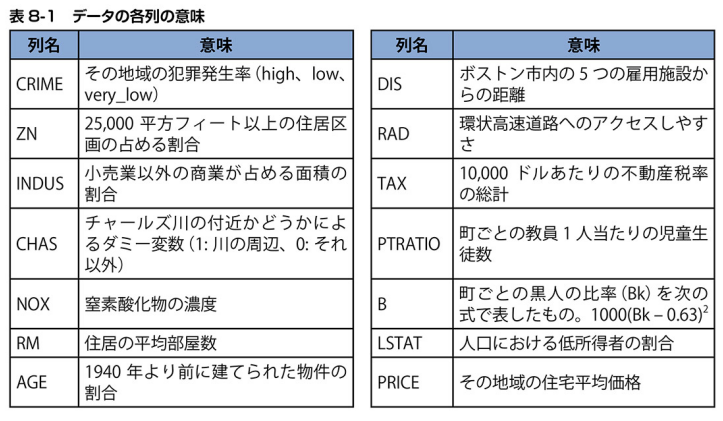
    


 ## データの前処理

 ### CSVファイルの読み込み

 #### ライブラリなどをインポートする


```python
import pandas as pd
#%matplotlib inline
from sklearn.linear_model import LinearRegression
from sklearn.model_selection import train_test_split
```

 #### Boston.csvを読み込む


```python
df = pd.read_csv(path + '/data/Boston.csv')
df.head(2)
```


<div>
<style scoped>
    .dataframe tbody tr th:only-of-type {
        vertical-align: middle;
    }

    .dataframe tbody tr th {
        vertical-align: top;
    }

    .dataframe thead th {
        text-align: right;
    }
</style>
<table border="1" class="dataframe">
  <thead>
    <tr style="text-align: right;">
      <th></th>
      <th>CRIME</th>
      <th>ZN</th>
      <th>INDUS</th>
      <th>CHAS</th>
      <th>NOX</th>
      <th>RM</th>
      <th>AGE</th>
      <th>DIS</th>
      <th>RAD</th>
      <th>TAX</th>
      <th>PTRATIO</th>
      <th>B</th>
      <th>LSTAT</th>
      <th>PRICE</th>
    </tr>
  </thead>
  <tbody>
    <tr>
      <th>0</th>
      <td>high</td>
      <td>0.0</td>
      <td>18.10</td>
      <td>0</td>
      <td>0.718</td>
      <td>3.561</td>
      <td>87.9</td>
      <td>1.6132</td>
      <td>24.0</td>
      <td>666</td>
      <td>20.2</td>
      <td>354.7</td>
      <td>7.12</td>
      <td>27.5</td>
    </tr>
    <tr>
      <th>1</th>
      <td>low</td>
      <td>0.0</td>
      <td>8.14</td>
      <td>0</td>
      <td>0.538</td>
      <td>5.950</td>
      <td>82.0</td>
      <td>3.9900</td>
      <td>4.0</td>
      <td>307</td>
      <td>21.0</td>
      <td>232.6</td>
      <td>27.71</td>
      <td>13.2</td>
    </tr>
  </tbody>
</table>
</div>


 ### ダミー変数化

 #### CRIME列にデータが何種類あるか調べる


```python
df['CRIME'].value_counts()
```


    very_low    50
    low         25
    high        25
    Name: CRIME, dtype: int64


 #### ダミー変数化した列を連結しCRIME列を削除


```python
crime = pd.get_dummies(df['CRIME'], drop_first=True)

df2 = pd.concat((df, crime), axis=1)
df2 = df2.drop('CRIME', axis=1)
df2.head(2)
```


<div>
<style scoped>
    .dataframe tbody tr th:only-of-type {
        vertical-align: middle;
    }

    .dataframe tbody tr th {
        vertical-align: top;
    }

    .dataframe thead th {
        text-align: right;
    }
</style>
<table border="1" class="dataframe">
  <thead>
    <tr style="text-align: right;">
      <th></th>
      <th>ZN</th>
      <th>INDUS</th>
      <th>CHAS</th>
      <th>NOX</th>
      <th>RM</th>
      <th>AGE</th>
      <th>DIS</th>
      <th>RAD</th>
      <th>TAX</th>
      <th>PTRATIO</th>
      <th>B</th>
      <th>LSTAT</th>
      <th>PRICE</th>
      <th>low</th>
      <th>very_low</th>
    </tr>
  </thead>
  <tbody>
    <tr>
      <th>0</th>
      <td>0.0</td>
      <td>18.10</td>
      <td>0</td>
      <td>0.718</td>
      <td>3.561</td>
      <td>87.9</td>
      <td>1.6132</td>
      <td>24.0</td>
      <td>666</td>
      <td>20.2</td>
      <td>354.7</td>
      <td>7.12</td>
      <td>27.5</td>
      <td>0</td>
      <td>0</td>
    </tr>
    <tr>
      <th>1</th>
      <td>0.0</td>
      <td>8.14</td>
      <td>0</td>
      <td>0.538</td>
      <td>5.950</td>
      <td>82.0</td>
      <td>3.9900</td>
      <td>4.0</td>
      <td>307</td>
      <td>21.0</td>
      <td>232.6</td>
      <td>27.71</td>
      <td>13.2</td>
      <td>1</td>
      <td>0</td>
    </tr>
  </tbody>
</table>
</div>


 ### 訓練データ、検証データ、テストデータの分割

 #### 訓練データ&検証データとテストデータに分割する


```python
train_val, test = train_test_split(df2, test_size=0.2, random_state=0)
```

 ### 欠損値の処理

 #### train_valの欠損値を確認する


```python
train_val.isnull().sum()
```


    ZN          0
    INDUS       0
    CHAS        0
    NOX         1
    RM          0
    AGE         0
    DIS         0
    RAD         0
    TAX         0
    PTRATIO     0
    B           0
    LSTAT       0
    PRICE       0
    low         0
    very_low    0
    dtype: int64


 #### 欠損値を平均値で穴埋めする


```python
train_val_mean = train_val.mean() # 各列の平均値の計算
train_val2 = train_val.fillna(train_val_mean) # 平均値で穴埋め
```

 ### 外れ値の処理

 #### 各特徴量の列とPRICE列の相関関係を示す散布図を描く


```python
colname = train_val2.columns
for name in colname:
    train_val2.plot(kind='scatter', x=name, y='PRICE')
```

    c:\Users\kakim\Projects\github\k2works\programing_introduce_2023\.venv\lib\site-packages\pandas\plotting\_matplotlib\core.py:1041: UserWarning: No data for colormapping provided via 'c'. Parameters 'cmap' will be ignored
      scatter = ax.scatter(
    


    
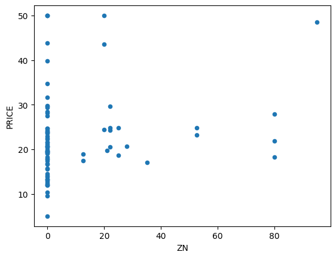
    


    
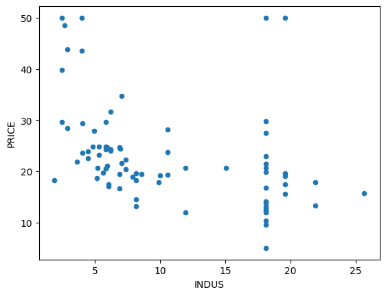
    


    
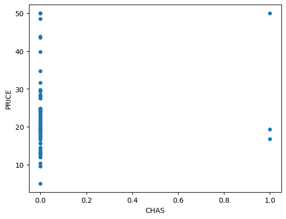
    


    
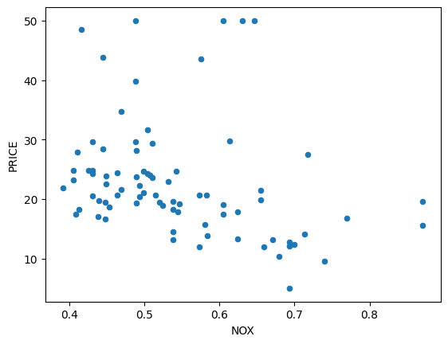
    


    
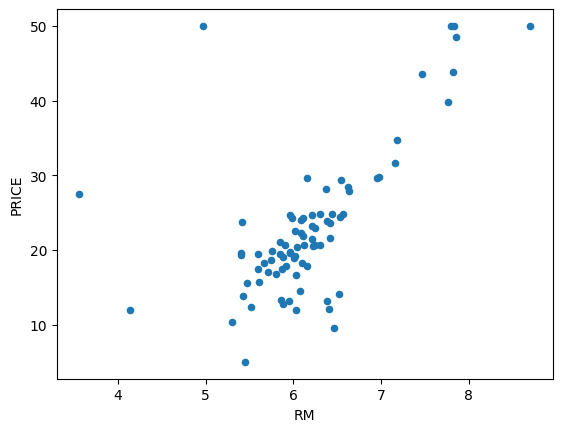
    


    
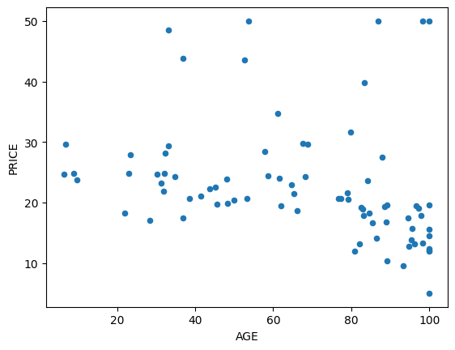
    


    
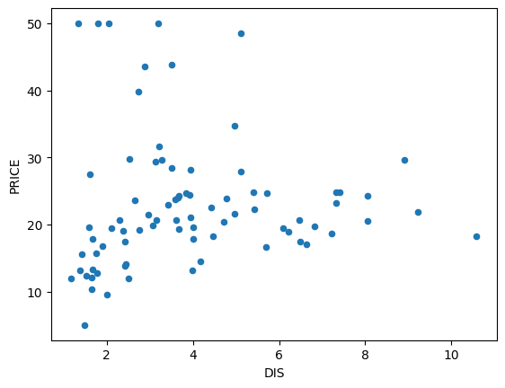
    


    
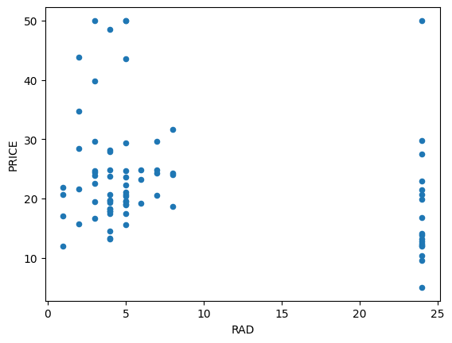
    


    
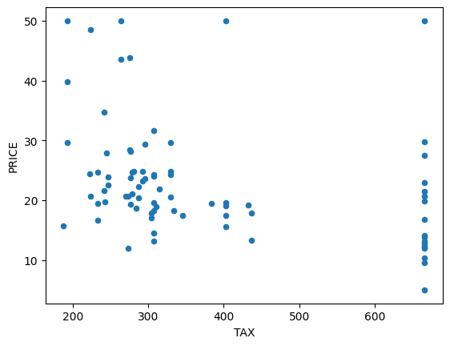
    


    
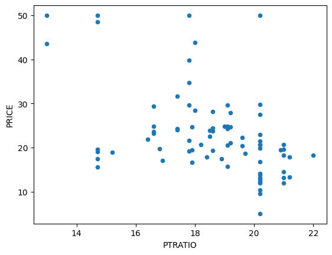
    


    
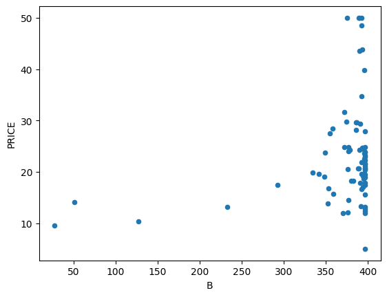
    


    
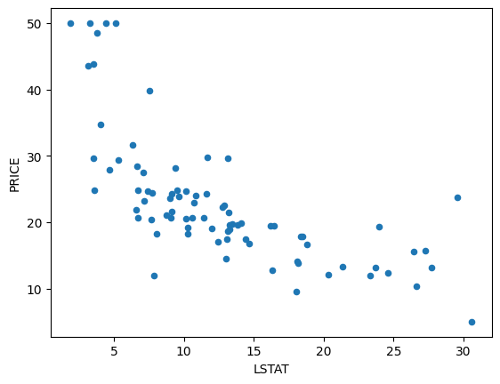
    


    
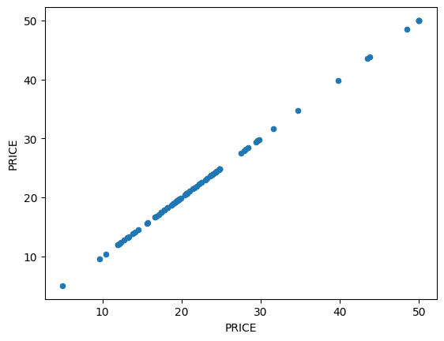
    


    
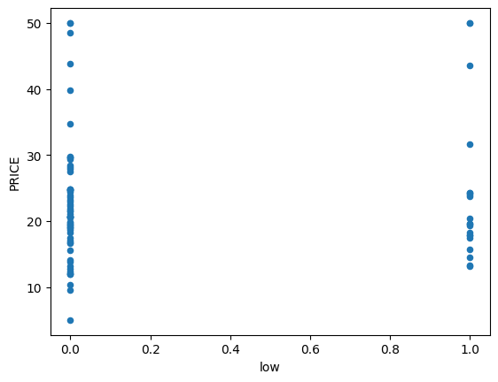
    


    
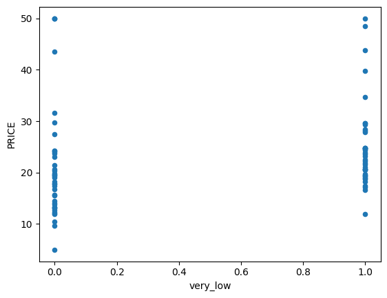
    


 #### 外れ値が存在するインデックスを確認する


```python
# RMの外れ値
out_line1 = train_val2[(train_val2['RM'] < 6) & (train_val2['PRICE'] > 40)].index
# PTRATIOの外れ値
out_line2 = train_val2[(train_val2['PTRATIO'] > 18) & (train_val2['PRICE'] > 40)].index

print(out_line1, out_line2)
```

    Int64Index([76], dtype='int64') Int64Index([76], dtype='int64')
    

 #### 外れ値を削除する


```python
train_val3 = train_val2.drop([76], axis=0)
```

 #### 絞り込んだ列以外を取り除く


```python
col = ['INDUS', 'NOX', 'RM', 'PTRATIO', 'LSTAT', 'PRICE']

train_val4 = train_val3[col]
train_val4.head(3)
```


<div>
<style scoped>
    .dataframe tbody tr th:only-of-type {
        vertical-align: middle;
    }

    .dataframe tbody tr th {
        vertical-align: top;
    }

    .dataframe thead th {
        text-align: right;
    }
</style>
<table border="1" class="dataframe">
  <thead>
    <tr style="text-align: right;">
      <th></th>
      <th>INDUS</th>
      <th>NOX</th>
      <th>RM</th>
      <th>PTRATIO</th>
      <th>LSTAT</th>
      <th>PRICE</th>
    </tr>
  </thead>
  <tbody>
    <tr>
      <th>43</th>
      <td>5.86</td>
      <td>0.431</td>
      <td>6.108</td>
      <td>19.1</td>
      <td>9.16</td>
      <td>24.3</td>
    </tr>
    <tr>
      <th>62</th>
      <td>5.86</td>
      <td>0.431</td>
      <td>6.957</td>
      <td>19.1</td>
      <td>3.53</td>
      <td>29.6</td>
    </tr>
    <tr>
      <th>3</th>
      <td>21.89</td>
      <td>0.624</td>
      <td>6.151</td>
      <td>21.2</td>
      <td>18.46</td>
      <td>17.8</td>
    </tr>
  </tbody>
</table>
</div>


 ### 相関係数による特徴量の絞り込み

 #### 列同士の相関係数を調べる


```python
train_val4.corr()
```


<div>
<style scoped>
    .dataframe tbody tr th:only-of-type {
        vertical-align: middle;
    }

    .dataframe tbody tr th {
        vertical-align: top;
    }

    .dataframe thead th {
        text-align: right;
    }
</style>
<table border="1" class="dataframe">
  <thead>
    <tr style="text-align: right;">
      <th></th>
      <th>INDUS</th>
      <th>NOX</th>
      <th>RM</th>
      <th>PTRATIO</th>
      <th>LSTAT</th>
      <th>PRICE</th>
    </tr>
  </thead>
  <tbody>
    <tr>
      <th>INDUS</th>
      <td>1.000000</td>
      <td>0.785722</td>
      <td>-0.403129</td>
      <td>0.249438</td>
      <td>0.578406</td>
      <td>-0.470889</td>
    </tr>
    <tr>
      <th>NOX</th>
      <td>0.785722</td>
      <td>1.000000</td>
      <td>-0.272996</td>
      <td>0.077533</td>
      <td>0.484295</td>
      <td>-0.325289</td>
    </tr>
    <tr>
      <th>RM</th>
      <td>-0.403129</td>
      <td>-0.272996</td>
      <td>1.000000</td>
      <td>-0.404568</td>
      <td>-0.560454</td>
      <td>0.753771</td>
    </tr>
    <tr>
      <th>PTRATIO</th>
      <td>0.249438</td>
      <td>0.077533</td>
      <td>-0.404568</td>
      <td>1.000000</td>
      <td>0.326563</td>
      <td>-0.542449</td>
    </tr>
    <tr>
      <th>LSTAT</th>
      <td>0.578406</td>
      <td>0.484295</td>
      <td>-0.560454</td>
      <td>0.326563</td>
      <td>1.000000</td>
      <td>-0.693490</td>
    </tr>
    <tr>
      <th>PRICE</th>
      <td>-0.470889</td>
      <td>-0.325289</td>
      <td>0.753771</td>
      <td>-0.542449</td>
      <td>-0.693490</td>
      <td>1.000000</td>
    </tr>
  </tbody>
</table>
</div>


 #### 各列とPRICE列との相関係数を見る


```python
train_cor = train_val4.corr()['PRICE']
train_cor
```


    INDUS     -0.470889
    NOX       -0.325289
    RM         0.753771
    PTRATIO   -0.542449
    LSTAT     -0.693490
    PRICE      1.000000
    Name: PRICE, dtype: float64


 #### abs関数で絶対値に変換


```python
print(abs(1)) # 1の絶対値を計算
print(abs(-2)) # -2の絶対値を計算
```

    1
    2
    

 #### mapメソッドで要素に関数を適用する


```python
se = pd.Series([1, 2, 3, 4, 5]) # シリーズの作成

# seの各要素にabs関数を適応させた結果をシリーズ化
se.map(abs)
```


    0    1
    1    2
    2    3
    3    4
    4    5
    dtype: int64


 #### 相関行列のPRICE列との相関係数を絶対値に変換する


```python
abs_cor = train_cor.map(abs)
abs_cor
```


    INDUS      0.470889
    NOX        0.325289
    RM         0.753771
    PTRATIO    0.542449
    LSTAT      0.693490
    PRICE      1.000000
    Name: PRICE, dtype: float64


 #### sort_valuesメソッドで要素を降順に並び替える


```python
# 降順に並べ替える
abs_cor.sort_values(ascending=False)
```


    PRICE      1.000000
    RM         0.753771
    LSTAT      0.693490
    PTRATIO    0.542449
    INDUS      0.470889
    NOX        0.325289
    Name: PRICE, dtype: float64


 ### 訓練データと検証データの分割

 #### 訓練データと検証データに分割する


```python
col = ['RM', 'LSTAT', 'PTRATIO']
x = train_val4[col]
t = train_val4[['PRICE']]

# 訓練データと検証データに分割する
x_train, x_val, y_train, y_val = train_test_split(x, t, test_size=0.2, random_state=0)
```

 ### データの標準化

 #### scikit-learnのpreprocessingモジュールを使う


```python
from sklearn.preprocessing import StandardScaler

sc_model_x = StandardScaler()
sc_model_x.fit(x_train)

# 各列のデータを標準化してsc_xに代入
sc_x = sc_model_x.transform(x_train)
sc_x # 表示
```


    array([[-0.10238334, -0.89546338, -0.97250163],
           [-0.11741281, -0.37386886,  1.21732721],
           [-0.92274224,  2.49984836,  0.83648742],
           [ 1.60346221, -1.37747891, -2.59107078],
           [-0.21134704, -0.36821472, -0.30603198],
           [ 0.28337322, -0.54632017, -0.87729168],
           [ 2.01927772, -1.55275729, -1.7817862 ],
           [-0.42551707, -0.58448562,  0.36043767],
           [-0.39420567,  0.21557535, -1.7817862 ],
           [-0.21886178, -0.00634969,  0.02720284],
           [-0.48438252,  0.24525959,  0.83648742],
           [ 0.02411475,  0.04453758,  0.83648742],
           [ 0.31092726, -1.31669689,  0.31283269],
           [ 2.08315299, -1.28559912, -1.7817862 ],
           [-0.98411261,  1.56550154,  0.07480782],
           [-0.28398951,  0.07704889, -0.78208173],
           [-0.9039554 ,  1.91040415, -1.7817862 ],
           [ 0.23828479,  1.52450902,  0.83648742],
           [-0.12993738, -0.28622968, -0.49645188],
           [-0.18629791, -0.73573389,  0.55085757],
           [-0.37917619,  0.48697412,  0.83648742],
           [ 0.9897586 , -0.17597392,  0.83648742],
           [ 0.02411475, -0.81489187, -0.87729168],
           [-3.29238966, -0.81771894,  0.83648742],
           [-1.10935824,  1.94150192,  0.83648742],
           [-0.0460228 ,  0.03464283, -0.30603198],
           [ 0.9609521 , -1.32517811,  0.31283269],
           [-0.83882767,  1.64748659,  0.83648742],
           [-0.22637651,  0.05160526, -1.54376133],
           [ 0.43617289, -0.73149329,  0.07480782],
           [-0.34535987,  0.76685411, -0.02040213],
           [-0.30027144,  2.0927502 ,  1.21732721],
           [-0.98411261,  0.05301879, -1.7817862 ],
           [-0.13369475, -0.01624444,  0.55085757],
           [ 3.14899334, -1.100426  , -2.59107078],
           [-0.38794338, -0.12367312, -1.7817862 ],
           [-0.10238334, -0.52935774,  0.31283269],
           [ 0.5451366 , -0.8841551 , -0.21082203],
           [ 0.33973375,  0.72727512,  0.83648742],
           [ 2.04182193, -1.31952396, -0.21082203],
           [-0.97409295,  2.35284069,  0.07480782],
           [ 0.26834374,  1.04673409,  0.83648742],
           [-0.20007493,  0.83329027, -0.25842701],
           [ 0.46998921, -0.47988401, -0.87729168],
           [-0.35663198, -0.20565816,  0.83648742],
           [ 0.1405932 , -0.87426035,  0.26522772],
           [-0.28148459,  0.13076323,  1.21732721],
           [ 1.21895811, -0.92514762, -0.49645188],
           [ 0.41989096,  0.7385834 ,  0.83648742],
           [ 0.06544581, -0.30601917,  0.83648742],
           [-0.28023214, -0.39224482,  0.36043767],
           [-0.60587079, -0.06713171, -0.73447676],
           [-0.20007493, -0.71029026,  1.21732721],
           [ 0.2896355 , -0.53218481, -0.30603198],
           [-0.42426462,  0.50393655,  1.16972224],
           [ 1.97293683, -0.75552339, -0.30603198],
           [-0.41674988,  1.18950116,  1.31253716],
           [-0.56203482,  0.03464283,  0.59846254],
           [ 0.15061285, -0.87001975,  0.83648742],
           [-2.56972234,  1.47503528,  0.83648742],
           [-0.95530611,  0.73999694,  0.83648742],
           [ 0.04540651, -0.38941775,  0.31283269],
           [ 1.24651215, -1.25450134, -0.30603198]])


 #### 平均値0を確認する


```python
# array型だと見づらいのでデータフレームに変換
tmp_df = pd.DataFrame(sc_x, columns=x_train.columns)
# 平均値の計算
tmp_df.mean()
```


    RM        -3.418782e-16
    LSTAT      1.445052e-16
    PTRATIO   -1.436241e-16
    dtype: float64


 #### 標準偏差1を確認する


```python
tmp_df.std() # 標準偏差の計算
```


    RM         1.008032
    LSTAT      1.008032
    PTRATIO    1.008032
    dtype: float64


 #### 正解データを標準化する


```python
sc_model_y = StandardScaler()
sc_model_y.fit(y_train)

sc_y = sc_model_y.transform(y_train)
```

 ## モデルの作成と学習

 #### 標準化したデータで学習させる


```python
model = LinearRegression()
model.fit(sc_x, sc_y) # 標準化済みの訓練データで学習
```


<style>#sk-container-id-7 {color: black;background-color: white;}#sk-container-id-7 pre{padding: 0;}#sk-container-id-7 div.sk-toggleable {background-color: white;}#sk-container-id-7 label.sk-toggleable__label {cursor: pointer;display: block;width: 100%;margin-bottom: 0;padding: 0.3em;box-sizing: border-box;text-align: center;}#sk-container-id-7 label.sk-toggleable__label-arrow:before {content: "▸";float: left;margin-right: 0.25em;color: #696969;}#sk-container-id-7 label.sk-toggleable__label-arrow:hover:before {color: black;}#sk-container-id-7 div.sk-estimator:hover label.sk-toggleable__label-arrow:before {color: black;}#sk-container-id-7 div.sk-toggleable__content {max-height: 0;max-width: 0;overflow: hidden;text-align: left;background-color: #f0f8ff;}#sk-container-id-7 div.sk-toggleable__content pre {margin: 0.2em;color: black;border-radius: 0.25em;background-color: #f0f8ff;}#sk-container-id-7 input.sk-toggleable__control:checked~div.sk-toggleable__content {max-height: 200px;max-width: 100%;overflow: auto;}#sk-container-id-7 input.sk-toggleable__control:checked~label.sk-toggleable__label-arrow:before {content: "▾";}#sk-container-id-7 div.sk-estimator input.sk-toggleable__control:checked~label.sk-toggleable__label {background-color: #d4ebff;}#sk-container-id-7 div.sk-label input.sk-toggleable__control:checked~label.sk-toggleable__label {background-color: #d4ebff;}#sk-container-id-7 input.sk-hidden--visually {border: 0;clip: rect(1px 1px 1px 1px);clip: rect(1px, 1px, 1px, 1px);height: 1px;margin: -1px;overflow: hidden;padding: 0;position: absolute;width: 1px;}#sk-container-id-7 div.sk-estimator {font-family: monospace;background-color: #f0f8ff;border: 1px dotted black;border-radius: 0.25em;box-sizing: border-box;margin-bottom: 0.5em;}#sk-container-id-7 div.sk-estimator:hover {background-color: #d4ebff;}#sk-container-id-7 div.sk-parallel-item::after {content: "";width: 100%;border-bottom: 1px solid gray;flex-grow: 1;}#sk-container-id-7 div.sk-label:hover label.sk-toggleable__label {background-color: #d4ebff;}#sk-container-id-7 div.sk-serial::before {content: "";position: absolute;border-left: 1px solid gray;box-sizing: border-box;top: 0;bottom: 0;left: 50%;z-index: 0;}#sk-container-id-7 div.sk-serial {display: flex;flex-direction: column;align-items: center;background-color: white;padding-right: 0.2em;padding-left: 0.2em;position: relative;}#sk-container-id-7 div.sk-item {position: relative;z-index: 1;}#sk-container-id-7 div.sk-parallel {display: flex;align-items: stretch;justify-content: center;background-color: white;position: relative;}#sk-container-id-7 div.sk-item::before, #sk-container-id-7 div.sk-parallel-item::before {content: "";position: absolute;border-left: 1px solid gray;box-sizing: border-box;top: 0;bottom: 0;left: 50%;z-index: -1;}#sk-container-id-7 div.sk-parallel-item {display: flex;flex-direction: column;z-index: 1;position: relative;background-color: white;}#sk-container-id-7 div.sk-parallel-item:first-child::after {align-self: flex-end;width: 50%;}#sk-container-id-7 div.sk-parallel-item:last-child::after {align-self: flex-start;width: 50%;}#sk-container-id-7 div.sk-parallel-item:only-child::after {width: 0;}#sk-container-id-7 div.sk-dashed-wrapped {border: 1px dashed gray;margin: 0 0.4em 0.5em 0.4em;box-sizing: border-box;padding-bottom: 0.4em;background-color: white;}#sk-container-id-7 div.sk-label label {font-family: monospace;font-weight: bold;display: inline-block;line-height: 1.2em;}#sk-container-id-7 div.sk-label-container {text-align: center;}#sk-container-id-7 div.sk-container {/* jupyter's `normalize.less` sets `[hidden] { display: none; }` but bootstrap.min.css set `[hidden] { display: none !important; }` so we also need the `!important` here to be able to override the default hidden behavior on the sphinx rendered scikit-learn.org. See: https://github.com/scikit-learn/scikit-learn/issues/21755 */display: inline-block !important;position: relative;}#sk-container-id-7 div.sk-text-repr-fallback {display: none;}</style><div id="sk-container-id-7" class="sk-top-container"><div class="sk-text-repr-fallback"><pre>LinearRegression()</pre><b>In a Jupyter environment, please rerun this cell to show the HTML representation or trust the notebook. <br />On GitHub, the HTML representation is unable to render, please try loading this page with nbviewer.org.</b></div><div class="sk-container" hidden><div class="sk-item"><div class="sk-estimator sk-toggleable"><input class="sk-toggleable__control sk-hidden--visually" id="sk-estimator-id-7" type="checkbox" checked><label for="sk-estimator-id-7" class="sk-toggleable__label sk-toggleable__label-arrow">LinearRegression</label><div class="sk-toggleable__content"><pre>LinearRegression()</pre></div></div></div></div></div>


 ## モデルの評価とチューニング

 ### 標準化データによる予測性能の評価

 #### scoreメソッドで決定係数を求める


```python
model.score(x_val, y_val)
```

    c:\Users\kakim\Projects\github\k2works\programing_introduce_2023\.venv\lib\site-packages\sklearn\base.py:432: UserWarning: X has feature names, but LinearRegression was fitted without feature names
      warnings.warn(
    


    -13.085044375040098


 #### 検証データを標準化する


```python
sc_x_val = sc_model_x.transform(x_val)
sc_y_val = sc_model_y.transform(y_val)
# 標準化した検証データで決定係数を計算
model.score(sc_x_val, sc_y_val)
```


    0.7359028880291


 #### 間違って検証データの平均値と標準偏差を使って標準化


```python
# 以下、やってはいけない間違いコード
sc_model_x2 = StandardScaler()
sc_model_x2.fit(x_val)
sc_x_val = sc_model_x2.transform(x_val)
sc_model_y2 = StandardScaler()
sc_model_y2.fit(y_val)
sc_y_val = sc_model_y2.transform(y_val)
model.score(sc_x_val, sc_y_val)
```


    0.791811786357224


 ### チューニングの目標と準備

 #### learn関数の定義


```python
def learn(x,t):
    x_train, x_val, y_train, y_val = train_test_split(x, t, test_size=0.2, random_state=0)
    # 訓練データを標準化
    sc_model_x = StandardScaler()
    sc_model_y = StandardScaler()
    sc_model_x.fit(x_train)
    sc_x_train = sc_model_x.transform(x_train)
    sc_model_y.fit(y_train)
    sc_y_train = sc_model_y.transform(y_train)
    # 学習
    model = LinearRegression()
    model.fit(sc_x_train, sc_y_train)

    # 検証データを標準化
    sc_x_val = sc_model_x.transform(x_val)
    sc_y_val = sc_model_y.transform(y_val)
    # 訓練データと検証データの決定係数計算
    train_score = model.score(sc_x_train, sc_y_train)
    val_score = model.score(sc_x_val, sc_y_val)

    return train_score, val_score
```

 #### learn関数を実行する


```python
x = train_val3.loc[:, ['RM', 'LSTAT', 'PTRATIO']]
t = train_val3[['PRICE']]

s1,s2 = learn(x,t)
print(s1, s2)
```

    0.7175897572515981 0.7359028880291
    

 ### 特徴量の追加

 #### 特徴量にINDUS列を追加する


```python
x = train_val3.loc[:, ['RM', 'LSTAT', 'PTRATIO', 'INDUS']]
t = train_val3[['PRICE']]
s1,s2 = learn(x,t)
print(s1, s2)
```

    0.7190252930186809 0.7295535344941491
    

 ### 特徴量エンジニアリング

 ### 多項式特徴量と多項式回帰

 #### データフレームのRM列のデータを2乗する


```python
x['RM'] ** 2
```


    43    37.307664
    62    48.399849
    3     37.834801
    71    37.307664
    45    35.557369
            ...    
    96    33.166081
    67    39.816100
    64    39.050001
    47    43.890625
    44    34.222500
    Name: RM, Length: 79, dtype: float64


 #### 新しい列を特徴量に追加する


```python
# RM2乗のシリーズを新しい列として追加
x['RM2'] = x['RM'] ** 2
# コード8-29で、INDUS列を追加したので削除
x = x.drop('INDUS', axis=1)
x.head(2)
```


<div>
<style scoped>
    .dataframe tbody tr th:only-of-type {
        vertical-align: middle;
    }

    .dataframe tbody tr th {
        vertical-align: top;
    }

    .dataframe thead th {
        text-align: right;
    }
</style>
<table border="1" class="dataframe">
  <thead>
    <tr style="text-align: right;">
      <th></th>
      <th>RM</th>
      <th>LSTAT</th>
      <th>PTRATIO</th>
      <th>RM2</th>
    </tr>
  </thead>
  <tbody>
    <tr>
      <th>43</th>
      <td>6.108</td>
      <td>9.16</td>
      <td>19.1</td>
      <td>37.307664</td>
    </tr>
    <tr>
      <th>62</th>
      <td>6.957</td>
      <td>3.53</td>
      <td>19.1</td>
      <td>48.399849</td>
    </tr>
  </tbody>
</table>
</div>


 #### 行を追加する


```python
# インデックスを2000として新しい行を追加
x.loc[2000] = [10,7,8,100]
print(x.tail(2)) # 確認

# 第8章の本筋に関係ないので削除
x = x.drop(2000, axis=0)
```

             RM  LSTAT  PTRATIO       RM2
    44     5.85   8.77     19.2   34.2225
    2000  10.00   7.00      8.0  100.0000
    

 #### 新しい列が追加されたので再学習を行う


```python
s1,s2 = learn(x,t)
print(s1, s2)
```

    0.8456207631185566 0.8372526287986779
    

 #### LSTAT列とPTRATIO列で新しい列を特徴量に追加する


```python
# LSTAT列の2乗を追加
x['LSTAT2'] = x['LSTAT'] ** 2
s1,s2 = learn(x,t)
print(s1, s2)

# PTRATIO列の2乗を追加
x['PTRATIO2'] = x['PTRATIO'] ** 2
s1,s2 = learn(x,t)
print(s1, s2)
```

    0.8565689444345093 0.8425282632102129
    0.864383498898444 0.8678022326740726
    

 ### 交互作用特徴量

 #### 2つのシリーズに算術演算を行う


```python
se1 = pd.Series([1,2,3])
se2 = pd.Series([10,20,30])
se1 + se2 # 対応する各要素を足し算したシリーズ
```


    0    11
    1    22
    2    33
    dtype: int64


 #### 交互作用特徴量を追加する


```python
x['RM * LSTAT'] = x['RM'] * x['LSTAT']
x.head(2)
```


<div>
<style scoped>
    .dataframe tbody tr th:only-of-type {
        vertical-align: middle;
    }

    .dataframe tbody tr th {
        vertical-align: top;
    }

    .dataframe thead th {
        text-align: right;
    }
</style>
<table border="1" class="dataframe">
  <thead>
    <tr style="text-align: right;">
      <th></th>
      <th>RM</th>
      <th>LSTAT</th>
      <th>PTRATIO</th>
      <th>RM2</th>
      <th>LSTAT2</th>
      <th>PTRATIO2</th>
      <th>RM * LSTAT</th>
    </tr>
  </thead>
  <tbody>
    <tr>
      <th>43</th>
      <td>6.108</td>
      <td>9.16</td>
      <td>19.1</td>
      <td>37.307664</td>
      <td>83.9056</td>
      <td>364.81</td>
      <td>55.94928</td>
    </tr>
    <tr>
      <th>62</th>
      <td>6.957</td>
      <td>3.53</td>
      <td>19.1</td>
      <td>48.399849</td>
      <td>12.4609</td>
      <td>364.81</td>
      <td>24.55821</td>
    </tr>
  </tbody>
</table>
</div>


 #### 交互作用特徴量を追加したので再学習を行う


```python
s1,s2 = learn(x,t)
print(s1, s2)
```

    0.8668534967796697 0.8739347357775972
    

 #### データの標準化後に再学習を行う


```python
# 訓練データと検証データを合わせて再学習させるので
# 再度、標準化する
sc_model_x2 = StandardScaler()
sc_model_x2.fit(x)
sc_x = sc_model_x2.transform(x)

sc_model_y2 = StandardScaler()
sc_model_y2.fit(t)
sc_y = sc_model_y2.transform(t)
model = LinearRegression()
model.fit(sc_x, sc_y)
```


<style>#sk-container-id-8 {color: black;background-color: white;}#sk-container-id-8 pre{padding: 0;}#sk-container-id-8 div.sk-toggleable {background-color: white;}#sk-container-id-8 label.sk-toggleable__label {cursor: pointer;display: block;width: 100%;margin-bottom: 0;padding: 0.3em;box-sizing: border-box;text-align: center;}#sk-container-id-8 label.sk-toggleable__label-arrow:before {content: "▸";float: left;margin-right: 0.25em;color: #696969;}#sk-container-id-8 label.sk-toggleable__label-arrow:hover:before {color: black;}#sk-container-id-8 div.sk-estimator:hover label.sk-toggleable__label-arrow:before {color: black;}#sk-container-id-8 div.sk-toggleable__content {max-height: 0;max-width: 0;overflow: hidden;text-align: left;background-color: #f0f8ff;}#sk-container-id-8 div.sk-toggleable__content pre {margin: 0.2em;color: black;border-radius: 0.25em;background-color: #f0f8ff;}#sk-container-id-8 input.sk-toggleable__control:checked~div.sk-toggleable__content {max-height: 200px;max-width: 100%;overflow: auto;}#sk-container-id-8 input.sk-toggleable__control:checked~label.sk-toggleable__label-arrow:before {content: "▾";}#sk-container-id-8 div.sk-estimator input.sk-toggleable__control:checked~label.sk-toggleable__label {background-color: #d4ebff;}#sk-container-id-8 div.sk-label input.sk-toggleable__control:checked~label.sk-toggleable__label {background-color: #d4ebff;}#sk-container-id-8 input.sk-hidden--visually {border: 0;clip: rect(1px 1px 1px 1px);clip: rect(1px, 1px, 1px, 1px);height: 1px;margin: -1px;overflow: hidden;padding: 0;position: absolute;width: 1px;}#sk-container-id-8 div.sk-estimator {font-family: monospace;background-color: #f0f8ff;border: 1px dotted black;border-radius: 0.25em;box-sizing: border-box;margin-bottom: 0.5em;}#sk-container-id-8 div.sk-estimator:hover {background-color: #d4ebff;}#sk-container-id-8 div.sk-parallel-item::after {content: "";width: 100%;border-bottom: 1px solid gray;flex-grow: 1;}#sk-container-id-8 div.sk-label:hover label.sk-toggleable__label {background-color: #d4ebff;}#sk-container-id-8 div.sk-serial::before {content: "";position: absolute;border-left: 1px solid gray;box-sizing: border-box;top: 0;bottom: 0;left: 50%;z-index: 0;}#sk-container-id-8 div.sk-serial {display: flex;flex-direction: column;align-items: center;background-color: white;padding-right: 0.2em;padding-left: 0.2em;position: relative;}#sk-container-id-8 div.sk-item {position: relative;z-index: 1;}#sk-container-id-8 div.sk-parallel {display: flex;align-items: stretch;justify-content: center;background-color: white;position: relative;}#sk-container-id-8 div.sk-item::before, #sk-container-id-8 div.sk-parallel-item::before {content: "";position: absolute;border-left: 1px solid gray;box-sizing: border-box;top: 0;bottom: 0;left: 50%;z-index: -1;}#sk-container-id-8 div.sk-parallel-item {display: flex;flex-direction: column;z-index: 1;position: relative;background-color: white;}#sk-container-id-8 div.sk-parallel-item:first-child::after {align-self: flex-end;width: 50%;}#sk-container-id-8 div.sk-parallel-item:last-child::after {align-self: flex-start;width: 50%;}#sk-container-id-8 div.sk-parallel-item:only-child::after {width: 0;}#sk-container-id-8 div.sk-dashed-wrapped {border: 1px dashed gray;margin: 0 0.4em 0.5em 0.4em;box-sizing: border-box;padding-bottom: 0.4em;background-color: white;}#sk-container-id-8 div.sk-label label {font-family: monospace;font-weight: bold;display: inline-block;line-height: 1.2em;}#sk-container-id-8 div.sk-label-container {text-align: center;}#sk-container-id-8 div.sk-container {/* jupyter's `normalize.less` sets `[hidden] { display: none; }` but bootstrap.min.css set `[hidden] { display: none !important; }` so we also need the `!important` here to be able to override the default hidden behavior on the sphinx rendered scikit-learn.org. See: https://github.com/scikit-learn/scikit-learn/issues/21755 */display: inline-block !important;position: relative;}#sk-container-id-8 div.sk-text-repr-fallback {display: none;}</style><div id="sk-container-id-8" class="sk-top-container"><div class="sk-text-repr-fallback"><pre>LinearRegression()</pre><b>In a Jupyter environment, please rerun this cell to show the HTML representation or trust the notebook. <br />On GitHub, the HTML representation is unable to render, please try loading this page with nbviewer.org.</b></div><div class="sk-container" hidden><div class="sk-item"><div class="sk-estimator sk-toggleable"><input class="sk-toggleable__control sk-hidden--visually" id="sk-estimator-id-8" type="checkbox" checked><label for="sk-estimator-id-8" class="sk-toggleable__label sk-toggleable__label-arrow">LinearRegression</label><div class="sk-toggleable__content"><pre>LinearRegression()</pre></div></div></div></div></div>


 ### テストデータでの評価

 #### テストデータの前処理


```python
test2 = test.fillna(train_val.mean()) # 欠損値を平均値で補完
x_test = test2.loc[:, ['RM', 'LSTAT', 'PTRATIO']]
y_test = test2[['PRICE']]

x_test['RM2'] = x_test['RM'] ** 2
x_test['LSTAT2'] = x_test['LSTAT'] ** 2
x_test['PTRATIO2'] = x_test['PTRATIO'] ** 2

x_test['RM * LSTAT'] = x_test['RM'] * x_test['LSTAT']

sc_x_test = sc_model_x2.transform(x_test)
sc_y_test = sc_model_y2.transform(y_test)
```

 #### 決定係数を計算する


```python
model.score(sc_x_test, sc_y_test)
```


    0.7649249353669053


 ### モデルの保存

 #### モデルを保存する


```python
import pickle
with open(path + '/data/boston.pkl', mode='wb') as fp:
    pickle.dump(model, fp)
with open(path + '/data/boston_scx.pkl', mode='wb') as fp:
    pickle.dump(sc_model_x2, fp)
with open(path + '/data/boston_scy.pkl', mode='wb') as fp:
    pickle.dump(sc_model_y2, fp)
```


```python
doctest.testmod(verbose=True)
unittest.main(argv=[''], verbosity=2, exit=False)
```

    4 items had no tests:
        __main__
        __main__.__VSCODE_compute_hash
        __main__.__VSCODE_wrap_run_cell
        __main__.learn
    0 tests in 4 items.
    0 passed and 0 failed.
    Test passed.
    

    
    ----------------------------------------------------------------------
    Ran 0 tests in 0.000s
    
    OK
    


    <unittest.main.TestProgram at 0x1fed4631460>


