 # 練習問題:金融機関のキャンペーン分析


```python
import unittest
import doctest
import os
path = os.path.dirname(os.path.abspath(__file__))

import matplotlib.pyplot as plt
import seaborn as sns
from sklearn import tree
from sklearn.tree import plot_tree

# データの可視化設定
plot_on = True

def new_df():
    """データフレームの作成"""
    df = pd.read_csv(path + '/data/Bank.csv', sep=',')
    return df

def plot_df(df):
    def plot_df_hist():
        """データの分布確認"""
        df.hist(figsize=(10, 10))
        plt.show()

    def plot_df_boxplot():
        """データの外れ値確認"""
        df.boxplot(figsize=(10, 10))
        plt.show()

    def plot_df_pairplot():
        """データの可視化"""
        sns.set()
        sns.pairplot(df, hue='y')
        plt.show()

    def exec_all(on=True):
        if on:
            plot_df_hist()
            plot_df_boxplot()
            plot_df_pairplot()

    return exec_all

# x:特徴量 t:正解データ depth:木の深さ
def learn(x, t, depth=3):
    """決定木による学習"""
    x_train, x_test, y_train, y_test = train_test_split(x, t, test_size=0.2, random_state=0)

    model = tree.DecisionTreeClassifier(max_depth=depth, random_state=0, class_weight='balanced')
    model.fit(x_train, y_train)

    score = model.score(X = x_train, y = y_train)
    score2 = model.score(X = x_test, y = y_test)
    return round(score, 3), round(score2, 3), model

def check_learn(x, t, depth=14):
    """学習の確認"""
    for j in range(1, depth + 1): # jは木の深さ（1～14が入る）
    # xは特徴量、tは正解データ
        train_score, test_score, model = learn(x, t, depth=j)
        sentence = '訓練データの正解率{}:'
        sentence2 = 'テストデータの正解率{}'
        total_sentence = '深さ{}:' + sentence + sentence2
        print(total_sentence.format(j, train_score, test_score))

class CategoricalData:
    def __init__(self, df, col) -> None:
        self.df = df
        self.col = col

    def show(self):
        """カテゴリーデータの値の数を確認"""
        return self.df[self.col].value_counts()

    def plot(self):
        """カテゴリーデータの値の数を棒グラフで確認"""
        return self.df[self.col].value_counts().plot(kind='bar')

    def convert(self):
        """カテゴリーデータを数値に変換"""
        from sklearn.preprocessing import LabelEncoder

        encoder = LabelEncoder()
        self.df[self.col] = encoder.fit_transform(self.df[self.col])

    def pivot(self, value):
        """ピボットテーブルによる集計"""
        return self.df.pivot_table(index='y', columns=self.col, values=value, aggfunc='count')

    def dummy(self):
        """ダミー変数化"""
        return pd.get_dummies(self.df, columns=[self.col])
```

 ## データの内容
 |列名|意味|
 |:--|:--|
 |id|顧客ID|
 |age|年齢|
 |job|職種|
 |education|最終学歴|
 |marital|既婚／未婚／離別など
 |loan|個人ローンの有無|
 |housing|住宅ローンの有無|
 |amount|年間キャンペーン終了時点での、総投資信託購入額|
 |default|債務不履行の有無|
 |previous|キャンペーン前に接触した回数|
 |campaign|現キャンペーン内での接触回数|
 |day|最終接触日|
 |month|最終接触月|
 |duration|接触時のへ平均時間（秒）|
 |y|今回のキャンペーンの結果（1:購入、0:未購入|

 ## 問題背景
 スッキリ銀行は、預貯金や融資のほかに、投資信託商品の販売も行っていますが、購入顧客数や顧客一人あたりの平均購入金額は伸び悩んでいます。

 そこで、昨年度の1年間はテレアポや資料の郵送など、銀行側から顧客に接触を図る各種のキャンペーンを実施しました。初の年間キャンペーンでもあり、さまざまな顧客に手あたり次第接触を試みましたが、次回のキャンペーンでは昨年得られたデータを生かして、もっと効率よく実施したいと考えています。

 さて、スッキリ銀行の課題を解決するためには、行ったキャンペーンが効果的だったか検証する必要があります。また、どうゆう顧客が購入してくれたのか、顧客特性の考察も必要です。

 ## データ分析の方法検討

 ### CSVファイルの読み込み


```python
import pandas as pd
df = pd.read_csv(path + '/data/Bank.csv', sep=',')
df.head()
```


<div>
<style scoped>
    .dataframe tbody tr th:only-of-type {
        vertical-align: middle;
    }

    .dataframe tbody tr th {
        vertical-align: top;
    }

    .dataframe thead th {
        text-align: right;
    }
</style>
<table border="1" class="dataframe">
  <thead>
    <tr style="text-align: right;">
      <th></th>
      <th>id</th>
      <th>age</th>
      <th>job</th>
      <th>marital</th>
      <th>education</th>
      <th>default</th>
      <th>amount</th>
      <th>housing</th>
      <th>loan</th>
      <th>contact</th>
      <th>day</th>
      <th>month</th>
      <th>duration</th>
      <th>campaign</th>
      <th>previous</th>
      <th>y</th>
    </tr>
  </thead>
  <tbody>
    <tr>
      <th>0</th>
      <td>1</td>
      <td>39</td>
      <td>blue-collar</td>
      <td>married</td>
      <td>secondary</td>
      <td>no</td>
      <td>1756.0</td>
      <td>yes</td>
      <td>no</td>
      <td>cellular</td>
      <td>3</td>
      <td>apr</td>
      <td>370.055237</td>
      <td>1</td>
      <td>0</td>
      <td>1</td>
    </tr>
    <tr>
      <th>1</th>
      <td>2</td>
      <td>51</td>
      <td>entrepreneur</td>
      <td>married</td>
      <td>primary</td>
      <td>no</td>
      <td>1443.0</td>
      <td>no</td>
      <td>no</td>
      <td>cellular</td>
      <td>18</td>
      <td>feb</td>
      <td>233.998933</td>
      <td>10</td>
      <td>0</td>
      <td>1</td>
    </tr>
    <tr>
      <th>2</th>
      <td>3</td>
      <td>36</td>
      <td>management</td>
      <td>single</td>
      <td>tertiary</td>
      <td>no</td>
      <td>436.0</td>
      <td>no</td>
      <td>no</td>
      <td>cellular</td>
      <td>13</td>
      <td>apr</td>
      <td>NaN</td>
      <td>1</td>
      <td>2</td>
      <td>0</td>
    </tr>
    <tr>
      <th>3</th>
      <td>4</td>
      <td>63</td>
      <td>retired</td>
      <td>married</td>
      <td>secondary</td>
      <td>no</td>
      <td>474.0</td>
      <td>no</td>
      <td>no</td>
      <td>cellular</td>
      <td>25</td>
      <td>jan</td>
      <td>252.525808</td>
      <td>1</td>
      <td>0</td>
      <td>0</td>
    </tr>
    <tr>
      <th>4</th>
      <td>5</td>
      <td>31</td>
      <td>management</td>
      <td>single</td>
      <td>tertiary</td>
      <td>no</td>
      <td>354.0</td>
      <td>no</td>
      <td>no</td>
      <td>cellular</td>
      <td>30</td>
      <td>apr</td>
      <td>NaN</td>
      <td>1</td>
      <td>2</td>
      <td>0</td>
    </tr>
  </tbody>
</table>
</div>


 ### データの概要確認


```python
df.info()
```

    <class 'pandas.core.frame.DataFrame'>
    RangeIndex: 27128 entries, 0 to 27127
    Data columns (total 16 columns):
     #   Column     Non-Null Count  Dtype  
    ---  ------     --------------  -----  
     0   id         27128 non-null  int64  
     1   age        27128 non-null  int64  
     2   job        27128 non-null  object 
     3   marital    27128 non-null  object 
     4   education  27128 non-null  object 
     5   default    27128 non-null  object 
     6   amount     27128 non-null  float64
     7   housing    27128 non-null  object 
     8   loan       27128 non-null  object 
     9   contact    27128 non-null  object 
     10  day        27128 non-null  int64  
     11  month      27128 non-null  object 
     12  duration   20084 non-null  float64
     13  campaign   27128 non-null  int64  
     14  previous   27128 non-null  int64  
     15  y          27128 non-null  int64  
    dtypes: float64(2), int64(6), object(8)
    memory usage: 3.3+ MB
    

 ### データの統計量確認


```python
df.describe()
```


<div>
<style scoped>
    .dataframe tbody tr th:only-of-type {
        vertical-align: middle;
    }

    .dataframe tbody tr th {
        vertical-align: top;
    }

    .dataframe thead th {
        text-align: right;
    }
</style>
<table border="1" class="dataframe">
  <thead>
    <tr style="text-align: right;">
      <th></th>
      <th>id</th>
      <th>age</th>
      <th>amount</th>
      <th>day</th>
      <th>duration</th>
      <th>campaign</th>
      <th>previous</th>
      <th>y</th>
    </tr>
  </thead>
  <tbody>
    <tr>
      <th>count</th>
      <td>27128.000000</td>
      <td>27128.000000</td>
      <td>27128.000000</td>
      <td>27128.000000</td>
      <td>20084.000000</td>
      <td>27128.000000</td>
      <td>27128.000000</td>
      <td>27128.000000</td>
    </tr>
    <tr>
      <th>mean</th>
      <td>13564.500000</td>
      <td>40.951010</td>
      <td>1345.660830</td>
      <td>15.806215</td>
      <td>318.222068</td>
      <td>2.751769</td>
      <td>0.579733</td>
      <td>0.320075</td>
    </tr>
    <tr>
      <th>std</th>
      <td>7831.323388</td>
      <td>10.608542</td>
      <td>2992.015091</td>
      <td>8.337904</td>
      <td>81.871200</td>
      <td>3.126594</td>
      <td>2.503653</td>
      <td>0.466514</td>
    </tr>
    <tr>
      <th>min</th>
      <td>1.000000</td>
      <td>18.000000</td>
      <td>-6847.000000</td>
      <td>1.000000</td>
      <td>19.038719</td>
      <td>1.000000</td>
      <td>0.000000</td>
      <td>0.000000</td>
    </tr>
    <tr>
      <th>25%</th>
      <td>6782.750000</td>
      <td>33.000000</td>
      <td>75.000000</td>
      <td>8.000000</td>
      <td>260.279269</td>
      <td>1.000000</td>
      <td>0.000000</td>
      <td>0.000000</td>
    </tr>
    <tr>
      <th>50%</th>
      <td>13564.500000</td>
      <td>39.000000</td>
      <td>449.000000</td>
      <td>16.000000</td>
      <td>314.708107</td>
      <td>2.000000</td>
      <td>0.000000</td>
      <td>0.000000</td>
    </tr>
    <tr>
      <th>75%</th>
      <td>20346.250000</td>
      <td>48.000000</td>
      <td>1405.250000</td>
      <td>21.000000</td>
      <td>369.829530</td>
      <td>3.000000</td>
      <td>0.000000</td>
      <td>1.000000</td>
    </tr>
    <tr>
      <th>max</th>
      <td>27128.000000</td>
      <td>95.000000</td>
      <td>102127.000000</td>
      <td>31.000000</td>
      <td>1435.488040</td>
      <td>63.000000</td>
      <td>275.000000</td>
      <td>1.000000</td>
    </tr>
  </tbody>
</table>
</div>


 ### データの特徴量の相関確認


```python
df.corr()
```


<div>
<style scoped>
    .dataframe tbody tr th:only-of-type {
        vertical-align: middle;
    }

    .dataframe tbody tr th {
        vertical-align: top;
    }

    .dataframe thead th {
        text-align: right;
    }
</style>
<table border="1" class="dataframe">
  <thead>
    <tr style="text-align: right;">
      <th></th>
      <th>id</th>
      <th>age</th>
      <th>amount</th>
      <th>day</th>
      <th>duration</th>
      <th>campaign</th>
      <th>previous</th>
      <th>y</th>
    </tr>
  </thead>
  <tbody>
    <tr>
      <th>id</th>
      <td>1.000000</td>
      <td>-0.005716</td>
      <td>-0.000719</td>
      <td>0.002974</td>
      <td>0.007790</td>
      <td>0.016867</td>
      <td>-0.005425</td>
      <td>0.001353</td>
    </tr>
    <tr>
      <th>age</th>
      <td>-0.005716</td>
      <td>1.000000</td>
      <td>0.094546</td>
      <td>-0.008518</td>
      <td>0.207467</td>
      <td>-0.001340</td>
      <td>0.002946</td>
      <td>0.093856</td>
    </tr>
    <tr>
      <th>amount</th>
      <td>-0.000719</td>
      <td>0.094546</td>
      <td>1.000000</td>
      <td>0.002127</td>
      <td>-0.034113</td>
      <td>-0.016176</td>
      <td>0.012239</td>
      <td>-0.009768</td>
    </tr>
    <tr>
      <th>day</th>
      <td>0.002974</td>
      <td>-0.008518</td>
      <td>0.002127</td>
      <td>1.000000</td>
      <td>-0.024676</td>
      <td>0.164880</td>
      <td>-0.050009</td>
      <td>0.023500</td>
    </tr>
    <tr>
      <th>duration</th>
      <td>0.007790</td>
      <td>0.207467</td>
      <td>-0.034113</td>
      <td>-0.024676</td>
      <td>1.000000</td>
      <td>-0.024244</td>
      <td>0.137363</td>
      <td>0.275922</td>
    </tr>
    <tr>
      <th>campaign</th>
      <td>0.016867</td>
      <td>-0.001340</td>
      <td>-0.016176</td>
      <td>0.164880</td>
      <td>-0.024244</td>
      <td>1.000000</td>
      <td>-0.031557</td>
      <td>0.145963</td>
    </tr>
    <tr>
      <th>previous</th>
      <td>-0.005425</td>
      <td>0.002946</td>
      <td>0.012239</td>
      <td>-0.050009</td>
      <td>0.137363</td>
      <td>-0.031557</td>
      <td>1.000000</td>
      <td>0.022762</td>
    </tr>
    <tr>
      <th>y</th>
      <td>0.001353</td>
      <td>0.093856</td>
      <td>-0.009768</td>
      <td>0.023500</td>
      <td>0.275922</td>
      <td>0.145963</td>
      <td>0.022762</td>
      <td>1.000000</td>
    </tr>
  </tbody>
</table>
</div>


 ### データの特徴量確認


```python
df.columns
```


    Index(['id', 'age', 'job', 'marital', 'education', 'default', 'amount',
           'housing', 'loan', 'contact', 'day', 'month', 'duration', 'campaign',
           'previous', 'y'],
          dtype='object')


 ### データの数値変数確認


```python
df.select_dtypes(include='number').columns
```


    Index(['id', 'age', 'amount', 'day', 'duration', 'campaign', 'previous', 'y'], dtype='object')


 ### データのカテゴリカル変数確認


```python
df.select_dtypes(include='object').columns
```


    Index(['job', 'marital', 'education', 'default', 'housing', 'loan', 'contact',
           'month'],
          dtype='object')


 ### 職種カテゴリ


```python
job = CategoricalData(df, 'job')
```

 ### 職種カテゴリ確認


```python
job.show()
```


    blue-collar      5886
    management       5620
    technician       4491
    admin.           3085
    services         2506
    retired          1391
    self-employed     945
    entrepreneur      914
    unemployed        790
    housemaid         765
    student           557
    unknown           178
    Name: job, dtype: int64


```python
job.plot()
```


    <Axes: >


    
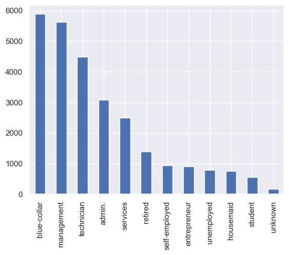
    


 #### カテゴリーデータを数値に変換


```python
job.convert()
job.plot()
```


    <Axes: >


    
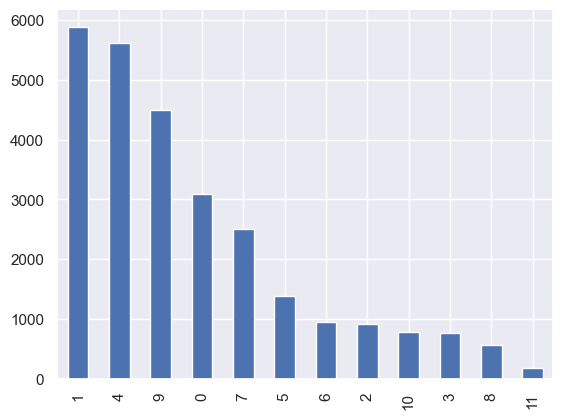
    


 #### ピボットテーブルによる集計


```python
job.pivot('id')
```


<div>
<style scoped>
    .dataframe tbody tr th:only-of-type {
        vertical-align: middle;
    }

    .dataframe tbody tr th {
        vertical-align: top;
    }

    .dataframe thead th {
        text-align: right;
    }
</style>
<table border="1" class="dataframe">
  <thead>
    <tr style="text-align: right;">
      <th>job</th>
      <th>0</th>
      <th>1</th>
      <th>2</th>
      <th>3</th>
      <th>4</th>
      <th>5</th>
      <th>6</th>
      <th>7</th>
      <th>8</th>
      <th>9</th>
      <th>10</th>
      <th>11</th>
    </tr>
    <tr>
      <th>y</th>
      <th></th>
      <th></th>
      <th></th>
      <th></th>
      <th></th>
      <th></th>
      <th></th>
      <th></th>
      <th></th>
      <th></th>
      <th></th>
      <th></th>
    </tr>
  </thead>
  <tbody>
    <tr>
      <th>0</th>
      <td>2138</td>
      <td>3796</td>
      <td>567</td>
      <td>549</td>
      <td>3900</td>
      <td>881</td>
      <td>659</td>
      <td>1676</td>
      <td>468</td>
      <td>3094</td>
      <td>591</td>
      <td>126</td>
    </tr>
    <tr>
      <th>1</th>
      <td>947</td>
      <td>2090</td>
      <td>347</td>
      <td>216</td>
      <td>1720</td>
      <td>510</td>
      <td>286</td>
      <td>830</td>
      <td>89</td>
      <td>1397</td>
      <td>199</td>
      <td>52</td>
    </tr>
  </tbody>
</table>
</div>


 ### ダミー変数化


```python
#job.dummy()
df = job.dummy()
df.head()
```


<div>
<style scoped>
    .dataframe tbody tr th:only-of-type {
        vertical-align: middle;
    }

    .dataframe tbody tr th {
        vertical-align: top;
    }

    .dataframe thead th {
        text-align: right;
    }
</style>
<table border="1" class="dataframe">
  <thead>
    <tr style="text-align: right;">
      <th></th>
      <th>id</th>
      <th>age</th>
      <th>marital</th>
      <th>education</th>
      <th>default</th>
      <th>amount</th>
      <th>housing</th>
      <th>loan</th>
      <th>contact</th>
      <th>day</th>
      <th>...</th>
      <th>job_2</th>
      <th>job_3</th>
      <th>job_4</th>
      <th>job_5</th>
      <th>job_6</th>
      <th>job_7</th>
      <th>job_8</th>
      <th>job_9</th>
      <th>job_10</th>
      <th>job_11</th>
    </tr>
  </thead>
  <tbody>
    <tr>
      <th>0</th>
      <td>1</td>
      <td>39</td>
      <td>married</td>
      <td>secondary</td>
      <td>no</td>
      <td>1756.0</td>
      <td>yes</td>
      <td>no</td>
      <td>cellular</td>
      <td>3</td>
      <td>...</td>
      <td>0</td>
      <td>0</td>
      <td>0</td>
      <td>0</td>
      <td>0</td>
      <td>0</td>
      <td>0</td>
      <td>0</td>
      <td>0</td>
      <td>0</td>
    </tr>
    <tr>
      <th>1</th>
      <td>2</td>
      <td>51</td>
      <td>married</td>
      <td>primary</td>
      <td>no</td>
      <td>1443.0</td>
      <td>no</td>
      <td>no</td>
      <td>cellular</td>
      <td>18</td>
      <td>...</td>
      <td>1</td>
      <td>0</td>
      <td>0</td>
      <td>0</td>
      <td>0</td>
      <td>0</td>
      <td>0</td>
      <td>0</td>
      <td>0</td>
      <td>0</td>
    </tr>
    <tr>
      <th>2</th>
      <td>3</td>
      <td>36</td>
      <td>single</td>
      <td>tertiary</td>
      <td>no</td>
      <td>436.0</td>
      <td>no</td>
      <td>no</td>
      <td>cellular</td>
      <td>13</td>
      <td>...</td>
      <td>0</td>
      <td>0</td>
      <td>1</td>
      <td>0</td>
      <td>0</td>
      <td>0</td>
      <td>0</td>
      <td>0</td>
      <td>0</td>
      <td>0</td>
    </tr>
    <tr>
      <th>3</th>
      <td>4</td>
      <td>63</td>
      <td>married</td>
      <td>secondary</td>
      <td>no</td>
      <td>474.0</td>
      <td>no</td>
      <td>no</td>
      <td>cellular</td>
      <td>25</td>
      <td>...</td>
      <td>0</td>
      <td>0</td>
      <td>0</td>
      <td>1</td>
      <td>0</td>
      <td>0</td>
      <td>0</td>
      <td>0</td>
      <td>0</td>
      <td>0</td>
    </tr>
    <tr>
      <th>4</th>
      <td>5</td>
      <td>31</td>
      <td>single</td>
      <td>tertiary</td>
      <td>no</td>
      <td>354.0</td>
      <td>no</td>
      <td>no</td>
      <td>cellular</td>
      <td>30</td>
      <td>...</td>
      <td>0</td>
      <td>0</td>
      <td>1</td>
      <td>0</td>
      <td>0</td>
      <td>0</td>
      <td>0</td>
      <td>0</td>
      <td>0</td>
      <td>0</td>
    </tr>
  </tbody>
</table>
<p>5 rows × 27 columns</p>
</div>


 ### 最終学歴カテゴリ確認


```python
education = CategoricalData(df, 'education')
```


```python
education.show()
```


    secondary    13882
    tertiary      7959
    primary       4150
    unknown       1137
    Name: education, dtype: int64


```python
education.plot()
```


    <Axes: >


    
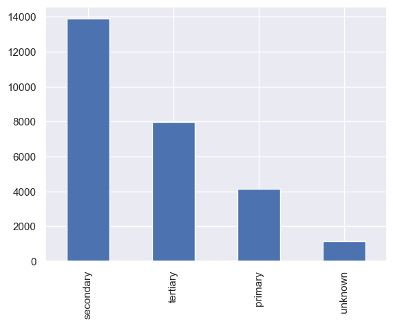
    


 #### カテゴリーデータを数値に変換


```python
education.convert()
education.plot()
```


    <Axes: >


    
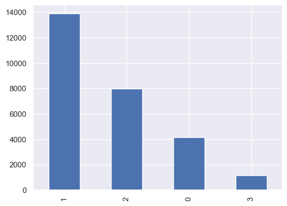
    


 #### ピボットテーブルによる集計


```python
education.pivot('id')
```


<div>
<style scoped>
    .dataframe tbody tr th:only-of-type {
        vertical-align: middle;
    }

    .dataframe tbody tr th {
        vertical-align: top;
    }

    .dataframe thead th {
        text-align: right;
    }
</style>
<table border="1" class="dataframe">
  <thead>
    <tr style="text-align: right;">
      <th>education</th>
      <th>0</th>
      <th>1</th>
      <th>2</th>
      <th>3</th>
    </tr>
    <tr>
      <th>y</th>
      <th></th>
      <th></th>
      <th></th>
      <th></th>
    </tr>
  </thead>
  <tbody>
    <tr>
      <th>0</th>
      <td>2691</td>
      <td>9445</td>
      <td>5574</td>
      <td>735</td>
    </tr>
    <tr>
      <th>1</th>
      <td>1459</td>
      <td>4437</td>
      <td>2385</td>
      <td>402</td>
    </tr>
  </tbody>
</table>
</div>


 ### ダミー変数化


```python
df = education.dummy()
df.head()
```


<div>
<style scoped>
    .dataframe tbody tr th:only-of-type {
        vertical-align: middle;
    }

    .dataframe tbody tr th {
        vertical-align: top;
    }

    .dataframe thead th {
        text-align: right;
    }
</style>
<table border="1" class="dataframe">
  <thead>
    <tr style="text-align: right;">
      <th></th>
      <th>id</th>
      <th>age</th>
      <th>marital</th>
      <th>default</th>
      <th>amount</th>
      <th>housing</th>
      <th>loan</th>
      <th>contact</th>
      <th>day</th>
      <th>month</th>
      <th>...</th>
      <th>job_6</th>
      <th>job_7</th>
      <th>job_8</th>
      <th>job_9</th>
      <th>job_10</th>
      <th>job_11</th>
      <th>education_0</th>
      <th>education_1</th>
      <th>education_2</th>
      <th>education_3</th>
    </tr>
  </thead>
  <tbody>
    <tr>
      <th>0</th>
      <td>1</td>
      <td>39</td>
      <td>married</td>
      <td>no</td>
      <td>1756.0</td>
      <td>yes</td>
      <td>no</td>
      <td>cellular</td>
      <td>3</td>
      <td>apr</td>
      <td>...</td>
      <td>0</td>
      <td>0</td>
      <td>0</td>
      <td>0</td>
      <td>0</td>
      <td>0</td>
      <td>0</td>
      <td>1</td>
      <td>0</td>
      <td>0</td>
    </tr>
    <tr>
      <th>1</th>
      <td>2</td>
      <td>51</td>
      <td>married</td>
      <td>no</td>
      <td>1443.0</td>
      <td>no</td>
      <td>no</td>
      <td>cellular</td>
      <td>18</td>
      <td>feb</td>
      <td>...</td>
      <td>0</td>
      <td>0</td>
      <td>0</td>
      <td>0</td>
      <td>0</td>
      <td>0</td>
      <td>1</td>
      <td>0</td>
      <td>0</td>
      <td>0</td>
    </tr>
    <tr>
      <th>2</th>
      <td>3</td>
      <td>36</td>
      <td>single</td>
      <td>no</td>
      <td>436.0</td>
      <td>no</td>
      <td>no</td>
      <td>cellular</td>
      <td>13</td>
      <td>apr</td>
      <td>...</td>
      <td>0</td>
      <td>0</td>
      <td>0</td>
      <td>0</td>
      <td>0</td>
      <td>0</td>
      <td>0</td>
      <td>0</td>
      <td>1</td>
      <td>0</td>
    </tr>
    <tr>
      <th>3</th>
      <td>4</td>
      <td>63</td>
      <td>married</td>
      <td>no</td>
      <td>474.0</td>
      <td>no</td>
      <td>no</td>
      <td>cellular</td>
      <td>25</td>
      <td>jan</td>
      <td>...</td>
      <td>0</td>
      <td>0</td>
      <td>0</td>
      <td>0</td>
      <td>0</td>
      <td>0</td>
      <td>0</td>
      <td>1</td>
      <td>0</td>
      <td>0</td>
    </tr>
    <tr>
      <th>4</th>
      <td>5</td>
      <td>31</td>
      <td>single</td>
      <td>no</td>
      <td>354.0</td>
      <td>no</td>
      <td>no</td>
      <td>cellular</td>
      <td>30</td>
      <td>apr</td>
      <td>...</td>
      <td>0</td>
      <td>0</td>
      <td>0</td>
      <td>0</td>
      <td>0</td>
      <td>0</td>
      <td>0</td>
      <td>0</td>
      <td>1</td>
      <td>0</td>
    </tr>
  </tbody>
</table>
<p>5 rows × 30 columns</p>
</div>


 ### 既婚／未婚／離別カテゴリ確認


```python
marital = CategoricalData(df, 'marital')
```


```python
marital.show()
```


    married     16411
    single       7662
    divorced     3055
    Name: marital, dtype: int64


```python
marital.plot()
```


    <Axes: >


    
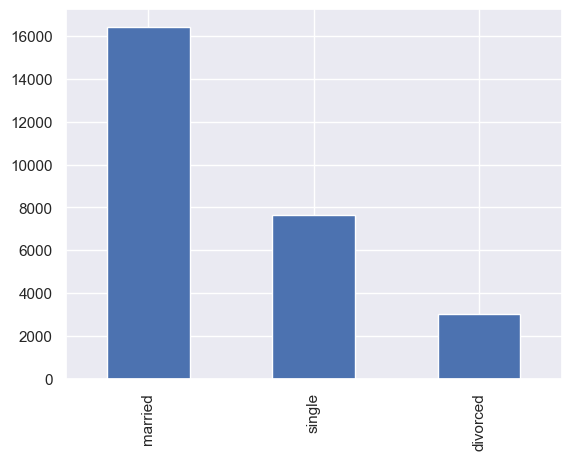
    


 #### カテゴリーデータを数値に変換


```python
marital.convert()
marital.plot()
```


    <Axes: >


    
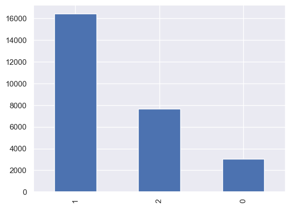
    


 #### ピボットテーブルによる集計


```python
marital.pivot('id')
```


<div>
<style scoped>
    .dataframe tbody tr th:only-of-type {
        vertical-align: middle;
    }

    .dataframe tbody tr th {
        vertical-align: top;
    }

    .dataframe thead th {
        text-align: right;
    }
</style>
<table border="1" class="dataframe">
  <thead>
    <tr style="text-align: right;">
      <th>marital</th>
      <th>0</th>
      <th>1</th>
      <th>2</th>
    </tr>
    <tr>
      <th>y</th>
      <th></th>
      <th></th>
      <th></th>
    </tr>
  </thead>
  <tbody>
    <tr>
      <th>0</th>
      <td>2033</td>
      <td>10807</td>
      <td>5605</td>
    </tr>
    <tr>
      <th>1</th>
      <td>1022</td>
      <td>5604</td>
      <td>2057</td>
    </tr>
  </tbody>
</table>
</div>


 ### ダミー変数化


```python
df = marital.dummy()
df.head()
```


<div>
<style scoped>
    .dataframe tbody tr th:only-of-type {
        vertical-align: middle;
    }

    .dataframe tbody tr th {
        vertical-align: top;
    }

    .dataframe thead th {
        text-align: right;
    }
</style>
<table border="1" class="dataframe">
  <thead>
    <tr style="text-align: right;">
      <th></th>
      <th>id</th>
      <th>age</th>
      <th>default</th>
      <th>amount</th>
      <th>housing</th>
      <th>loan</th>
      <th>contact</th>
      <th>day</th>
      <th>month</th>
      <th>duration</th>
      <th>...</th>
      <th>job_9</th>
      <th>job_10</th>
      <th>job_11</th>
      <th>education_0</th>
      <th>education_1</th>
      <th>education_2</th>
      <th>education_3</th>
      <th>marital_0</th>
      <th>marital_1</th>
      <th>marital_2</th>
    </tr>
  </thead>
  <tbody>
    <tr>
      <th>0</th>
      <td>1</td>
      <td>39</td>
      <td>no</td>
      <td>1756.0</td>
      <td>yes</td>
      <td>no</td>
      <td>cellular</td>
      <td>3</td>
      <td>apr</td>
      <td>370.055237</td>
      <td>...</td>
      <td>0</td>
      <td>0</td>
      <td>0</td>
      <td>0</td>
      <td>1</td>
      <td>0</td>
      <td>0</td>
      <td>0</td>
      <td>1</td>
      <td>0</td>
    </tr>
    <tr>
      <th>1</th>
      <td>2</td>
      <td>51</td>
      <td>no</td>
      <td>1443.0</td>
      <td>no</td>
      <td>no</td>
      <td>cellular</td>
      <td>18</td>
      <td>feb</td>
      <td>233.998933</td>
      <td>...</td>
      <td>0</td>
      <td>0</td>
      <td>0</td>
      <td>1</td>
      <td>0</td>
      <td>0</td>
      <td>0</td>
      <td>0</td>
      <td>1</td>
      <td>0</td>
    </tr>
    <tr>
      <th>2</th>
      <td>3</td>
      <td>36</td>
      <td>no</td>
      <td>436.0</td>
      <td>no</td>
      <td>no</td>
      <td>cellular</td>
      <td>13</td>
      <td>apr</td>
      <td>NaN</td>
      <td>...</td>
      <td>0</td>
      <td>0</td>
      <td>0</td>
      <td>0</td>
      <td>0</td>
      <td>1</td>
      <td>0</td>
      <td>0</td>
      <td>0</td>
      <td>1</td>
    </tr>
    <tr>
      <th>3</th>
      <td>4</td>
      <td>63</td>
      <td>no</td>
      <td>474.0</td>
      <td>no</td>
      <td>no</td>
      <td>cellular</td>
      <td>25</td>
      <td>jan</td>
      <td>252.525808</td>
      <td>...</td>
      <td>0</td>
      <td>0</td>
      <td>0</td>
      <td>0</td>
      <td>1</td>
      <td>0</td>
      <td>0</td>
      <td>0</td>
      <td>1</td>
      <td>0</td>
    </tr>
    <tr>
      <th>4</th>
      <td>5</td>
      <td>31</td>
      <td>no</td>
      <td>354.0</td>
      <td>no</td>
      <td>no</td>
      <td>cellular</td>
      <td>30</td>
      <td>apr</td>
      <td>NaN</td>
      <td>...</td>
      <td>0</td>
      <td>0</td>
      <td>0</td>
      <td>0</td>
      <td>0</td>
      <td>1</td>
      <td>0</td>
      <td>0</td>
      <td>0</td>
      <td>1</td>
    </tr>
  </tbody>
</table>
<p>5 rows × 32 columns</p>
</div>


 ### 個人ローンの有無カテゴリ確認


```python
loan = CategoricalData(df, 'loan')
```


```python
loan.show()
```


    no     22788
    yes     4340
    Name: loan, dtype: int64


```python
loan.plot()
```


    <Axes: >


    
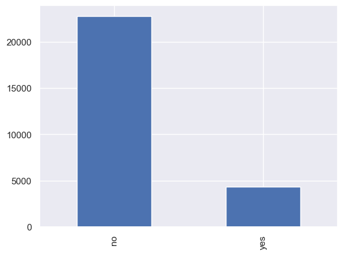
    


 #### カテゴリーデータを数値に変換


```python
loan.convert()
loan.plot()
```


    <Axes: >


    
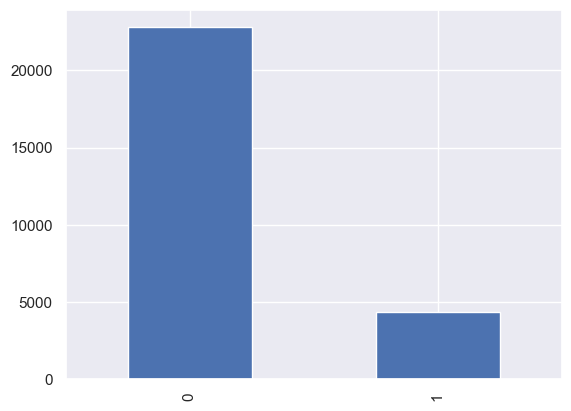
    


 #### ピボットテーブルによる集計


```python
loan.pivot('id')
```


<div>
<style scoped>
    .dataframe tbody tr th:only-of-type {
        vertical-align: middle;
    }

    .dataframe tbody tr th {
        vertical-align: top;
    }

    .dataframe thead th {
        text-align: right;
    }
</style>
<table border="1" class="dataframe">
  <thead>
    <tr style="text-align: right;">
      <th>loan</th>
      <th>0</th>
      <th>1</th>
    </tr>
    <tr>
      <th>y</th>
      <th></th>
      <th></th>
    </tr>
  </thead>
  <tbody>
    <tr>
      <th>0</th>
      <td>15925</td>
      <td>2520</td>
    </tr>
    <tr>
      <th>1</th>
      <td>6863</td>
      <td>1820</td>
    </tr>
  </tbody>
</table>
</div>


 ### ダミー変数化


```python
df = loan.dummy()
df.head()
```


<div>
<style scoped>
    .dataframe tbody tr th:only-of-type {
        vertical-align: middle;
    }

    .dataframe tbody tr th {
        vertical-align: top;
    }

    .dataframe thead th {
        text-align: right;
    }
</style>
<table border="1" class="dataframe">
  <thead>
    <tr style="text-align: right;">
      <th></th>
      <th>id</th>
      <th>age</th>
      <th>default</th>
      <th>amount</th>
      <th>housing</th>
      <th>contact</th>
      <th>day</th>
      <th>month</th>
      <th>duration</th>
      <th>campaign</th>
      <th>...</th>
      <th>job_11</th>
      <th>education_0</th>
      <th>education_1</th>
      <th>education_2</th>
      <th>education_3</th>
      <th>marital_0</th>
      <th>marital_1</th>
      <th>marital_2</th>
      <th>loan_0</th>
      <th>loan_1</th>
    </tr>
  </thead>
  <tbody>
    <tr>
      <th>0</th>
      <td>1</td>
      <td>39</td>
      <td>no</td>
      <td>1756.0</td>
      <td>yes</td>
      <td>cellular</td>
      <td>3</td>
      <td>apr</td>
      <td>370.055237</td>
      <td>1</td>
      <td>...</td>
      <td>0</td>
      <td>0</td>
      <td>1</td>
      <td>0</td>
      <td>0</td>
      <td>0</td>
      <td>1</td>
      <td>0</td>
      <td>1</td>
      <td>0</td>
    </tr>
    <tr>
      <th>1</th>
      <td>2</td>
      <td>51</td>
      <td>no</td>
      <td>1443.0</td>
      <td>no</td>
      <td>cellular</td>
      <td>18</td>
      <td>feb</td>
      <td>233.998933</td>
      <td>10</td>
      <td>...</td>
      <td>0</td>
      <td>1</td>
      <td>0</td>
      <td>0</td>
      <td>0</td>
      <td>0</td>
      <td>1</td>
      <td>0</td>
      <td>1</td>
      <td>0</td>
    </tr>
    <tr>
      <th>2</th>
      <td>3</td>
      <td>36</td>
      <td>no</td>
      <td>436.0</td>
      <td>no</td>
      <td>cellular</td>
      <td>13</td>
      <td>apr</td>
      <td>NaN</td>
      <td>1</td>
      <td>...</td>
      <td>0</td>
      <td>0</td>
      <td>0</td>
      <td>1</td>
      <td>0</td>
      <td>0</td>
      <td>0</td>
      <td>1</td>
      <td>1</td>
      <td>0</td>
    </tr>
    <tr>
      <th>3</th>
      <td>4</td>
      <td>63</td>
      <td>no</td>
      <td>474.0</td>
      <td>no</td>
      <td>cellular</td>
      <td>25</td>
      <td>jan</td>
      <td>252.525808</td>
      <td>1</td>
      <td>...</td>
      <td>0</td>
      <td>0</td>
      <td>1</td>
      <td>0</td>
      <td>0</td>
      <td>0</td>
      <td>1</td>
      <td>0</td>
      <td>1</td>
      <td>0</td>
    </tr>
    <tr>
      <th>4</th>
      <td>5</td>
      <td>31</td>
      <td>no</td>
      <td>354.0</td>
      <td>no</td>
      <td>cellular</td>
      <td>30</td>
      <td>apr</td>
      <td>NaN</td>
      <td>1</td>
      <td>...</td>
      <td>0</td>
      <td>0</td>
      <td>0</td>
      <td>1</td>
      <td>0</td>
      <td>0</td>
      <td>0</td>
      <td>1</td>
      <td>1</td>
      <td>0</td>
    </tr>
  </tbody>
</table>
<p>5 rows × 33 columns</p>
</div>


 ### 住宅ローンの有無カテゴリ確認


```python
housing = CategoricalData(df, 'housing')
```


```python
housing.show()
```


    yes    15125
    no     12003
    Name: housing, dtype: int64


```python
housing.plot()
```


    <Axes: >


    
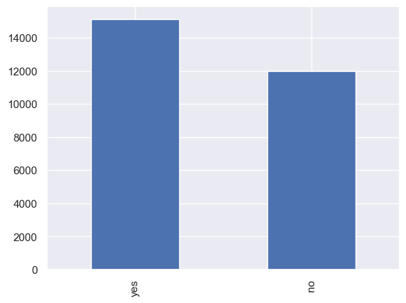
    


 #### カテゴリーデータを数値に変換


```python
housing.convert()
housing.plot()
```


    <Axes: >


    
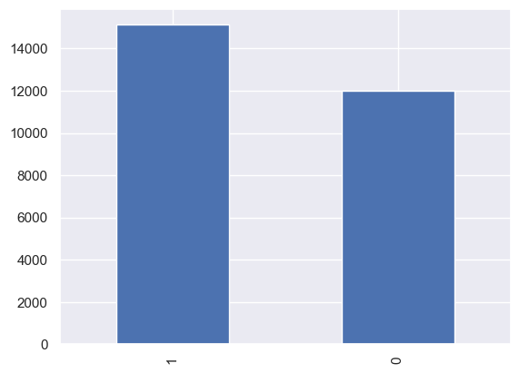
    


 #### ピボットテーブルによる集計


```python
housing.pivot('id')
```


<div>
<style scoped>
    .dataframe tbody tr th:only-of-type {
        vertical-align: middle;
    }

    .dataframe tbody tr th {
        vertical-align: top;
    }

    .dataframe thead th {
        text-align: right;
    }
</style>
<table border="1" class="dataframe">
  <thead>
    <tr style="text-align: right;">
      <th>housing</th>
      <th>0</th>
      <th>1</th>
    </tr>
    <tr>
      <th>y</th>
      <th></th>
      <th></th>
    </tr>
  </thead>
  <tbody>
    <tr>
      <th>0</th>
      <td>9396</td>
      <td>9049</td>
    </tr>
    <tr>
      <th>1</th>
      <td>2607</td>
      <td>6076</td>
    </tr>
  </tbody>
</table>
</div>


 ### ダミー変数化


```python
df = housing.dummy()
df.head()
```


<div>
<style scoped>
    .dataframe tbody tr th:only-of-type {
        vertical-align: middle;
    }

    .dataframe tbody tr th {
        vertical-align: top;
    }

    .dataframe thead th {
        text-align: right;
    }
</style>
<table border="1" class="dataframe">
  <thead>
    <tr style="text-align: right;">
      <th></th>
      <th>id</th>
      <th>age</th>
      <th>default</th>
      <th>amount</th>
      <th>contact</th>
      <th>day</th>
      <th>month</th>
      <th>duration</th>
      <th>campaign</th>
      <th>previous</th>
      <th>...</th>
      <th>education_1</th>
      <th>education_2</th>
      <th>education_3</th>
      <th>marital_0</th>
      <th>marital_1</th>
      <th>marital_2</th>
      <th>loan_0</th>
      <th>loan_1</th>
      <th>housing_0</th>
      <th>housing_1</th>
    </tr>
  </thead>
  <tbody>
    <tr>
      <th>0</th>
      <td>1</td>
      <td>39</td>
      <td>no</td>
      <td>1756.0</td>
      <td>cellular</td>
      <td>3</td>
      <td>apr</td>
      <td>370.055237</td>
      <td>1</td>
      <td>0</td>
      <td>...</td>
      <td>1</td>
      <td>0</td>
      <td>0</td>
      <td>0</td>
      <td>1</td>
      <td>0</td>
      <td>1</td>
      <td>0</td>
      <td>0</td>
      <td>1</td>
    </tr>
    <tr>
      <th>1</th>
      <td>2</td>
      <td>51</td>
      <td>no</td>
      <td>1443.0</td>
      <td>cellular</td>
      <td>18</td>
      <td>feb</td>
      <td>233.998933</td>
      <td>10</td>
      <td>0</td>
      <td>...</td>
      <td>0</td>
      <td>0</td>
      <td>0</td>
      <td>0</td>
      <td>1</td>
      <td>0</td>
      <td>1</td>
      <td>0</td>
      <td>1</td>
      <td>0</td>
    </tr>
    <tr>
      <th>2</th>
      <td>3</td>
      <td>36</td>
      <td>no</td>
      <td>436.0</td>
      <td>cellular</td>
      <td>13</td>
      <td>apr</td>
      <td>NaN</td>
      <td>1</td>
      <td>2</td>
      <td>...</td>
      <td>0</td>
      <td>1</td>
      <td>0</td>
      <td>0</td>
      <td>0</td>
      <td>1</td>
      <td>1</td>
      <td>0</td>
      <td>1</td>
      <td>0</td>
    </tr>
    <tr>
      <th>3</th>
      <td>4</td>
      <td>63</td>
      <td>no</td>
      <td>474.0</td>
      <td>cellular</td>
      <td>25</td>
      <td>jan</td>
      <td>252.525808</td>
      <td>1</td>
      <td>0</td>
      <td>...</td>
      <td>1</td>
      <td>0</td>
      <td>0</td>
      <td>0</td>
      <td>1</td>
      <td>0</td>
      <td>1</td>
      <td>0</td>
      <td>1</td>
      <td>0</td>
    </tr>
    <tr>
      <th>4</th>
      <td>5</td>
      <td>31</td>
      <td>no</td>
      <td>354.0</td>
      <td>cellular</td>
      <td>30</td>
      <td>apr</td>
      <td>NaN</td>
      <td>1</td>
      <td>2</td>
      <td>...</td>
      <td>0</td>
      <td>1</td>
      <td>0</td>
      <td>0</td>
      <td>0</td>
      <td>1</td>
      <td>1</td>
      <td>0</td>
      <td>1</td>
      <td>0</td>
    </tr>
  </tbody>
</table>
<p>5 rows × 34 columns</p>
</div>


 ### 債務不履行の有無カテゴリ確認


```python
default = CategoricalData(df, 'default')
```


```python
default.show()
```


    no     26644
    yes      484
    Name: default, dtype: int64


```python
default.plot()
```


    <Axes: >


    
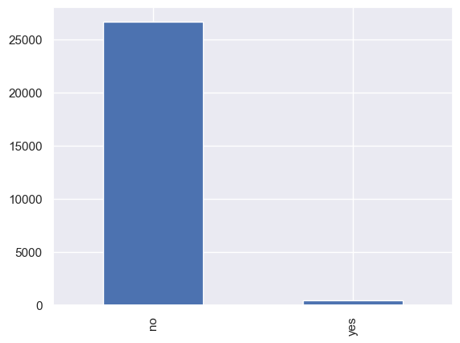
    


 #### カテゴリーデータを数値に変換


```python
default.convert()
default.plot()
```


    <Axes: >


    
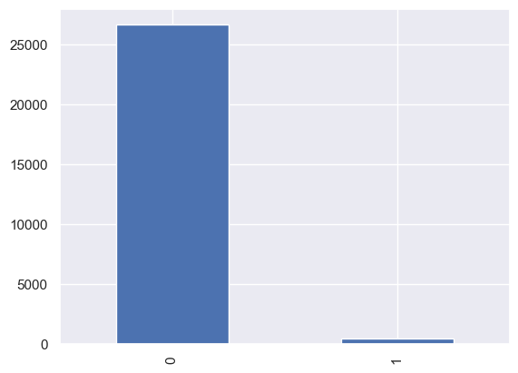
    


 #### ピボットテーブルによる集計


```python
default.pivot('id')
```


<div>
<style scoped>
    .dataframe tbody tr th:only-of-type {
        vertical-align: middle;
    }

    .dataframe tbody tr th {
        vertical-align: top;
    }

    .dataframe thead th {
        text-align: right;
    }
</style>
<table border="1" class="dataframe">
  <thead>
    <tr style="text-align: right;">
      <th>default</th>
      <th>0</th>
      <th>1</th>
    </tr>
    <tr>
      <th>y</th>
      <th></th>
      <th></th>
    </tr>
  </thead>
  <tbody>
    <tr>
      <th>0</th>
      <td>18081</td>
      <td>364</td>
    </tr>
    <tr>
      <th>1</th>
      <td>8563</td>
      <td>120</td>
    </tr>
  </tbody>
</table>
</div>


 ### ダミー変数化


```python
df = default.dummy()
df.head()
```


<div>
<style scoped>
    .dataframe tbody tr th:only-of-type {
        vertical-align: middle;
    }

    .dataframe tbody tr th {
        vertical-align: top;
    }

    .dataframe thead th {
        text-align: right;
    }
</style>
<table border="1" class="dataframe">
  <thead>
    <tr style="text-align: right;">
      <th></th>
      <th>id</th>
      <th>age</th>
      <th>amount</th>
      <th>contact</th>
      <th>day</th>
      <th>month</th>
      <th>duration</th>
      <th>campaign</th>
      <th>previous</th>
      <th>y</th>
      <th>...</th>
      <th>education_3</th>
      <th>marital_0</th>
      <th>marital_1</th>
      <th>marital_2</th>
      <th>loan_0</th>
      <th>loan_1</th>
      <th>housing_0</th>
      <th>housing_1</th>
      <th>default_0</th>
      <th>default_1</th>
    </tr>
  </thead>
  <tbody>
    <tr>
      <th>0</th>
      <td>1</td>
      <td>39</td>
      <td>1756.0</td>
      <td>cellular</td>
      <td>3</td>
      <td>apr</td>
      <td>370.055237</td>
      <td>1</td>
      <td>0</td>
      <td>1</td>
      <td>...</td>
      <td>0</td>
      <td>0</td>
      <td>1</td>
      <td>0</td>
      <td>1</td>
      <td>0</td>
      <td>0</td>
      <td>1</td>
      <td>1</td>
      <td>0</td>
    </tr>
    <tr>
      <th>1</th>
      <td>2</td>
      <td>51</td>
      <td>1443.0</td>
      <td>cellular</td>
      <td>18</td>
      <td>feb</td>
      <td>233.998933</td>
      <td>10</td>
      <td>0</td>
      <td>1</td>
      <td>...</td>
      <td>0</td>
      <td>0</td>
      <td>1</td>
      <td>0</td>
      <td>1</td>
      <td>0</td>
      <td>1</td>
      <td>0</td>
      <td>1</td>
      <td>0</td>
    </tr>
    <tr>
      <th>2</th>
      <td>3</td>
      <td>36</td>
      <td>436.0</td>
      <td>cellular</td>
      <td>13</td>
      <td>apr</td>
      <td>NaN</td>
      <td>1</td>
      <td>2</td>
      <td>0</td>
      <td>...</td>
      <td>0</td>
      <td>0</td>
      <td>0</td>
      <td>1</td>
      <td>1</td>
      <td>0</td>
      <td>1</td>
      <td>0</td>
      <td>1</td>
      <td>0</td>
    </tr>
    <tr>
      <th>3</th>
      <td>4</td>
      <td>63</td>
      <td>474.0</td>
      <td>cellular</td>
      <td>25</td>
      <td>jan</td>
      <td>252.525808</td>
      <td>1</td>
      <td>0</td>
      <td>0</td>
      <td>...</td>
      <td>0</td>
      <td>0</td>
      <td>1</td>
      <td>0</td>
      <td>1</td>
      <td>0</td>
      <td>1</td>
      <td>0</td>
      <td>1</td>
      <td>0</td>
    </tr>
    <tr>
      <th>4</th>
      <td>5</td>
      <td>31</td>
      <td>354.0</td>
      <td>cellular</td>
      <td>30</td>
      <td>apr</td>
      <td>NaN</td>
      <td>1</td>
      <td>2</td>
      <td>0</td>
      <td>...</td>
      <td>0</td>
      <td>0</td>
      <td>0</td>
      <td>1</td>
      <td>1</td>
      <td>0</td>
      <td>1</td>
      <td>0</td>
      <td>1</td>
      <td>0</td>
    </tr>
  </tbody>
</table>
<p>5 rows × 35 columns</p>
</div>


 ### 最終接触月確認


```python
month = CategoricalData(df, 'month')
```


```python
month.show()
```


    may    8317
    jul    4136
    aug    3718
    jun    3204
    nov    2342
    apr    1755
    feb    1586
    jan     846
    oct     439
    sep     356
    mar     299
    dec     130
    Name: month, dtype: int64


```python
month.plot()
```


    <Axes: >


    
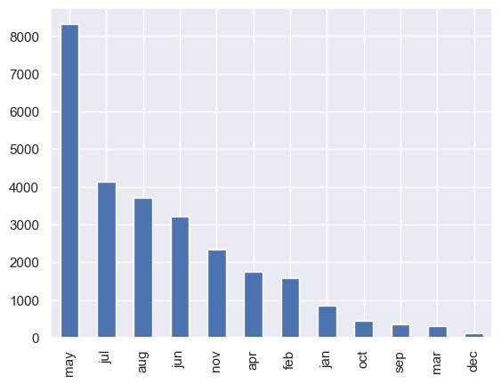
    


 #### カテゴリーデータを数値に変換


```python
month.convert()
month.plot()
```


    <Axes: >


    
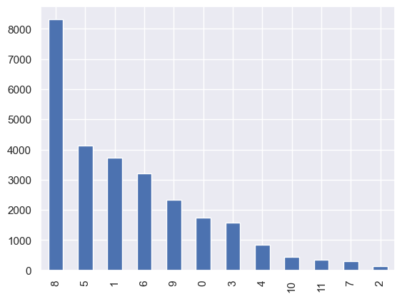
    


 #### ピボットテーブルによる集計


```python
month.pivot('id')
```


<div>
<style scoped>
    .dataframe tbody tr th:only-of-type {
        vertical-align: middle;
    }

    .dataframe tbody tr th {
        vertical-align: top;
    }

    .dataframe thead th {
        text-align: right;
    }
</style>
<table border="1" class="dataframe">
  <thead>
    <tr style="text-align: right;">
      <th>month</th>
      <th>0</th>
      <th>1</th>
      <th>2</th>
      <th>3</th>
      <th>4</th>
      <th>5</th>
      <th>6</th>
      <th>7</th>
      <th>8</th>
      <th>9</th>
      <th>10</th>
      <th>11</th>
    </tr>
    <tr>
      <th>y</th>
      <th></th>
      <th></th>
      <th></th>
      <th></th>
      <th></th>
      <th></th>
      <th></th>
      <th></th>
      <th></th>
      <th></th>
      <th></th>
      <th></th>
    </tr>
  </thead>
  <tbody>
    <tr>
      <th>0</th>
      <td>1204</td>
      <td>2788</td>
      <td>86</td>
      <td>1165</td>
      <td>669</td>
      <td>2869</td>
      <td>2046</td>
      <td>194</td>
      <td>5079</td>
      <td>1791</td>
      <td>309</td>
      <td>245</td>
    </tr>
    <tr>
      <th>1</th>
      <td>551</td>
      <td>930</td>
      <td>44</td>
      <td>421</td>
      <td>177</td>
      <td>1267</td>
      <td>1158</td>
      <td>105</td>
      <td>3238</td>
      <td>551</td>
      <td>130</td>
      <td>111</td>
    </tr>
  </tbody>
</table>
</div>


 ### 連絡方法カテゴリ確認


```python
contact = CategoricalData(df, 'contact')
```


```python
contact.show()
```


    cellular             17580
    sending _document     7861
    telephone             1687
    Name: contact, dtype: int64


```python
contact.plot()
```


    <Axes: >


    
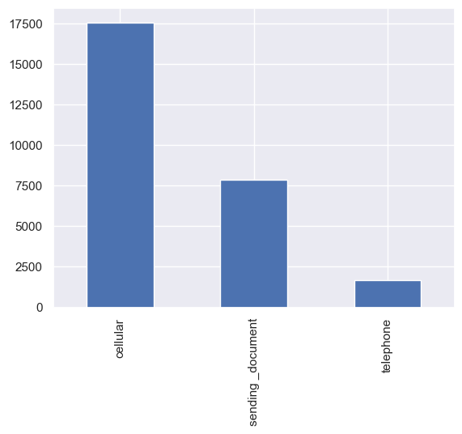
    


 #### カテゴリーデータを数値に変換


```python
contact.convert()
contact.plot()
```


    <Axes: >


    
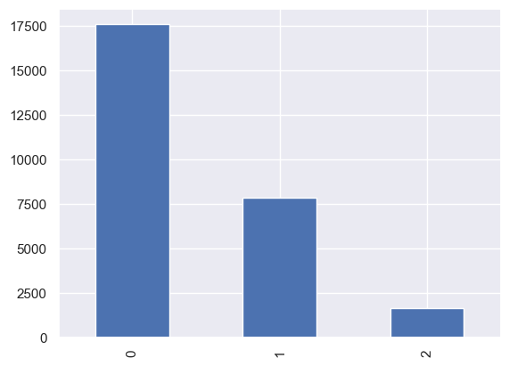
    


 #### ピボットテーブルによる集計


```python
contact.pivot('id')
```


<div>
<style scoped>
    .dataframe tbody tr th:only-of-type {
        vertical-align: middle;
    }

    .dataframe tbody tr th {
        vertical-align: top;
    }

    .dataframe thead th {
        text-align: right;
    }
</style>
<table border="1" class="dataframe">
  <thead>
    <tr style="text-align: right;">
      <th>contact</th>
      <th>0</th>
      <th>1</th>
      <th>2</th>
    </tr>
    <tr>
      <th>y</th>
      <th></th>
      <th></th>
      <th></th>
    </tr>
  </thead>
  <tbody>
    <tr>
      <th>0</th>
      <td>12712</td>
      <td>4577</td>
      <td>1156</td>
    </tr>
    <tr>
      <th>1</th>
      <td>4868</td>
      <td>3284</td>
      <td>531</td>
    </tr>
  </tbody>
</table>
</div>


 ### ダミー変数化


```python
df = contact.dummy()
df.head()
```


<div>
<style scoped>
    .dataframe tbody tr th:only-of-type {
        vertical-align: middle;
    }

    .dataframe tbody tr th {
        vertical-align: top;
    }

    .dataframe thead th {
        text-align: right;
    }
</style>
<table border="1" class="dataframe">
  <thead>
    <tr style="text-align: right;">
      <th></th>
      <th>id</th>
      <th>age</th>
      <th>amount</th>
      <th>day</th>
      <th>month</th>
      <th>duration</th>
      <th>campaign</th>
      <th>previous</th>
      <th>y</th>
      <th>job_0</th>
      <th>...</th>
      <th>marital_2</th>
      <th>loan_0</th>
      <th>loan_1</th>
      <th>housing_0</th>
      <th>housing_1</th>
      <th>default_0</th>
      <th>default_1</th>
      <th>contact_0</th>
      <th>contact_1</th>
      <th>contact_2</th>
    </tr>
  </thead>
  <tbody>
    <tr>
      <th>0</th>
      <td>1</td>
      <td>39</td>
      <td>1756.0</td>
      <td>3</td>
      <td>0</td>
      <td>370.055237</td>
      <td>1</td>
      <td>0</td>
      <td>1</td>
      <td>0</td>
      <td>...</td>
      <td>0</td>
      <td>1</td>
      <td>0</td>
      <td>0</td>
      <td>1</td>
      <td>1</td>
      <td>0</td>
      <td>1</td>
      <td>0</td>
      <td>0</td>
    </tr>
    <tr>
      <th>1</th>
      <td>2</td>
      <td>51</td>
      <td>1443.0</td>
      <td>18</td>
      <td>3</td>
      <td>233.998933</td>
      <td>10</td>
      <td>0</td>
      <td>1</td>
      <td>0</td>
      <td>...</td>
      <td>0</td>
      <td>1</td>
      <td>0</td>
      <td>1</td>
      <td>0</td>
      <td>1</td>
      <td>0</td>
      <td>1</td>
      <td>0</td>
      <td>0</td>
    </tr>
    <tr>
      <th>2</th>
      <td>3</td>
      <td>36</td>
      <td>436.0</td>
      <td>13</td>
      <td>0</td>
      <td>NaN</td>
      <td>1</td>
      <td>2</td>
      <td>0</td>
      <td>0</td>
      <td>...</td>
      <td>1</td>
      <td>1</td>
      <td>0</td>
      <td>1</td>
      <td>0</td>
      <td>1</td>
      <td>0</td>
      <td>1</td>
      <td>0</td>
      <td>0</td>
    </tr>
    <tr>
      <th>3</th>
      <td>4</td>
      <td>63</td>
      <td>474.0</td>
      <td>25</td>
      <td>4</td>
      <td>252.525808</td>
      <td>1</td>
      <td>0</td>
      <td>0</td>
      <td>0</td>
      <td>...</td>
      <td>0</td>
      <td>1</td>
      <td>0</td>
      <td>1</td>
      <td>0</td>
      <td>1</td>
      <td>0</td>
      <td>1</td>
      <td>0</td>
      <td>0</td>
    </tr>
    <tr>
      <th>4</th>
      <td>5</td>
      <td>31</td>
      <td>354.0</td>
      <td>30</td>
      <td>0</td>
      <td>NaN</td>
      <td>1</td>
      <td>2</td>
      <td>0</td>
      <td>0</td>
      <td>...</td>
      <td>1</td>
      <td>1</td>
      <td>0</td>
      <td>1</td>
      <td>0</td>
      <td>1</td>
      <td>0</td>
      <td>1</td>
      <td>0</td>
      <td>0</td>
    </tr>
  </tbody>
</table>
<p>5 rows × 37 columns</p>
</div>


 ### データの目的変数確認


```python
df['y'].value_counts()
```


    0    18445
    1     8683
    Name: y, dtype: int64


```python
df['y'].value_counts().plot(kind='bar')
```


    <Axes: >


    
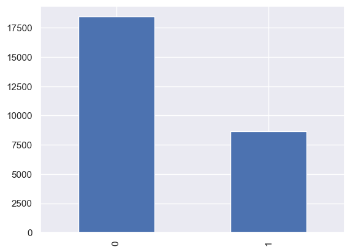
    


 ### データの可視化


```python
# %matplotlib inline
df = new_df()
exec_all = plot_df(df)
exec_all(plot_on)
```


    
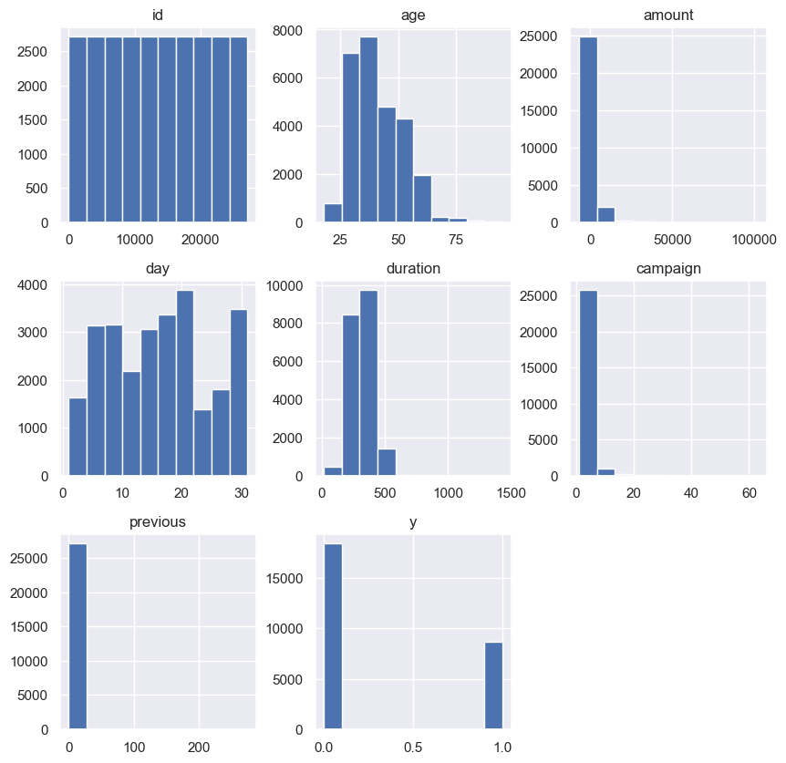
    


    
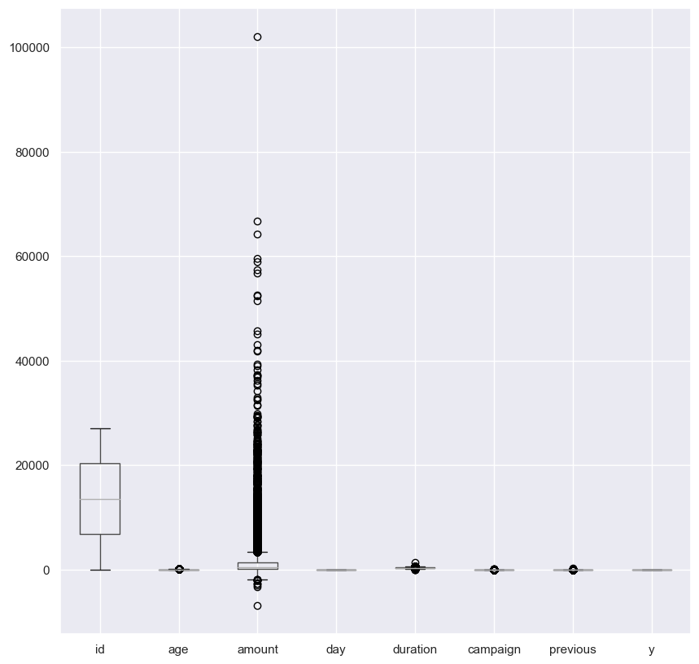
    


    
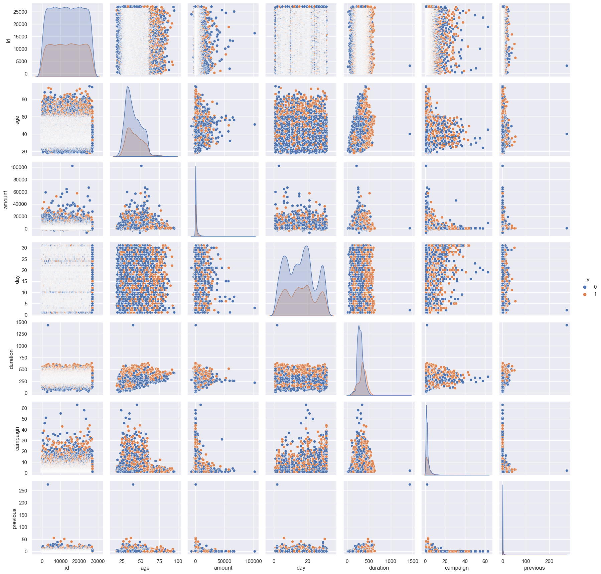
    


 ### データの欠損確認


```python
df.isnull().any()
```


    id           False
    age          False
    job          False
    marital      False
    education    False
    default      False
    amount       False
    housing      False
    loan         False
    contact      False
    day          False
    month        False
    duration      True
    campaign     False
    previous     False
    y            False
    dtype: bool


```python
df.isnull().sum()
```


    id              0
    age             0
    job             0
    marital         0
    education       0
    default         0
    amount          0
    housing         0
    loan            0
    contact         0
    day             0
    month           0
    duration     7044
    campaign        0
    previous        0
    y               0
    dtype: int64


 ### データの重複確認


```python
df.duplicated().sum()
```


    0


 ## 分析の実施

 ## データの前処理

 ### CSVファイルの読み込み


```python
import pandas as pd
df = new_df()
df.head()
```


<div>
<style scoped>
    .dataframe tbody tr th:only-of-type {
        vertical-align: middle;
    }

    .dataframe tbody tr th {
        vertical-align: top;
    }

    .dataframe thead th {
        text-align: right;
    }
</style>
<table border="1" class="dataframe">
  <thead>
    <tr style="text-align: right;">
      <th></th>
      <th>id</th>
      <th>age</th>
      <th>job</th>
      <th>marital</th>
      <th>education</th>
      <th>default</th>
      <th>amount</th>
      <th>housing</th>
      <th>loan</th>
      <th>contact</th>
      <th>day</th>
      <th>month</th>
      <th>duration</th>
      <th>campaign</th>
      <th>previous</th>
      <th>y</th>
    </tr>
  </thead>
  <tbody>
    <tr>
      <th>0</th>
      <td>1</td>
      <td>39</td>
      <td>blue-collar</td>
      <td>married</td>
      <td>secondary</td>
      <td>no</td>
      <td>1756.0</td>
      <td>yes</td>
      <td>no</td>
      <td>cellular</td>
      <td>3</td>
      <td>apr</td>
      <td>370.055237</td>
      <td>1</td>
      <td>0</td>
      <td>1</td>
    </tr>
    <tr>
      <th>1</th>
      <td>2</td>
      <td>51</td>
      <td>entrepreneur</td>
      <td>married</td>
      <td>primary</td>
      <td>no</td>
      <td>1443.0</td>
      <td>no</td>
      <td>no</td>
      <td>cellular</td>
      <td>18</td>
      <td>feb</td>
      <td>233.998933</td>
      <td>10</td>
      <td>0</td>
      <td>1</td>
    </tr>
    <tr>
      <th>2</th>
      <td>3</td>
      <td>36</td>
      <td>management</td>
      <td>single</td>
      <td>tertiary</td>
      <td>no</td>
      <td>436.0</td>
      <td>no</td>
      <td>no</td>
      <td>cellular</td>
      <td>13</td>
      <td>apr</td>
      <td>NaN</td>
      <td>1</td>
      <td>2</td>
      <td>0</td>
    </tr>
    <tr>
      <th>3</th>
      <td>4</td>
      <td>63</td>
      <td>retired</td>
      <td>married</td>
      <td>secondary</td>
      <td>no</td>
      <td>474.0</td>
      <td>no</td>
      <td>no</td>
      <td>cellular</td>
      <td>25</td>
      <td>jan</td>
      <td>252.525808</td>
      <td>1</td>
      <td>0</td>
      <td>0</td>
    </tr>
    <tr>
      <th>4</th>
      <td>5</td>
      <td>31</td>
      <td>management</td>
      <td>single</td>
      <td>tertiary</td>
      <td>no</td>
      <td>354.0</td>
      <td>no</td>
      <td>no</td>
      <td>cellular</td>
      <td>30</td>
      <td>apr</td>
      <td>NaN</td>
      <td>1</td>
      <td>2</td>
      <td>0</td>
    </tr>
  </tbody>
</table>
</div>


 ### 欠損地処理（行削除・全体代表値埋め、グループ代表値埋め）

 ### 欠損値を含む行を削除


```python
df.dropna(inplace=True)
```

 ### 各手法を必要に応じて実施

 - 外れ値の除外
 - 多項式特徴量・交互作用特徴量の追加
 - 特徴量の絞り込み
 - 標準化

 ### 特徴量xと正解tに分割


```python
from sklearn.discriminant_analysis import StandardScaler
from sklearn.preprocessing import LabelEncoder

# カテゴリカル変数を指定してLabelEncoderを作成
categorical_cols = ['job', 'marital', 'education', 'default', 'housing', 'loan', 'contact', 'month']
for col in categorical_cols:
    CategoricalData(df, col).convert()

# データの分割とスケーリング
X = df.drop('y', axis=1)
y = df['y']
```

 ### 教師データの分割


```python
from sklearn.model_selection import train_test_split

X_train, X_test, y_train, y_test = train_test_split(X, y, test_size=0.2, random_state=1234, stratify=y)

scaler = StandardScaler()
scaler.fit(X_train)

X_train_std = scaler.transform(X_train)
X_test_std = scaler.transform(X_test)
```

 ## モデルの作成と学習

 ### 未学習状態モデルの生成（分類なら決定木、回帰なら線形回帰）


```python
# model = tree.DecisionTreeClassifier(max_depth=3, random_state=1234)
check_learn(X_train_std, y_train)
treain_score, test_score, model = learn(X_train_std, y_train, depth=8)
```

    深さ1:訓練データの正解率0.69:テストデータの正解率0.683
    深さ2:訓練データの正解率0.661:テストデータの正解率0.652
    深さ3:訓練データの正解率0.695:テストデータの正解率0.694
    深さ4:訓練データの正解率0.709:テストデータの正解率0.712
    深さ5:訓練データの正解率0.77:テストデータの正解率0.764
    深さ6:訓練データの正解率0.788:テストデータの正解率0.78
    深さ7:訓練データの正解率0.802:テストデータの正解率0.786
    深さ8:訓練データの正解率0.817:テストデータの正解率0.783
    深さ9:訓練データの正解率0.835:テストデータの正解率0.771
    深さ10:訓練データの正解率0.854:テストデータの正解率0.766
    深さ11:訓練データの正解率0.88:テストデータの正解率0.763
    深さ12:訓練データの正解率0.902:テストデータの正解率0.754
    深さ13:訓練データの正解率0.923:テストデータの正解率0.747
    深さ14:訓練データの正解率0.946:テストデータの正解率0.743
    

 ### 訓練データで学習（必要に応じて不均衡データ補正）


```python
model.fit(X_train_std, y_train)
```


<style>#sk-container-id-7 {color: black;background-color: white;}#sk-container-id-7 pre{padding: 0;}#sk-container-id-7 div.sk-toggleable {background-color: white;}#sk-container-id-7 label.sk-toggleable__label {cursor: pointer;display: block;width: 100%;margin-bottom: 0;padding: 0.3em;box-sizing: border-box;text-align: center;}#sk-container-id-7 label.sk-toggleable__label-arrow:before {content: "▸";float: left;margin-right: 0.25em;color: #696969;}#sk-container-id-7 label.sk-toggleable__label-arrow:hover:before {color: black;}#sk-container-id-7 div.sk-estimator:hover label.sk-toggleable__label-arrow:before {color: black;}#sk-container-id-7 div.sk-toggleable__content {max-height: 0;max-width: 0;overflow: hidden;text-align: left;background-color: #f0f8ff;}#sk-container-id-7 div.sk-toggleable__content pre {margin: 0.2em;color: black;border-radius: 0.25em;background-color: #f0f8ff;}#sk-container-id-7 input.sk-toggleable__control:checked~div.sk-toggleable__content {max-height: 200px;max-width: 100%;overflow: auto;}#sk-container-id-7 input.sk-toggleable__control:checked~label.sk-toggleable__label-arrow:before {content: "▾";}#sk-container-id-7 div.sk-estimator input.sk-toggleable__control:checked~label.sk-toggleable__label {background-color: #d4ebff;}#sk-container-id-7 div.sk-label input.sk-toggleable__control:checked~label.sk-toggleable__label {background-color: #d4ebff;}#sk-container-id-7 input.sk-hidden--visually {border: 0;clip: rect(1px 1px 1px 1px);clip: rect(1px, 1px, 1px, 1px);height: 1px;margin: -1px;overflow: hidden;padding: 0;position: absolute;width: 1px;}#sk-container-id-7 div.sk-estimator {font-family: monospace;background-color: #f0f8ff;border: 1px dotted black;border-radius: 0.25em;box-sizing: border-box;margin-bottom: 0.5em;}#sk-container-id-7 div.sk-estimator:hover {background-color: #d4ebff;}#sk-container-id-7 div.sk-parallel-item::after {content: "";width: 100%;border-bottom: 1px solid gray;flex-grow: 1;}#sk-container-id-7 div.sk-label:hover label.sk-toggleable__label {background-color: #d4ebff;}#sk-container-id-7 div.sk-serial::before {content: "";position: absolute;border-left: 1px solid gray;box-sizing: border-box;top: 0;bottom: 0;left: 50%;z-index: 0;}#sk-container-id-7 div.sk-serial {display: flex;flex-direction: column;align-items: center;background-color: white;padding-right: 0.2em;padding-left: 0.2em;position: relative;}#sk-container-id-7 div.sk-item {position: relative;z-index: 1;}#sk-container-id-7 div.sk-parallel {display: flex;align-items: stretch;justify-content: center;background-color: white;position: relative;}#sk-container-id-7 div.sk-item::before, #sk-container-id-7 div.sk-parallel-item::before {content: "";position: absolute;border-left: 1px solid gray;box-sizing: border-box;top: 0;bottom: 0;left: 50%;z-index: -1;}#sk-container-id-7 div.sk-parallel-item {display: flex;flex-direction: column;z-index: 1;position: relative;background-color: white;}#sk-container-id-7 div.sk-parallel-item:first-child::after {align-self: flex-end;width: 50%;}#sk-container-id-7 div.sk-parallel-item:last-child::after {align-self: flex-start;width: 50%;}#sk-container-id-7 div.sk-parallel-item:only-child::after {width: 0;}#sk-container-id-7 div.sk-dashed-wrapped {border: 1px dashed gray;margin: 0 0.4em 0.5em 0.4em;box-sizing: border-box;padding-bottom: 0.4em;background-color: white;}#sk-container-id-7 div.sk-label label {font-family: monospace;font-weight: bold;display: inline-block;line-height: 1.2em;}#sk-container-id-7 div.sk-label-container {text-align: center;}#sk-container-id-7 div.sk-container {/* jupyter's `normalize.less` sets `[hidden] { display: none; }` but bootstrap.min.css set `[hidden] { display: none !important; }` so we also need the `!important` here to be able to override the default hidden behavior on the sphinx rendered scikit-learn.org. See: https://github.com/scikit-learn/scikit-learn/issues/21755 */display: inline-block !important;position: relative;}#sk-container-id-7 div.sk-text-repr-fallback {display: none;}</style><div id="sk-container-id-7" class="sk-top-container"><div class="sk-text-repr-fallback"><pre>DecisionTreeClassifier(class_weight=&#x27;balanced&#x27;, max_depth=8, random_state=0)</pre><b>In a Jupyter environment, please rerun this cell to show the HTML representation or trust the notebook. <br />On GitHub, the HTML representation is unable to render, please try loading this page with nbviewer.org.</b></div><div class="sk-container" hidden><div class="sk-item"><div class="sk-estimator sk-toggleable"><input class="sk-toggleable__control sk-hidden--visually" id="sk-estimator-id-7" type="checkbox" checked><label for="sk-estimator-id-7" class="sk-toggleable__label sk-toggleable__label-arrow">DecisionTreeClassifier</label><div class="sk-toggleable__content"><pre>DecisionTreeClassifier(class_weight=&#x27;balanced&#x27;, max_depth=8, random_state=0)</pre></div></div></div></div></div>


 ## モデルの評価


```python
model.score(X_test_std, y_test)
```


    0.7993527508090615


```python
from sklearn.metrics import accuracy_score

y_pred = model.predict(X_test_std)
accuracy_score(y_test, y_pred)
```


    0.7993527508090615


 ### 検証データで評価し指標確認（分類なら正解率、回帰なら決定係数）

 ### 特徴量重要度をデータフレームに変換して表示


```python
pd.DataFrame(model.feature_importances_, index=X.columns)
```


<div>
<style scoped>
    .dataframe tbody tr th:only-of-type {
        vertical-align: middle;
    }

    .dataframe tbody tr th {
        vertical-align: top;
    }

    .dataframe thead th {
        text-align: right;
    }
</style>
<table border="1" class="dataframe">
  <thead>
    <tr style="text-align: right;">
      <th></th>
      <th>0</th>
    </tr>
  </thead>
  <tbody>
    <tr>
      <th>id</th>
      <td>0.008886</td>
    </tr>
    <tr>
      <th>age</th>
      <td>0.145131</td>
    </tr>
    <tr>
      <th>job</th>
      <td>0.004074</td>
    </tr>
    <tr>
      <th>marital</th>
      <td>0.001534</td>
    </tr>
    <tr>
      <th>education</th>
      <td>0.001308</td>
    </tr>
    <tr>
      <th>default</th>
      <td>0.000000</td>
    </tr>
    <tr>
      <th>amount</th>
      <td>0.012920</td>
    </tr>
    <tr>
      <th>housing</th>
      <td>0.094611</td>
    </tr>
    <tr>
      <th>loan</th>
      <td>0.062813</td>
    </tr>
    <tr>
      <th>contact</th>
      <td>0.012281</td>
    </tr>
    <tr>
      <th>day</th>
      <td>0.006828</td>
    </tr>
    <tr>
      <th>month</th>
      <td>0.014739</td>
    </tr>
    <tr>
      <th>duration</th>
      <td>0.443390</td>
    </tr>
    <tr>
      <th>campaign</th>
      <td>0.187722</td>
    </tr>
    <tr>
      <th>previous</th>
      <td>0.003765</td>
    </tr>
  </tbody>
</table>
</div>


 ### 決定木における特徴量の考察


```python
import numpy as np

importances = model.feature_importances_
indices = np.argsort(importances)[::-1]

for f in range(X_train_std.shape[1]):
    print(f'{f+1}番目に重要な特徴量：{X.columns[indices[f]]} {importances[indices[f]]}')
```

    1番目に重要な特徴量：duration 0.4433895962589087
    2番目に重要な特徴量：campaign 0.187721531432321
    3番目に重要な特徴量：age 0.14513099809323624
    4番目に重要な特徴量：housing 0.09461145180794735
    5番目に重要な特徴量：loan 0.06281267984697401
    6番目に重要な特徴量：month 0.01473882804128882
    7番目に重要な特徴量：amount 0.012920028582195986
    8番目に重要な特徴量：contact 0.012281174286635194
    9番目に重要な特徴量：id 0.00888587445751927
    10番目に重要な特徴量：day 0.006827904384379279
    11番目に重要な特徴量：job 0.004073813929825153
    12番目に重要な特徴量：previous 0.0037646412428874692
    13番目に重要な特徴量：marital 0.0015335670302177098
    14番目に重要な特徴量：education 0.001307910605663764
    15番目に重要な特徴量：default 0.0
    

 ### NG:改善案検討前処理に戻る

 #### モデルの再学習

 ##### Take1
 - 接触時の平均時間、キャンペーン前に接触した回数、年齢、住宅ローンの有無を特徴量として学習する
 - 接触時の平均時間の欠損値は削除する
 - 住宅ローンの有無を数値化する


```python
df = new_df()

df.dropna(inplace=True)
categorical_cols = ['housing']
for c in categorical_cols:
    CategoricalData(df, c).convert()

col = ['duration', 'campaign', 'age', 'housing']
x = df[col]
t = df['y']

check_learn(x, t)
treain_score, test_score, model = learn(x, t, depth=8)
take1 = model.score(x, t)
take1
```

    深さ1:訓練データの正解率0.69:テストデータの正解率0.68
    深さ2:訓練データの正解率0.663:テストデータの正解率0.652
    深さ3:訓練データの正解率0.699:テストデータの正解率0.686
    深さ4:訓練データの正解率0.732:テストデータの正解率0.723
    深さ5:訓練データの正解率0.75:テストデータの正解率0.738
    深さ6:訓練データの正解率0.742:テストデータの正解率0.732
    深さ7:訓練データの正解率0.76:テストデータの正解率0.747
    深さ8:訓練データの正解率0.771:テストデータの正解率0.744
    深さ9:訓練データの正解率0.775:テストデータの正解率0.736
    深さ10:訓練データの正解率0.789:テストデータの正解率0.738
    深さ11:訓練データの正解率0.805:テストデータの正解率0.722
    深さ12:訓練データの正解率0.821:テストデータの正解率0.728
    深さ13:訓練データの正解率0.832:テストデータの正解率0.72
    深さ14:訓練データの正解率0.851:テストデータの正解率0.713
    


    0.7658832901812388


 ##### Take2
 - 接触時の平均時間、キャンペーン前に接触した回数、年齢、住宅ローンの有無を特徴量として学習する
 - 接触時の平均時間の欠損値は削除する
 - 住宅ローンの有無をダミー化する


```python
df = new_df()

df.dropna(inplace=True)
housing = CategoricalData(df, 'housing')
df = housing.dummy()

col = ['duration', 'campaign', 'age', 'housing_yes', 'housing_no']
x = df[col]
t = df['y']

check_learn(x, t)
treain_score, test_score, model = learn(x, t, depth=8)
take2 = model.score(x, t)
take2
```

    深さ1:訓練データの正解率0.69:テストデータの正解率0.68
    深さ2:訓練データの正解率0.663:テストデータの正解率0.652
    深さ3:訓練データの正解率0.699:テストデータの正解率0.686
    深さ4:訓練データの正解率0.732:テストデータの正解率0.723
    深さ5:訓練データの正解率0.75:テストデータの正解率0.738
    深さ6:訓練データの正解率0.742:テストデータの正解率0.732
    深さ7:訓練データの正解率0.76:テストデータの正解率0.747
    深さ8:訓練データの正解率0.771:テストデータの正解率0.744
    深さ9:訓練データの正解率0.775:テストデータの正解率0.737
    深さ10:訓練データの正解率0.789:テストデータの正解率0.739
    深さ11:訓練データの正解率0.805:テストデータの正解率0.722
    深さ12:訓練データの正解率0.821:テストデータの正解率0.727
    深さ13:訓練データの正解率0.832:テストデータの正解率0.722
    深さ14:訓練データの正解率0.851:テストデータの正解率0.715
    


    0.7658832901812388


 ##### Take3
 - 接触時の平均時間、キャンペーン前に接触した回数、年齢、住宅ローンの有無を特徴量として学習する
 - 接触時の平均時間の欠損値は平均時間で埋める
 - 住宅ローンの有無を数値化する


```python
df = new_df()

df['duration'].fillna(df['duration'].mean(), inplace=True)
categorical_cols = ['housing']
for c in categorical_cols:
    CategoricalData(df, c).convert()


col = ['duration', 'campaign', 'age', 'housing']
x = df[col]
t = df['y']

depth = 20
check_learn(x, t, depth)
treain_score, test_score, model = learn(x, t, 7)
take3 = model.score(x, t)
take3
```

    深さ1:訓練データの正解率0.716:テストデータの正解率0.698
    深さ2:訓練データの正解率0.663:テストデータの正解率0.663
    深さ3:訓練データの正解率0.657:テストデータの正解率0.656
    深さ4:訓練データの正解率0.737:テストデータの正解率0.734
    深さ5:訓練データの正解率0.768:テストデータの正解率0.764
    深さ6:訓練データの正解率0.797:テストデータの正解率0.785
    深さ7:訓練データの正解率0.82:テストデータの正解率0.805
    深さ8:訓練データの正解率0.819:テストデータの正解率0.799
    深さ9:訓練データの正解率0.827:テストデータの正解率0.8
    深さ10:訓練データの正解率0.836:テストデータの正解率0.794
    深さ11:訓練データの正解率0.844:テストデータの正解率0.791
    深さ12:訓練データの正解率0.86:テストデータの正解率0.792
    深さ13:訓練データの正解率0.869:テストデータの正解率0.785
    深さ14:訓練データの正解率0.885:テストデータの正解率0.781
    深さ15:訓練データの正解率0.896:テストデータの正解率0.776
    深さ16:訓練データの正解率0.907:テストデータの正解率0.772
    深さ17:訓練データの正解率0.921:テストデータの正解率0.77
    深さ18:訓練データの正解率0.931:テストデータの正解率0.769
    深さ19:訓練データの正解率0.944:テストデータの正解率0.772
    深さ20:訓練データの正解率0.953:テストデータの正解率0.768
    


    0.8171630787378354


 ##### Take4
 - 接触時の平均時間を特徴量として学習する
 - 接触時の平均時間の欠損値は平均時間で埋める
 - 住宅ローンの有無を数値化する


```python
df = new_df()

df['duration'].fillna(df['duration'].mean(), inplace=True)
categorical_cols = ['housing']
for c in categorical_cols:
    CategoricalData(df, c).convert()


col = ['duration']
x = df[col]
t = df['y']

check_learn(x, t)
treain_score, test_score, model = learn(x, t, 9)
take4 = model.score(x, t)
take4
```

    深さ1:訓練データの正解率0.716:テストデータの正解率0.698
    深さ2:訓練データの正解率0.721:テストデータの正解率0.705
    深さ3:訓練データの正解率0.712:テストデータの正解率0.7
    深さ4:訓練データの正解率0.712:テストデータの正解率0.696
    深さ5:訓練データの正解率0.713:テストデータの正解率0.697
    深さ6:訓練データの正解率0.714:テストデータの正解率0.697
    深さ7:訓練データの正解率0.714:テストデータの正解率0.694
    深さ8:訓練データの正解率0.719:テストデータの正解率0.696
    深さ9:訓練データの正解率0.719:テストデータの正解率0.696
    深さ10:訓練データの正解率0.725:テストデータの正解率0.694
    深さ11:訓練データの正解率0.727:テストデータの正解率0.691
    深さ12:訓練データの正解率0.736:テストデータの正解率0.69
    深さ13:訓練データの正解率0.743:テストデータの正解率0.689
    深さ14:訓練データの正解率0.749:テストデータの正解率0.687
    


    0.7147965202005309


 ##### Take5
 - 接触時の平均時間、キャンペーン前に接触した回数、年齢、住宅ローンの有無を特徴量として学習する
 - 接触時の平均時間の欠損値は削除する
 - 接触時の平均時間の外れ値を削除する
 - 住宅ローンの有無を数値化する


```python
df = new_df()

df.dropna(inplace=True)
no = df[(df['duration'] > 1400)].index
df = df.drop(no, axis=0)
categorical_cols = ['housing']
for c in categorical_cols:
    CategoricalData(df, c).convert()

col = ['duration', 'campaign', 'age', 'housing']
x = df[col]
t = df['y']

check_learn(x, t)
treain_score, test_score, model = learn(x, t, depth=8)
take5 = model.score(x, t)
take5
```

    深さ1:訓練データの正解率0.67:テストデータの正解率0.667
    深さ2:訓練データの正解率0.641:テストデータの正解率0.642
    深さ3:訓練データの正解率0.73:テストデータの正解率0.715
    深さ4:訓練データの正解率0.732:テストデータの正解率0.725
    深さ5:訓練データの正解率0.751:テストデータの正解率0.735
    深さ6:訓練データの正解率0.759:テストデータの正解率0.741
    深さ7:訓練データの正解率0.754:テストデータの正解率0.732
    深さ8:訓練データの正解率0.769:テストデータの正解率0.739
    深さ9:訓練データの正解率0.778:テストデータの正解率0.735
    深さ10:訓練データの正解率0.791:テストデータの正解率0.734
    深さ11:訓練データの正解率0.803:テストデータの正解率0.724
    深さ12:訓練データの正解率0.821:テストデータの正解率0.727
    深さ13:訓練データの正解率0.839:テストデータの正解率0.717
    深さ14:訓練データの正解率0.857:テストデータの正解率0.711
    


    0.7633321714883234


 ##### Take6
 - 接触時の平均時間、キャンペーン前に接触した回数、年齢、住宅ローンの有無を特徴量として学習する
 - 接触時の平均時間の欠損値は平均時間で埋める
 - 接触時の平均時間の外れ値を削除する
 - 住宅ローンの有無を数値化する


```python
df = new_df()

df['duration'].fillna(df['duration'].mean(), inplace=True)
no = df[(df['duration'] > 1400)].index
df = df.drop(no, axis=0)
categorical_cols = ['housing']
for c in categorical_cols:
    CategoricalData(df, c).convert()


col = ['duration', 'campaign', 'age', 'housing']
x = df[col]
t = df['y']

depth = 20
check_learn(x, t, depth)
treain_score, test_score, model = learn(x, t, 7)
take6 = model.score(x, t)
take6
```

    深さ1:訓練データの正解率0.7:テストデータの正解率0.694
    深さ2:訓練データの正解率0.649:テストデータの正解率0.647
    深さ3:訓練データの正解率0.643:テストデータの正解率0.642
    深さ4:訓練データの正解率0.737:テストデータの正解率0.74
    深さ5:訓練データの正解率0.785:テストデータの正解率0.778
    深さ6:訓練データの正解率0.797:テストデータの正解率0.792
    深さ7:訓練データの正解率0.809:テストデータの正解率0.802
    深さ8:訓練データの正解率0.814:テストデータの正解率0.8
    深さ9:訓練データの正解率0.817:テストデータの正解率0.79
    深さ10:訓練データの正解率0.828:テストデータの正解率0.792
    深さ11:訓練データの正解率0.843:テストデータの正解率0.8
    深さ12:訓練データの正解率0.854:テストデータの正解率0.79
    深さ13:訓練データの正解率0.863:テストデータの正解率0.783
    深さ14:訓練データの正解率0.88:テストデータの正解率0.78
    深さ15:訓練データの正解率0.895:テストデータの正解率0.776
    深さ16:訓練データの正解率0.909:テストデータの正解率0.771
    深さ17:訓練データの正解率0.921:テストデータの正解率0.768
    深さ18:訓練データの正解率0.932:テストデータの正解率0.767
    深さ19:訓練データの正解率0.946:テストデータの正解率0.761
    深さ20:訓練データの正解率0.954:テストデータの正解率0.762
    


    0.8076086555829984


```python
# 結果を比較
for i, take in enumerate([take1,take2, take3, take4, take5, take6]):
    print(f'take{i+1}:{take}')
```

    take1:0.7658832901812388
    take2:0.7658832901812388
    take3:0.8171630787378354
    take4:0.7147965202005309
    take5:0.7633321714883234
    take6:0.8076086555829984
    

 ### OK:最終性能評価（テストデータで評価）

 ##### Take3
 - 接触時の平均時間、キャンペーン前に接触した回数、年齢、住宅ローンの有無を特徴量として学習する
 - 接触時の平均時間の欠損値は平均時間で埋める
 - 住宅ローンの有無を数値化する


```python
df = new_df()

df['duration'].fillna(df['duration'].mean(), inplace=True)
categorical_cols = ['housing']
for c in categorical_cols:
    CategoricalData(df, c).convert()


col = ['duration', 'campaign', 'age', 'housing']
x = df[col]
t = df['y']

check_learn(x, t)
treain_score, test_score, model = learn(x, t, 7)

model.score(x, t)
```

    深さ1:訓練データの正解率0.716:テストデータの正解率0.698
    深さ2:訓練データの正解率0.663:テストデータの正解率0.663
    深さ3:訓練データの正解率0.657:テストデータの正解率0.656
    深さ4:訓練データの正解率0.737:テストデータの正解率0.734
    深さ5:訓練データの正解率0.768:テストデータの正解率0.764
    深さ6:訓練データの正解率0.797:テストデータの正解率0.785
    深さ7:訓練データの正解率0.82:テストデータの正解率0.805
    深さ8:訓練データの正解率0.819:テストデータの正解率0.799
    深さ9:訓練データの正解率0.827:テストデータの正解率0.8
    深さ10:訓練データの正解率0.836:テストデータの正解率0.794
    深さ11:訓練データの正解率0.844:テストデータの正解率0.791
    深さ12:訓練データの正解率0.86:テストデータの正解率0.792
    深さ13:訓練データの正解率0.869:テストデータの正解率0.785
    深さ14:訓練データの正解率0.885:テストデータの正解率0.781
    


    0.8171630787378354


 ### データの可視化


```python
# %matplotlib inline
x_tmp = pd.concat([x, t], axis=1)
exec_all = plot_df(x_tmp)
exec_all(plot_on)
```


    
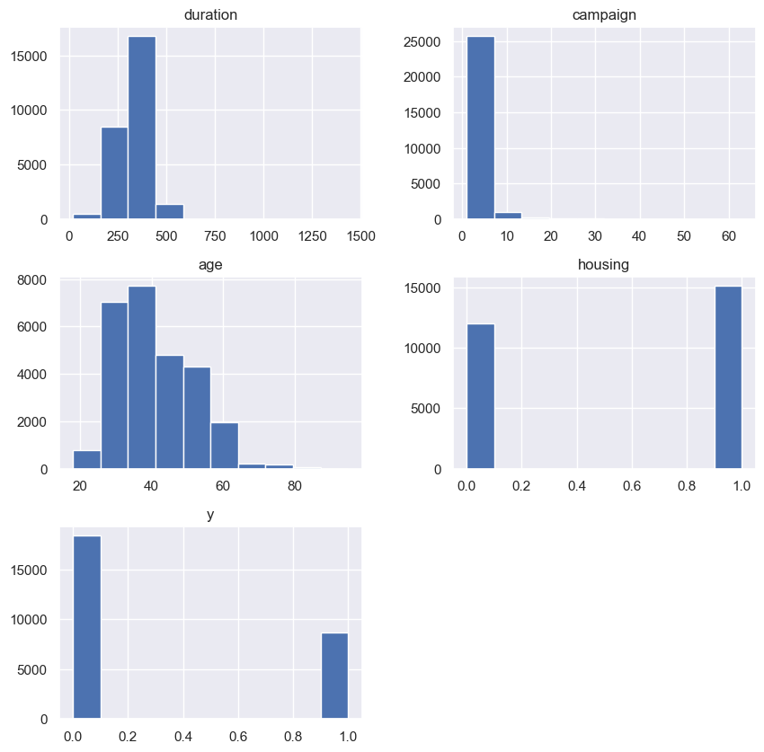
    


    
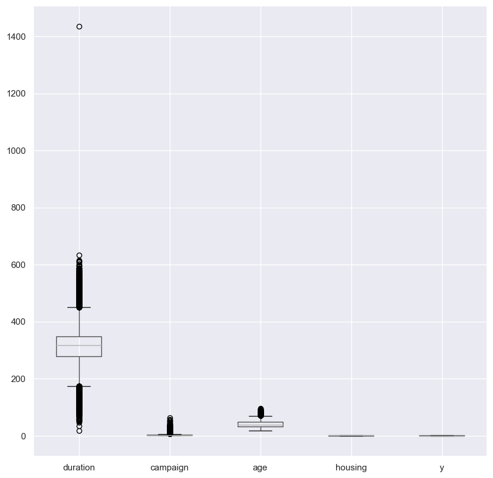
    


    
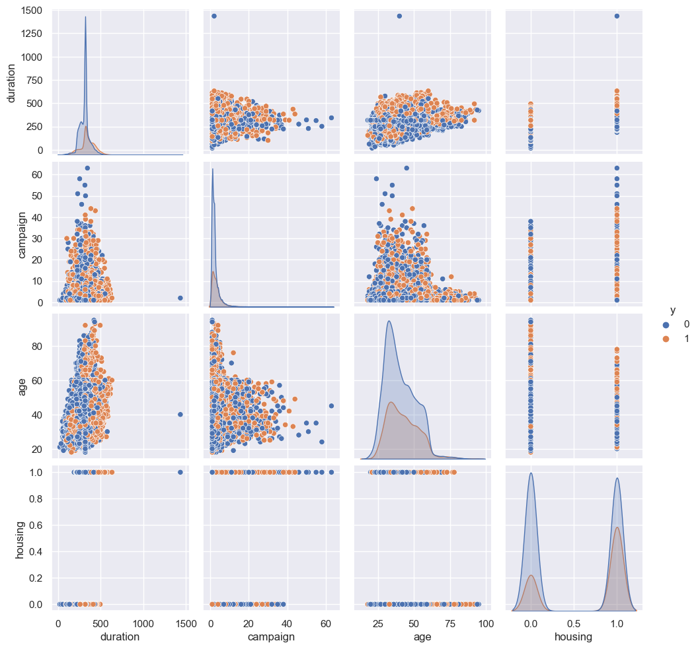
    


```python
# %matplotlib inline
plot_tree(model, feature_names=x.columns, filled=True, max_depth=2)
```


    [Text(0.5, 0.875, 'duration <= 337.926\ngini = 0.5\nsamples = 21702\nvalue = [10851.0, 10851.0]'),
     Text(0.25, 0.625, 'campaign <= 2.5\ngini = 0.471\nsamples = 15554\nvalue = [8873.55, 5439.592]'),
     Text(0.125, 0.375, 'duration <= 213.423\ngini = 0.389\nsamples = 10475\nvalue = [6583.175, 2369.057]'),
     Text(0.0625, 0.125, '\n  (...)  \n'),
     Text(0.1875, 0.125, '\n  (...)  \n'),
     Text(0.375, 0.375, 'duration <= 213.63\ngini = 0.489\nsamples = 5079\nvalue = [2290.375, 3070.535]'),
     Text(0.3125, 0.125, '\n  (...)  \n'),
     Text(0.4375, 0.125, '\n  (...)  \n'),
     Text(0.75, 0.625, 'campaign <= 2.5\ngini = 0.392\nsamples = 6148\nvalue = [1977.45, 5411.408]'),
     Text(0.625, 0.375, 'duration <= 411.545\ngini = 0.451\nsamples = 4016\nvalue = [1556.544, 2970.324]'),
     Text(0.5625, 0.125, '\n  (...)  \n'),
     Text(0.6875, 0.125, '\n  (...)  \n'),
     Text(0.875, 0.375, 'duration <= 397.583\ngini = 0.251\nsamples = 2132\nvalue = [420.906, 2441.084]'),
     Text(0.8125, 0.125, '\n  (...)  \n'),
     Text(0.9375, 0.125, '\n  (...)  \n')]


    
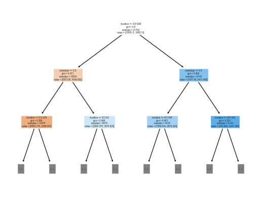
    


 ### 学習したモデルを保存する


```python
import pickle
file = path + '/model/campaign.pkl'
with open(file, 'wb') as f:
    pickle.dump(model, f)
```


```python
doctest.testmod(verbose=True)
unittest.main(argv=[''], verbosity=2, exit=False)
```

    15 items had no tests:
        __main__
        __main__.CategoricalData
        __main__.CategoricalData.__init__
        __main__.CategoricalData.convert
        __main__.CategoricalData.dummy
        __main__.CategoricalData.pivot
        __main__.CategoricalData.plot
        __main__.CategoricalData.show
        __main__.__VSCODE_compute_hash
        __main__.__VSCODE_wrap_run_cell
        __main__.check_learn
        __main__.exec_all
        __main__.learn
        __main__.new_df
        __main__.plot_df
    0 tests in 15 items.
    0 passed and 0 failed.
    Test passed.
    

    
    ----------------------------------------------------------------------
    Ran 0 tests in 0.000s
    
    OK
    


    <unittest.main.TestProgram at 0x16a6bb06e50>


