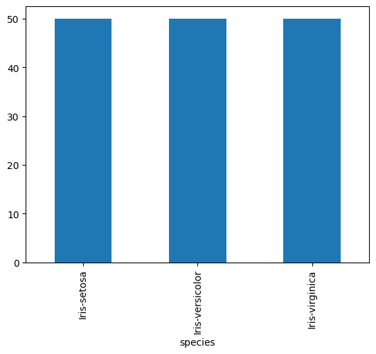
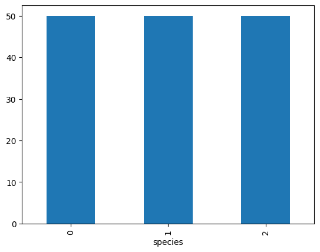
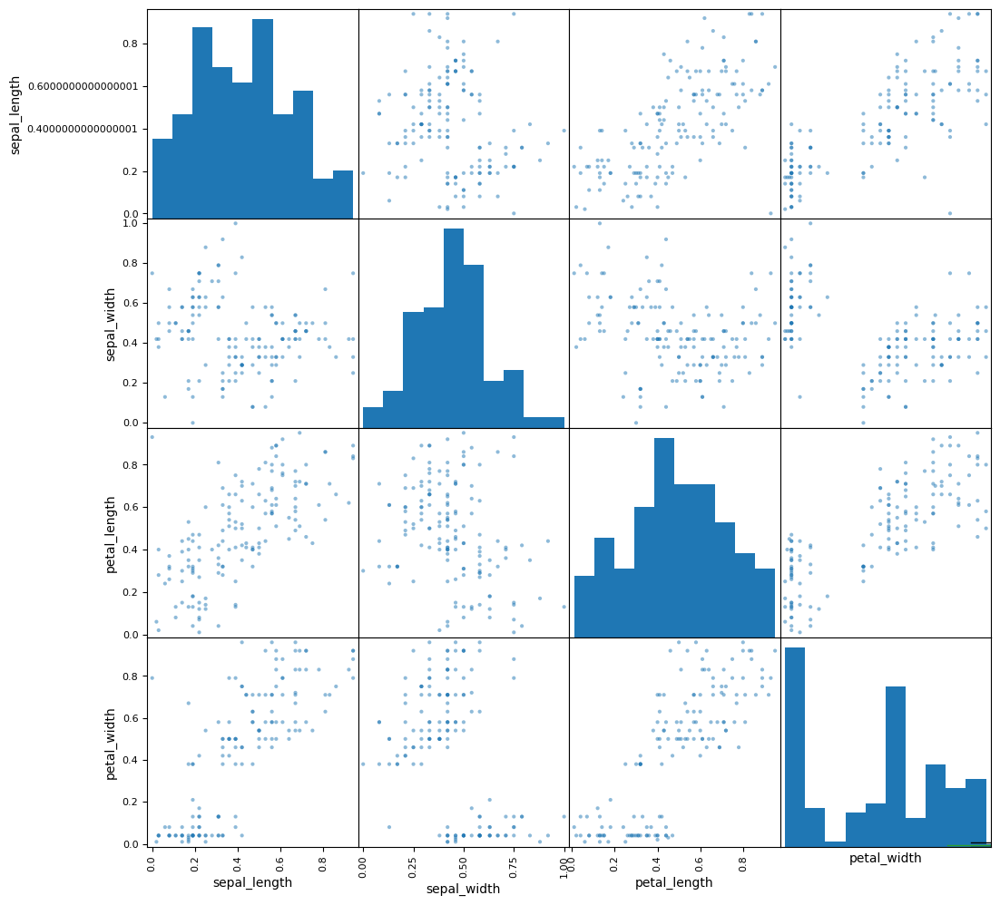
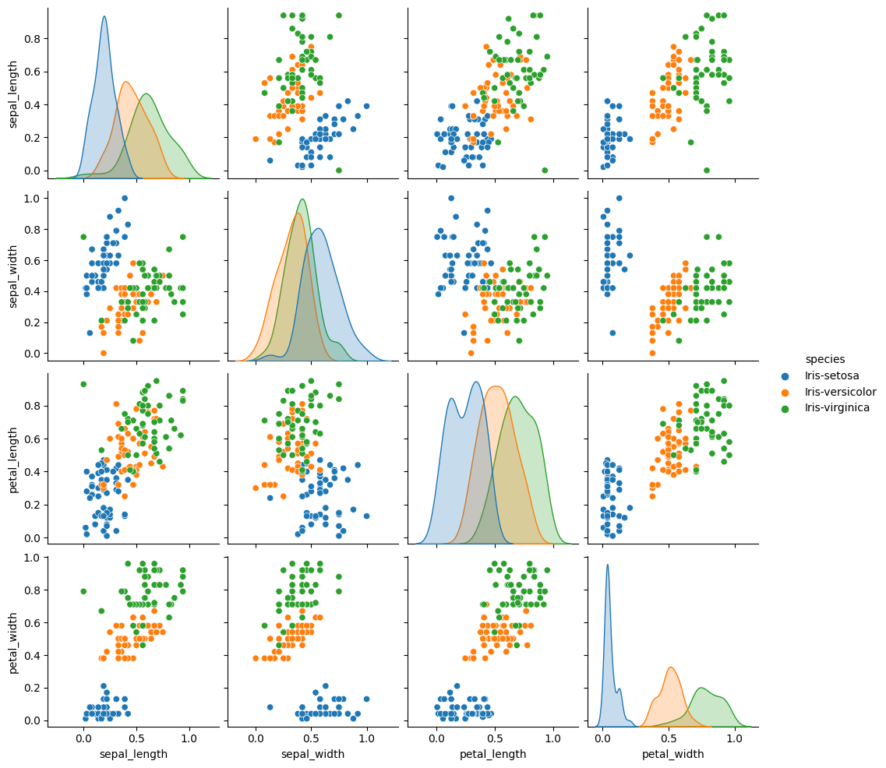

 # 分類1:アヤメの判別


```python
from sklearn.tree import plot_tree
import pickle
from sklearn import tree
from sklearn.model_selection import train_test_split
from typing import Any
import unittest
import doctest
import os
from domain import CategoricalData, DataVisualization, convert_categoricals
from repository import CSVRepository, SQLRepository

path = os.path.dirname(os.path.abspath(__file__))
# repo = SQLRepository(table='Iris')
repo = CSVRepository(file=path + '/data/iris.csv')
```

 ## データの内容
 | 列名 | 内容 |
 | --- | --- |
 | sepal_length | がく片の長さ |
 | sepal_width | がく片の幅 |
 | petal_length | 花弁の長さ |
 | petal_width | 花弁の幅 |
 | species | 種類 |


```python
df = repo.get_data()
df.head(3)
```


<div>
<style scoped>
    .dataframe tbody tr th:only-of-type {
        vertical-align: middle;
    }

    .dataframe tbody tr th {
        vertical-align: top;
    }

    .dataframe thead th {
        text-align: right;
    }
</style>
<table border="1" class="dataframe">
  <thead>
    <tr style="text-align: right;">
      <th></th>
      <th>sepal_length</th>
      <th>sepal_width</th>
      <th>petal_length</th>
      <th>petal_width</th>
      <th>species</th>
    </tr>
  </thead>
  <tbody>
    <tr>
      <th>0</th>
      <td>0.22</td>
      <td>0.63</td>
      <td>0.08</td>
      <td>0.04</td>
      <td>Iris-setosa</td>
    </tr>
    <tr>
      <th>1</th>
      <td>0.17</td>
      <td>0.42</td>
      <td>0.35</td>
      <td>0.04</td>
      <td>Iris-setosa</td>
    </tr>
    <tr>
      <th>2</th>
      <td>0.11</td>
      <td>0.50</td>
      <td>0.13</td>
      <td>0.04</td>
      <td>Iris-setosa</td>
    </tr>
  </tbody>
</table>
</div>


 ## 問題背景
 Iris(アヤメ)のデータは、ある特徴を持つ花がどの種類のアヤメに分類されるかを示すデータです。花の個体情報としてデータの内容の列名が示す4つの特徴量が与えられており、それらの特徴量から花の種類を分類することができます。このデータを用いて、花の特徴量からアヤメの種類を分類するモデルを作成します。
 花の種類は、setosa(ヒオウギアヤメ), Iris-versicolor(ブルーフラッグ), Iris-virginica(バージニアアイリス)の3種類があります。

 ## データ分析の方法検討
 - 特徴量を「がく片の長さと幅、花びらの長さと幅」として、アヤメの種類を判別する。

 ### データの概要


```python
df.info()
```

    <class 'pandas.core.frame.DataFrame'>
    RangeIndex: 150 entries, 0 to 149
    Data columns (total 5 columns):
     #   Column        Non-Null Count  Dtype  
    ---  ------        --------------  -----  
     0   sepal_length  148 non-null    float64
     1   sepal_width   149 non-null    float64
     2   petal_length  148 non-null    float64
     3   petal_width   148 non-null    float64
     4   species       150 non-null    object 
    dtypes: float64(4), object(1)
    memory usage: 6.0+ KB


 ### データの統計量


```python
df.describe()
```


<div>
<style scoped>
    .dataframe tbody tr th:only-of-type {
        vertical-align: middle;
    }

    .dataframe tbody tr th {
        vertical-align: top;
    }

    .dataframe thead th {
        text-align: right;
    }
</style>
<table border="1" class="dataframe">
  <thead>
    <tr style="text-align: right;">
      <th></th>
      <th>sepal_length</th>
      <th>sepal_width</th>
      <th>petal_length</th>
      <th>petal_width</th>
    </tr>
  </thead>
  <tbody>
    <tr>
      <th>count</th>
      <td>148.000000</td>
      <td>149.000000</td>
      <td>148.000000</td>
      <td>148.000000</td>
    </tr>
    <tr>
      <th>mean</th>
      <td>0.420878</td>
      <td>0.440403</td>
      <td>0.486757</td>
      <td>0.447432</td>
    </tr>
    <tr>
      <th>std</th>
      <td>0.228910</td>
      <td>0.181137</td>
      <td>0.231752</td>
      <td>0.309960</td>
    </tr>
    <tr>
      <th>min</th>
      <td>0.000000</td>
      <td>0.000000</td>
      <td>0.010000</td>
      <td>0.010000</td>
    </tr>
    <tr>
      <th>25%</th>
      <td>0.220000</td>
      <td>0.330000</td>
      <td>0.320000</td>
      <td>0.080000</td>
    </tr>
    <tr>
      <th>50%</th>
      <td>0.405000</td>
      <td>0.420000</td>
      <td>0.490000</td>
      <td>0.500000</td>
    </tr>
    <tr>
      <th>75%</th>
      <td>0.580000</td>
      <td>0.540000</td>
      <td>0.660000</td>
      <td>0.710000</td>
    </tr>
    <tr>
      <th>max</th>
      <td>0.940000</td>
      <td>1.000000</td>
      <td>0.950000</td>
      <td>0.960000</td>
    </tr>
  </tbody>
</table>
</div>


 ### データの特徴量の相関確認


```python
categorical_cols = ['species']
df_conv = convert_categoricals(df, categorical_cols)
df_conv.corr()
```


<div>
<style scoped>
    .dataframe tbody tr th:only-of-type {
        vertical-align: middle;
    }

    .dataframe tbody tr th {
        vertical-align: top;
    }

    .dataframe thead th {
        text-align: right;
    }
</style>
<table border="1" class="dataframe">
  <thead>
    <tr style="text-align: right;">
      <th></th>
      <th>sepal_length</th>
      <th>sepal_width</th>
      <th>petal_length</th>
      <th>petal_width</th>
      <th>species</th>
    </tr>
  </thead>
  <tbody>
    <tr>
      <th>sepal_length</th>
      <td>1.000000</td>
      <td>-0.162054</td>
      <td>0.679089</td>
      <td>0.790098</td>
      <td>0.754002</td>
    </tr>
    <tr>
      <th>sepal_width</th>
      <td>-0.162054</td>
      <td>1.000000</td>
      <td>-0.295351</td>
      <td>-0.389771</td>
      <td>-0.421124</td>
    </tr>
    <tr>
      <th>petal_length</th>
      <td>0.679089</td>
      <td>-0.295351</td>
      <td>1.000000</td>
      <td>0.796245</td>
      <td>0.791505</td>
    </tr>
    <tr>
      <th>petal_width</th>
      <td>0.790098</td>
      <td>-0.389771</td>
      <td>0.796245</td>
      <td>1.000000</td>
      <td>0.952338</td>
    </tr>
    <tr>
      <th>species</th>
      <td>0.754002</td>
      <td>-0.421124</td>
      <td>0.791505</td>
      <td>0.952338</td>
      <td>1.000000</td>
    </tr>
  </tbody>
</table>
</div>


 ### データの数値変数確認


```python
df.select_dtypes(include='number').columns
```


    Index(['sepal_length', 'sepal_width', 'petal_length', 'petal_width'], dtype='object')


 ### データのカテゴリ変数確認


```python
df.select_dtypes(include='object').columns
```


    Index(['species'], dtype='object')


 ### 種類カテゴリ


```python
species = CategoricalData(df, 'species')
```


```python
species.show()
```


    species
    Iris-setosa        50
    Iris-versicolor    50
    Iris-virginica     50
    Name: count, dtype: int64


```python
species.plot()
```


    <Axes: xlabel='species'>


    

    


 ### 種類カテゴリの数値変換


```python
categorical_cols = ['species']
df_conv = convert_categoricals(df, categorical_cols)
conv_species = CategoricalData(df_conv, 'species')
conv_species.plot()
```


    <Axes: xlabel='species'>


    

    


 ### ピボットテーブルによる集計


```python
species.pivot('sepal_length', 'sepal_width')
```


<div>
<style scoped>
    .dataframe tbody tr th:only-of-type {
        vertical-align: middle;
    }

    .dataframe tbody tr th {
        vertical-align: top;
    }

    .dataframe thead th {
        text-align: right;
    }
</style>
<table border="1" class="dataframe">
  <thead>
    <tr style="text-align: right;">
      <th>species</th>
      <th>Iris-setosa</th>
      <th>Iris-versicolor</th>
      <th>Iris-virginica</th>
    </tr>
    <tr>
      <th>sepal_length</th>
      <th></th>
      <th></th>
      <th></th>
    </tr>
  </thead>
  <tbody>
    <tr>
      <th>0.00</th>
      <td>NaN</td>
      <td>NaN</td>
      <td>1.0</td>
    </tr>
    <tr>
      <th>0.02</th>
      <td>1.0</td>
      <td>NaN</td>
      <td>NaN</td>
    </tr>
    <tr>
      <th>0.03</th>
      <td>3.0</td>
      <td>NaN</td>
      <td>NaN</td>
    </tr>
    <tr>
      <th>0.06</th>
      <td>1.0</td>
      <td>NaN</td>
      <td>NaN</td>
    </tr>
    <tr>
      <th>0.08</th>
      <td>4.0</td>
      <td>NaN</td>
      <td>NaN</td>
    </tr>
    <tr>
      <th>0.11</th>
      <td>2.0</td>
      <td>NaN</td>
      <td>NaN</td>
    </tr>
    <tr>
      <th>0.14</th>
      <td>5.0</td>
      <td>NaN</td>
      <td>NaN</td>
    </tr>
    <tr>
      <th>0.17</th>
      <td>4.0</td>
      <td>1.0</td>
      <td>1.0</td>
    </tr>
    <tr>
      <th>0.19</th>
      <td>8.0</td>
      <td>2.0</td>
      <td>NaN</td>
    </tr>
    <tr>
      <th>0.22</th>
      <td>8.0</td>
      <td>1.0</td>
      <td>NaN</td>
    </tr>
    <tr>
      <th>0.25</th>
      <td>3.0</td>
      <td>1.0</td>
      <td>NaN</td>
    </tr>
    <tr>
      <th>0.28</th>
      <td>1.0</td>
      <td>NaN</td>
      <td>NaN</td>
    </tr>
    <tr>
      <th>0.31</th>
      <td>5.0</td>
      <td>1.0</td>
      <td>NaN</td>
    </tr>
    <tr>
      <th>0.33</th>
      <td>2.0</td>
      <td>5.0</td>
      <td>NaN</td>
    </tr>
    <tr>
      <th>0.36</th>
      <td>NaN</td>
      <td>5.0</td>
      <td>1.0</td>
    </tr>
    <tr>
      <th>0.39</th>
      <td>2.0</td>
      <td>5.0</td>
      <td>1.0</td>
    </tr>
    <tr>
      <th>0.42</th>
      <td>1.0</td>
      <td>3.0</td>
      <td>3.0</td>
    </tr>
    <tr>
      <th>0.44</th>
      <td>NaN</td>
      <td>1.0</td>
      <td>1.0</td>
    </tr>
    <tr>
      <th>0.47</th>
      <td>NaN</td>
      <td>4.0</td>
      <td>2.0</td>
    </tr>
    <tr>
      <th>0.50</th>
      <td>NaN</td>
      <td>4.0</td>
      <td>2.0</td>
    </tr>
    <tr>
      <th>0.53</th>
      <td>NaN</td>
      <td>2.0</td>
      <td>2.0</td>
    </tr>
    <tr>
      <th>0.56</th>
      <td>NaN</td>
      <td>3.0</td>
      <td>6.0</td>
    </tr>
    <tr>
      <th>0.58</th>
      <td>NaN</td>
      <td>1.0</td>
      <td>4.0</td>
    </tr>
    <tr>
      <th>0.61</th>
      <td>NaN</td>
      <td>1.0</td>
      <td>4.0</td>
    </tr>
    <tr>
      <th>0.64</th>
      <td>NaN</td>
      <td>2.0</td>
      <td>NaN</td>
    </tr>
    <tr>
      <th>0.67</th>
      <td>NaN</td>
      <td>3.0</td>
      <td>5.0</td>
    </tr>
    <tr>
      <th>0.69</th>
      <td>NaN</td>
      <td>1.0</td>
      <td>2.0</td>
    </tr>
    <tr>
      <th>0.72</th>
      <td>NaN</td>
      <td>1.0</td>
      <td>3.0</td>
    </tr>
    <tr>
      <th>0.75</th>
      <td>NaN</td>
      <td>1.0</td>
      <td>NaN</td>
    </tr>
    <tr>
      <th>0.78</th>
      <td>NaN</td>
      <td>NaN</td>
      <td>1.0</td>
    </tr>
    <tr>
      <th>0.81</th>
      <td>NaN</td>
      <td>NaN</td>
      <td>3.0</td>
    </tr>
    <tr>
      <th>0.83</th>
      <td>NaN</td>
      <td>NaN</td>
      <td>1.0</td>
    </tr>
    <tr>
      <th>0.86</th>
      <td>NaN</td>
      <td>NaN</td>
      <td>1.0</td>
    </tr>
    <tr>
      <th>0.92</th>
      <td>NaN</td>
      <td>NaN</td>
      <td>1.0</td>
    </tr>
    <tr>
      <th>0.94</th>
      <td>NaN</td>
      <td>NaN</td>
      <td>4.0</td>
    </tr>
  </tbody>
</table>
</div>


```python
species.pivot('sepal_width', 'petal_length')
```


<div>
<style scoped>
    .dataframe tbody tr th:only-of-type {
        vertical-align: middle;
    }

    .dataframe tbody tr th {
        vertical-align: top;
    }

    .dataframe thead th {
        text-align: right;
    }
</style>
<table border="1" class="dataframe">
  <thead>
    <tr style="text-align: right;">
      <th>species</th>
      <th>Iris-setosa</th>
      <th>Iris-versicolor</th>
      <th>Iris-virginica</th>
    </tr>
    <tr>
      <th>sepal_width</th>
      <th></th>
      <th></th>
      <th></th>
    </tr>
  </thead>
  <tbody>
    <tr>
      <th>0.00</th>
      <td>NaN</td>
      <td>1.0</td>
      <td>NaN</td>
    </tr>
    <tr>
      <th>0.08</th>
      <td>NaN</td>
      <td>2.0</td>
      <td>1.0</td>
    </tr>
    <tr>
      <th>0.13</th>
      <td>1.0</td>
      <td>3.0</td>
      <td>NaN</td>
    </tr>
    <tr>
      <th>0.17</th>
      <td>NaN</td>
      <td>3.0</td>
      <td>NaN</td>
    </tr>
    <tr>
      <th>0.21</th>
      <td>NaN</td>
      <td>4.0</td>
      <td>4.0</td>
    </tr>
    <tr>
      <th>0.25</th>
      <td>NaN</td>
      <td>3.0</td>
      <td>2.0</td>
    </tr>
    <tr>
      <th>0.29</th>
      <td>NaN</td>
      <td>5.0</td>
      <td>4.0</td>
    </tr>
    <tr>
      <th>0.33</th>
      <td>NaN</td>
      <td>6.0</td>
      <td>8.0</td>
    </tr>
    <tr>
      <th>0.38</th>
      <td>1.0</td>
      <td>6.0</td>
      <td>2.0</td>
    </tr>
    <tr>
      <th>0.42</th>
      <td>6.0</td>
      <td>8.0</td>
      <td>10.0</td>
    </tr>
    <tr>
      <th>0.46</th>
      <td>5.0</td>
      <td>3.0</td>
      <td>4.0</td>
    </tr>
    <tr>
      <th>0.50</th>
      <td>5.0</td>
      <td>3.0</td>
      <td>5.0</td>
    </tr>
    <tr>
      <th>0.54</th>
      <td>2.0</td>
      <td>1.0</td>
      <td>3.0</td>
    </tr>
    <tr>
      <th>0.58</th>
      <td>9.0</td>
      <td>1.0</td>
      <td>2.0</td>
    </tr>
    <tr>
      <th>0.63</th>
      <td>6.0</td>
      <td>NaN</td>
      <td>NaN</td>
    </tr>
    <tr>
      <th>0.67</th>
      <td>2.0</td>
      <td>NaN</td>
      <td>1.0</td>
    </tr>
    <tr>
      <th>0.71</th>
      <td>3.0</td>
      <td>NaN</td>
      <td>NaN</td>
    </tr>
    <tr>
      <th>0.75</th>
      <td>4.0</td>
      <td>NaN</td>
      <td>2.0</td>
    </tr>
    <tr>
      <th>0.79</th>
      <td>2.0</td>
      <td>NaN</td>
      <td>NaN</td>
    </tr>
    <tr>
      <th>0.83</th>
      <td>1.0</td>
      <td>NaN</td>
      <td>NaN</td>
    </tr>
    <tr>
      <th>0.88</th>
      <td>1.0</td>
      <td>NaN</td>
      <td>NaN</td>
    </tr>
    <tr>
      <th>0.92</th>
      <td>1.0</td>
      <td>NaN</td>
      <td>NaN</td>
    </tr>
    <tr>
      <th>1.00</th>
      <td>1.0</td>
      <td>NaN</td>
      <td>NaN</td>
    </tr>
  </tbody>
</table>
</div>


```python
species.pivot('petal_length', 'petal_width')
```


<div>
<style scoped>
    .dataframe tbody tr th:only-of-type {
        vertical-align: middle;
    }

    .dataframe tbody tr th {
        vertical-align: top;
    }

    .dataframe thead th {
        text-align: right;
    }
</style>
<table border="1" class="dataframe">
  <thead>
    <tr style="text-align: right;">
      <th>species</th>
      <th>Iris-setosa</th>
      <th>Iris-versicolor</th>
      <th>Iris-virginica</th>
    </tr>
    <tr>
      <th>petal_length</th>
      <th></th>
      <th></th>
      <th></th>
    </tr>
  </thead>
  <tbody>
    <tr>
      <th>0.01</th>
      <td>1.0</td>
      <td>NaN</td>
      <td>NaN</td>
    </tr>
    <tr>
      <th>0.02</th>
      <td>1.0</td>
      <td>NaN</td>
      <td>NaN</td>
    </tr>
    <tr>
      <th>0.04</th>
      <td>2.0</td>
      <td>NaN</td>
      <td>NaN</td>
    </tr>
    <tr>
      <th>0.06</th>
      <td>1.0</td>
      <td>NaN</td>
      <td>NaN</td>
    </tr>
    <tr>
      <th>0.07</th>
      <td>1.0</td>
      <td>NaN</td>
      <td>NaN</td>
    </tr>
    <tr>
      <th>...</th>
      <td>...</td>
      <td>...</td>
      <td>...</td>
    </tr>
    <tr>
      <th>0.88</th>
      <td>NaN</td>
      <td>NaN</td>
      <td>0.0</td>
    </tr>
    <tr>
      <th>0.89</th>
      <td>NaN</td>
      <td>NaN</td>
      <td>3.0</td>
    </tr>
    <tr>
      <th>0.92</th>
      <td>NaN</td>
      <td>NaN</td>
      <td>1.0</td>
    </tr>
    <tr>
      <th>0.93</th>
      <td>NaN</td>
      <td>NaN</td>
      <td>1.0</td>
    </tr>
    <tr>
      <th>0.95</th>
      <td>NaN</td>
      <td>NaN</td>
      <td>1.0</td>
    </tr>
  </tbody>
</table>
<p>70 rows × 3 columns</p>
</div>


```python
species.pivot('petal_width', 'sepal_length')
```


<div>
<style scoped>
    .dataframe tbody tr th:only-of-type {
        vertical-align: middle;
    }

    .dataframe tbody tr th {
        vertical-align: top;
    }

    .dataframe thead th {
        text-align: right;
    }
</style>
<table border="1" class="dataframe">
  <thead>
    <tr style="text-align: right;">
      <th>species</th>
      <th>Iris-setosa</th>
      <th>Iris-versicolor</th>
      <th>Iris-virginica</th>
    </tr>
    <tr>
      <th>petal_width</th>
      <th></th>
      <th></th>
      <th></th>
    </tr>
  </thead>
  <tbody>
    <tr>
      <th>0.01</th>
      <td>4.0</td>
      <td>NaN</td>
      <td>NaN</td>
    </tr>
    <tr>
      <th>0.02</th>
      <td>1.0</td>
      <td>NaN</td>
      <td>NaN</td>
    </tr>
    <tr>
      <th>0.03</th>
      <td>1.0</td>
      <td>NaN</td>
      <td>NaN</td>
    </tr>
    <tr>
      <th>0.04</th>
      <td>28.0</td>
      <td>NaN</td>
      <td>NaN</td>
    </tr>
    <tr>
      <th>0.08</th>
      <td>7.0</td>
      <td>NaN</td>
      <td>NaN</td>
    </tr>
    <tr>
      <th>0.13</th>
      <td>7.0</td>
      <td>NaN</td>
      <td>NaN</td>
    </tr>
    <tr>
      <th>0.17</th>
      <td>1.0</td>
      <td>NaN</td>
      <td>NaN</td>
    </tr>
    <tr>
      <th>0.21</th>
      <td>1.0</td>
      <td>NaN</td>
      <td>NaN</td>
    </tr>
    <tr>
      <th>0.38</th>
      <td>NaN</td>
      <td>7.0</td>
      <td>NaN</td>
    </tr>
    <tr>
      <th>0.42</th>
      <td>NaN</td>
      <td>3.0</td>
      <td>NaN</td>
    </tr>
    <tr>
      <th>0.46</th>
      <td>NaN</td>
      <td>5.0</td>
      <td>1.0</td>
    </tr>
    <tr>
      <th>0.50</th>
      <td>NaN</td>
      <td>13.0</td>
      <td>NaN</td>
    </tr>
    <tr>
      <th>0.54</th>
      <td>NaN</td>
      <td>7.0</td>
      <td>1.0</td>
    </tr>
    <tr>
      <th>0.58</th>
      <td>NaN</td>
      <td>9.0</td>
      <td>2.0</td>
    </tr>
    <tr>
      <th>0.63</th>
      <td>NaN</td>
      <td>3.0</td>
      <td>1.0</td>
    </tr>
    <tr>
      <th>0.67</th>
      <td>NaN</td>
      <td>1.0</td>
      <td>1.0</td>
    </tr>
    <tr>
      <th>0.71</th>
      <td>NaN</td>
      <td>1.0</td>
      <td>10.0</td>
    </tr>
    <tr>
      <th>0.72</th>
      <td>NaN</td>
      <td>NaN</td>
      <td>1.0</td>
    </tr>
    <tr>
      <th>0.75</th>
      <td>NaN</td>
      <td>NaN</td>
      <td>4.0</td>
    </tr>
    <tr>
      <th>0.79</th>
      <td>NaN</td>
      <td>NaN</td>
      <td>6.0</td>
    </tr>
    <tr>
      <th>0.83</th>
      <td>NaN</td>
      <td>NaN</td>
      <td>6.0</td>
    </tr>
    <tr>
      <th>0.88</th>
      <td>NaN</td>
      <td>NaN</td>
      <td>3.0</td>
    </tr>
    <tr>
      <th>0.92</th>
      <td>NaN</td>
      <td>NaN</td>
      <td>8.0</td>
    </tr>
    <tr>
      <th>0.96</th>
      <td>NaN</td>
      <td>NaN</td>
      <td>3.0</td>
    </tr>
  </tbody>
</table>
</div>


 ### ダミー変数化


```python
df_dummy = species.dummy()
df_dummy
```


<div>
<style scoped>
    .dataframe tbody tr th:only-of-type {
        vertical-align: middle;
    }

    .dataframe tbody tr th {
        vertical-align: top;
    }

    .dataframe thead th {
        text-align: right;
    }
</style>
<table border="1" class="dataframe">
  <thead>
    <tr style="text-align: right;">
      <th></th>
      <th>sepal_length</th>
      <th>sepal_width</th>
      <th>petal_length</th>
      <th>petal_width</th>
      <th>species_Iris-setosa</th>
      <th>species_Iris-versicolor</th>
      <th>species_Iris-virginica</th>
    </tr>
  </thead>
  <tbody>
    <tr>
      <th>0</th>
      <td>0.22</td>
      <td>0.63</td>
      <td>0.08</td>
      <td>0.04</td>
      <td>True</td>
      <td>False</td>
      <td>False</td>
    </tr>
    <tr>
      <th>1</th>
      <td>0.17</td>
      <td>0.42</td>
      <td>0.35</td>
      <td>0.04</td>
      <td>True</td>
      <td>False</td>
      <td>False</td>
    </tr>
    <tr>
      <th>2</th>
      <td>0.11</td>
      <td>0.50</td>
      <td>0.13</td>
      <td>0.04</td>
      <td>True</td>
      <td>False</td>
      <td>False</td>
    </tr>
    <tr>
      <th>3</th>
      <td>0.08</td>
      <td>0.46</td>
      <td>0.26</td>
      <td>0.04</td>
      <td>True</td>
      <td>False</td>
      <td>False</td>
    </tr>
    <tr>
      <th>4</th>
      <td>0.19</td>
      <td>0.67</td>
      <td>0.44</td>
      <td>0.04</td>
      <td>True</td>
      <td>False</td>
      <td>False</td>
    </tr>
    <tr>
      <th>...</th>
      <td>...</td>
      <td>...</td>
      <td>...</td>
      <td>...</td>
      <td>...</td>
      <td>...</td>
      <td>...</td>
    </tr>
    <tr>
      <th>145</th>
      <td>0.67</td>
      <td>0.42</td>
      <td>0.54</td>
      <td>0.92</td>
      <td>False</td>
      <td>False</td>
      <td>True</td>
    </tr>
    <tr>
      <th>146</th>
      <td>0.56</td>
      <td>0.21</td>
      <td>0.69</td>
      <td>0.46</td>
      <td>False</td>
      <td>False</td>
      <td>True</td>
    </tr>
    <tr>
      <th>147</th>
      <td>0.61</td>
      <td>0.42</td>
      <td>NaN</td>
      <td>0.79</td>
      <td>False</td>
      <td>False</td>
      <td>True</td>
    </tr>
    <tr>
      <th>148</th>
      <td>0.53</td>
      <td>0.58</td>
      <td>0.63</td>
      <td>0.92</td>
      <td>False</td>
      <td>False</td>
      <td>True</td>
    </tr>
    <tr>
      <th>149</th>
      <td>0.44</td>
      <td>0.42</td>
      <td>0.41</td>
      <td>0.71</td>
      <td>False</td>
      <td>False</td>
      <td>True</td>
    </tr>
  </tbody>
</table>
<p>150 rows × 7 columns</p>
</div>


 ### データの可視化


```python
dv = DataVisualization(df)
dv.df_all('species')
```


    

    


    

    


    

    


 # 分析の実施

 ## データの前処理

 ### データの読み込み


```python
repo = CSVRepository(file=path + '/data/iris.csv')
df = repo.get_data()
df.head(3)
```


<div>
<style scoped>
    .dataframe tbody tr th:only-of-type {
        vertical-align: middle;
    }

    .dataframe tbody tr th {
        vertical-align: top;
    }

    .dataframe thead th {
        text-align: right;
    }
</style>
<table border="1" class="dataframe">
  <thead>
    <tr style="text-align: right;">
      <th></th>
      <th>sepal_length</th>
      <th>sepal_width</th>
      <th>petal_length</th>
      <th>petal_width</th>
      <th>species</th>
    </tr>
  </thead>
  <tbody>
    <tr>
      <th>0</th>
      <td>0.22</td>
      <td>0.63</td>
      <td>0.08</td>
      <td>0.04</td>
      <td>Iris-setosa</td>
    </tr>
    <tr>
      <th>1</th>
      <td>0.17</td>
      <td>0.42</td>
      <td>0.35</td>
      <td>0.04</td>
      <td>Iris-setosa</td>
    </tr>
    <tr>
      <th>2</th>
      <td>0.11</td>
      <td>0.50</td>
      <td>0.13</td>
      <td>0.04</td>
      <td>Iris-setosa</td>
    </tr>
  </tbody>
</table>
</div>


 ### 欠損地処理（行削除・全体代表値埋め、グループ代表値埋め）

 #### 欠損値の確認


```python
df.isnull().sum()
```


    sepal_length    2
    sepal_width     1
    petal_length    2
    petal_width     2
    species         0
    dtype: int64


 #### 欠損値の削除


```python
def df_dropna(df):
    df_drop = df.dropna(how='any', axis=0)
    return df_drop
```

 #### 欠損値の代表値埋め


```python
def df_fillna_mean(df, col):
    mean_value = df[col].mean()
    df_fill = df.fillna(mean_value)
    return df_fill


def df_fillna_mean_cols(df, cols):
    df_fill = df.copy()
    for col in cols:
        df_fill = df_fillna_mean(df_fill, col)
    return df_fill
```

 #### 特徴量と正解データの取り出し


```python
xcol = ['sepal_length', 'sepal_width', 'petal_length', 'petal_width']
df = df_fillna_mean_cols(df, xcol)
x = df[xcol]
t = df['species']


x_train, x_test, y_train, y_test = train_test_split(
    x, t, test_size=0.3, random_state=0)
```

 ### 各手法を必要に応じて実施

 - 外れ値の除外
 - 多項式特徴量・交互作用特徴量の追加
 - 特徴量の絞り込み
 - 標準化

 ## モデルの作成と学習

 ### 未学習状態モデルの生成（分類なら決定木、回帰なら線形回帰）

 #### 決定木モデルを作成する


```python
model = tree.DecisionTreeClassifier(max_depth=2, random_state=0)
```

 ### 訓練データで学習（必要に応じて不均衡データ補正）

 ## モデルの評価

 ### 検証データで評価し指標確認（分類なら正解率、回帰なら決定係数）


```python
model.fit(x_train, y_train)
model.score(x_test, y_test)
```


    0.9555555555555556


 ### NG:改善案検討前処理に戻る
 ### OK:最終性能評価（テストデータで評価）
 #### Take1
 - がく片の長さ、がく片の幅、花弁の長さ、花弁の幅を特徴量として、アヤメの種類を判別する。
 - 欠損データは代表値埋めを行う。


```python
df = repo.get_data()
xcol = ['sepal_length', 'sepal_width', 'petal_length', 'petal_width']
df = df_fillna_mean_cols(df, xcol)

x = df[xcol]
t = df['species']

x_train, x_test, y_train, y_test = train_test_split(
    x, t, test_size=0.3, random_state=0)

model = tree.DecisionTreeClassifier(max_depth=2, random_state=0)
model.fit(x_train, y_train)
model.score(x_test, y_test)
```


    0.9555555555555556


```python
with open(path + '/model/iris.pkl', 'wb') as f:
    pickle.dump(model, f)
```

 ## 決定木における特徴量の考察

 ### 分岐条件の列を決める


```python
model.tree_.feature
```


    array([ 3, -2,  3, -2, -2], dtype=int64)


 ### 分岐条件のしきい値


```python
model.tree_.threshold
```


    array([ 0.275, -2.   ,  0.69 , -2.   , -2.   ])


 ### 末端ノードと種類の紐付け


```python
print(model.tree_.value[1])
print(model.tree_.value[3])
print(model.tree_.value[4])
```

    [[34.  0.  0.]]
    [[ 0. 31.  6.]]
    [[ 0.  1. 33.]]


```python
model.classes_
```


    array(['Iris-setosa', 'Iris-versicolor', 'Iris-virginica'], dtype=object)


 ### 決定木の可視化


```python
plot_tree(model, feature_names=xcol, class_names=model.classes_, filled=True)
```


    [Text(0.4, 0.8333333333333334, 'petal_width <= 0.275\ngini = 0.664\nsamples = 105\nvalue = [34, 32, 39]\nclass = Iris-virginica'),
     Text(0.2, 0.5, 'gini = 0.0\nsamples = 34\nvalue = [34, 0, 0]\nclass = Iris-setosa'),
     Text(0.6, 0.5, 'petal_width <= 0.69\ngini = 0.495\nsamples = 71\nvalue = [0, 32, 39]\nclass = Iris-virginica'),
     Text(0.4, 0.16666666666666666, 'gini = 0.272\nsamples = 37\nvalue = [0, 31, 6]\nclass = Iris-versicolor'),
     Text(0.8, 0.16666666666666666, 'gini = 0.057\nsamples = 34\nvalue = [0, 1, 33]\nclass = Iris-virginica')]


    

    


```python
doctest.testmod(verbose=True)
unittest.main(argv=[''], verbosity=2, exit=False)
```

    6 items had no tests:
        __main__
        __main__.__VSCODE_compute_hash
        __main__.__VSCODE_wrap_run_cell
        __main__.df_dropna
        __main__.df_fillna_mean
        __main__.df_fillna_mean_cols
    0 tests in 6 items.
    0 passed and 0 failed.
    Test passed.


    
    ----------------------------------------------------------------------
    Ran 0 tests in 0.000s
    
    OK


    <unittest.main.TestProgram at 0x7f07c88deaf0>


